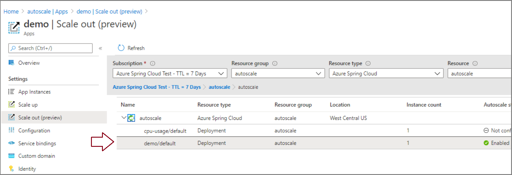
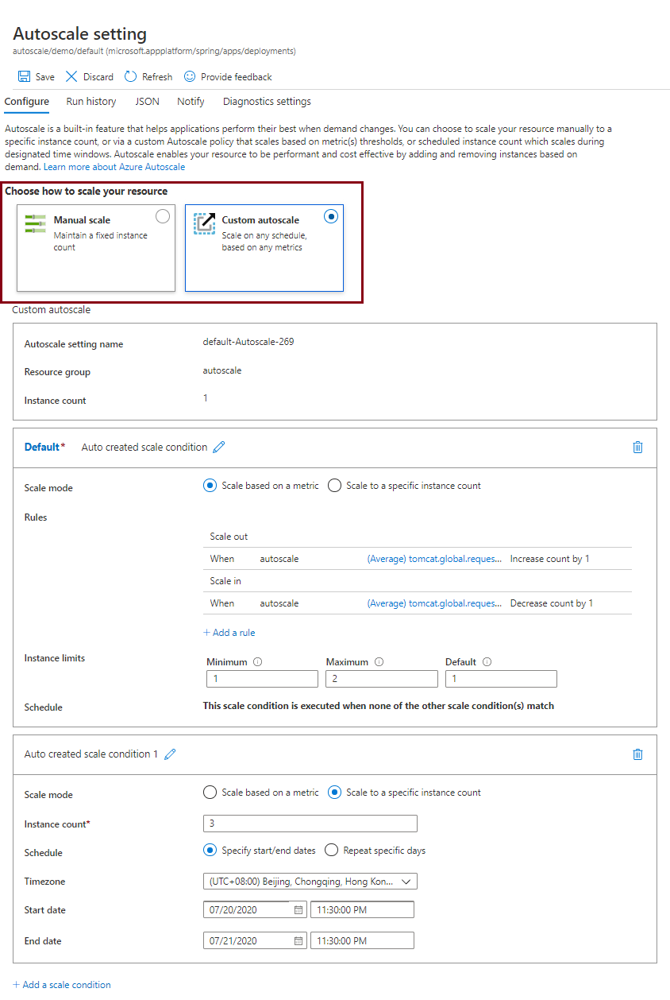

# Set up autoscale for microservice applications

**This article applies to:** ✔️ Java ✔️ C#

Autoscale is a built-in feature of Azure Spring Cloud that helps microservice applications perform their best when demand changes. This includes modifying the number of virtual CPUs, memory, and app instances. This article describes how to set up Autoscale settings for your applications using the Microsoft Azure portal or the Azure CLI.

## Prerequisites

To follow these procedures, you need:

* An Azure subscription. If you don't have an Azure subscription, create a [free account](https://azure.microsoft.com/free/?WT.mc_id=A261C142F) before you begin.
* A deployed Azure Spring Cloud service instance. Follow the [quickstart on deploying an app via the Azure CLI](./quickstart.md) to get started.
* At least one application already created in your service instance.

## Navigate to the Autoscale page in the Azure portal

1. Sign in to the [Azure portal](https://portal.azure.com/).
2. Go to the Azure Spring Cloud **Overview** page.
3. Select the resource group that contains your service.
4. Select the **Apps** tab under **Settings** in the menu on the left navigation pane.
5. Select the application for which you want to set up Autoscale. In this example, select the application named **demo**. You should then see the application's **Overview** page.
6. Go to the **Scale out** tab under **Settings** in the menu on the left navigation pane.
7. Select the deployment you want to set up Autoscale. You should see options for Autoscale shown in the following section.




## Set up Autoscale settings for your application in the Azure portal

There are two options for Autoscale demand management:

* Manual scale: Maintains a fixed instance count. In the Standard tier, you can scale out to a maximum of 500 instances. This value changes the number of separate running instances of the microservice application.
* Custom autoscale: Scales on any schedule, based on any metrics.

In the Azure portal, choose how you want to scale.  The following figure shows the **Custom autoscale** option and mode settings.



## Set up Autoscale settings for your application in Azure CLI
You can also set Autoscale modes using the Azure CLI.  The following commands create an Autoscale setting and an Autoscale rule.

* Create Autoscale setting
  ```
  az monitor autoscale create -g demo-rg --resource /subscriptions/ffffffff-ffff-ffff-ffff-ffffffffffff/resourcegroups/demo-rg/providers/Microsoft.AppPlatform/Spring/autoscale/apps/demo/deployments/default --name demo-setting --min-count 1 --max-count 5 --count 1
  ```
* Create Autoscale rule
  ```
  az monitor autoscale rule create -g demo-rg --autoscale-name demo-setting --scale out 1 --cooldown 1 --condition "tomcat.global.request.total.count > 100 avg 1m where AppName == demo and Deployment == default"
  ```

## Upgrade to the Standard tier

If you are on the Basic tier and constrained by one or more of these limits, you can upgrade to the Standard tier. To do this, go to the **Pricing** tier menu by first selecting the *Standard* tier column and the clicking the **Upgrade** button.

## Next steps

* [Overview of autoscale in Microsoft Azure](../azure-monitor/autoscale/autoscale-overview.md)
* [Azure CLI Monitoring autoscale](/cli/azure/monitor/autoscale)