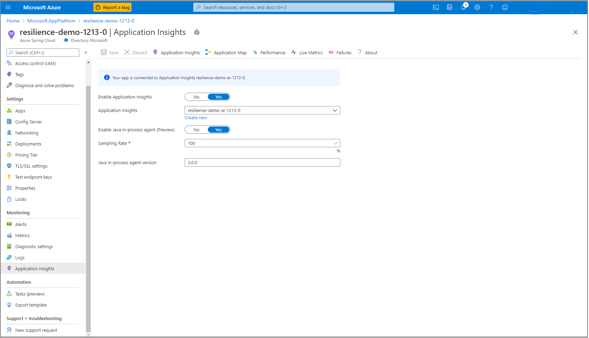
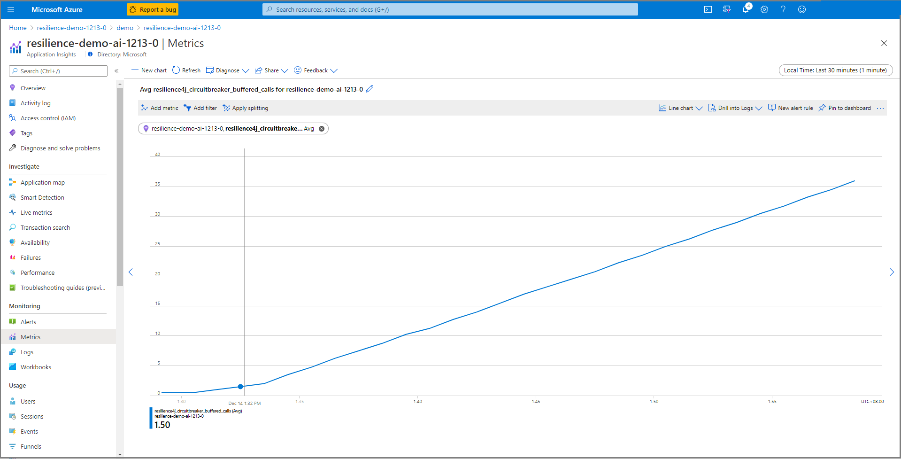
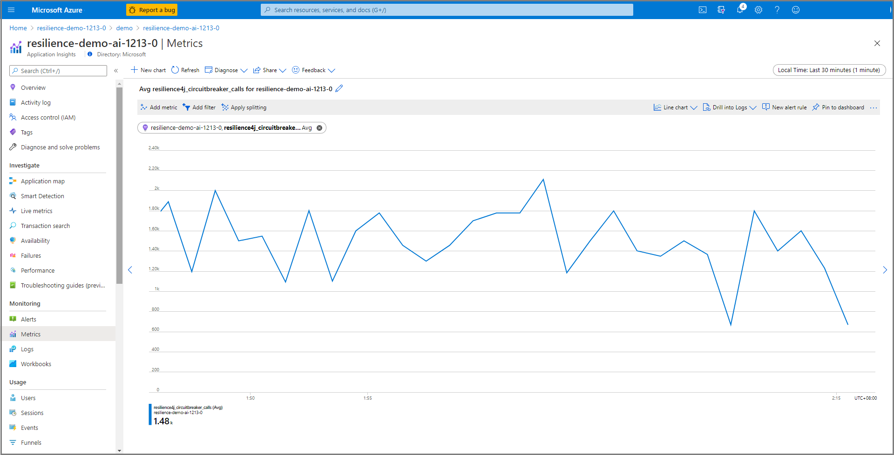
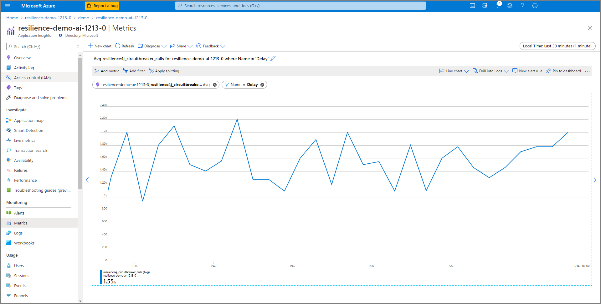
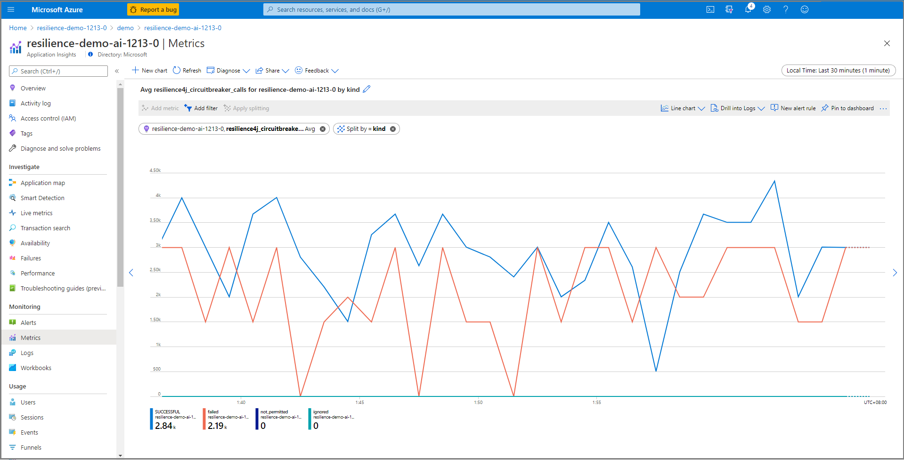

# Collect Spring Cloud Resilience4J Circuit Breaker Metrics (Preview)

This document explains how to collect Spring Cloud Resilience4j Circuit Breaker Metrics with Application Insights java in-process agent.  With this feature you can monitor metrics of resilience4j circuit breaker from Application Insights.

We use the [spring-cloud-circuit-breaker-demo](https://github.com/spring-cloud-samples/spring-cloud-circuitbreaker-demo) to show how it works.

## Prerequisites

* Enable Java In-Process agent from the [Java In-Process Agent for Application Insights guide](https://docs.microsoft.com/azure/spring-cloud/spring-cloud-howto-application-insights#enable-java-in-process-agent-for-application-insights). 

* Enable dimension collection for resilience4j metrics from the [Application Insights guide](https://docs.microsoft.com/azure/azure-monitor/app/pre-aggregated-metrics-log-metrics#custom-metrics-dimensions-and-pre-aggregation).

* Install git, Maven, and Java, if not already in use by the development computer.

## Build and deploy apps

The following procedure builds and deploys apps.

1. Clone and build the demo repository.

```bash
git clone https://github.com/spring-cloud-samples/spring-cloud-circuitbreaker-demo.git
cd spring-cloud-circuitbreaker-demo && mvn clean package -DskipTests
```

2. Create applications with endpoints

```azcli
az spring-cloud app create --name resilience4j --is-public \
    -s ${asc-service-name} -g ${asc-resource-group}
az spring-cloud app create --name reactive-resilience4j --is-public \
    -s ${asc-service-name} -g ${asc-resource-group}
```

3. Deploy applications.

```azcli
az spring-cloud app deploy -n resilience4j \
    --jar-path ./spring-cloud-circuitbreaker-demo-resilience4j/target/spring-cloud-circuitbreaker-demo-resilience4j-0.0.1.BUILD-SNAPSHOT.jar \
    -s ${service_name} -g ${resource_group}
az spring-cloud app deploy -n reactive-resilience4j \
    --jar-path ./spring-cloud-circuitbreaker-demo-reactive-resilience4j/target/spring-cloud-circuitbreaker-demo-reactive-resilience4j-0.0.1.BUILD-SNAPSHOT.jar \
    -s ${service_name} -g ${resource_group}
```

> [!Note]
>
> * Include the required dependency for Resilience4j:
>
>   ```xml
>   <dependency>
>       <groupId>io.github.resilience4j</groupId>
>       <artifactId>resilience4j-micrometer</artifactId>
>   </dependency>
>   <dependency>
>       <groupId>org.springframework.cloud</groupId>
>       <artifactId>spring-cloud-starter-circuitbreaker-resilience4j</artifactId>
>   </dependency>
>   ```
> * The customer code must use the API of `CircuitBreakerFactory`, which is implemented as a `bean` automatically created when you include a Spring Cloud Circuit Breaker starter. For details see [Spring Cloud Circuit Breaker](https://spring.io/projects/spring-cloud-circuitbreaker0#overview).
>
> * The following 2 dependencies have conflicts with resilient4j packages above.  Be sure the customer does not include them.
>
>   ```xml
>   <dependency>
>       <groupId>org.springframework.cloud</groupId>
>       <artifactId>spring-cloud-starter-sleuth</artifactId>
>   </dependency>
>   <dependency>
>       <groupId>org.springframework.cloud</groupId>
>       <artifactId>spring-cloud-starter-zipkin</artifactId>
>   </dependency>
>   ```
>
>
> Navigate to the URL provided by gateway applications, and access the endpoint from [spring-cloud-circuit-breaker-demo](https://github.com/spring-cloud-samples/spring-cloud-circuitbreaker-demo) as follows:
>
>   ```
>   /get
>   /get/delay/{seconds}
>   /get/fluxdelay/{seconds}
>   ```

## Locate Resilence4j Metrics from Portal

1. Select the **Application Insights** Blade from Azure Spring Cloud portal, and click **Application Insights**.

   [ ](media/spring-cloud-resilience4j/resilience4J-0.PNG)

2. Select **Metrics** from the **Application Insights** page.  Select **azure.applicationinsights** from **Metrics Namespace**.  Also select **resilience4j_circuitbreaker_buffered_calls** metrics with **Average**.

   [ ](media/spring-cloud-resilience4j/resilience4J-1.PNG)

3. Select **resilience4j_circuitbreaker_calls** metrics and **Average**.

   [ ](media/spring-cloud-resilience4j/resilience4J-2.PNG)

4. Select **resilience4j_circuitbreaker_calls**  metrics and **Average**.  Click **Add filter**, and then select name as **createNewAccount**.

   [ ](media/spring-cloud-resilience4j/resilience4J-3.PNG)

5. Select **resilience4j_circuitbreaker_calls**  metrics and **Average**.  Then click **Apply splitting**, and select **kind**.

   [ ](media/spring-cloud-resilience4j/resilience4J-4.PNG)

6. Select **resilience4j_circuitbreaker_calls**, `**resilience4j_circuitbreaker_buffered_calls**, and **resilience4j_circuitbreaker_slow_calls** metrics with **Average**.

   [ ](media/spring-cloud-resilience4j/resilience4j-5.PNG)

## See also

* [Application insights](https://docs.microsoft.com/azure/spring-cloud/spring-cloud-howto-application-insights)
* [Distributed tracing](spring-cloud-tutorial-distributed-tracing.md)
* [Circuit breaker dashboard](spring-cloud-tutorial-circuit-breaker.md)