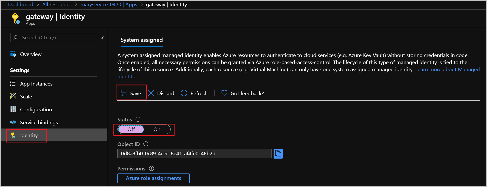

# How to enable system-assigned managed identity for Azure Spring Cloud application
Managed identities for Azure resources provide an automatically managed identity in Azure Active Directory to an Azure resource such as your Azure Spring Cloud application. You can use this identity to authenticate to any service that supports Azure AD authentication, without having credentials in your code.

This article shows how to enable and disable system-assigned managed identities for an Azure Spring Cloud app, using the Azure portal and CLI (available from version 0.2.4).

## Prerequisites
If you're unfamiliar with managed identities for Azure resources, see [overview section](https://docs.microsoft.com/azure/active-directory/managed-identities-azure-resources/overview).
You'll need a deployed Azure Spring Cloud instance. Follow the [Quickstart to deploy by using the Azure CLI](spring-cloud-quickstart-launch-app-cli.md).

## Add a system-assigned identity
Creating an app with a system-assigned identity requires setting an additional property on the application.

### Using Azure portal
To set up a managed identity in the [Azure portal](https://portal.azure.com/), first create an app, and then enable the feature.

1. Create an app in the portal as you normally would. Navigate to it in the portal.
2. Scroll down to the **Settings** group in the left navigation pane.
3. Select **Identity**.
4. Within the **System assigned** tab, switch **Status** to *On*. Click **Save**.

 

### Using Azure CLI
You can enable system-assigned managed identity during app creation or on an existing app.

**Enable system-assigned managed identity during creation of an app**

The following example creates an app named *app_name* with a system-assigned managed identity, as requested by the `--assign-identity` parameter.

```azurecli
az spring-cloud app create -n app_name -s service_name -g resource_group_name --assign-identity
```

**Enable system-assigned managed identity on an existing app**
Use `az spring-cloud app identity assign` command to enable the system-assigned identity on an existing app.

```azurecli
az spring-cloud app identity assign -n app_name -s service_name -g resource_group_name
```

## Obtain tokens for Azure resources
An app can use its managed identity to get tokens to access other resources protected by Azure Active Directory, such as Azure Key Vault. These tokens represent the application accessing the resource, not any specific user of the application.

You may need to [configure the target resource to allow access from your application](https://docs.microsoft.com/azure/active-directory/managed-identities-azure-resources/howto-assign-access-portal). For example, if you request a token to access Key Vault, make sure you have added an access policy that includes your application's identity. Otherwise, your calls to Key Vault will be rejected, even if they include the token. To learn more about which resources support Azure Active Directory tokens, see [Azure services that support Azure AD authentication](https://docs.microsoft.com/azure/active-directory/managed-identities-azure-resources/services-support-managed-identities#azure-services-that-support-azure-ad-authentication).

Azure Spring Cloud shares the same endpoint for token acquisition with Azure Virtual Machine. We recommend using Java SDK or spring boot starters to acquire a token.  See [How to use VM token](https://docs.microsoft.com/azure/active-directory/managed-identities-azure-resources/how-to-use-vm-token) for various code and script examples and guidance on important topics such as handling token expiration and HTTP errors.

Recommended: use Java SDK or spring boot starters to get tokens.  See the samples in the [Next Steps](#next-steps).

## Disable system-assigned identity from an app
Removing a system-assigned identity will also delete it from Azure AD. Deleting the app resource automatically removes system-assigned identities from Azure AD.

### Using Azure portal
To remove system-assigned managed identity from an app that no longer needs it:

1. Sign in to the [Azure portal](https://portal.azure.com/) using an account associated with the Azure subscription that contains the Azure Spring Cloud instance.
1. Navigate to the desired Virtual Machine and select **Identity**.
1. Under **System assigned**/**Status**, select **Off** and then click **Save**:

 

### Using Azure CLI
To remove system-assigned managed identity from an app that no longer needs it, use the following command:
```azurecli
az spring-cloud app identity remove -n app_name -s service_name -g resource_group_name
```

## Next steps
* [How to use managed identities with Java SDK](https://github.com/Azure-Samples/Azure-Spring-Cloud-Samples)
* [Access Azure Key Vault with managed identities in Spring boot starter](https://github.com/Azure/azure-sdk-for-java/blob/master/sdk/spring/azure-spring-boot-starter-keyvault-secrets/README.md#use-msi--managed-identities)
* [Learn more about managed identities for Azure resources](https://github.com/MicrosoftDocs/azure-docs/blob/master/articles/active-directory/managed-identities-azure-resources/overview.md)

