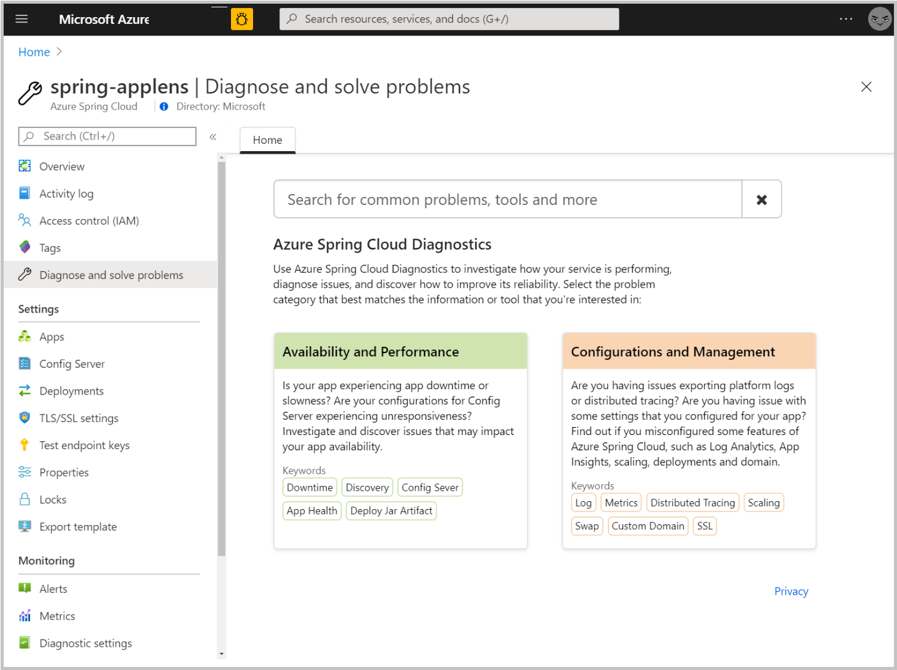
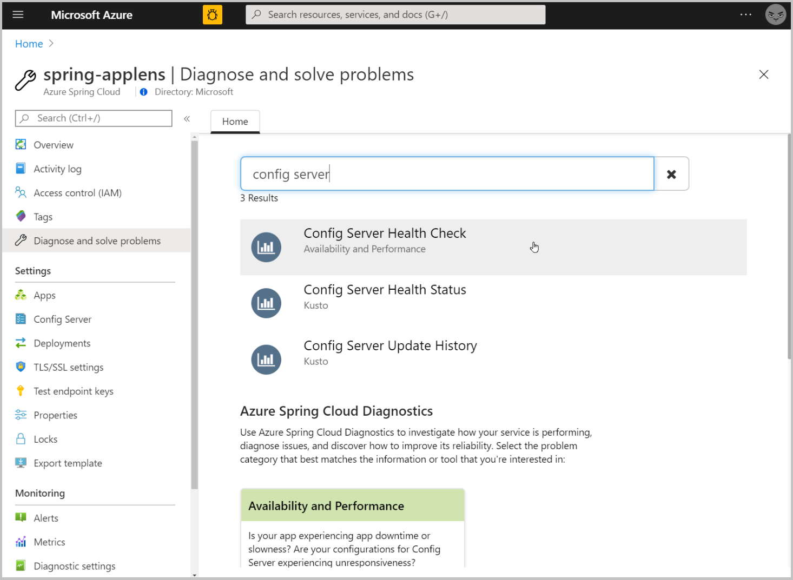
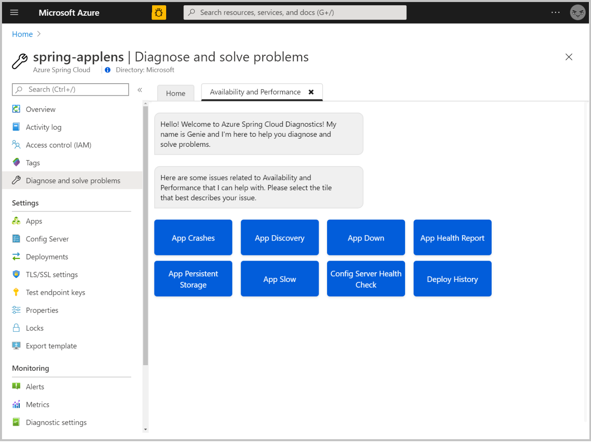
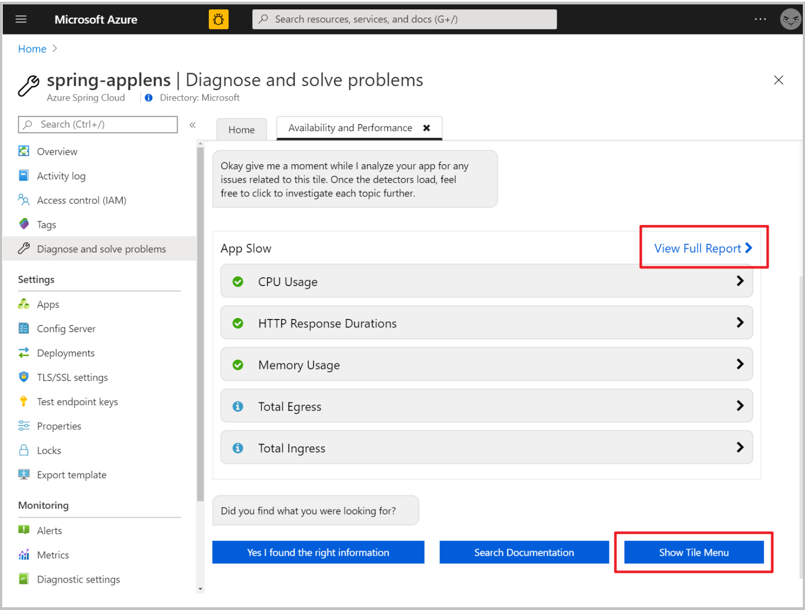
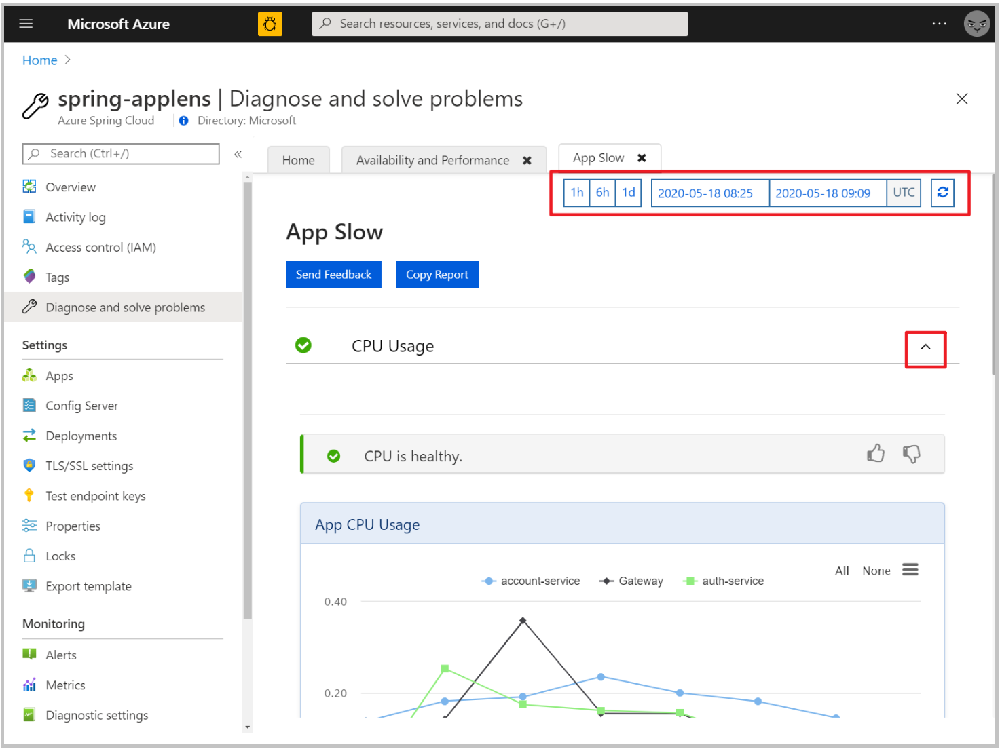
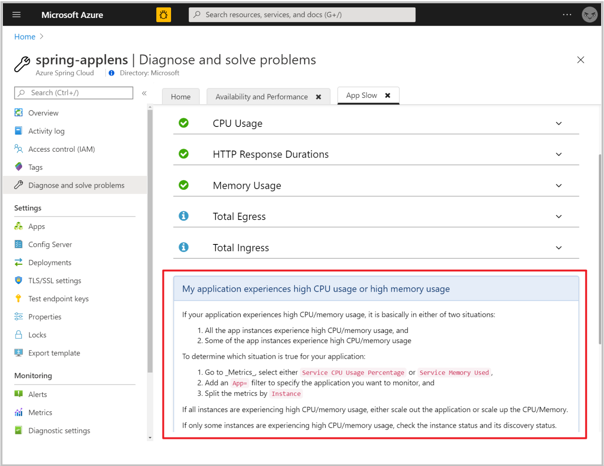

# How to self-diagnose and solve problems in Azure Spring Cloud
Azure Spring Cloud diagnostics is an interactive experience to help you troubleshoot your app. No configuration is required. When you find issues, Azure Spring Cloud diagnostics points out what’s wrong and guides you to information that helps troubleshoot and resolve the issue.

## Prerequisites
To complete this tutorial, you need:

* An Azure subscription. If you don't have an Azure subscription, create a [free account](https://azure.microsoft.com/free/?WT.mc_id=A261C142F) before you begin.
* A deployed Azure Spring Cloud service instance. Follow our [quickstart on deploying an app via the Azure CLI](spring-cloud-quickstart.md) to get started.
* At least one application already created in your service instance.

## Navigate to the diagnostics page
1. Sign in to the Azure portal.
2. Go to your Azure Spring Cloud **Overview** page.
3. Open **Diagnose and solve problems** in the menu on the left side of the page.

 

 ## Search logged issues
To find an issue, you can either search by typing a keyword or click solution group to explore all in that category.

 

Selection of **Config Server Health Check**, **Config Server Health Status**, or **Config Server Update History** will display various results.

Find your target detector, and click it to execute. A summary of diagnostics will be shown after you execute the detector. You can select **View Full Report** to check diagnostic details or click **Show Tile Menu** button to go back to detector list.

 

In diagnostic details page, you can change the diagnostic time range with the controller at top-right corner. To see more metrics or logs, toggle each diagnostic. There can be a 15-minute delay for metrics and logs.

 

Some results contain related documentation.

 

## Next steps
* [Monitor Spring Cloud resources using alerts and action groups](spring-cloud-tutorial-alerts-action-groups.md)
* [Security controls for Azure Spring Cloud Service](spring-cloud-concept-security-controls.md)