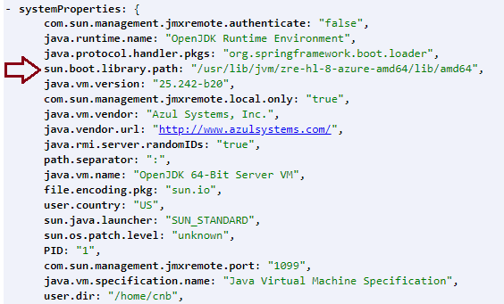

# Java and Base OS for Spring Microservice Apps

**This article applies to:** ✔️ Java

The following are principles for maintaining healthy Java and base operating system for Spring microservice apps.
## Principles for healthy Java and Base OS
* Shall be the same base operating system across tiers - Basic | Standard | Premium.
    * Currently, apps on Azure Spring Cloud use a mix of Debian 10 and Ubuntu 18.04.
    * VMware build service uses Ubuntu 18.04.
* Shall be the same base operating system regardless of deployment starting points - source | JAR
    * Currently, apps on Azure Spring Cloud use a mix of Debian 10 and Ubuntu 18.04.
* Base operating system shall be free of security vulnerabilities.
    * Debian 10 base operating system has 147 open CVEs.
    * Ubuntu 18.04 base operating system has 132 open CVEs.
* Shall use JRE-headless.
    * Currently, apps on Azure Spring Cloud use JDK. JRE-headless is a smaller image.
* Shall use the most recent builds of Java.
    * Currently, apps on Azure Spring Cloud use Java 8 build 242. This is an outdated build.
 
Azul Systems will continuously scan for changes to base operating systems and keep the last built images up to date. Azure Spring Cloud looks for changes to images and continuously updates them across deployments.
 
## FAQ for Azure Spring Cloud

* Which versions of Java are supported? Major version and build number.
    * Support LTS versions - Java 8 and 11.
    * Uses the most recent build - for example, right now, Java 8 build 252 and Java 11 build 7.
* Who built these Java runtimes?
    * Azul Systems.
* What is the base operating system for images?
    * Ubuntu 20.04 LTS (Focal Fossa). Apps will continue to stay on the most recent LTS version of Ubuntu.
    * See [Ubuntu 20.04 LTS (Focal Fossa)](http://releases.ubuntu.com/focal/)
* How can I download a supported Java runtime for local dev? 
    * See [Install the JDK for Azure and Azure Stack](/azure/developer/java/fundamentals/java-jdk-install)
* How can I get support for issues at the Java runtime level?
    * Open a support ticket with Azure Support.
 
## Default deployment on Azure Spring Cloud

> 
 
## Next steps

* [Quickstart: Deploy your first Azure Spring Cloud application](spring-cloud-quickstart.md)
* [Java long-term support for Azure and Azure Stack](/azure/developer/java/fundamentals/java-jdk-long-term-support)