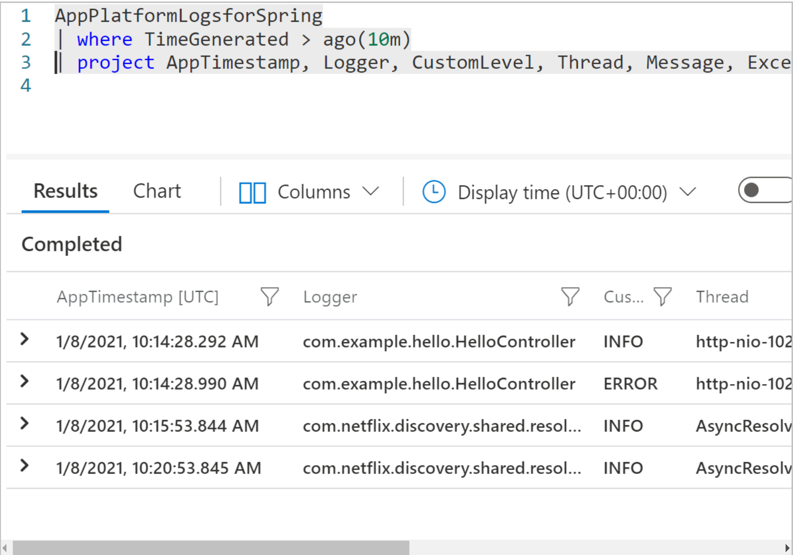

# Structured application log for Azure Spring Cloud

This article explains how to generate and collect structured application log data in Azure Spring Cloud. With proper configuration, Azure Spring Cloud provides useful application log query and analysis through Log Analytics.

## Log schema requirements
To improve log query experience, an application log is required to be in JSON format and conform to a schema. Azure Spring Cloud uses this schema to parse your application and stream to Log Analytics. 

**JSON schema requirements:**

| Json Key      | Json value Type|  Required | Column in Log Analytics| Description |
| --------------| ------------|-----------|-----------------|--------------------------|
| timestamp     | string      |     Yes   | AppTimestamp    | timestamp in UTC format  |
| logger        | string      |     No    | Logger          | logger                   |
| level         | string      |     No    | CustomLevel     | log level                |
| thread        | string      |     No    | Thread          | thread                   |
| message       | string      |     No    | Message         | log message              |
| stackTrace    | string      |     No    | StackTrace      | exception stack trace    |
| exceptionClass| string      |     No    | ExceptionClass  | exception class name     |
| mdc           | nested JSON |     No    |                 | mapped diagnostic context|
| mdc.traceId   | string      |     No    | TraceId         |trace Id for distributed tracing|
| mdc.spanId    | string      |     No    | SpanId          |span Id for distributed tracing |
|               |             |           |                 |                          |

* The "timestamp" field is required, and should be in UTC format, all other fields are optional.
* "traceId" and "spanId" in "mdc" field are used for tracing purpose.
* Log each JSON record in one line. 

**Log record sample** 
 ```
{"timestamp":"2021-01-08T09:23:51.280Z","logger":"com.example.demo.HelloController","level":"ERROR","thread":"http-nio-1456-exec-4","mdc":{"traceId":"c84f8a897041f634","spanId":"c84f8a897041f634"},"stackTrace":"java.lang.RuntimeException: get an exception\r\n\tat com.example.demo.HelloController.throwEx(HelloController.java:54)\r\n\","message":"Got an exception","exceptionClass":"RuntimeException"}
```

## Generate schema-compliant JSON log  
For Spring applications, you can generate expected JSON log format using common [logging frameworks](https://docs.spring.io/spring-boot/docs/2.1.13.RELEASE/reference/html/boot-features-logging.html#boot-features-custom-log-configuration), such as [logback](http://logback.qos.ch/) and [log4j2](https://logging.apache.org/log4j/2.x/). 

### Log with logback 
When using Spring Boot starters, logback is used by default. For logback apps, use [logstash-encoder](https://github.com/logstash/logstash-logback-encoder) to generate JSON formatted log. This method is supported in Spring Boot version 2.1+. 

The procedure:

1. Add logstash dependency in your pom.xml file. 

    ```json
    <dependency>
		<groupId>net.logstash.logback</groupId>
		<artifactId>logstash-logback-encoder</artifactId>
		<version>6.5</version>
	</dependency>
    ```
1. Update your logback.xml config file to set the JSON format.
    ```json
    <configuration>
        <appender name="stdout" class="ch.qos.logback.core.ConsoleAppender">
            <encoder class="net.logstash.logback.encoder.LoggingEventCompositeJsonEncoder">
            <providers>
                <timestamp>
                    <fieldName>timestamp</fieldName>
                    <timeZone>UTC</timeZone>
                </timestamp>
                <loggerName>
                    <fieldName>logger</fieldName>
                </loggerName>
                <logLevel>
                    <fieldName>level</fieldName>
                </logLevel>
                <threadName>
                    <fieldName>thread</fieldName>
                </threadName>
                <nestedField>
                    <fieldName>mdc</fieldName>
                    <providers>
                        <mdc/>
                    </providers>
                </nestedField>
                <stackTrace>
                    <fieldName>stackTrace</fieldName>
                </stackTrace>
                <message/>
                <throwableClassName>
                    <fieldName>exceptionClass</fieldName>
                </throwableClassName>
            </providers>
            </encoder>
        </appender>
        <root level="info">
            <appender-ref ref="stdout"/>
        </root>
    </configuration>
    ```

### Log with log4j2 

For log4j2 apps, use [json-template-layout](https://logging.apache.org/log4j/2.x/manual/json-template-layout.html) to generate JSON formatted log. This method is supported in Spring Boot version 2.1+.

The procedure:

1. Exclude `spring-boot-starter-logging` from `spring-boot-starter`, add dependencies `spring-boot-starter-log4j2`, `log4j-layout-template-json` in your pom.xml file.

    ```xml
        <dependency>
            <groupId>org.springframework.boot</groupId>
            <artifactId>spring-boot-starter-web</artifactId>
            <exclusions>
                    <exclusion>
                    <groupId>org.springframework.boot</groupId>
                    <artifactId>spring-boot-starter-logging</artifactId>
                </exclusion>
            </exclusions>
        </dependency>
        <dependency>
            <groupId>org.springframework.boot</groupId>
            <artifactId>spring-boot-starter-log4j2</artifactId>
        </dependency>
        <dependency>
            <groupId>org.apache.logging.log4j</groupId>
            <artifactId>log4j-layout-template-json</artifactId>
            <version>2.14.0</version>
        </dependency>
    ```

2. Prepare a JSON layout template file jsonTemplate.json in your class path.

    ```json
        {
            "mdc": {
                "$resolver": "mdc"
            },
            "exceptionClass": {
                "$resolver": "exception",
                "field": "className"
            },
            "stackTrace": {
                "$resolver": "exception",
                "field": "stackTrace",
                "stringified": true
            },
            "message": {
                "$resolver": "message",
                "stringified": true
            },
            "thread": {
                "$resolver": "thread",
                "field": "name"
            },
            "timestamp": {
                "$resolver": "timestamp",
                "pattern": {
                    "format": "yyyy-MM-dd'T'HH:mm:ss.SSS'Z'",
                    "timeZone": "UTC"
                }
            },
            "level": {
                "$resolver": "level",
                "field": "name"
            },
            "logger": {
                "$resolver": "logger",
                "field": "name"
            }
        }
    ```

3. Use this JSON layout template in your log4j2.xml config file. 

    ```json
        <configuration>
            <appenders>
                <console name="Console" target="SYSTEM_OUT">
                <JsonTemplateLayout eventTemplateUri="classpath:jsonTemplate.json"/>
                </console>
            </appenders>
            <loggers>
                <root level="info">
                <appender-ref ref="Console"/>
                </root>
            </loggers>
        </configuration>
    ```

## Analyze the logs in Log Analytics

After your application is properly set up, your application console log will be streamed to Log Analytics. The structure enables efficient query in Log Analytics.

### Check log structure in Log Analytics
Use the following procedure:
1. Go to service overview page of your service instance.
2. Click `Logs` entry under `Monitoring` section.
3. Run this query.

   ```
   AppPlatformLogsforSpring
   | where TimeGenerated > ago(1h)
   | project AppTimestamp, Logger, CustomLevel, Thread, Message, ExceptionClass, StackTrace, TraceId, SpanId
   ```

4. Application logs return as shown in the following image:



### Show log entries containing errors

To review log entries that have an error, run the following query:

```
AppPlatformLogsforSpring
| where TimeGenerated > ago(1h) and CustomLevel == "ERROR" 
| project AppTimestamp, Logger, ExceptionClass, StackTrace, Message, AppName 
| sort by AppTimestamp
```

Use this query to find errors, or modify the query terms to find specific exception class or error code. 

### Show log entries for a specific traceId
To review log entries for a specific tracing ID "trace_id", run the following query:

```
AppPlatformLogsforSpring
| where TimeGenerated > ago(1h)
| where TraceId == "trace_id" 
| project AppTimestamp, Logger, TraceId, SpanId, StackTrace, Message, AppName 
| sort by AppTimestamp
```

## Next Steps
* To learn more about the Log Query, see [Get started with log queries in Azure Monitor](https://docs.microsoft.com/azure/azure-monitor/log-query/get-started-queries)
