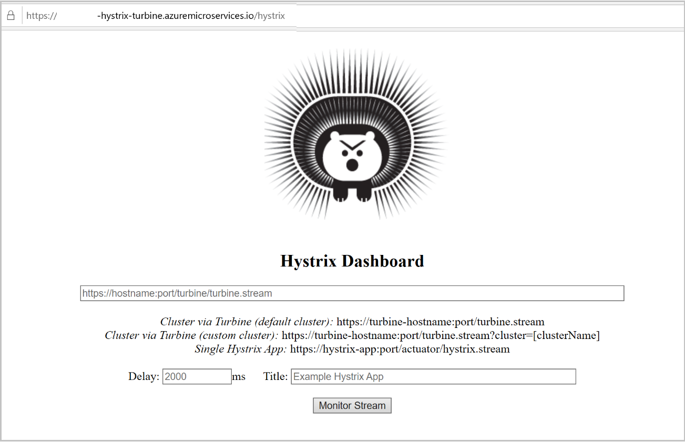

# Use Circuit Breaker Dashboard with Azure Spring Cloud

**This article applies to:** ✔️ Java

::: zone pivot="programming-language-java"
Spring [Cloud Netflix Turbine](https://github.com/Netflix/Turbine) is widely used to aggregate multiple [Hystrix](https://github.com/Netflix/Hystrix) metrics streams so that streams can be monitored in a single view using Hystrix dashboard. This tutorial demonstrates how to use them on Azure Spring Cloud.
> [!NOTE]
> Netflix Hystrix is widely used in many existing Spring Cloud apps but it is no longer in active development. If you are developing new project, use instead Spring Cloud Circuit Breaker implementations like [resilience4j](https://github.com/resilience4j/resilience4j). Different from Turbine shown in this tutorial, the new Spring Cloud Circuit Breaker framework unifies all implementations of its metrics data pipeline into Micrometer. We are still working on supporting micrometer in Azure Spring Cloud, thus it will not be covered by this tutorial.

## Prepare your sample applications
The sample is forked from this [repository](https://github.com/StackAbuse/spring-cloud/tree/master/spring-turbine).

Clone the sample repository to your develop environment:
```
git clone https://github.com/Azure-Samples/Azure-Spring-Cloud-Samples.git
cd Azure-Spring-Cloud-Samples/hystrix-turbine-sample
```

Build the 3 applications that will be used in this tutorial:
* user-service: A simple REST service that has a single endpoint of /personalized/{id}
* recommendation-service: A simple REST service that has a single endpoint of /recommendations, which will be called by user-service.
* hystrix-turbine: A Hystrix dashboard service to display Hystrix streams and a Turbine service aggregating Hystrix metrics stream from other services.
```
mvn clean package -D skipTests -f user-service/pom.xml
mvn clean package -D skipTests -f recommendation-service/pom.xml
mvn clean package -D skipTests -f hystrix-turbine/pom.xml
```
## Provision your Azure Spring Cloud instance
Follow the procedure, [Provision a service instance on the Azure CLI](https://docs.microsoft.com/azure/spring-cloud/spring-cloud-quickstart-launch-app-cli#provision-a-service-instance-on-the-azure-cli).

## Deploy your applications to Azure Spring Cloud
These apps do not use **Config Server**, so there is no need to set up **Config Server** for Azure Spring Cloud.  Create and deploy as follows:
```azurecli
az spring-cloud app create -n user-service --is-public
az spring-cloud app create -n recommendation-service
az spring-cloud app create -n hystrix-turbine --is-public

az spring-cloud app deploy -n user-service --jar-path user-service/target/user-service.jar
az spring-cloud app deploy -n recommendation-service --jar-path recommendation-service/target/recommendation-service.jar
az spring-cloud app deploy -n hystrix-turbine --jar-path hystrix-turbine/target/hystrix-turbine.jar
```
## Verify your apps
After all the apps are running and discoverable, access `user-service` with the path https://<username>-user-service.azuremicroservices.io/personalized/1 from your browser. If the user-service can access `recommendation-service`, you should get the following output. Refresh the web page a few times if it doesn't work.
```json
[{"name":"Product1","description":"Description1","detailsLink":"link1"},{"name":"Product2","description":"Description2","detailsLink":"link3"},{"name":"Product3","description":"Description3","detailsLink":"link3"}]
```
## Access your Hystrix dashboard and metrics stream
Verify using public endpoints or private test endpoints.

### Using public endpoints
Access hystrix-turbine with the path `https://<SERVICE-NAME>-hystrix-turbine.azuremicroservices.io/hystrix` from your browser.  The following figure shows the Hystrix dashboard running in this app.



Copy the Turbine stream url `https://<SERVICE-NAME>-hystrix-turbine.azuremicroservices.io/turbine.stream?cluster=default` into the text box, and click **Monitor Stream**.  This will display the dashboard. If nothing shows in the viewer, hit the `user-service` endpoints to generate streams.


Now you can experiment with the Circuit Breaker Dashboard.
> [!NOTE] 
> In production, the Hystrix dashboard and metrics stream should not be exposed to the Internet.

### Using private test endpoints
Hystrix metrics streams are also accessible from `test-endpoint`. As a backend service, we didn't assign a public end-point for `recommendation-service`, but we can show its metrics with test-endpoint at `https://primary:<KEY>@<SERVICE-NAME>.test.azuremicroservices.io/recommendation-service/default/actuator/hystrix.stream`


As a web app, Hystrix dashboard should be working on `test-endpoint`. If it is not working properly, there may be two reasons: first, using `test-endpoint` changed the base URL from `/ to /<APP-NAME>/<DEPLOYMENT-NAME>`, or, second, the web app is using absolute path for static resource. To get it working on `test-endpoint`, you might need to manually edit the <base>in the front-end files.

## Next steps
* [Provision a service instance on the Azure CLI](https://docs.microsoft.com/azure/spring-cloud/spring-cloud-quickstart-launch-app-cli#provision-a-service-instance-on-the-azure-cli)
* [Prepare a Java Spring application for deployment in Azure Spring Cloud](https://docs.microsoft.com/azure/spring-cloud/spring-cloud-tutorial-prepare-app-deployment)
::: zone-end
