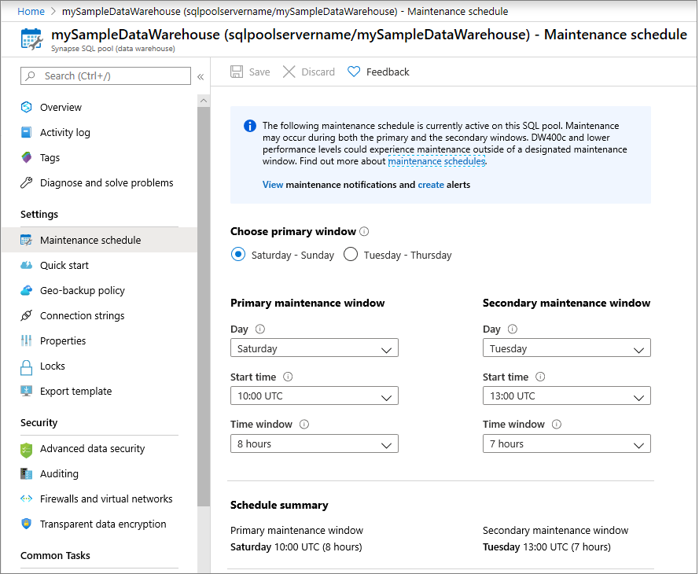
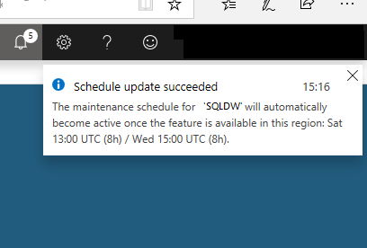

# Change a maintenance schedule 

## Portal
A maintenance schedule can be updated or changed at any time. If the selected instance is going through an active maintenance cycle, the settings will be saved. They'll become active during the next identified maintenance period. [Learn more](https://docs.microsoft.com/azure/service-health/resource-health-overview) about monitoring your data warehouse during an active maintenance event. 

To use maintenance schedules, you must select two maintenance windows during a seven-day period. Each maintenance window can be three to eight hours. Maintenance can occur at any time within a maintenance window but won't occur outside time windows without prior notification. You'll also experience a brief loss of connectivity as the service deploys new code to your data warehouse. 

## Identifying the primary and secondary windows

The primary and secondary windows must have separate day ranges. An example is a primary window of Tuesday–Thursday and a secondary of window of Saturday–Sunday.

To change the maintenance schedule for your data warehouse, complete the following steps:
1.	Sign in to the [Azure portal](https://portal.azure.com/).
2.	Select the data warehouse that you want to update. The page opens on the overview blade. 
3.	Open the page for maintenance schedule settings by selecting the **Maintenance Schedule (preview) summary** link on the overview blade. Or, select the **Maintenance Schedule** option on the left-side resource menu.  

    

4. Identify the preferred day range for your primary maintenance window by using the options at the top of the page. This selection determines if your primary window will occur on a weekday or over the weekend. Your selection will update the drop-down values. 
During preview, some regions might not yet support the full set of available **Day** options.

   

5. Choose your preferred primary and secondary maintenance windows by using the drop-down list boxes:
   - **Day**: Preferred day to perform maintenance during the selected window.
   - **Start time**: Preferred start time for the maintenance window.
   - **Time window**: Preferred duration of your time window.

   The **Schedule summary** area at the bottom of the blade is updated based on the values that you selected. 
  
6. Select **Save**. A message appears, confirming that your new schedule is now active. 

   If you're saving a schedule in a region that doesn't support maintenance scheduling, the following message appears. Your settings are saved and become active when the feature becomes available in your selected region.    

   

## Next steps
- [Learn more](https://docs.microsoft.com/azure/monitoring-and-diagnostics/monitor-alerts-unified-log-webhook) about webhook actions for log alert rules.
- [Learn more](https://docs.microsoft.com/azure/service-health/service-health-overview) about Azure Service Health.

