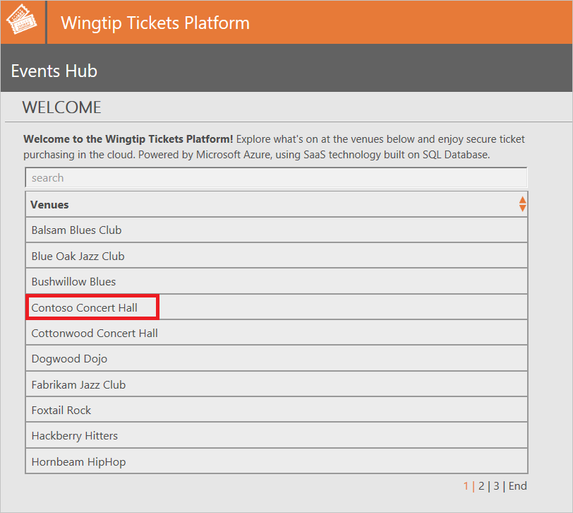

# Restore a single tenant with a database-per-tenant SaaS application

The database-per-tenant model makes it easy to restore a single tenant to a prior point in time without affecting other tenants.

In this tutorial, you learn two data recovery patterns:

> [!div class="checklist"]
> * Restore a database into a parallel database (side by side).
> * Restore a database in place, replacing the existing database.

|||
|:--|:--|
| Restore into a parallel database | This pattern can be used for tasks such as review, auditing, and compliance to allow a tenant to inspect their data from an earlier point. The tenant's current database remains online and unchanged. |
| Restore in place | This pattern is typically used to recover a tenant to an earlier point, after a tenant accidentally deletes or corrupts data. The original database is taken off line and replaced with the restored database. |
|||

To complete this tutorial, make sure the following prerequisites are completed:

* The Wingtip SaaS app is deployed. To deploy in less than five minutes, see [Deploy and explore the Wingtip SaaS application](saas-dbpertenant-get-started-deploy.md).
* Azure PowerShell is installed. For details, see [Get started with Azure PowerShell](https://docs.microsoft.com/powershell/azure/get-started-azureps).

## Introduction to the SaaS tenant restore patterns

There are two simple patterns for restoring an individual tenant's data. Because tenant databases are isolated from each other, restoring one tenant has no impact on any other tenant's data. The Azure SQL Database point-in-time-restore (PITR) feature is used in both patterns. PITR always creates a new database.

* **Restore in parallel**: In the first pattern, a new parallel database is created alongside the tenant's current database. The tenant is then given read-only access to the restored database. The restored data can be reviewed and potentially used to overwrite current data values. It's up to the app designer to determine how the tenant accesses the restored database and what options for recovery are provided. Simply allowing the tenant to review their data at an earlier point might be all that's required in some scenarios.

* **Restore in place**: The second pattern is useful if data was lost or corrupted and the tenant wants to revert to an earlier point. The tenant is taken off line while the database is restored. The original database is deleted, and the restored database is renamed. The backup chain of the original database remains accessible after the deletion, so you can restore the database to an earlier point in time, if necessary.

If the database uses [active geo-replication](sql-database-active-geo-replication.md) and restoring in parallel, we recommend that you copy any required data from the restored copy into the original database. If you replace the original database with the restored database, you need to reconfigure and resynchronize geo-replication.

## Get the Wingtip Tickets SaaS database-per-tenant application scripts

The Wingtip Tickets SaaS Multitenant Database scripts and application source code are available in the [WingtipTicketsSaaS-DbPerTenant](https://github.com/Microsoft/WingtipTicketsSaaS-DbPerTenant) GitHub repo. For steps to download and unblock the Wingtip Tickets SaaS scripts, see the [general guidance](saas-tenancy-wingtip-app-guidance-tips.md).

## Before you start

When a database is created, it can take 10 to 15 minutes before the first full backup is available to restore from. If you just installed the application, you might need to wait for a few minutes before you try this scenario.

## Simulate a tenant accidentally deleting data

To demonstrate these recovery scenarios, first "accidentally" delete an event in one of the tenant databases. 

### Open the Events app to review the current events

1. Open the Events Hub (http://events.wtp.&lt;user&gt;.trafficmanager.net), and select **Contoso Concert Hall**.

   

2. Scroll the list of events, and make a note of the last event in the list.

   

### "Accidentally" delete the last event

1. In the PowerShell ISE, open ...\\Learning Modules\\Business Continuity and Disaster Recovery\\RestoreTenant\\*Demo-RestoreTenant.ps1*, and set the following value:

   * **$DemoScenario** = **1**, *Delete last event (with no ticket sales)*.
2. Press F5 to run the script and delete the last event. The following confirmation message appears:

   ```Console
   Deleting last unsold event from Contoso Concert Hall ...
   Deleted event 'Seriously Strauss' from Contoso Concert Hall venue.
   ```

3. The Contoso events page opens. Scroll down and verify that the event is gone. If the event is still in the list, select **Refresh** and verify that it's gone.
   

## Restore a tenant database in parallel with the production database

This exercise restores the Contoso Concert Hall database to a point in time before the event was deleted. This scenario assumes that you want to review the deleted data in a parallel database.

 The *Restore-TenantInParallel.ps1* script creates a parallel tenant database named *ContosoConcertHall\_old*, with a parallel catalog entry. This pattern of restore is best suited for recovering from a minor data loss. You also can use this pattern if you need to review data for compliance or auditing purposes. It's the recommended approach when you use [active geo-replication](sql-database-active-geo-replication.md).

1. Complete the [Simulate a tenant accidentally deleting data](#simulate-a-tenant-accidentally-deleting-data) section.
2. In the PowerShell ISE, open ...\\Learning Modules\\Business Continuity and Disaster Recovery\\RestoreTenant\\_Demo-RestoreTenant.ps1_.
3. Set **$DemoScenario** = **2**, *Restore tenant in parallel*.
4. To run the script, press F5.

The script restores the tenant database to a point in time before you deleted the event. The database is restored to a new database named _ContosoConcertHall\_old_. The catalog metadata that exists in this restored database is deleted, and then the database is added to the catalog by using a key constructed from the *ContosoConcertHall\_old* name.

The demo script opens the events page for this new tenant database in your browser. Note from the URL ```http://events.wingtip-dpt.&lt;user&gt;.trafficmanager.net/contosoconcerthall_old``` that this page shows data from the restored database where *_old* is added to the name.

Scroll the events listed in the browser to confirm that the event deleted in the previous section was restored.

Exposing the restored tenant as an additional tenant, with its own Events app, is unlikely to be how you  provide a tenant access to restored data. It serves to illustrate the restore pattern. Typically, you give read-only access to the old data and retain the restored database for a defined period. In the sample, you can delete the restored tenant entry after you're finished by running the _Remove restored tenant_ scenario.

1. Set **$DemoScenario** = **4**, *Remove restored tenant*.
2. To run the script, press F5.
3. The *ContosoConcertHall\_old* entry is now deleted from the catalog. Close the events page for this tenant in your browser.

## Restore a tenant in place, replacing the existing tenant database

This exercise restores the Contoso Concert Hall tenant to a point before the event was deleted. The *Restore-TenantInPlace* script restores a tenant database to a new database and deletes the original. This restore pattern is best suited to recovering from serious data corruption, and the tenant might have to accommodate significant data loss.

1. In the PowerShell ISE, open the **Demo-RestoreTenant.ps1** file.
2. Set **$DemoScenario** = **5**, *Restore tenant in place*.
3. To run the script, press F5.

The script restores the tenant database to a point before the event was deleted. It first takes the Contoso Concert Hall tenant off line to prevent further updates. Then, a parallel database is created by restoring from the restore point. The restored database is named with a time stamp to make sure the database name doesn't conflict with the existing tenant database name. Next, the old tenant database is deleted, and the restored database is renamed to the original database name. Finally, Contoso Concert Hall is brought online to allow the app access to the restored database.

You successfully restored the database to a point in time before the event was deleted. When the **Events** page opens, confirm that the last event was restored.

After you restore the database, it takes another 10 to 15 minutes before the first full backup is available to restore from again.

## Next steps

In this tutorial, you learned how to:

> [!div class="checklist"]
> * Restore a database into a parallel database (side by side).
> * Restore a database in place.

Try the [Manage tenant database schema](saas-tenancy-schema-management.md) tutorial.

## Additional resources

* [Additional tutorials that build on the Wingtip SaaS application](saas-dbpertenant-wingtip-app-overview.md#sql-database-wingtip-saas-tutorials)
* [Overview of business continuity with Azure SQL Database](sql-database-business-continuity.md)
* [Learn about SQL Database backups](sql-database-automated-backups.md)
