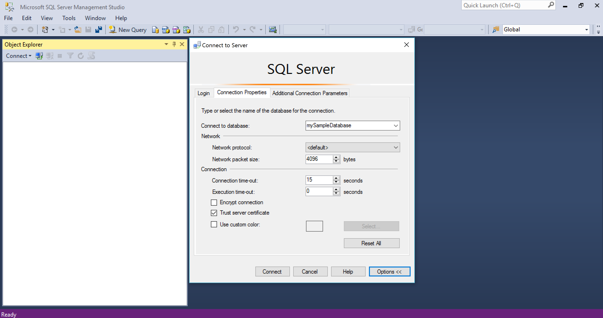
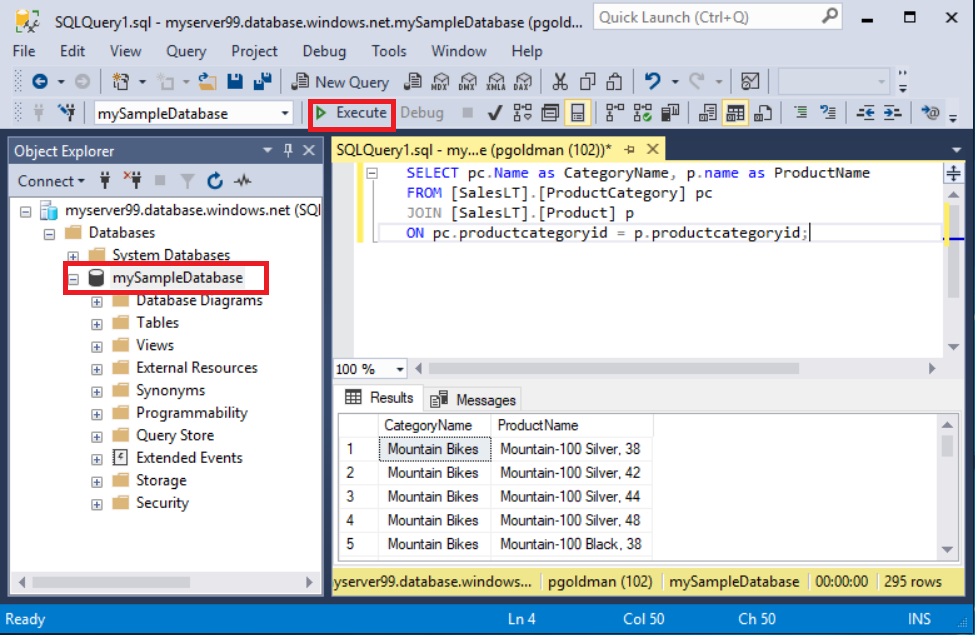

# Quickstart: Use SQL Server Management Studio to connect and query an Azure SQL database

In this quickstart, you'll use [SQL Server Management Studio][ssms-install-latest-84g] (SSMS) to connect to an Azure SQL database. You'll then run Transact-SQL statements to query, insert, update, and delete data. You can use SSMS to manage any SQL infrastructure, from SQL Server to SQL Database for Microsoft Windows.  

## Prerequisites

An Azure SQL database. You can use one of these quickstarts to create and then configure a database in Azure SQL Database:

  || Single database | Managed instance |
  |:--- |:--- |:---|
  | Create| [Portal](sql-database-single-database-get-started.md) | [Portal](sql-database-managed-instance-get-started.md) |
  || [CLI](scripts/sql-database-create-and-configure-database-cli.md) | [CLI](https://medium.com/azure-sqldb-managed-instance/working-with-sql-managed-instance-using-azure-cli-611795fe0b44) |
  || [PowerShell](scripts/sql-database-create-and-configure-database-powershell.md) | [PowerShell](scripts/sql-database-create-configure-managed-instance-powershell.md) |
  | Configure | [Server-level IP firewall rule](sql-database-server-level-firewall-rule.md)| [Connectivity from a VM](sql-database-managed-instance-configure-vm.md)|
  |||[Connectivity from on-site](sql-database-managed-instance-configure-p2s.md)
  |Load data|Adventure Works loaded per quickstart|[Restore Wide World Importers](sql-database-managed-instance-get-started-restore.md)
  |||Restore or import Adventure Works from [BACPAC](sql-database-import.md) file from [GitHub](https://github.com/Microsoft/sql-server-samples/tree/master/samples/databases/adventure-works)|

  > [!IMPORTANT]
  > The scripts in this article are written to use the Adventure Works database. With a managed instance, you must either import the Adventure Works database into an instance database or modify the scripts in this article to use the Wide World Importers database.

## Install the latest SSMS

Before you start, make sure you've installed the latest [SSMS][ssms-install-latest-84g].

## Get SQL server connection information

Get the connection information you need to connect to the Azure SQL database. You'll need the fully qualified server name or host name, database name, and login information for the upcoming procedures.

1. Sign in to the [Azure portal](https://portal.azure.com/).

2. Navigate to the **SQL databases**  or **SQL managed instances** page.

3. On the **Overview** page, review the fully qualified server name next to **Server name** for a single database or the fully qualified server name next to **Host** for a managed instance. To copy the server name or host name, hover over it and select the **Copy** icon.

## Connect to your database

In SMSS, connect to your Azure SQL Database server.

> [!IMPORTANT]
> An Azure SQL Database server listens on port 1433. To connect to a SQL Database server from behind a corporate firewall, the firewall must have this port open.
>

1. Open SSMS. The **Connect to Server** dialog box appears.

2. Enter the following information:

   | Setting      | Suggested value    | Description |
   | ------------ | ------------------ | ----------- |
   | **Server type** | Database engine | Required value. |
   | **Server name** | The fully qualified server name | Something like: **mynewserver20170313.database.windows.net**. |
   | **Authentication** | SQL Server Authentication | This tutorial uses SQL Authentication. |
   | **Login** | Server admin account user ID | The user ID from the server admin account used to create the server. |
   | **Password** | Server admin account password | The password from the server admin account used to create the server. |
   ||||

     

3. Select **Options** in the **Connect to Server** dialog box. In the **Connect to database** drop-down menu, select **mySampleDatabase**.

     

4. Select **Connect**. The Object Explorer window opens.

5. To view the database's objects, expand **Databases** and then expand **mySampleDatabase**.

     

## Query data

Run this [SELECT](https://msdn.microsoft.com/library/ms189499.aspx) Transact-SQL code to query for the top 20 products by category.

1. In Object Explorer, right-click **mySampleDatabase** and select **New Query**. A new query window connected to your database opens.

2. In the query window, paste this SQL query.

   ```sql
   SELECT pc.Name as CategoryName, p.name as ProductName
   FROM [SalesLT].[ProductCategory] pc
   JOIN [SalesLT].[Product] p
   ON pc.productcategoryid = p.productcategoryid;
   ```

3. On the toolbar, select **Execute** to retrieve data from the `Product` and `ProductCategory` tables.

    

## Insert data

Run this [INSERT](https://msdn.microsoft.com/library/ms174335.aspx) Transact-SQL code to create a new product in the `SalesLT.Product` table.

1. Replace the previous query with this one.

   ```sql
   INSERT INTO [SalesLT].[Product]
           ( [Name]
           , [ProductNumber]
           , [Color]
           , [ProductCategoryID]
           , [StandardCost]
           , [ListPrice]
           , [SellStartDate] )
     VALUES
           ('myNewProduct'
           ,123456789
           ,'NewColor'
           ,1
           ,100
           ,100
           ,GETDATE() );
   ```

2. Select **Execute**  to insert a new row in the `Product` table. The **Messages** pane displays **(1 row affected)**.

## View the result

1. Replace the previous query with this one.

   ```sql
   SELECT * FROM [SalesLT].[Product]
   WHERE Name='myNewProduct'
   ```

2. Select **Execute**. The following result appears.

   

## Update data

Run this [UPDATE](https://msdn.microsoft.com/library/ms177523.aspx) Transact-SQL code to modify your new product.

1. Replace the previous query with this one.

   ```sql
   UPDATE [SalesLT].[Product]
   SET [ListPrice] = 125
   WHERE Name = 'myNewProduct';
   ```

2. Select **Execute** to update the specified row in the `Product` table. The **Messages** pane displays **(1 row affected)**.

## Delete data

Run this [DELETE](https://msdn.microsoft.com/library/ms189835.aspx) Transact-SQL code to remove your new product.

1. Replace the previous query with this one.

   ```sql
   DELETE FROM [SalesLT].[Product]
   WHERE Name = 'myNewProduct';
   ```

2. Select **Execute** to delete the specified row in the `Product` table. The **Messages** pane displays **(1 row affected)**.

## Next steps

- For information about SSMS, see [SQL Server Management Studio](https://msdn.microsoft.com/library/ms174173.aspx).
- To connect and query using the Azure portal, see [Connect and query with the Azure portal SQL Query editor](sql-database-connect-query-portal.md).
- To connect and query using Visual Studio Code, see [Connect and query with Visual Studio Code](sql-database-connect-query-vscode.md).
- To connect and query using .NET, see [Connect and query with .NET](sql-database-connect-query-dotnet.md).
- To connect and query using PHP, see [Connect and query with PHP](sql-database-connect-query-php.md).
- To connect and query using Node.js, see [Connect and query with Node.js](sql-database-connect-query-nodejs.md).
- To connect and query using Java, see [Connect and query with Java](sql-database-connect-query-java.md).
- To connect and query using Python, see [Connect and query with Python](sql-database-connect-query-python.md).
- To connect and query using Ruby, see [Connect and query with Ruby](sql-database-connect-query-ruby.md).

<!-- Article link references. -->

[ssms-install-latest-84g]: https://docs.microsoft.com/sql/ssms/sql-server-management-studio-ssms
