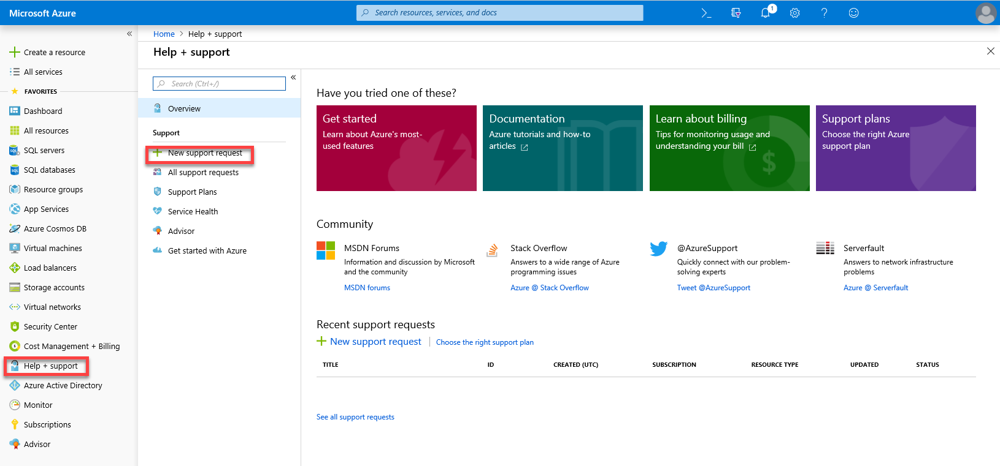
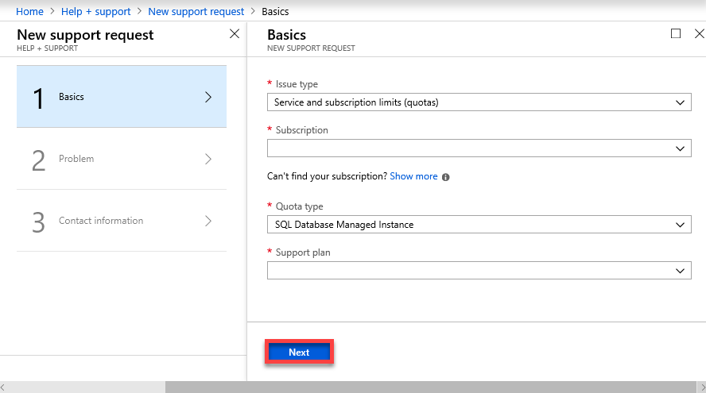
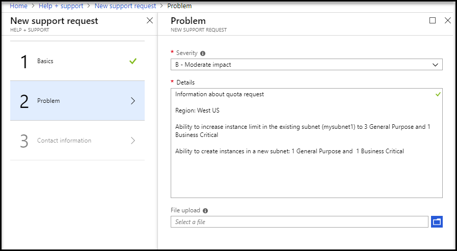

# Overview Azure SQL Database managed instance resource limits

This article provides an overview of the resource limits for Azure SQL Database managed instance, and provides information about how to request an increase to these limits.

> [!NOTE]
> For differences in supported features and T-SQL statements see [Feature differences](sql-database-features.md) and [T-SQL statement support](sql-database-managed-instance-transact-sql-information.md).

## Instance-level resource limits

Managed instance has characteristics and resource limits that depend on the underlying infrastructure and architecture. Limits depend on hardware generation and service tier.

### Hardware generation characteristics

Azure SQL Database managed instance can be deployed on two hardware generations: Gen4 and Gen5. Hardware generations have different characteristics that are described in the following table:

|   | **Gen4** | **Gen5** |
| --- | --- | --- |
| Hardware | Intel E5-2673 v3 (Haswell) 2.4-GHz processors, attached SSD vCore = 1 PP (physical core) | Intel E5-2673 v4 (Broadwell) 2.3-GHz processors, fast NVMe SSD, vCore=1 LP (hyper-thread) |
| vCores | 8, 16, 24 vCores | 8, 16, 24, 32, 40, 64, 80 vCores |
| Memory (memory/core ratio) | 7 GB per vCore | 5.1 GB per vCore |
| Max In-Memory OLTP memory | Instance limit: 3 GB per vCore Database limits:  - 8-core: 8GB per database  - 16-core: 20GB per database  - 24-core: 36GB per database | Instance limit: 2.5 GB per vCore Database limits:  - 8-core: 13GB per database  - 16-core: 32GB per database |
| Max instance storage (General Purpose) |  8 TB | 8 TB |
| Max instance storage (Business Critical) | 1 TB | 1 TB, 2 TB, or 4 TB depending on the number of cores |

### Service tier characteristics

Managed instance has two service tiers - General Purpose and Business Critical. These tiers provide different capabilities, as described in the table below:

| **Feature** | **General Purpose** | **Business Critical** |
| --- | --- | --- |
| Number of vCores\* | Gen4: 8, 16, 24 Gen5: 8, 16, 24, 32, 40, 64, 80 | Gen4: 8, 16, 24, 32   Gen5: 8, 16, 24, 32, 40, 64, 80 |
| Memory (memory/core ratio) | Gen4: 56 GB - 168 GB (7GB/vCore) Gen5: 40.8 GB - 408 GB (5.1GB/vCore) | Gen4: 56 GB - 168 GB (7GB/vCore) Gen5: 40.8 GB - 408 GB (5.1GB/vCore) |
| Max instance storage size | 8 TB | Gen4: 1 TB   Gen5:  - 1 TB for 8, 16 vCores - 2 TB for 24 vCores - 4 TB for 32, 40, 64, 80 vCores |
| Max storage per database | Determined by the max storage size per instance | Determined by the max storage size per instance |
| Max number of databases per instance | 100 | 100 |
| Max database files per instance | Up to 280 | 32,767 files per database |
| Data/Log IOPS (approximate) | 500 - 7,500 per file \*[Depends on the file size](https://docs.microsoft.com/azure/virtual-machines/windows/premium-storage-performance#premium-storage-disk-sizes)| 11 K - 110 K (1375/vCore) |
| Log throughput | 3 MB/s per vCore Max 22 MB/s per instance | 4 MB/s per vCore Max 48 MB/s per instance|
| Data throughput (approximate) | 100 - 250 MB/s per file \*[Depends on the file size](https://docs.microsoft.com/azure/virtual-machines/windows/premium-storage-performance#premium-storage-disk-sizes) | N/A |
| IO latency (approximate) | 5-10 ms | 1-2 ms |
| Max tempDB size | 192 - 1,920 GB (24 GB per vCore) | No constraints - limited by the max instance storage size |
| Max sessions | 30000 | 30000 |

**Notes**:

- Both data and log file size in the user and system databases are included in the instance storage size that is compared with the Max storage size limit. Use <a href="https://docs.microsoft.com/sql/relational-databases/system-catalog-views/sys-master-files-transact-sql">sys.master_files</a> system view to determine the total used space by databases. Error logs are not persisted and not included in the size. Backups are not included in storage size.
- Throughput and IOPS also depend on the page size that is not explicitly limited by managed instance.

## Supported regions

Managed instances can be created only in [supported regions](https://azure.microsoft.com/global-infrastructure/services/?products=sql-database&regions=all). To create a managed instance in a region that is currently not supported, you can [send a support request via the Azure portal](#obtaining-a-larger-quota-for-sql-managed-instance).

## Supported subscription types

Managed instance currently supports deployment only on the following types of subscriptions:

- [Enterprise Agreement (EA)](https://azure.microsoft.com/pricing/enterprise-agreement/)
- [Pay-as-you-go](https://azure.microsoft.com/offers/ms-azr-0003p/)
- [Cloud Service Provider (CSP)](https://docs.microsoft.com/partner-center/csp-documents-and-learning-resources)
- [Enterprise Dev/Test](https://azure.microsoft.com/offers/ms-azr-0148p/)
- [Pay-As-You-Go Dev/Test](https://azure.microsoft.com/offers/ms-azr-0023p/)

> [!NOTE]
> This limitation is temporary. New subscription types will be enabled in the future.

## Regional resource limitations

Supported subscription types can contain a limited number of resources per region. Managed instance has two default limits per Azure region depending on a type of subscription type:

- **Subnet limit**: The maximum number of subnets where managed instances are deployed in a single region.
- **Instance number limit**: The maximum number of instances that can be deployed in a single region.

> [!Note]
> These limits are default settings and not technical limitations. The limits can be increased on-demand by creating a special [support request in the Azure portal](#obtaining-a-larger-quota-for-sql-managed-instance) if you need more managed instances in the current region. As an alternative, you can create new managed instances in another Azure region without sending support requests.

The following table shows the default regional limits for supported subscriptions:

|Subscription type| Max number of managed instance subnets | Max number of instances |Max number of GP managed instances*|Max number of BC managed instances*|
| :---| :--- | :--- |:--- |:--- |
|Pay-as-you-go|1*|4*|4*|1*|
|CSP |1*|4*|4*|1*|
|Pay-as-you-go Dev/Test|1*|4*|4*|1*|
|Enterprise Dev/Test|1*|4*|4*|1*|
|EA|3**|12**|12**|3**|

\* You can either deploy 1 BC or 4 GP instances in one subnet, so that total number of "instance units" in the subnet never exceeds 4.

** Maximum number of instances in one service tier applies if there are no instances in another service tier. If you plan to mix GP and BC instances within the same subnet, use the following section as a reference for allowed combinations. As a simple rule, the total number of subnets cannot exceed 3, and the total number of instance units cannot exceed 12.

> [!IMPORTANT]
> When planning your deployments, consider that a Business Critical (BC) instance (due to added redundancy) generally consumes 4x more capacity than a General Purpose (GP) instance. So, for your calculations, 1 GP instance = 1 instance unit and 1 BC instance = 4 instance units. To simplify your consumption analysis against the default limits, summarize the instance units across all subnets in the region where managed instances are deployed and compare the results with the instance unit limits for your subscription type.

## Strategies for deploying mixed General Purpose and Business Critical instances

[Enterprise Agreement (EA)](https://azure.microsoft.com/pricing/enterprise-agreement/) subscriptions can have combinations of GP and BC instances. However, there are some constraints regarding the placement of the instances in the subnets.

> [!Note]
> [Pay-as-you-go](https://azure.microsoft.com/offers/ms-azr-0003p/) and [Cloud Service Provider (CSP)](https://docs.microsoft.com/partner-center/csp-documents-and-learning-resources) subscription types can have either one Business Critical or up to 4 General Purpose instances.

The following examples cover deployment cases with non-empty subnets and mixed GP and BC service tiers.

|Number of subnets|Subnet 1|Subnet 2|Subnet 3|
|:---|:---|:---|:---|
|1|1 BC and up to 8 GP 2 BC and up to 4 GP|N/A| N/A|
|2|0 BC, up to 4 GP|1 BC, up to 4 GP 2 BC, 0 GP|N/A|
|2|1 BC, 0 GP|0 BC, up to 8 GP 1 BC, up to 4 GP|N/A|
|2|2 BC, 0 GP|0 BC, up to 4 GP|N/A|
|3|1 BC, 0 GP|1 BC, 0 GP|0 BC, up to 4 GP|
|3|1 BC, 0 GP|0 BC, up to 4 GP|0 BC, up to 4 GP|

## Obtaining a larger quota for SQL managed instance

If you need more managed instances in your current regions, send a support request to extend the quota using the Azure portal.
To initiate the process of obtaining a larger quota:

1. Open **Help + support**, and click **New support request**.

   
2. On the Basics tab for the new support request:
   - For **Issue type**, select **Service and subscription limits (quotas)**.
   - For **Subscription**, select your subscription.
   - For **Quota type**, select **SQL Database Managed Instance**.
   - For **Support plan**, select your support plan.

     

3. Click **Next**.
4. On the Problem tab for the new support request:
   - For **Severity**, select the severity level of the problem.
   - For **Details**, provide additional information about your issue, including error messages.
   - For **File upload**, attach a file with more information (up to 4 MB).

     

     > [!IMPORTANT]
     > A valid request should include:
     > - Region in which subscription limit needs to be increased
     > - Required number of instances, per service tier in existing subnets after the quota increase (if any of the existing subnets needs to be expanded
     > - Required number of new subnets and total number of instances per service tier within the new subnets (if you need to deploy managed instances in new subnets).

5. Click **Next**.
6. On the Contact Information tab for the new support request, enter preferred contact method (email or phone) and the contact details.
7. Click **Create**.

## Next steps

- For more information about managed instance, see [What is a managed instance?](sql-database-managed-instance.md).
- For pricing information, see [SQL Database managed instance pricing](https://azure.microsoft.com/pricing/details/sql-database/managed/).
- To learn how to create your first managed instance, see [the quickstart guide](sql-database-managed-instance-get-started.md).
