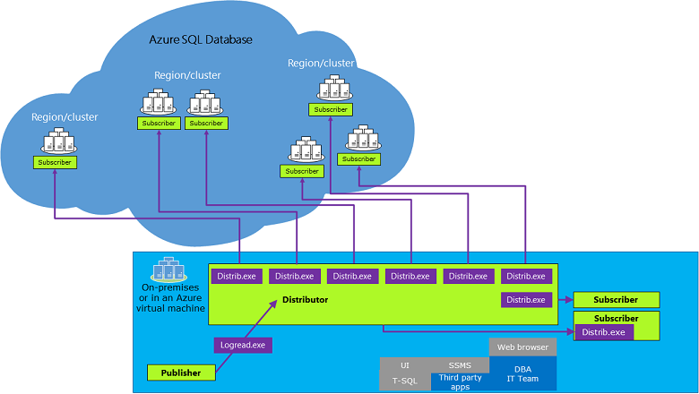
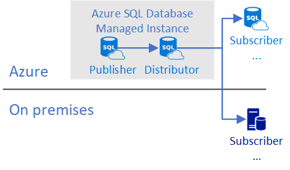

# Transactional replication with single, pooled, and instance databases in Azure SQL Database

Transactional replication is a feature of Azure SQL Database and SQL Server that enables you to replicate data from a table in Azure SQL Database or a SQL Server to the tables placed on remote databases. This feature allows you to synchronize multiple tables in different databases.

## When to use Transactional replication

Transactional replication is useful in the following scenarios:
- Publish changes made in one or more tables in a database and distribute them to one or many SQL Server or Azure SQL databases that subscribed for the changes.
- Keep several distributed databases in synchronized state.
- Migrate databases from one SQL Server or managed instance to another database by continuously publishing the changes.

## Overview

The key components in transactional replication are shown in the following picture:  



The **Publisher** is an instance or server that publishes changes made on some tables (articles) by sending the updates to the Distributor. Publishing to any Azure SQL database from an on-premises SQL Server is supported by the following versions of SQL Server:

- SQL Server 2019 (preview)
- SQL Server 2016 to SQL 2017
- SQL Server 2014 SP1 CU3 or greater (12.00.4427)
- SQL Server 2014 RTM CU10 (12.00.2556)
- SQL Server 2012 SP3 or greater (11.0.6020)
- SQL Server 2012 SP2 CU8 (11.0.5634.0)
- For other versions of SQL Server that do not support publishing to objects in Azure, it is possible to utilize the [republishing data](https://docs.microsoft.com/sql/relational-databases/replication/republish-data) method to move data to newer versions of SQL Server. 

The **Distributor** is an instance or server that collects changes in the articles from a Publisher and distributes them to the Subscribers. The Distributor can be either Azure SQL Database managed instance or SQL Server (any version as long it is equal to or higher than the Publisher version). 

The **Subscriber** is an instance or server that is receiving the changes made on the Publisher. Subscribers can be either single, pooled, and instance databases in Azure SQL Database or SQL Server databases. A Subscriber on a single or pooled database must be configured as push-subscriber. 

| Role | Single and pooled databases | Instance databases |
| :----| :------------- | :--------------- |
| **Publisher** | No | Yes | 
| **Distributor** | No | Yes|
| **Pull subscriber** | No | Yes|
| **Push Subscriber**| Yes | Yes|
| &nbsp; | &nbsp; | &nbsp; |

  >[!NOTE]
  > A pull subscription is not supported when the distributor is an Instance database and the subscriber is not. 

There are different [types of replication](https://docs.microsoft.com/sql/relational-databases/replication/types-of-replication):


| Replication | Single and pooled databases | Instance  databases|
| :----| :------------- | :--------------- |
| [**Standard Transactional**](https://docs.microsoft.com/sql/relational-databases/replication/transactional/transactional-replication) | Yes (only as subscriber) | Yes | 
| [**Snapshot**](https://docs.microsoft.com/sql/relational-databases/replication/snapshot-replication) | Yes (only as subscriber) | Yes|
| [**Merge replication**](https://docs.microsoft.com/sql/relational-databases/replication/merge/merge-replication) | No | No|
| [**Peer-to-peer**](https://docs.microsoft.com/sql/relational-databases/replication/transactional/peer-to-peer-transactional-replication) | No | No|
| [**Bidirectional**](https://docs.microsoft.com/sql/relational-databases/replication/transactional/bidirectional-transactional-replication) | No | Yes|
| [**Updatable subscriptions**](https://docs.microsoft.com/sql/relational-databases/replication/transactional/updatable-subscriptions-for-transactional-replication) | No | No|
| &nbsp; | &nbsp; | &nbsp; |

  >[!NOTE]
  > - Attempting to configure replication using an older version can result in error number MSSQL_REPL20084 (The process could not connect to Subscriber.) and MSSQ_REPL40532 (Cannot open server \<name> requested by the login. The login failed.)
  > - To use all the features of Azure SQL Database, you must be using the latest versions of [SQL Server Management Studio (SSMS)](https://docs.microsoft.com/sql/ssms/download-sql-server-management-studio-ssms) and [SQL Server Data Tools (SSDT)](https://docs.microsoft.com/sql/ssdt/download-sql-server-data-tools-ssdt).
  
  ### Supportability matrix for Instance Databases and On-premises systems
  The replication supportability matrix for instance databases is the same as the one for SQL Server on-premises. 
  
| **Publisher**   | **Distributor** | **Subscriber** |
| :------------   | :-------------- | :------------- |
| SQL Server 2019 | SQL Server 2019 | SQL Server 2019 <br/> SQL Server 2017 <br/> SQL Server 2016 <br/>  |
| SQL Server 2017 | SQL Server 2019 <br/>SQL Server 2017 | SQL Server 2019 <br/> SQL Server 2017 <br/> SQL Server 2016 <br/> SQL Server 2014 |
| SQL Server 2016 | SQL Server 2019 <br/>SQL Server 2017 <br/> SQL Server 2016 | SQL Server 2019 <br/> SQL Server 2017 <br/>SQL Server 2016 <br/> SQL Server 2014 <br/> SQL Server 2012 |
| SQL Server 2014 | SQL Server 2019 <br/> SQL Server 2017 <br/> SQL Server 2016 <br/> SQL Server 2014 <br/>| SQL Server 2017 <br/> SQL Server 2016 <br/> SQL Server 2014 <br/> SQL Server 2012 <br/> SQL Server 2008 R2 <br/> SQL Server 2008 |
| SQL Server 2012 | SQL Server 2019 <br/> SQL Server 2017 <br/> SQL Server 2016 <br/> SQL Server 2014 <br/>SQL Server 2012 <br/> | SQL Server 2016 <br/> SQL Server 2014 <br/> SQL Server 2012 <br/> SQL Server 2008 R2 <br/> SQL Server 2008 | 
| SQL Server 2008 R2 <br/> SQL Server 2008 | SQL Server 2019 <br/> SQL Server 2017 <br/> SQL Server 2016 <br/> SQL Server 2014 <br/>SQL Server 2012 <br/> SQL Server 2008 R2 <br/> SQL Server 2008 |  SQL Server 2014 <br/> SQL Server 2012 <br/> SQL Server 2008 R2 <br/> SQL Server 2008 <br/>  |
| &nbsp; | &nbsp; | &nbsp; |

## Requirements

- Connectivity uses SQL Authentication between replication participants. 
- An Azure Storage Account share for the working directory used by replication. 
- Port 445 (TCP outbound) needs to be open in the security rules of the managed instance subnet to access the Azure file share. 
- Port 1433 (TCP outbound) needs to be opened if the Publisher/Distributor are on a managed instance and the subscriber is on-premises.
- All types of replication participants (Publisher, Distributor, Pull Subscriber, and Push Subscriber) can be placed on managed instances, but the publisher and the distributor must be either both in the cloud or both on-premises.
- If either the publisher, distributor, and/or the subscriber exist in different virtual networks, then VPN peering must be established between each entity, such that there is VPN peering between the publisher and distributor, and/or there is VPN peering between the distributor and subscriber. 


>[!NOTE]
> - You may encounter error 53 when connecting to an Azure Storage File if the outbound network security group (NSG) port 445 is blocked when the distributor is an instance database and the subscriber is on-premises. [Update the vNet NSG](/azure/storage/files/storage-troubleshoot-windows-file-connection-problems) to resolve this issue. 


### Compare Data Sync with Transactional Replication

| | Data Sync | Transactional Replication |
|---|---|---|
| Advantages | - Active-active support<br/>- Bi-directional between on-premises and Azure SQL Database | - Lower latency<br/>- Transactional consistency<br/>- Reuse existing topology after migration |
| Disadvantages | - 5 min or more latency<br/>- No transactional consistency<br/>- Higher performance impact | - Can’t publish from Azure SQL Database single database or pooled database<br/>-	High maintenance cost |
| | | |

## Common configurations

In general, the publisher and the distributor must be either in the cloud or on-premises. The following configurations are supported: 

### Publisher with local Distributor on a managed instance



Publisher and distributor are configured within a single managed instance and distributing changes to other managed instance, single database, pooled database, or SQL Server on-premises. 

### Publisher with remote distributor on a managed instance

In this configuration, one managed instance publishes changes to distributor placed on another managed instance that can serve many source managed instances and distribute changes to one or many targets on managed instance, single database, pooled database, or SQL Server.


Publisher and distributor are configured on two managed instances. There are some constraints with this configuration: 

- Both managed instances are on the same vNet.
- Both managed instances are in the same location.


### Publisher and distributor on-premises with a subscriber on a single, pooled, and instance database 


 
In this configuration, an Azure SQL Database (single, pooled, and instance database) is a subscriber. This configuration supports migration from on-premises to Azure. If a subscriber is on a single or pooled database, it must be in push mode.  

## With failover groups

If geo-replication is enabled on a **publisher** or **distributor** instance in a [failover group](sql-database-auto-failover-group.md), the managed instance administrator must clean up all publications on the old primary and reconfigure them on the new primary after a failover occurs. The following activities are needed in this scenario:

1. Stop all replication jobs running on the database, if there are any.
2. Drop subscription metadata from publisher by running the following script on publisher database:

   ```sql
   EXEC sp_dropsubscription @publication='<name of publication>', @article='all',@subscriber='<name of subscriber>'
   ```             
 
1. Drop subscription metadata from the subscriber. Run the following script on the subscription database on subscriber instance:

   ```sql
   EXEC sp_subscription_cleanup
      @publisher = N'<full DNS of publisher, e.g. example.ac2d23028af5.database.windows.net>', 
      @publisher_db = N'<publisher database>', 
      @publication = N'<name of publication>'; 
   ```                

1. Forcefully drop all replication objects from publisher by running the following script in the published database:

   ```sql
   EXEC sp_removedbreplication
   ```

1. Forcefully drop old distributor from original primary instance (if failing back over to an old primary that used to have a distributor). Run the following script on the master database in old distributor managed instance:

   ```sql
   EXEC sp_dropdistributor 1,1
   ```

If geo-replication is enabled on a **subscriber** instance in a failover group, the publication should be configured to connect to the failover group listener endpoint for the subscriber managed instance. In the event of a failover, subsequent action by the managed instance administrator depends on the type of failover that occurred: 

- For a failover with no data loss, replication will continue working after failover. 
- For a failover with data loss, replication will work as well. It will replicate the lost changes again. 
- For a failover with data loss, but the data loss is outside of the distribution database retention period, the managed instance administrator will need to reinitialize the subscription database. 

## Next steps

- [Configure replication between an MI publisher and subscriber](replication-with-sql-database-managed-instance.md)
- [Configure replication between an MI publisher, MI distributor, and SQL Server subscriber](sql-database-managed-instance-configure-replication-tutorial.md)
- [Create a publication](https://docs.microsoft.com/sql/relational-databases/replication/publish/create-a-publication).
- [Create a push subscription](https://docs.microsoft.com/sql/relational-databases/replication/create-a-push-subscription) by using the Azure SQL Database server name as the subscriber (for example `N'azuresqldbdns.database.windows.net` and the Azure SQL Database name as the destination database (for example **Adventureworks**. )


For more information about configuring transactional replication, see the following tutorials:


## See Also  

- [Replication with an MI and a failover group](sql-database-managed-instance-transact-sql-information.md#replication)
- [Replication to SQL Database](replication-to-sql-database.md)
- [Replication to managed instance](replication-with-sql-database-managed-instance.md)
- [Create a Publication](https://docs.microsoft.com/sql/relational-databases/replication/publish/create-a-publication)
- [Create a Push Subscription](https://docs.microsoft.com/sql/relational-databases/replication/create-a-push-subscription/)
- [Types of Replication](https://docs.microsoft.com/sql/relational-databases/replication/types-of-replication)
- [Monitoring (Replication)](https://docs.microsoft.com/sql/relational-databases/replication/monitor/monitoring-replication)
- [Initialize a Subscription](https://docs.microsoft.com/sql/relational-databases/replication/initialize-a-subscription)  
