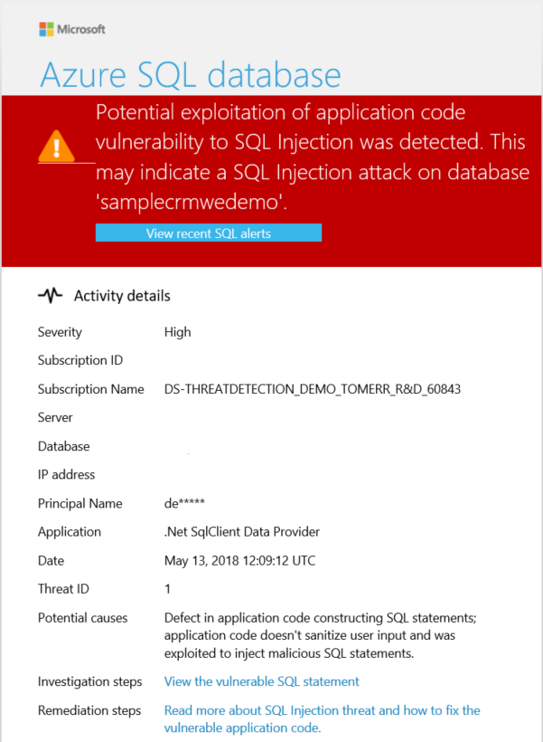
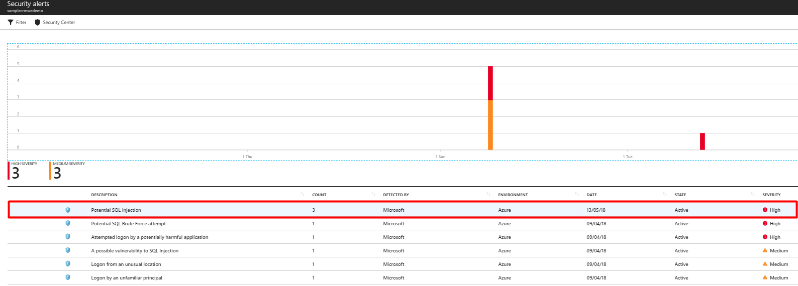
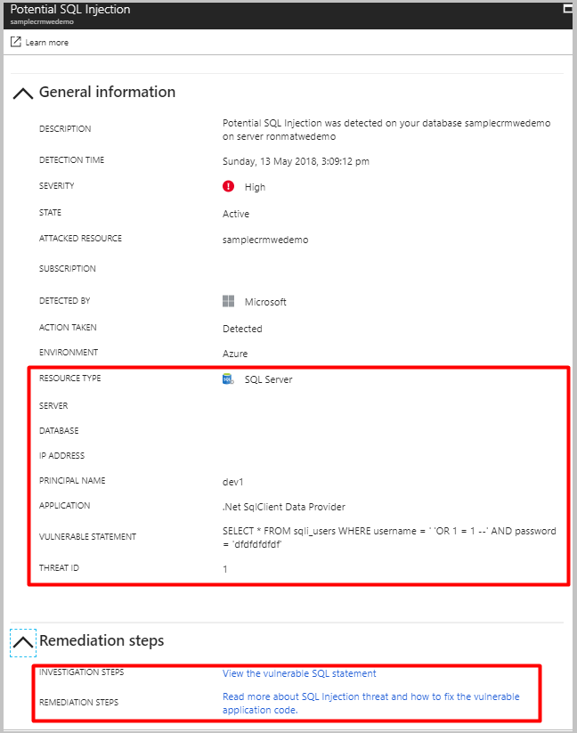

# Advanced Threat Protection for Azure SQL Database

Advanced Threat Protection for [Azure SQL Database](sql-database-technical-overview.md) and [SQL Data Warehouse](../sql-data-warehouse/sql-data-warehouse-overview-what-is.md) detects anomalous activities indicating unusual and potentially harmful attempts to access or exploit databases.

Advanced Threat Protection is part of the [Advanced data security](sql-database-advanced-data-security.md) (ADS) offering, which is a unified package for advanced SQL security capabilities. Advanced Threat Protection can be accessed and managed via the central SQL ADS portal.

> [!NOTE]
> This topic applies to Azure SQL server, and to both SQL Database and SQL Data Warehouse databases that are created on the Azure SQL server. For simplicity, SQL Database is used when referring to both SQL Database and SQL Data Warehouse.

## What is Advanced Threat Protection

 Advanced Threat Protection provides a new layer of security, which enables customers to detect and respond to potential threats as they occur by providing security alerts on anomalous activities. Users receive an alert upon suspicious database activities, potential vulnerabilities, and SQL injection attacks, as well as anomalous database access and queries patterns. Advanced Threat Protection integrates alerts with [Azure Security Center](https://azure.microsoft.com/services/security-center/), which include details of suspicious activity and recommend action on how to investigate and mitigate the threat. Advanced Threat Protection makes it simple to address potential threats to the database without the need to be a security expert or manage advanced security monitoring systems.

For a full investigation experience, it is recommended to enable [SQL Database Auditing](sql-database-auditing.md), which writes database events to an audit log in your Azure storage account.  

## Advanced Threat Protection alerts

Advanced Threat Protection for Azure SQL Database detects anomalous activities indicating unusual and potentially harmful attempts to access or exploit databases and it can trigger the following alerts:

- **Vulnerability to SQL injection**: This alert is triggered when an application generates a faulty SQL statement in the database. This alert may indicate a possible vulnerability to SQL injection attacks. There are two possible reasons for the generation of a faulty statement:

  - A defect in application code that constructs the faulty SQL statement
  - Application code or stored procedures don't sanitize user input when constructing the faulty SQL statement, which may be exploited for SQL Injection
- **Potential SQL injection**: This alert is triggered when an active exploit happens against an identified application vulnerability to SQL injection. This means the attacker is trying to inject malicious SQL statements using the vulnerable application code or stored procedures.
- **Access from unusual location**: This alert is triggered when there is a change in the access pattern to SQL server, where someone has logged on to the SQL server from an unusual geographical location. In some cases, the alert detects a legitimate action (a new application or developer maintenance). In other cases, the alert detects a malicious action (former employee, external attacker).
- **Access from unusual Azure data center**: This alert is triggered when there is a change in the access pattern to SQL server, where someone has logged on to the SQL server from an unusual Azure data center that was seen on this server during the recent period. In some cases, the alert detects a legitimate action (your new application in Azure, Power BI, Azure SQL Query Editor). In other cases, the alert detects a malicious action from an Azure resource/service (former employee, external attacker).
- **Access from unfamiliar principal**: This alert is triggered when there is a change in the access pattern to SQL server, where someone has logged on to the SQL server using an unusual principal (SQL user). In some cases, the alert detects a legitimate action (new application, developer maintenance). In other cases, the alert detects a malicious action (former employee, external attacker).
- **Access from a potentially harmful application**: This alert is triggered when a potentially harmful application is used to access the database. In some cases, the alert detects penetration testing in action. In other cases, the alert detects an attack using common attack tools.
- **Brute force SQL credentials**: This alert is triggered when there is an abnormal high number of failed logins with different credentials. In some cases, the alert detects penetration testing in action. In other cases, the alert detects brute force attack.

## Explore anomalous database activities upon detection of a suspicious event

You receive an email notification upon detection of anomalous database activities. The email provides information on the suspicious security event including the nature of the anomalous activities, database name, server name, application name, and the event time. In addition, the email provides information on possible causes and recommended actions to investigate and mitigate the potential threat to the database.

1. Click the **View recent SQL alerts** link in the email to launch the Azure portal and show the Azure Security Center alerts page, which provides an overview of active threats detected on the SQL database.

   

2. Click a specific alert to get additional details and actions for investigating this threat and remediating future threats.

   For example, SQL injection is one of the most common Web application security issues on the Internet that is used to attack data-driven applications. Attackers take advantage of application vulnerabilities to inject malicious SQL statements into application entry fields, breaching or modifying data in the database. For SQL Injection alerts, the alert’s details include the vulnerable SQL statement that was exploited.

   

## Explore Advanced Threat Protection alerts for your database in the Azure portal

Advanced Threat Protection integrates its alerts with [Azure security center](https://azure.microsoft.com/services/security-center/). Live SQL Advanced Threat Protection tiles within the database and SQL ADS blades in the Azure portal track the status of active threats.

Click **Advanced Threat Protection alert** to launch the Azure Security Center alerts page and get an overview of active SQL threats detected on the database or data warehouse.

   

   

## Next steps

- Learn more about [Advanced Threat Protection in single and pooled databases](sql-database-threat-detection.md).
- Learn more about [Advanced Threat Protection in managed instance](sql-database-managed-instance-threat-detection.md).
- Learn more about [Advanced data security](sql-database-advanced-data-security.md).
- Learn more about [Azure SQL Database auditing](sql-database-auditing.md)
- Learn more about [Azure security center](https://docs.microsoft.com/azure/security-center/security-center-intro)
- For more information on pricing, see the [SQL Database pricing page](https://azure.microsoft.com/pricing/details/sql-database/)  
