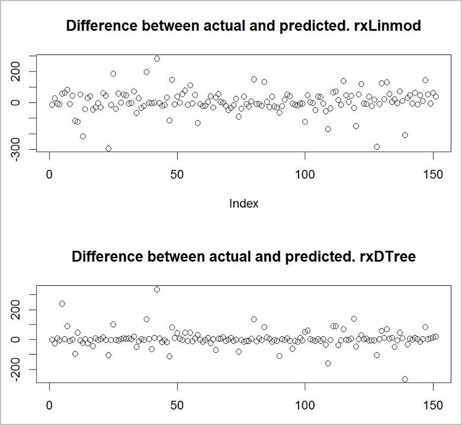

# Tutorial: Create a predictive model in R with Azure SQL Database Machine Learning Services (preview)

In part two of this three-part tutorial series, you'll create two predictive models in R and select the most accurate model. In the next part of this series, you'll deploy this model in a SQL database with Azure SQL Database Machine Learning Services (preview).

[!INCLUDE[ml-preview-note](../../includes/sql-database-ml-preview-note.md)]

In this article, you'll learn how to:

> [!div class="checklist"]
> * Train two machine learning models
> * Make predictions from both models
> * Compare the results to choose the most accurate model

In [part one](sql-database-tutorial-predictive-model-prepare-data.md), you learned how to import a sample database and then prepare the data to be used for training a predictive model in R.

In [part three](sql-database-tutorial-predictive-model-deploy.md), you'll learn how to store the model in a database, and then create stored procedures from the R scripts you developed in parts one and two. The stored procedures will run in a SQL database to make predictions based on new data.

[!INCLUDE[ml-preview-note](../../includes/sql-database-ml-preview-note.md)]

## Prerequisites

* Part two of this tutorial assumes you have completed [**part one**](sql-database-tutorial-predictive-model-prepare-data.md) and its prerequisites.

## Train two models

To find the best model for the ski rental data, create two different models (linear regression and decision tree) and see which one is predicting more accurately. You'll use the data frame `rentaldata` that you created in part one of this series.

```r
#First, split the dataset into two different sets:
# one for training the model and the other for validating it
train_data = rentaldata[rentaldata$Year < 2015,];
test_data  = rentaldata[rentaldata$Year == 2015,];

#Use the RentalCount column to check the quality of the prediction against actual values
actual_counts <- test_data$RentalCount;

#Model 1: Use rxLinMod to create a linear regression model, trained with the training data set
model_linmod <- rxLinMod(RentalCount ~  Month + Day + WeekDay + Snow + Holiday, data = train_data);

#Model 2: Use rxDTree to create a decision tree model, trained with the training data set
model_dtree  <- rxDTree(RentalCount ~ Month + Day + WeekDay + Snow + Holiday, data = train_data);
```

## Make predictions from both models

Use a predict function to predict the rental counts using each trained model.

```r
#Use both models to make predictions using the test data set.
predict_linmod <- rxPredict(model_linmod, test_data, writeModelVars = TRUE, extraVarsToWrite = c("Year"));

predict_dtree  <- rxPredict(model_dtree,  test_data, writeModelVars = TRUE, extraVarsToWrite = c("Year"));

#To verify it worked, look at the top rows of the two prediction data sets.
head(predict_linmod);
head(predict_dtree);
```

```results
    RentalCount_Pred  RentalCount  Month  Day  WeekDay  Snow  Holiday
1         27.45858          42       2     11     4      0       0
2        387.29344         360       3     29     1      0       0
3         16.37349          20       4     22     4      0       0
4         31.07058          42       3      6     6      0       0
5        463.97263         405       2     28     7      1       0
6        102.21695          38       1     12     2      1       0
    RentalCount_Pred  RentalCount  Month  Day  WeekDay  Snow  Holiday
1          40.0000          42       2     11     4      0       0
2         332.5714         360       3     29     1      0       0
3          27.7500          20       4     22     4      0       0
4          34.2500          42       3      6     6      0       0
5         645.7059         405       2     28     7      1       0
6          40.0000          38       1     12     2      1       0
```

## Compare the results

Now you want to see which of the models gives the best predictions. A quick and easy way to do this is to use a basic plotting function to view the difference between the actual values in your training data and the predicted values.

```r
#Use the plotting functionality in R to visualize the results from the predictions
par(mfrow = c(2, 1));
plot(predict_linmod$RentalCount_Pred - predict_linmod$RentalCount, main = "Difference between actual and predicted. rxLinmod");
plot(predict_dtree$RentalCount_Pred  - predict_dtree$RentalCount,  main = "Difference between actual and predicted. rxDTree");
```



It looks like the decision tree model is the more accurate of the two models.

## Clean up resources

If you're not going to continue with this tutorial, delete the TutorialDB database from your Azure SQL Database server.

From the Azure portal, follow these steps:

1. From the left-hand menu in the Azure portal, select **All resources** or **SQL databases**.
1. In the **Filter by name...** field, enter **TutorialDB**, and select your subscription.
1. Select your TutorialDB database.
1. On the **Overview** page, select **Delete**.

## Next steps

In part two of this tutorial series, you completed these steps:

* Train two machine learning models
* Make predictions from both models
* Compare the results to choose the most accurate model

To deploy the machine learning model you've created, follow part three of this tutorial series:

> [!div class="nextstepaction"]
> [Tutorial: Deploy a predictive model in R with Azure SQL Database Machine Learning Services (preview)](sql-database-tutorial-predictive-model-deploy.md)
