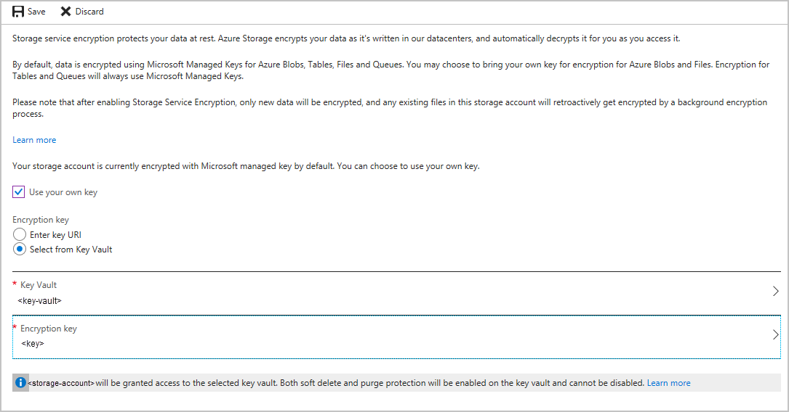

# Configure customer-managed keys for Azure Storage encryption from the Azure portal

[!INCLUDE [storage-encryption-configure-keys-include](../../../includes/storage-encryption-configure-keys-include.md)]

This article shows how to configure a key vault with customer-managed keys using the [Azure portal](https://portal.azure.com/). To learn how to create a key vault using the Azure portal, see [Quickstart: Set and retrieve a secret from Azure Key Vault using the Azure portal](../../key-vault/quick-create-portal.md). 

> [!IMPORTANT]
> Using customer-managed keys with Azure Storage encryption requires that the key vault have two required properties configured, **Soft Delete** and **Do Not Purge**. These properties are enabled by default when you create a new key vault in the Azure portal. However, if you need to enable these properties on an existing key vault, you must use either PowerShell or Azure CLI.
> Only RSA keys and key size 2048 are supported.

## Enable customer-managed keys

To enable customer-managed keys in the Azure portal, follow these steps:

1. Navigate to your storage account.
1. On the **Settings** blade for the storage account, click **Encryption**. Select the **Use your own key** option, as shown in the following figure.

    

## Specify a key

After you enable customer-managed keys, you'll have the opportunity to specify a key to associate with the storage account.

### Specify a key as a URI

To specify a key as a URI, follow these steps:

1. To locate the key URI in the Azure portal, navigate to your key vault, and select the **Keys** setting. Select the desired key, then click the key to view its settings. Copy the value of the **Key Identifier** field, which provides the URI.

    

1. In the **Encryption** settings for your storage account, choose the **Enter key URI** option.
1. In the **Key URI** field, specify the URI.

   

### Specify a key from a key vault

To specify a key from a key vault, first make sure that you have a key vault that contains a key. To specify a key from a key vault, follow these steps:

1. Choose the **Select from Key Vault** option.
2. Choose the key vault containing the key you want to use.
3. Choose the key from the key vault.

   

## Update the key version

When you create a new version of a key, you'll need to update the storage account to use the new version. Follow these steps:

1. Navigate to your storage account and display the **Encryption** settings.
1. Specify the URI for the new key version. Alternately, you can select the key vault and the key again to update the version.

## Next steps

- [Azure Storage encryption for data at rest](storage-service-encryption.md)
- [What is Azure Key Vault](https://docs.microsoft.com/azure/key-vault/key-vault-overview)?
