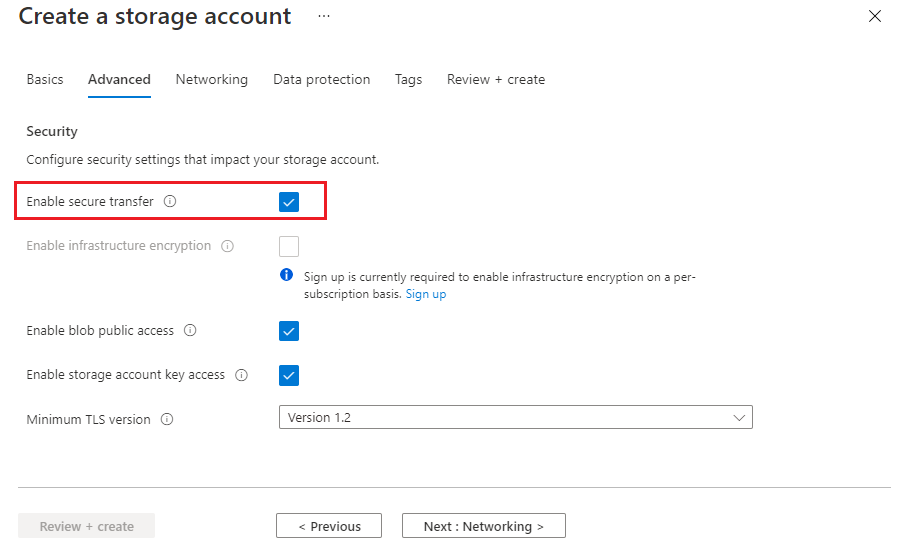
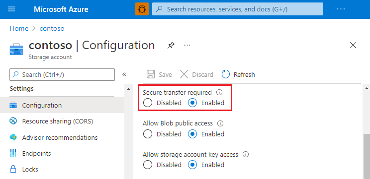

# Require secure transfer to ensure secure connections

You can configure your storage account to accept requests from secure connections only by setting the **Secure transfer required** property for the storage account. When you require secure transfer, any requests originating from an insecure connection are rejected. Microsoft recommends that you always require secure transfer for all of your storage accounts.

When secure transfer is required, a call to an Azure Storage REST API operation must be made over HTTPS. Any request made over HTTP is rejected.

Connecting to an Azure File share over SMB without encryption fails when secure transfer is required for the storage account. Examples of insecure connections include those made over SMB 2.1, SMB 3.0 without encryption, or some versions of the Linux SMB client.

By default, the **Secure transfer required** property is enabled when you create a storage account.

> [!NOTE]
> Because Azure Storage doesn't support HTTPS for custom domain names, this option is not applied when you're using a custom domain name. And classic storage accounts are not supported.

## Require secure transfer in the Azure portal

You can turn on the **Secure transfer required** property when you create a storage account in the [Azure portal](https://portal.azure.com). You can also enable it for existing storage accounts.

### Require secure transfer for a new storage account

1. Open the **Create storage account** pane in the Azure portal.
1. Under **Secure transfer required**, select **Enabled**.

   

### Require secure transfer for an existing storage account

1. Select an existing storage account in the Azure portal.
1. In the storage account menu pane, under **SETTINGS**, select **Configuration**.
1. Under **Secure transfer required**, select **Enabled**.

   

## Require secure transfer from code

To require secure transfer programmatically, set the _supportsHttpsTrafficOnly_ property on the storage account. You can set this property by using the Storage Resource Provider REST API, client libraries, or tools:

* [REST API](/rest/api/storagerp/storageaccounts)
* [PowerShell](/powershell/module/az.storage/set-azstorageaccount)
* [CLI](/cli/azure/storage/account)
* [NodeJS](https://www.npmjs.com/package/azure-arm-storage/)
* [.NET SDK](https://www.nuget.org/packages/Microsoft.Azure.Management.Storage)
* [Python SDK](https://pypi.org/project/azure-mgmt-storage)
* [Ruby SDK](https://rubygems.org/gems/azure_mgmt_storage)

## Require secure transfer with PowerShell

[!INCLUDE [updated-for-az](../../../includes/updated-for-az.md)]

This sample requires the Azure PowerShell module Az version 0.7 or later. Run `Get-Module -ListAvailable Az` to find the version. If you need to install or upgrade, see [Install Azure PowerShell module](/powershell/azure/install-Az-ps).

Run `Connect-AzAccount` to create a connection with Azure.

 Use the following command line to check the setting:

```powershell
Get-AzStorageAccount -Name "{StorageAccountName}" -ResourceGroupName "{ResourceGroupName}"
StorageAccountName     : {StorageAccountName}
Kind                   : Storage
EnableHttpsTrafficOnly : False
...

```

Use the following command line to enable the setting:

```powershell
Set-AzStorageAccount -Name "{StorageAccountName}" -ResourceGroupName "{ResourceGroupName}" -EnableHttpsTrafficOnly $True
StorageAccountName     : {StorageAccountName}
Kind                   : Storage
EnableHttpsTrafficOnly : True
...

```

## Require secure transfer with Azure CLI

[!INCLUDE [sample-cli-install](../../../includes/sample-cli-install.md)]

[!INCLUDE [quickstarts-free-trial-note](../../../includes/quickstarts-free-trial-note.md)]

 Use the following command to check the setting:

```azurecli-interactive
az storage account show -g {ResourceGroupName} -n {StorageAccountName}
{
  "name": "{StorageAccountName}",
  "enableHttpsTrafficOnly": false,
  "type": "Microsoft.Storage/storageAccounts"
  ...
}

```

Use the following command to enable the setting:

```azurecli-interactive
az storage account update -g {ResourceGroupName} -n {StorageAccountName} --https-only true
{
  "name": "{StorageAccountName}",
  "enableHttpsTrafficOnly": true,
  "type": "Microsoft.Storage/storageAccounts"
  ...
}

```

## Next steps

[Security recommendations for Blob storage](../blobs/security-recommendations.md)
