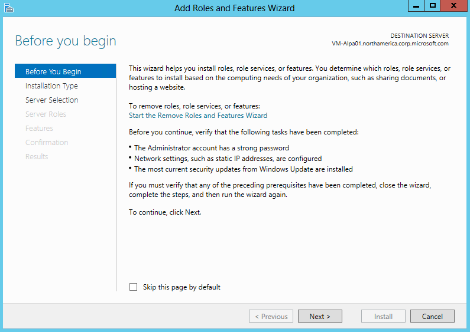
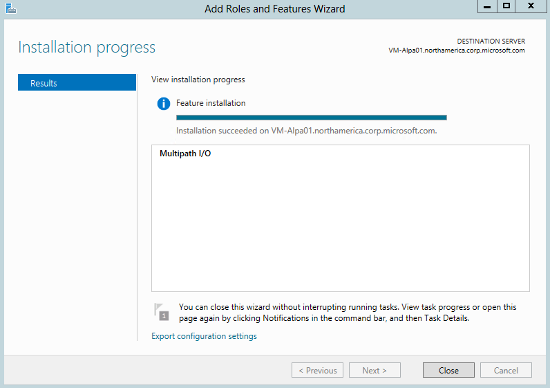
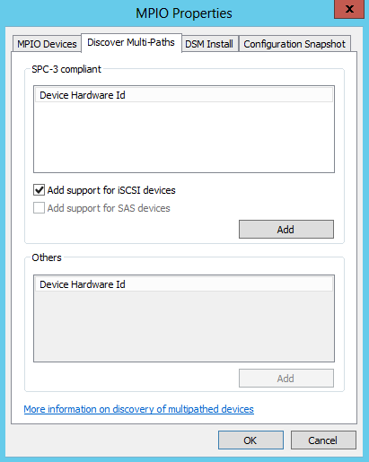
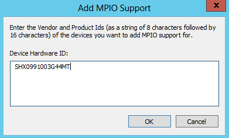
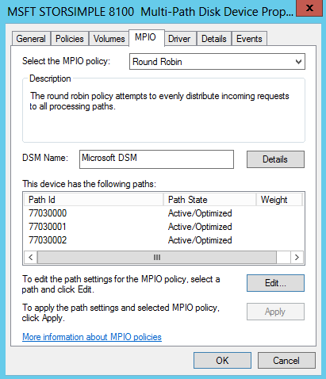

# Configure Multipath I/O for your StorSimple device

This tutorial describes the steps you should follow to install and use the Multipath I/O (MPIO) feature on a host running Windows Server 2012 R2 and connected to a StorSimple physical device. The guidance in this article applies to StorSimple 8000 series physical devices only. MPIO is currently not supported on a StorSimple Cloud Appliance.

Microsoft built support for the Multipath I/O (MPIO) feature in Windows Server to help build highly available, fault-tolerant iSCSI network configurations. MPIO uses redundant physical path components — adapters, cables, and switches — to create logical paths between the server and the storage device. If there is a component failure, causing a logical path to fail, multipathing logic uses an alternate path for I/O so that applications can still access their data. Additionally depending on your configuration, MPIO can also improve performance by rebalancing the load across all these paths. For more information, see [MPIO overview](https://technet.microsoft.com/library/cc725907.aspx "MPIO overview and features").

For the high-availability of your StorSimple solution, MPIO should be configured on your StorSimple device. When MPIO is installed on your host servers running Windows Server 2012 R2, the servers can then tolerate a link, network, or interface failure.

## MPIO configuration summary

MPIO is an optional feature on Windows Server and is not installed by default. It should be installed as a feature through Server Manager.

Follow these steps to configure MPIO on your StorSimple device:

* Step 1: Install MPIO on the Windows Server host
* Step 2: Configure MPIO for StorSimple volumes
* Step 3: Mount StorSimple volumes on the host
* Step 4: Configure MPIO for high availability and load balancing

Each of the preceding steps is discussed in the following sections.

## Step 1: Install MPIO on the Windows Server host

To install this feature on your Windows Server host, complete the following procedure.

#### To install MPIO on the host

1. Open Server Manager on your Windows Server host. By default, Server Manager starts when a member of the Administrators group logs on to a computer that is running Windows Server 2012 R2 or Windows Server 2012. If the Server Manager is not already open, click **Start > Server Manager**.
   
   

2. Click **Server Manager > Dashboard > Add roles and features**. This starts the **Add Roles and Features** wizard.
   
   
3. In the **Add Roles and Features** wizard, perform the following steps:
   
   1. On the **Before you begin** page, click **Next**.
   2. On the **Select installation type** page, accept the default setting of **Role-based or feature-based** installation. Click **Next**.
   
       
   3. On the **Select destination server** page, choose **Select a server from the server pool**. Your host server should be discovered automatically. Click **Next**.
   4. On the **Select server roles** page, click **Next**.
   5. On the **Select features** page, select **Multipath I/O**, and click **Next**.
   
       
   6. On the **Confirm installation selections** page, confirm the selection, and then select **Restart the destination server automatically if required**, as shown below. Click **Install**.
   
       
   7. You are notified when the installation is complete. Click **Close** to close the wizard.
   
       

## Step 2: Configure MPIO for StorSimple volumes

MPIO must be configured to identify StorSimple volumes. To configure MPIO to recognize StorSimple volumes, perform the following steps.

#### To configure MPIO for StorSimple volumes

1. Open the **MPIO configuration**. Click **Server Manager > Dashboard > Tools > MPIO**.
2. In the **MPIO Properties** dialog box, select the **Discover Multi-Paths** tab.
3. Select **Add support for iSCSI devices**, and then click **Add**.  
   
4. Reboot the server when prompted.
5. In the **MPIO Properties** dialog box, click the **MPIO Devices** tab. Click **Add**.
     
6. In the **Add MPIO Support** dialog box, under **Device Hardware ID**, enter your device serial number. To get the device serial number, access your StorSimple Device Manager service. Navigate to **Devices > Dashboard**. The device serial number is displayed in the right **Quick Glance** pane of the device dashboard.
     
    
7. Reboot the server when prompted.

## Step 3: Mount StorSimple volumes on the host

After MPIO is configured on Windows Server, volume(s) created on the StorSimple device can be mounted and can then take advantage of MPIO for redundancy. To mount a volume, perform the following steps.

#### To mount volumes on the host

1. Open the **iSCSI Initiator Properties** window on the Windows Server host. Click **Server Manager > Dashboard > Tools > iSCSI Initiator**.
2. In the **iSCSI Initiator Properties** dialog box, click the Discovery tab, and then click **Discover Target Portal**.
3. In the **Discover Target Portal** dialog box, perform the following steps:
   
   1. Enter the IP address of the DATA port of your StorSimple device (for example, enter DATA 0).
   2. Click **OK** to return to the **iSCSI Initiator Properties** dialog box.
     
      > [!IMPORTANT]
      > **If you are using a private network for iSCSI connections, enter the IP address of the DATA port that is connected to the private network.**
    
4. Repeat steps 2-3 for a second network interface (for example, DATA 1) on your device. Keep in mind that these interfaces should be enabled for iSCSI. For more information, see [Modify network interfaces](storsimple-8000-modify-device-config.md#modify-network-interfaces).
5. Select the **Targets** tab in the **iSCSI Initiator Properties** dialog box. You should see the StorSimple device target IQN under **Discovered Targets**.

   
   
6. Click **Connect** to establish an iSCSI session with your StorSimple device. A **Connect to Target** dialog box appears.
7. In the **Connect to Target** dialog box, select the **Enable multi-path** check box. Click **Advanced**.
8. In the **Advanced Settings** dialog box, perform the following steps:
   
   1. On the **Local Adapter** drop-down list, select **Microsoft iSCSI Initiator**.
   2. On the **Initiator IP** drop-down list, select the IP address of the host.
   3. On the **Target Portal** IP drop-down list, select the IP of device interface.
   4. Click **OK** to return to the **iSCSI Initiator Properties** dialog box.
9. Click **Properties**. In the **Properties** dialog box, click **Add Session**.
10. In the **Connect to Target** dialog box, select the **Enable multi-path** check box. Click **Advanced**.
11. In the **Advanced Settings** dialog box:

    1. On the **Local adapter** drop-down list, select Microsoft iSCSI Initiator.
    2. On the **Initiator IP** drop-down list, select the IP address corresponding to the host. In this case, you are connecting two network interfaces on the device to a single network interface on the host. Therefore, this interface is the same as that provided for the first session.
    3. On the **Target Portal IP** drop-down list, select the IP address for the second data interface enabled on the device.
    4. Click **OK** to return to the iSCSI Initiator Properties dialog box. You have added a second session to the target.
12. Open **Computer Management** by navigating to **Server Manager > Dashboard > Computer Management**. In the left pane, click **Storage > Disk Management**. The volume created on the StorSimple device that are visible to this host appears under **Disk Management** as new disk(s).
13. Initialize the disk and create a new volume. During the format process, select a block size of 64 KB.
    
    
14. Under **Disk Management**, right-click the **Disk** and select **Properties**.
15. In the StorSimple Model #### **Multi-Path Disk Device Properties** dialog box, click the **MPIO** tab.
    
    
16. In the **DSM Name** section, click **Details** and verify that the parameters are set to the default parameters. The default parameters are:
    
    * Path Verify Period = 30
    * Retry Count = 3
    * PDO Remove Period = 20
    * Retry Interval = 1
    * Path Verify Enabled = Unchecked.

> [!NOTE]
> **Do not modify the default parameters.**

## Step 4: Configure MPIO for high availability and load balancing

For multi-path based high availability and load balancing, multiple sessions must be manually added to declare the different paths available. For example, if the host has two interfaces connected to iSCSI network and the device has two interfaces connected to iSCSI network, then you need four sessions configured with proper path permutations (only two sessions will be required if each DATA interface and host interface is on a different IP subnet and is not routable).

**We recommend that you have at least 8 active parallel sessions between the device and your application host.** This can be achieved by enabling 4 network interfaces on your Windows Server system. Use physical network interfaces or virtual interfaces via network virtualization technologies on the hardware or operating system level on your Windows Server host. With the two network interfaces on the device, this configuration would result in 8 active sessions. This configuration helps optimize the device and cloud throughput.

> [!IMPORTANT]
> **We recommend that you do not mix 1 GbE and 10 GbE network interfaces. If you use two network interfaces, both interfaces should be of an identical type.**

The following procedure describes how to add sessions when a StorSimple device with two network interfaces is connected to a host with two network interfaces. This gives you only 4 sessions. Use this same procedure with a StorSimple device with two network interfaces connected to a host with four network interfaces. You will need to configure 8 instead of the 4 sessions described here.

### To configure MPIO for high availability and load balancing

1. Perform a discovery of the target: in the **iSCSI Initiator Properties** dialog box, on the **Discovery** tab, click **Discover Portal**.
2. In the **Connect to Target** dialog box, enter the IP address of one of the device network interfaces.
3. Click **OK** to return to the **iSCSI Initiator Properties** dialog box.
4. In the **iSCSI Initiator Properties** dialog box, select the **Targets** tab, highlight the discovered target, and then click **Connect**. The **Connect to Target** dialog box appears.
5. In the **Connect to Target** dialog box:
   
   1. Leave the default selected target setting for **Add this connection** to the list of favorite targets. This makes the device automatically attempt to restart the connection every time this computer restarts.
   2. Select the **Enable multi-path** check box.
   3. Click **Advanced**.
6. In the **Advanced Settings** dialog box:
   
   1. On the **Local Adapter** drop-down list, select **Microsoft iSCSI Initiator**.
   2. On the **Initiator IP** drop-down list, select the IP address corresponding to the first interface on the host (iSCSI interface).
   3. On the **Target Portal IP** drop-down list, select the IP address for the first data interface enabled on the device.
   4. Click **OK** to return to the iSCSI Initiator Properties dialog box.
7. Click **Properties**, and in the **Properties** dialog box, click **Add Session**.
8. In the **Connect to Target** dialog box, select the **Enable multi-path** check box, and then click **Advanced**.
9. In the **Advanced Settings** dialog box:
   
   1. On the **Local adapter** drop-down list, select **Microsoft iSCSI Initiator**.
   2. On the **Initiator IP** drop-down list, select the IP address corresponding to the second iSCSI interface on the host.
   3. On the **Target Portal IP** drop-down list, select the IP address for the second data interface enabled on the device.
   4. Click **OK** to return to the **iSCSI Initiator Properties** dialog box. You have now added a second session to the target.
10. Repeat Steps 8-10 to add additional sessions (paths) to the target. With two interfaces on the host and two on the device, you can add a total of four sessions.
11. After adding the desired sessions (paths), in the **iSCSI Initiator Properties** dialog box, select the target and click **Properties**. On the Sessions tab of the **Properties** dialog box, note the four session identifiers that correspond to the possible path permutations. To cancel a session, select the check box next to a session identifier, and then click **Disconnect**.
12. To view devices presented within sessions, select the **Devices** tab. To configure the MPIO policy for a selected device, click **MPIO**. The **Device Details** dialog box appears. On the **MPIO** tab, you can select the appropriate **Load Balance Policy** settings. You can also view the **Active** or **Standby** path type.

## Next steps

Learn more about [using the StorSimple Device Manager service to modify your StorSimple device configuration](storsimple-8000-modify-device-config.md).

