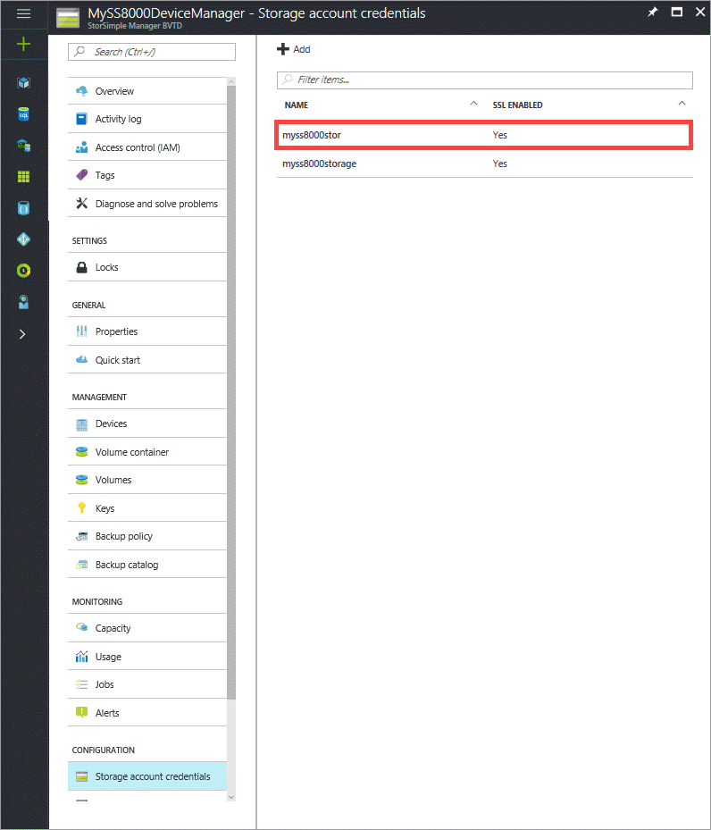
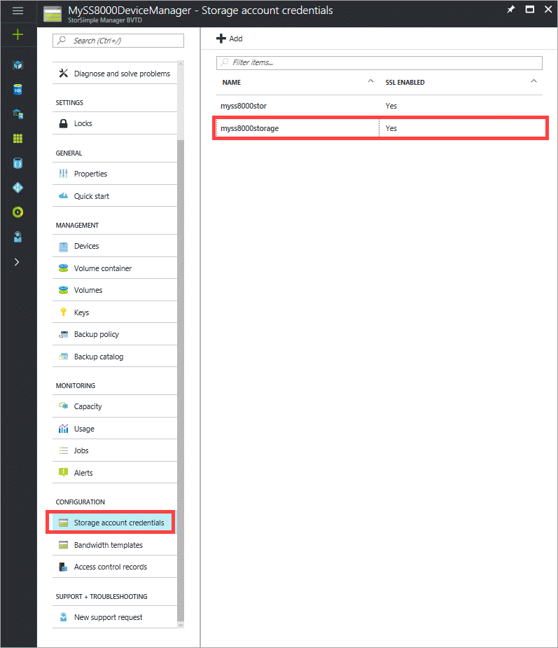
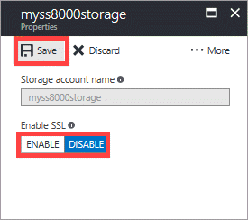
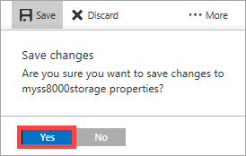
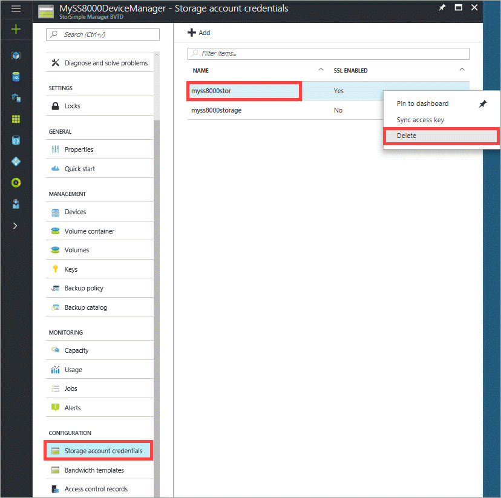
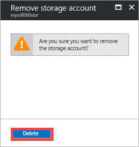
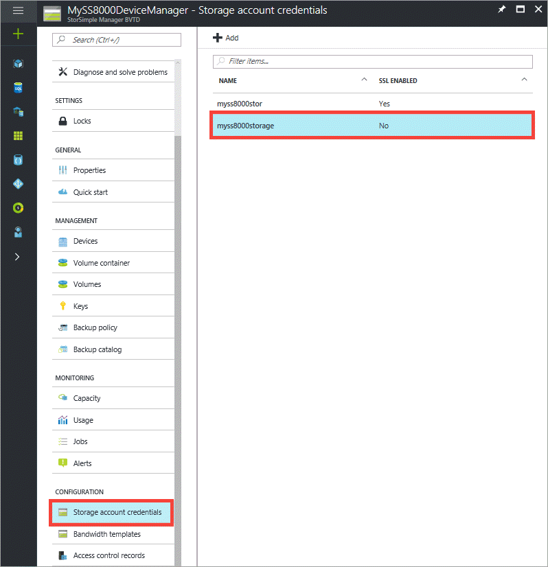
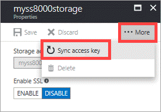
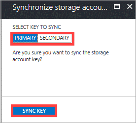

# Use the StorSimple Device Manager service to manage your storage account credentials

## Overview

The **Configuration** section in the StorSimple Device Manager service blade presents all the global service parameters that can be created in the StorSimple Device Manager service. These parameters can be applied to all the devices connected to the service, and include:

* Storage account credentials
* Bandwidth templates 
* Access control records 

This tutorial explains how to add, edit, or delete storage account credentials, or rotate the security keys for a storage account.

   

Storage accounts contain the credentials that the StorSimple device uses to access your storage account with your cloud service provider. For Microsoft Azure storage accounts, these are credentials such as the account name and the primary access key. 

On the **Storage account credentials** blade, all storage accounts that are created for the billing subscription are displayed in a tabular format containing the following information:

* **Name** – The unique name assigned to the account when it was created.
* **SSL enabled** – Whether the TLS is enabled and device-to-cloud communication is over the secure channel.
* **Used by** – The number of volumes using the storage account.

The most common tasks related to storage accounts that can be performed are:

* Add a storage account 
* Edit a storage account 
* Delete a storage account 
* Key rotation of storage accounts 

## Types of storage accounts

There are three types of storage accounts that can be used with your StorSimple device.

* **Auto-generated storage accounts** – As the name suggests, this type of storage account is automatically generated when the service is first created. To learn more about how this storage account is created, see [Step 1: Create a new service](storsimple-8000-deployment-walkthrough-u2.md#step-1-create-a-new-service) in [Deploy your on-premises StorSimple device](storsimple-8000-deployment-walkthrough-u2.md). 
* **Storage accounts in the service subscription** – These are the Azure storage accounts that are associated with the same subscription as that of the service. To learn more about how these storage accounts are created, see [About Azure Storage Accounts](../storage/common/storage-create-storage-account.md). 
* **Storage accounts outside of the service subscription** – These are the Azure storage accounts that are not associated with your service and likely existed before the service was created.

## Add a storage account

You can add a storage account by providing a unique friendly name and access credentials that are linked to the storage account (with the specified cloud service provider). You also have the option of enabling the Transport Layer Security (TLS) mode, previously known as Secure Sockets Layer (SSL) mode, to create a secure channel for network communication between your device and the cloud.

You can create multiple accounts for a given cloud service provider. Be aware, however, that after a storage account is created, you cannot change the cloud service provider.

While the storage account is being saved, the service attempts to communicate with your cloud service provider. The credentials and the access material that you supplied will be authenticated at this time. A storage account is created only if the authentication succeeds. If the authentication fails, then an appropriate error message will be displayed.

Use the following procedures to add Azure storage account credentials:

* To add a storage account credential that has the same Azure subscription as the Device Manager service
* To add an Azure storage account credential that is outside of the Device Manager service subscription

[!INCLUDE [add-a-storage-account-update2](../../includes/storsimple-8000-configure-new-storage-account-u2.md)]

#### To add an Azure storage account credential outside of the StorSimple Device Manager service subscription

1. Navigate to your StorSimple Device Manager service, select and double-click it. This opens the **Overview** blade.
2. Select **Storage account credentials** within the **Configuration** section. This lists any existing storage account credentials associated with the StorSimple Device Manager service.
3. Click **Add**.
4. In the **Add a storage account credential** blade, do the following:
   
    1. For **Subscription**, select **Other**.
   
    2. Provide the name of your Azure storage account credential.
   
    3. In the **Storage account access key** text box, supply the primary Access Key for your Azure storage account credential. To get this key, go to the Azure Storage service, select your storage account credential, and click **Manage account keys**. You can now copy the primary access key.
   
    4. To enable TLS, click the **Enable** button to create a secure channel for network communication between your StorSimple Device Manager service and the cloud. Click the **Disable** button only if you are operating within a private cloud.
   
    5. Click **Add**. You are notified after the storage account credential is successfully created.

5. The newly created storage account credential is displayed on the StorSimple Configure Device Manager service blade under **Storage account credentials**.
   

## Edit a storage account

You can edit a storage account that is used by a volume container. If you edit a storage account that is currently in use, the only field available to modify is the access key for the storage account. You can supply the new storage access key and save the updated settings.

#### To edit a storage account

1. Go to your StorSimple Device Manager service. In the **Configuration** section, click **Storage account credentials**.

    

2. In the **Storage account credentials** blade, from the list of storage account credentials, select and click the one you wish to edit. 

3. You can modify the **Enable SSL** selection. You can also click **More...** and then select **Sync access key to rotate** your storage account access keys. Go to [Key rotation of storage accounts](#key-rotation-of-storage-accounts) for more information on how to perform key rotation. After you have modified the settings, click **Save**. 

    

4. When prompted for confirmation, click **Yes**. 

    

The settings will be updated and saved for your storage account. 

## Delete a storage account

> [!IMPORTANT]
> You can delete a storage account only if it is not used by a volume container. If a storage account is being used by a volume container, first delete the volume container and then delete the associated storage account.

#### To delete a storage account

1. Go to your StorSimple Device Manager service. In the **Configuration** section, click **Storage account credentials**.

2. In the tabular list of storage accounts, hover over the account that you wish to delete. Right-click to invoke the context menu and click **Delete**.

    

3. When prompted for confirmation, click **Yes** to continue with the deletion. The tabular listing will be updated to reflect the changes.

    

## Key rotation of storage accounts

For security reasons, key rotation is often a requirement in data centers. Each Microsoft Azure subscription can have one or more associated storage accounts. The access to these accounts is controlled by the subscription and access keys for each storage account. 

When you create a storage account, Microsoft Azure generates two 512-bit storage access keys that are used for authentication when the storage account is accessed. Having two storage access keys allows you to regenerate the keys with no interruption to your storage service or access to that service. The key that is currently in use is the *primary* key and the backup key is referred to as the *secondary* key. One of these two keys must be supplied when your Microsoft Azure StorSimple device accesses your cloud storage service provider.

## What is key rotation?

Typically, applications use only one of the keys to access your data. After a certain period of time, you can have your applications switch over to using the second key. After you have switched your applications to the secondary key, you can retire the first key and then generate a new key. Using the two keys this way allows your applications access to the data without incurring any downtime.

The storage account keys are always stored in the service in an encrypted form. However, these can be reset via the StorSimple Device Manager service. The service can get the primary key and secondary key for all the storage accounts in the same subscription, including accounts created in the Storage service as well as the default storage accounts generated when the StorSimple Device Manager service was first created. The StorSimple Device Manager service will always get these keys from the Azure classic portal and then store them in an encrypted manner.

## Rotation workflow

A Microsoft Azure administrator can regenerate or change the primary or secondary key by directly accessing the storage account (via the Microsoft Azure Storage service). The StorSimple Device Manager service does not see this change automatically.

To inform the StorSimple Device Manager service of the change, you will need to access the StorSimple Device Manager service, access the storage account, and then synchronize the primary or secondary key (depending on which one was changed). The service then gets the latest key, encrypts the keys, and sends the encrypted key to the device.

#### To synchronize keys for storage accounts in the same subscription as the service 
1. Go to your StorSimple Device Manager service. In the **Configuration** section, click **Storage account credentials**.
2. From the tabular listing of storage accounts, click the one that you want to modify. 

    

3. Click **...More** and then select **Sync access key to rotate**.   

    

4. In the StorSimple Device Manager service, you need to update the key that was previously changed in the Microsoft Azure Storage service. If the primary access key was changed (regenerated), select **primary** key. If the secondary key was changed, select **secondary** key. Click **Sync key**.
      
      

You will be notified after the key is successfully synchronized.

#### To synchronize keys for storage accounts outside of the service subscription
1. On the **Services** page, click the **Configure** tab.
2. Click **Add/Edit Storage Accounts**.
3. In the dialog box, do the following:
   
   1. Select the storage account with the access key that you want to update.
   2. You will need to update the storage access key in the StorSimple Device Manager service. In this case, you can see the storage access key. Enter the new key in the **Storage Account Access Key** box. 
   3. Save your changes. Your storage account access key should now be updated.

## Next steps
* Learn more about [StorSimple security](storsimple-8000-security.md).
* Learn more about [using the StorSimple Device Manager service to administer your StorSimple device](storsimple-8000-manager-service-administration.md).

