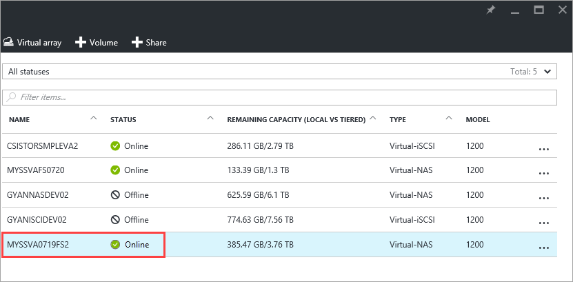
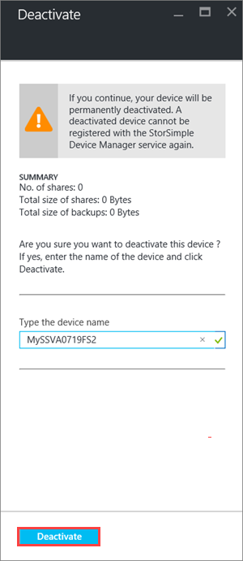
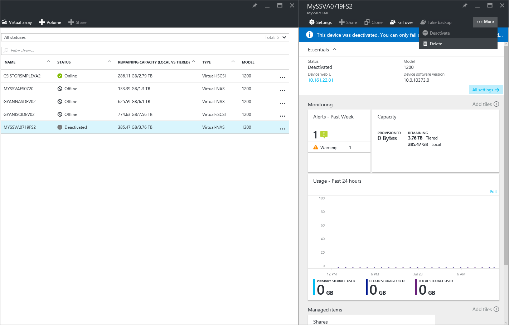
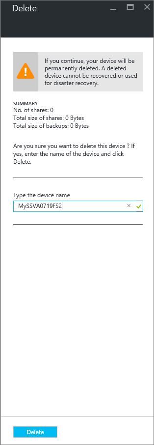

# Deactivate and delete a StorSimple Virtual Array

## Overview

When you deactivate a StorSimple Virtual Array, you break the connection between the device and the corresponding StorSimple Device Manager service. This tutorial explains how to:

* Deactivate a device 
* Delete a deactivated device

The information in this article applies to StorSimple Virtual Arrays only. For information on 8000 series, go to how to [deactivate or delete a device](./storsimple-8000-deactivate-and-delete-device.md).

## When to deactivate?

Deactivation is a PERMANENT operation and cannot be undone. You cannot register a deactivated device with the StorSimple Device Manager service again. You may need to deactivate and delete a StorSimple Virtual Array in the following scenarios:

* **Planned failover** : Your device is online and you plan to fail over your device. If you are planning to upgrade to a larger device, you may need to fail over your device. After the data ownership is transferred and the failover is complete, the source device is automatically deleted.
* **Unplanned failover** : Your device is offline and you need to fail over the device. This scenario may occur during a disaster when there is an outage in the datacenter and your primary device is down. You plan to fail over the device to a secondary device. After the data ownership is transferred and the failover is complete, the source device is automatically deleted.
* **Decommission** : You want to decommission the device. This requires you to first deactivate the device and then delete it. When you deactivate a device, you can no longer access any data that is stored locally. You can only access and recover the data stored in the cloud. If you plan to keep the device data after deactivation, then you should take a cloud snapshot of all your data before you deactivate a device. This cloud snapshot allows you to recover all the data at a later stage.

## Deactivate a device

To deactivate your device, perform the following steps.

#### To deactivate the device

1. In your service, go to **Management > Devices**. In the **Devices** blade, click and select the device that you wish to deactivate.
   
    
2. In your **Device dashboard** blade, click **… More** and from the list, select **Deactivate**.
   
    
3. In the **Deactivate** blade, type the device name and then click **Deactivate**. 
   
    
   
    The deactivate process starts and takes a few minutes to complete.
   
    
4. After deactivation, the list of devices refreshes.
   
    
   
    You can now delete this device.

## Delete the device

A device has to be first deactivated to delete it. Deleting a device removes it from the list of devices connected to the service. The service can then no longer manage the deleted device. The data associated with the device however remains in the cloud. This data then accrues charges.

To delete the device, perform the following steps.

#### To delete the device

1. In your StorSimple Device Manager, go to **Management > Devices**. In the **Devices** blade, select a deactivated device that you wish to delete.
2. In the **Device dashboard** blade, click **… More** and then click **Delete**.
   
   
3. In the **Delete** blade, type the name of your device to confirm the deletion and then click **Delete**. Deleting the device does not delete the cloud data associated with the device. 
   
    
4. The deletion starts and takes a few minutes to complete.
   
   
   
    After the device is deleted, you can view the updated list of devices.

## Next steps

* For information on how to fail over, go to [Failover and disaster recovery of your StorSimple Virtual Array](storsimple-virtual-array-failover-dr.md).

* To learn more about how to use the StorSimple Device Manager service, go to [Use the StorSimple Device Manager service to administer your StorSimple Virtual Array](storsimple-virtual-array-manager-service-administration.md).