# Deploy StorSimple Virtual Array - Provision in Hyper-V

## Overview

[!INCLUDE [storsimple-virtual-array-eol-banner](../../includes/storsimple-virtual-array-eol-banner.md)]

This tutorial describes how to provision a StorSimple Virtual Array on a host system running Hyper-V on Windows Server 2012 R2, Windows Server 2012, or Windows Server 2008 R2. This article applies to the deployment of StorSimple Virtual Arrays in Azure portal and Microsoft Azure Government Cloud.

You need administrator privileges to provision and configure a virtual array. The provisioning and initial setup can take around 10 minutes to complete.

## Provisioning prerequisites
Here you will find the prerequisites to provision a virtual array on a host system running Hyper-V on Windows Server 2012 R2, Windows Server 2012, or Windows Server 2008 R2.

### For the StorSimple Device Manager service
Before you begin, make sure that:

* You have completed all the steps in [Prepare the portal for StorSimple Virtual Array](storsimple-virtual-array-deploy1-portal-prep.md).
* You have downloaded the virtual array image for Hyper-V from the Azure portal. For more information, see **Step 3: Download the virtual array image** of [Prepare the portal for StorSimple Virtual Array guide](storsimple-virtual-array-deploy1-portal-prep.md).

  > [!IMPORTANT]
  > The software running on the StorSimple Virtual Array may only be used with the StorSimple Device Manager service.
  >
  >

### For the StorSimple Virtual Array
Before you deploy a virtual array, make sure that:

* You have access to a host system running Hyper-V on Windows Server 2008 R2 or later that can be used to a provision a device.
* The host system is able to dedicate the following resources to provision your virtual array:

  * A minimum of 4 cores.
  * At least 8 GB of RAM. If you plan to configure the virtual array as file server, 8 GB supports less than 2 million files. You need 16 GB RAM to support 2 - 4 million files.
  * One network interface.
  * A 500 GB virtual disk for data.

### For the network in the datacenter
Before you begin, review the networking requirements to deploy a StorSimple Virtual Array and configure the datacenter network appropriately. For more information, see [StorSimple Virtual Array networking requirements](storsimple-ova-system-requirements.md#networking-requirements).

## Step-by-step provisioning
To provision and connect to a virtual array, you need to perform the following steps:

1. Ensure that the host system has sufficient resources to meet the minimum virtual array requirements.
2. Provision a virtual array in your hypervisor.
3. Start the virtual array and get the IP address.

Each of these steps is explained in the following sections.

## Step 1: Ensure that the host system meets minimum virtual array requirements
To create a virtual array, you need:

* The Hyper-V role installed on Windows Server 2012 R2, Windows Server 2012, or Windows Server 2008 R2 SP1.
* Microsoft Hyper-V Manager on a Microsoft Windows client connected to the host.

Make sure that the underlying hardware (host system) on which you are creating the virtual array is able to dedicate the following resources to your virtual array:

* A minimum of 4 cores.
* At least 8 GB of RAM. If you plan to configure the virtual array as file server, 8 GB supports less than 2 million files. You need 16 GB RAM to support 2 - 4 million files.
* One network interface.
* A 500 GB virtual disk for system data.

## Step 2: Provision a virtual array in hypervisor
Perform the following steps to provision a device in your hypervisor.

#### To provision a virtual array
1. On your Windows Server host, copy the virtual array image to a local drive. You downloaded this image (VHD or VHDX) through the Azure portal. Make a note of the location where you copied the image as you are using this image later in the procedure.
2. Open **Server Manager**. In the top right corner, click **Tools** and select **Hyper-V Manager**.

   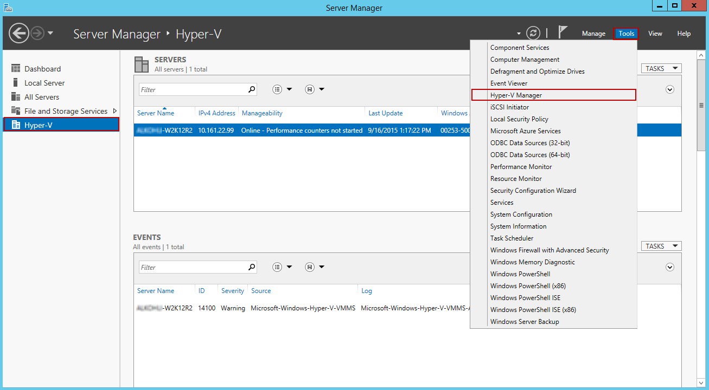  

   If you are running Windows Server 2008 R2, open the Hyper-V Manager. In Server Manager, click **Roles > Hyper-V > Hyper-V Manager**.
3. In **Hyper-V Manager**, in the scope pane, right-click your system node to open the context menu, and then click **New** > **Virtual Machine**.

   
4. On the **Before you begin** page of the New Virtual Machine Wizard, click **Next**.
5. On the **Specify name and location** page, provide a **Name** for your virtual array. Click **Next**.

   
6. On the **Specify generation** page, choose the device image type, and then click **Next**. This page doesn't appear if you're using Windows Server 2008 R2.

   * Choose **Generation 2** if you downloaded a .vhdx image for Windows Server 2012 or later.
   * Choose **Generation 1** if you downloaded a .vhd image for Windows Server 2008 R2 or later.

   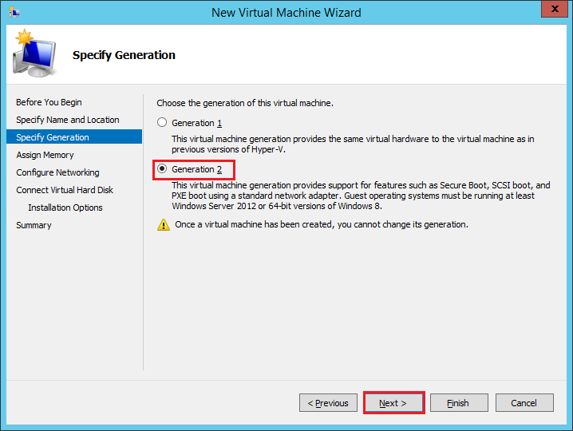
7. On the **Assign memory** page, specify a **Startup memory** of at least **8192 MB**, don't enable dynamic memory, and then click **Next**.

   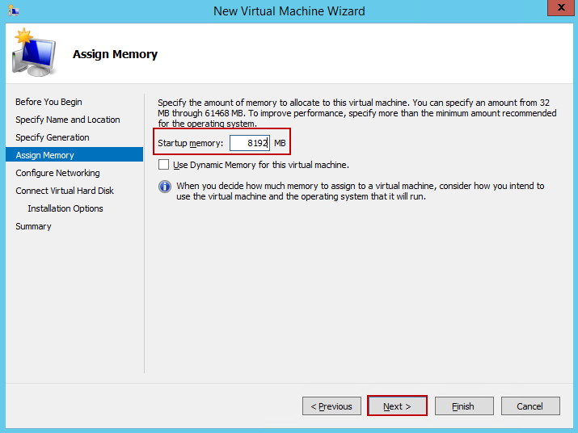  
8. On the **Configure networking** page, specify the virtual switch that is connected to the Internet and then click **Next**.

   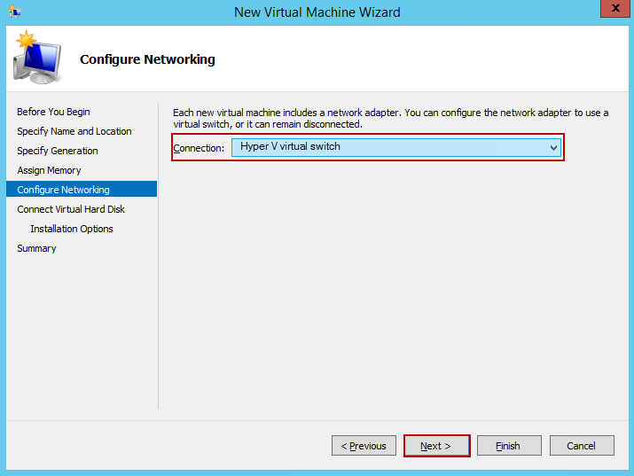
9. On the **Connect virtual hard disk** page, choose **Use an existing virtual hard disk**, specify the location of the virtual array image (.vhdx or .vhd), and then click **Next**.

   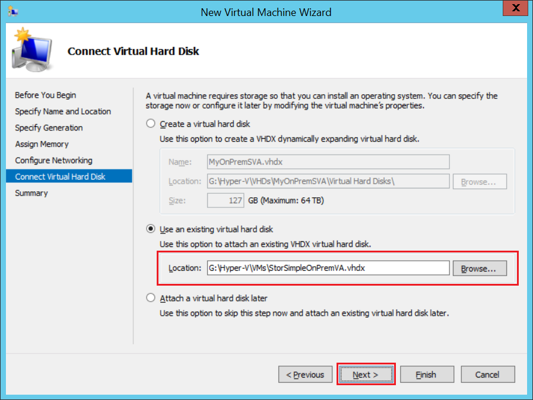
10. Review the **Summary** and then click **Finish** to create the virtual machine.

    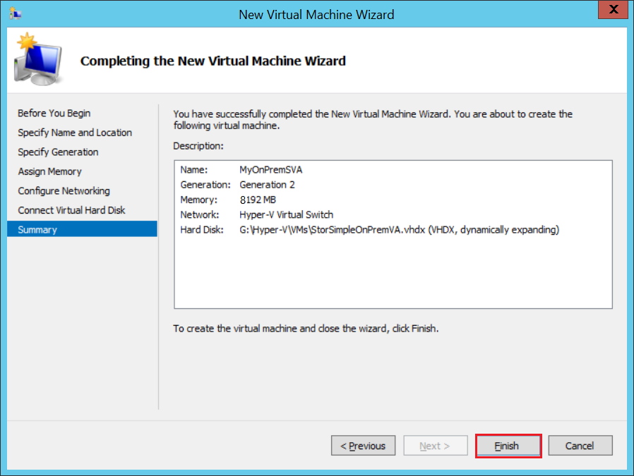
11. To meet the minimum requirements, you need 4 cores. To add 4 virtual processors, select your host system in the **Hyper-V Manager** window. In the right-pane under the list of **Virtual Machines**, locate the virtual machine you just created. Select and right-click the machine name and select **Settings**.

    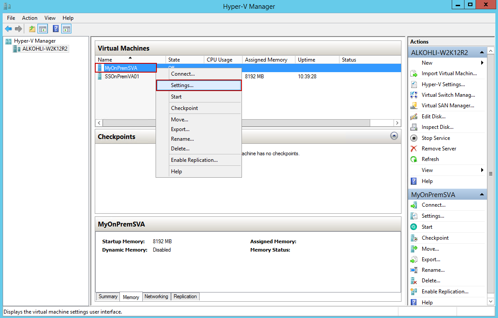
12. On the **Settings** page, in the left-pane, click **Processor**. In the right-pane, set **number of virtual processors** to 4 (or more). Click **Apply**.

    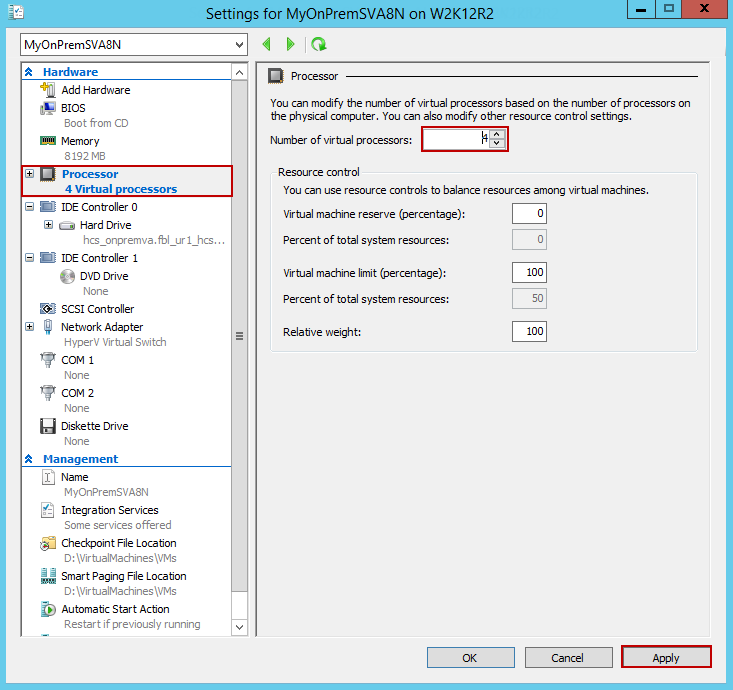
13. To meet the minimum requirements, you also need to add a 500 GB virtual data disk. In the **Settings** page:

    1. In the left pane, select **SCSI Controller**.
    2. In the right pane, select **Hard Drive,** and click **Add**.

    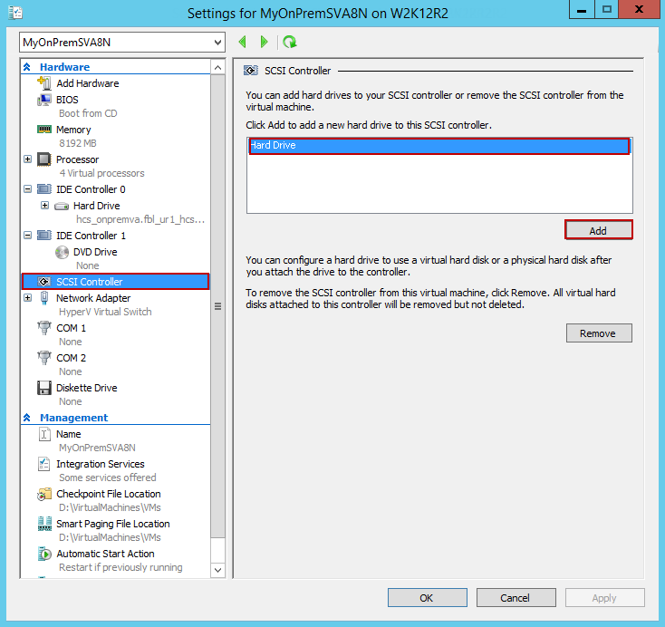
14. On the **Hard drive** page, select the **Virtual hard disk** option and click **New**. The **New Virtual Hard Disk Wizard** starts.

    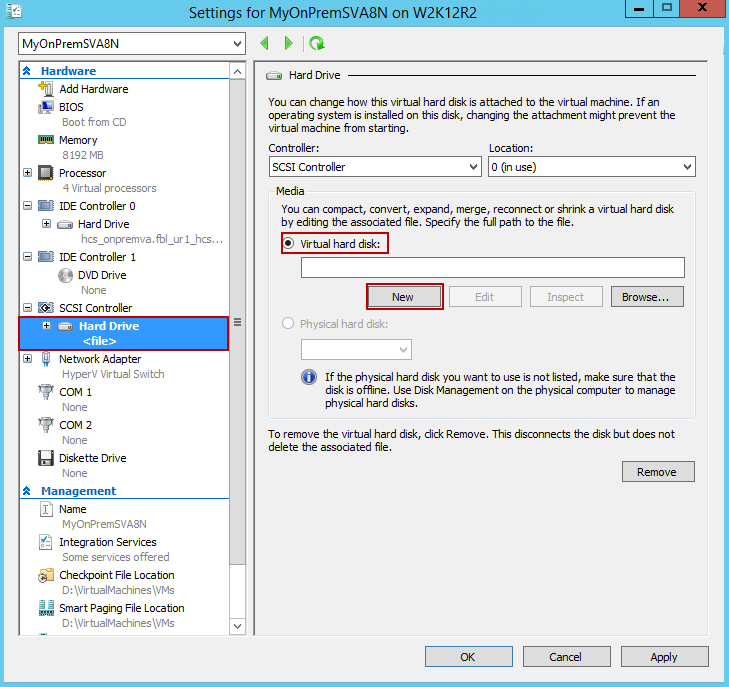
15. On the **Before you begin** page of the New Virtual Hard Disk Wizard, click **Next**.
16. On the **Choose Disk Format page**, accept the default option of **VHDX** format. Click **Next**. This screen is not presented if running Windows Server 2008 R2.

    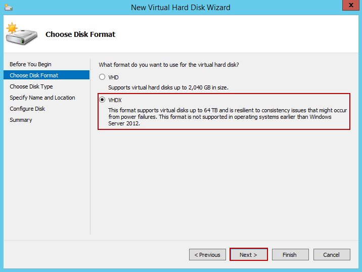
17. On the **Choose Disk Type page**, set virtual hard disk type as **Dynamically expanding** (recommended). **Fixed size** disk would work but you may need to wait a long time. We recommend that you do not use the **Differencing** option. Click **Next**. In Windows Server 2012 R2 and Windows Server 2012, **Dynamically expanding** is the default option whereas in Windows Server 2008 R2, the default is **Fixed size**.

    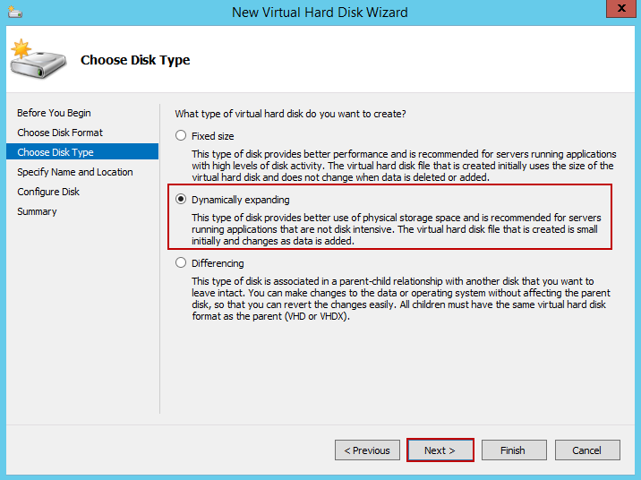
18. On the **Specify Name and Location** page, provide a **name** as well as **location** (you can browse to one) for the data disk. Click **Next**.

    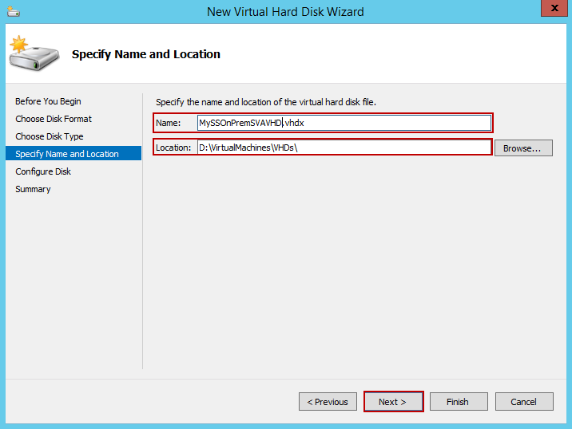
19. On the **Configure Disk** page, select the option **Create a new blank virtual hard disk** and specify the size as **500 GB** (or more). While 500 GB is the minimum requirement, you can always provision a larger disk. Note that you cannot expand or shrink the disk once provisioned. For more information on the size of disk to provision, review the sizing section in the [best practices document](storsimple-ova-best-practices.md). Click **Next**.

    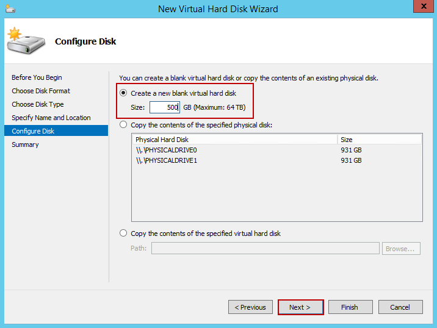
20. On the **Summary** page, review the details of your virtual data disk and if satisfied, click **Finish** to create the disk. The wizard closes and a virtual hard disk is added to your machine.

    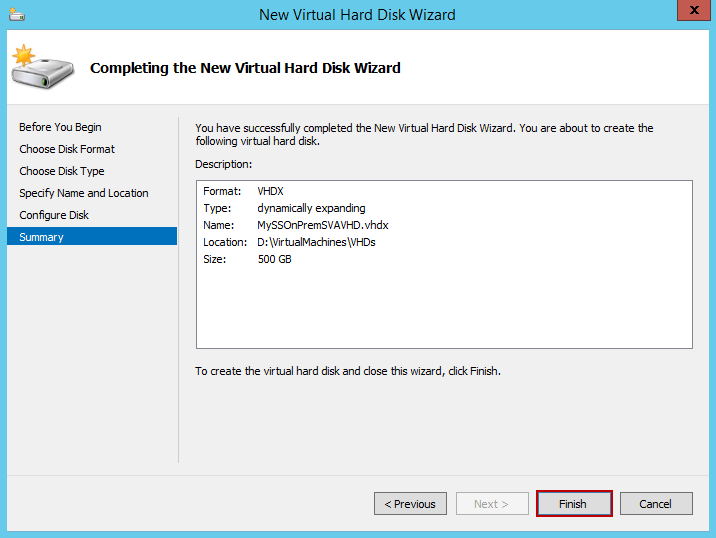
21. Return to the **Settings** page. Click **OK** to close the **Settings** page and return to Hyper-V Manager window.

    

## Step 3: Start the virtual array and get the IP
Perform the following steps to start your virtual array and connect to it.

#### To start the virtual array
1. Start the virtual array.

   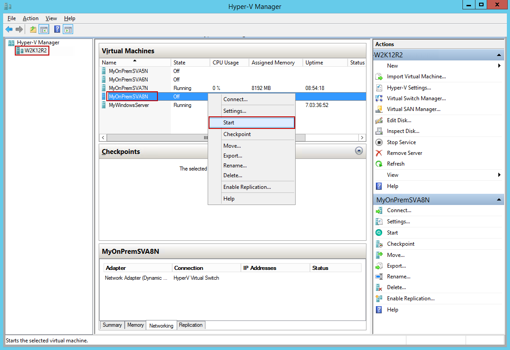
2. After the device is running, select the device, right click, and select **Connect**.

   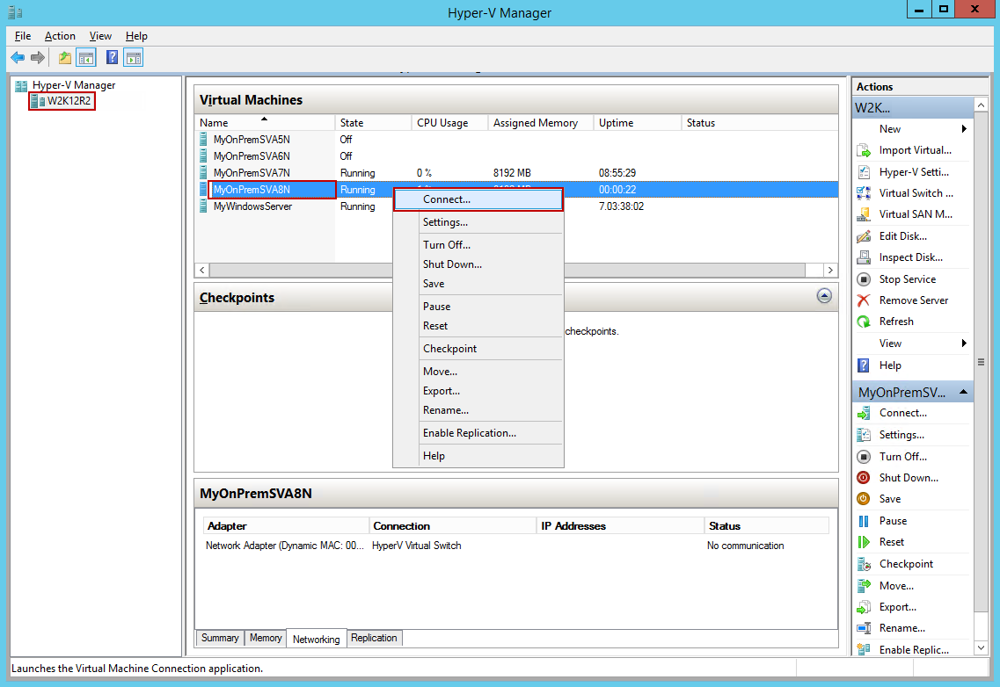
3. You may have to wait 5-10 minutes for the device to be ready. A status message is displayed on the console to indicate the progress. After the device is ready, go to **Action**. Press `Ctrl + Alt + Delete` to log in to the virtual array. The default user is *StorSimpleAdmin* and the default password is *Password1*.

   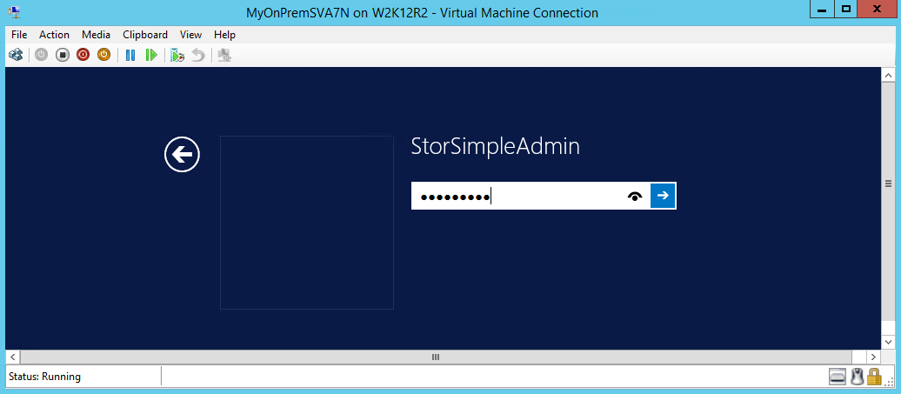
4. For security reasons, the device administrator password expires at the first logon. You are prompted to change the password.

   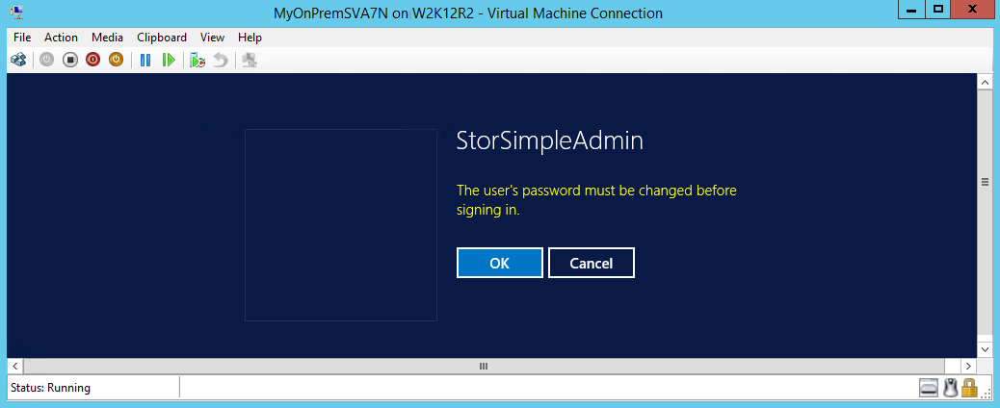

   Enter a password that contains at least 8 characters. The password must satisfy at least 3 out of the following 4 requirements: uppercase, lowercase, numeric, and special characters. Reenter the password to confirm it. You are notified that the password has changed.

   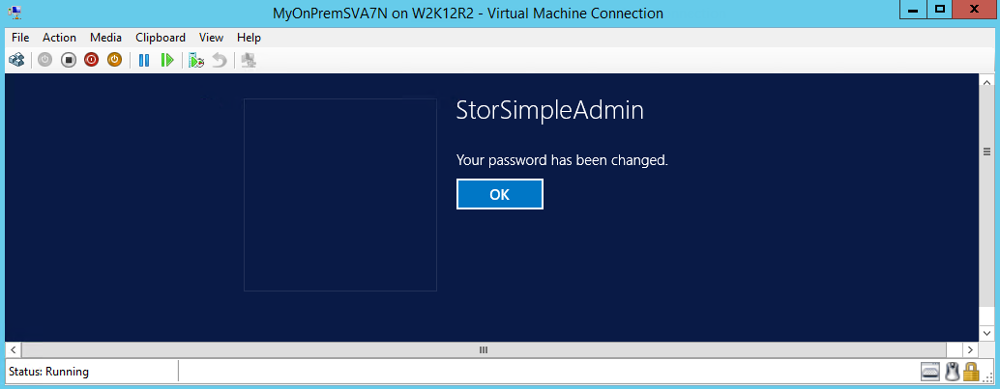
5. After the password is successfully changed, the virtual array may restart. Wait for the device to start.

   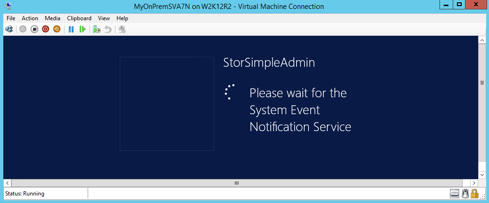

    The Windows PowerShell console of the device is displayed along with a progress bar.

   
6. Steps 6-8 only apply when booting up in a non-DHCP environment. If you are in a DHCP environment, then skip these steps and go to step 9. If you booted up your device in non-DHCP environment, you will see the following screen.

   

    Next, configure the network.
7. Use the `Get-HcsIpAddress` command to list the network interfaces enabled on your virtual array. If your device has a single network interface enabled, the default name assigned to this interface is `Ethernet`.

   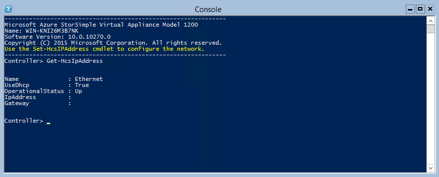
8. Use the `Set-HcsIpAddress` cmdlet to configure the network. See the following example:

    `Set-HcsIpAddress –Name Ethernet –IpAddress 10.161.22.90 –Netmask 255.255.255.0 –Gateway 10.161.22.1`

    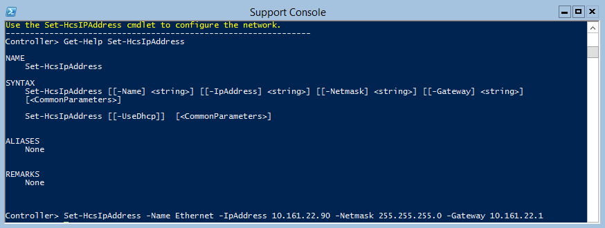
9. After the initial setup is complete and the device has booted up, you will see the device banner text. Make a note of the IP address and the URL displayed in the banner text to manage the device. Use this IP address to connect to the web UI of your virtual array and complete the local setup and registration.

   
10. (Optional) Perform this step only if you are deploying your device in the Government Cloud. You will now enable the United States Federal Information Processing Standard (FIPS) mode on your device. The FIPS 140 standard defines cryptographic algorithms approved for use by US Federal government computer systems for the protection of sensitive data.

    1. To enable the FIPS mode, run the following cmdlet:

        `Enable-HcsFIPSMode`
    2. Reboot your device after you have enabled the FIPS mode so that the cryptographic validations take effect.

       > [!NOTE]
       > You can either enable or disable FIPS mode on your device. Alternating the device between FIPS and non-FIPS mode is not supported.
       >
       >

If your device does not meet the minimum configuration requirements, you see the following error in the banner text (shown below). Modify the device configuration so that the machine has adequate resources to meet the minimum requirements. You can then restart and connect to the device. Refer to the minimum configuration requirements in Step 1: Ensure that the host system meets minimum virtual array requirements.

If you face any other error during the initial configuration using the local web UI, refer to the following workflows:

* Run diagnostic tests to [troubleshoot web UI setup](storsimple-ova-web-ui-admin.md#troubleshoot-web-ui-setup-errors).
* [Generate log package and view log files](storsimple-ova-web-ui-admin.md#generate-a-log-package).

## Next steps
* [Set up your StorSimple Virtual Array as a file server](storsimple-virtual-array-deploy3-fs-setup.md)
* [Set up your StorSimple Virtual Array as an iSCSI server](storsimple-virtual-array-deploy3-iscsi-setup.md)
