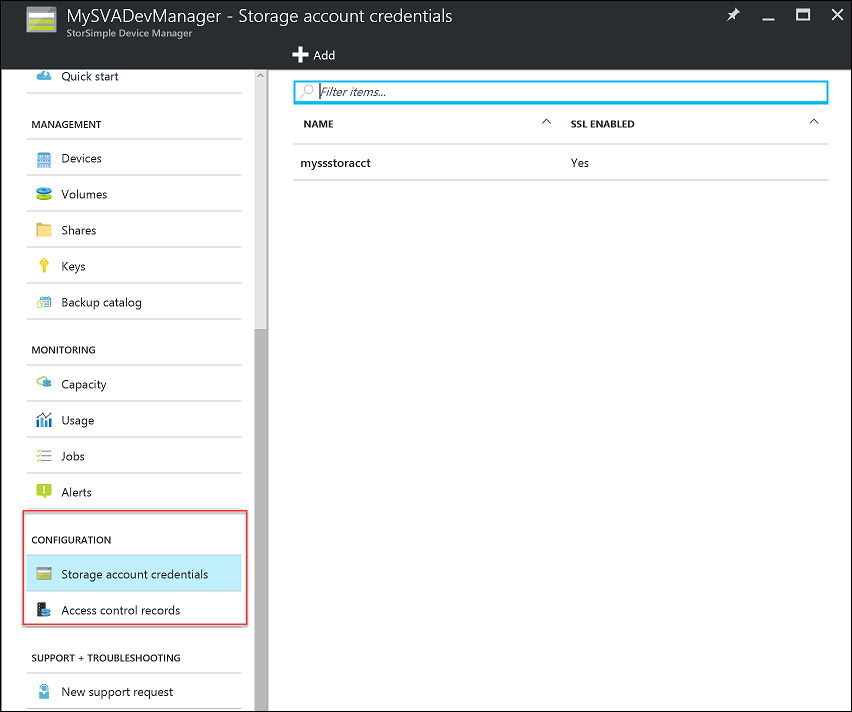
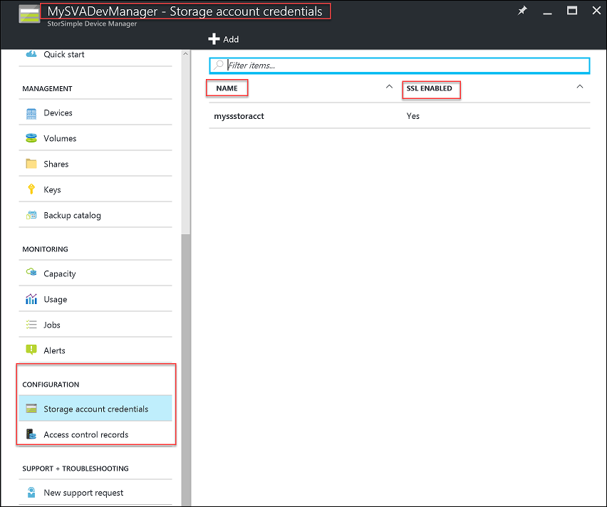
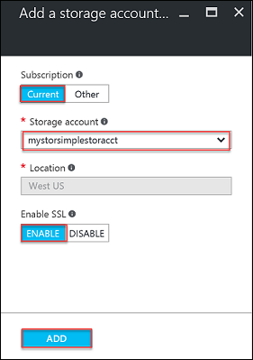
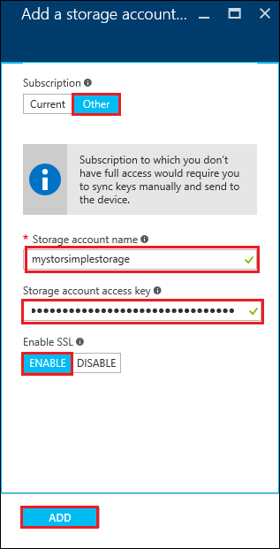
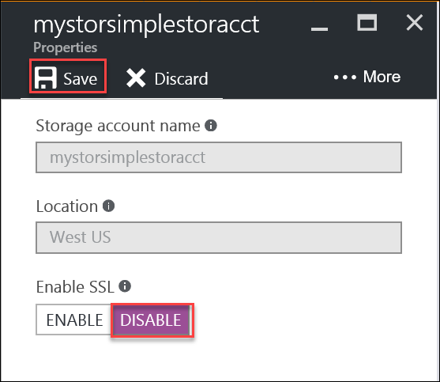
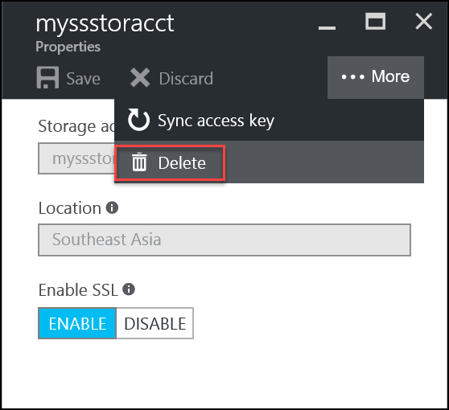
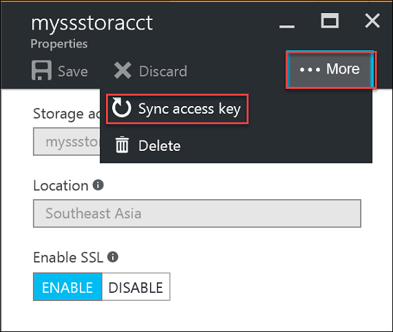

# Use StorSimple Device Manager to manage storage account credentials for StorSimple Virtual Array

## Overview
The **Configuration** section of the StorSimple Device Manager service blade of your StorSimple Virtual Array presents the global service parameters that can be created in the StorSimple Manager service. These parameters can be applied to all the devices connected to the service, and include:

* Storage account credentials
* Access control records
  
    

This tutorial explains how you can add, edit, or delete storage account credentials for your StorSimple Virtual Array. The information in this tutorial only applies to the StorSimple Virtual Array. For information on how to manage storage accounts in 8000 series, see [Use the StorSimple Manager service to manage your storage account](storsimple-manage-storage-accounts.md).

Storage account credentials contain the credentials that the device uses to access your storage account with your cloud service provider. For Microsoft Azure storage accounts, these are credentials such as the account name and the primary access key.

On the **Storage account credentials** blade, all storage account credentials that are created for the billing subscription are displayed in a tabular format containing the following information:

* **Name** – The unique name assigned to the account when it was created.
* **SSL enabled** – Whether the SSL is enabled and device-to-cloud communication is over the secure channel.
  
  

The most common tasks related to storage account credentials that can be performed on the **Storage account credentials** blade are:

* Add a storage account credential
* Edit a storage account credential
* Delete a storage account credential

## Types of storage account credentials
There are three types of storage account credentials that can be used with your StorSimple device.

* **Auto-generated storage account credentials** – As the name suggests, this type of storage account credential is automatically generated when the service is first created. To learn more about how this storage account credential is created, see [Create a new service](storsimple-virtual-array-manage-service.md#create-a-service).
* **storage account credentials in the service subscription** – These are the Azure storage account credentials that are associated with the same subscription as that of the service. To learn more about how these storage account credentials are created, see [About Azure Storage Accounts](../storage/common/storage-create-storage-account.md).
* **storage account credentials outside of the service subscription** – These are the Azure storage account credentials that are not associated with your service and likely existed before the service was created.

## Add a storage account credential
You can add a storage account credential to your StorSimple Device Manager service configuration by providing a unique friendly name and access credentials that are linked to the storage account. You also have the option of enabling the secure sockets layer (SSL) mode to create a secure channel for network communication between your device and the cloud.

You can create multiple accounts for a given cloud service provider. While the storage account credential is being saved, the service attempts to communicate with your cloud service provider. The credentials and the access material that you supplied are authenticated at this time. A storage account credential is created only if the authentication succeeds. If the authentication fails, then an appropriate error message is displayed.

Use the following procedures to add Azure storage account credentials:

* To add a storage account credential that has the same Azure subscription as the Device Manager service
* To add an Azure storage account credential that is outside of the Device Manager service subscription

#### To add a storage account credential that has the same Azure subscription as the Device Manager service

1. Navigate to your Device Manager service, select and double-click it. This opens the **Overview** blade.
2. Select **Storage account credentials** within the **Configuration** section.
3. Click **Add**.
4. In the **Add a storage account** blade, do the following:
   
    1. For **Subscription**, select **Current**.
    2. Provide the name of your Azure storage account.
    3. Select **Enable** to create a secure channel for network communication between your StorSimple device and the cloud. Select **Disable** only if you are operating within a private cloud.
    4. Click **Add**. You are notified after the storage account is successfully created.  
   
        

#### To add an Azure storage account credential that is outside of the Device Manager service subscription

1. Navigate to your Device Manager service, select and double-click it. This opens the **Overview** blade.
2. Select **Storage account credentials** within the **Configuration** section. This lists any existing storage account credentials associated with the StorSimple Device Manager service.
3. Click **Add**.
4. In the **Add a storage account** blade, do the following:
   
    1. For **Subscription**, select **Other**.
   
    2. Provide the name of your Azure storage account credential.
   
    3. In the **Storage account access key** text box, supply the primary Access Key for your Azure storage account credential. To get this key, go to the Azure Storage service, select your storage account credential, and click **Manage account keys**. You can now copy the primary access key.
   
    4. To enable SSL, click the **Enable** button to create a secure channel for network communication between your StorSimple Device Manager service and the cloud. Click the **Disable** button only if you are operating within a private cloud.
   
    5. Click **Add**. You are notified after the storage account credential is successfully created.

5. The newly created storage account credential is displayed on the StorSimple Configure Device Manager service blade under **Storage account credentials**.
   
    

## Edit a storage account credential
You can edit a storage account credential used by your device. If you edit a storage account credential that is currently in use, the fields available to modify are the access key and the SSL mode for the storage account credential. You can supply the new storage access key or modify the **Enable SSL mode** selection and save the updated settings.

#### To edit a storage account credential
1. Navigate to your Device Manager service, select and double-click it. This opens the **Overview** blade.
2. Select **Storage account credentials** within the **Configuration** section. This lists any existing storage account credentials associated with the StorSimple Device Manager service.
3. In the tabular list of storage account credentials, select and double-click the account that you want to modify.
4. In the storage account credential **Properties** blade, do the following:
   
   1. If necessary, you can modify the **Enable SSL** mode selection.
   2. You can choose to regenerate your storage account credential access keys. For more information, see [Manage storage account access keys](../storage/common/storage-account-keys-manage.md). Supply the new storage account credential key. For an Azure storage account, this is the primary access key.
   3. Click **Save** at the top of the **Properties** blade to save the settings. The settings are updated on the **Storage account credentials** blade.
      
      

## Delete a storage account credential
> [!IMPORTANT]
> You can delete a storage account credential only if it is not in use. If a storage account credential is in use, you are notified.
> 
> 

#### To delete a storage account credential
1. Navigate to your Device Manager service, select and double-click it. This opens the **Overview** blade.
2. Select **Storage account credentials** within the **Configuration** section. This lists any existing storage account credentials associated with the StorSimple Device Manager service.
3. In the tabular list of storage account credentials, select and double-click the account that you want to delete.
4. In the storage account credential **Properties** blade, do the following:
   
   1. Click **Delete** to delete the credentials.
   2. When prompted for confirmation, click **Yes** to continue with the deletion. The tabular listing is updated to reflect the changes.
      
      

## Synchronizing storage account credential keys
For security reasons, key rotation is often a requirement in data centers. A Microsoft Azure administrator can regenerate or change the primary or secondary key by directly accessing the storage account credential (via the Microsoft Azure Storage service). The StorSimple Device Manager service does not see this change automatically.

To inform the StorSimple Device Manager service of the change, you need to access the StorSimple Device Manager service, access the storage account credential, and then synchronize the primary or secondary key (depending on which one was changed). The service then gets the latest key, encrypts the keys, and sends the encrypted key to the device.

#### To synchronize keys for storage account credentials in the same subscription as the service (Azure only)
1. On the service landing blade, select your service, double-click the service name, and then in the **Configuration** section, click **Storage account credentials**.
2. On the **Storage account credentials** blade, in the list of Storage account credentials, select the storage account credential whose keys that you want to synchronize.
3. In the **Properties** blade for the selected storage account credential, do the following:
   
    1. Click **More**, and then click **Sync access key**.
   
    2. When prompted for confirmation, click **Sync key** to complete the synchronization.
    
4. In the StorSimple Device Manager service, you need to update the key that was previously changed in the Microsoft Azure Storage service. In the **Synchronize storage account key** blade, if the primary access key was changed (regenerated), click Primary, and then click **Sync Key**. If the secondary key was changed, click **Secondary**, and then click **Sync Key**.
   
    

## Next steps
* Learn how to [administer your StorSimple Virtual Array](storsimple-ova-web-ui-admin.md).

