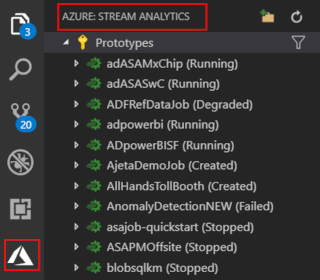
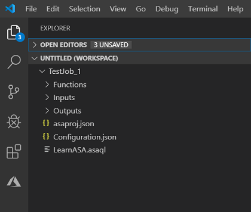

# Copy or back up Azure Stream Analytics jobs

You can copy or back up your deployed Azure Stream Analytics jobs using Visual Studio Code or Visual Studio. Copying a job to another region does not copy the last output time. Therefore, you cannot use [**When last stopped**](https://docs.microsoft.com/azure/stream-analytics/start-job#start-options) option when starting the copied job.

## Before you begin
* If you don't have an Azure subscription, create a [free account](https://azure.microsoft.com/free/).

* Sign in to the [Azure portal](https://portal.azure.com/).

* Install [Azure Stream Analytics extension for Visual Studio Code](quick-create-vs-code.md#install-the-azure-stream-analytics-tools-extension) or [Azure Stream Analytics tools for Visual Studio](quick-create-vs-code.md#install-the-azure-stream-analytics-tools-extension).  

## Visual Studio Code

1. Click the **Azure** icon on the Visual Studio Code Activity Bar and then expand **Stream Analytics** node. Your jobs should appear under your subscriptions.

   

2. To export a job to a local project, locate the job you wish to export in the **Stream Analytics Explorer** in Visual Studio Code. Then select a folder for your project.

    

    The project is exported to the folder you select and added to your current workspace.

    

3. To publish the job to another region or backup using another name, select **Select from your subscriptions to publish** in the query editor (\*.asaql) and follow the instructions.

    

## Visual Studio

1. Follow the [export a deployed Azure Stream Analytics job to a project instructions](https://docs.microsoft.com/azure/stream-analytics/stream-analytics-vs-tools#export-jobs-to-a-project).

2. Open the \*.asaql file in the Query Editor, select **Submit To Azure** in the script editor and follow the instructions to publish the job to another region or backup using a new name.

## Next steps

* [Quickstart: Create a Stream Analytics job by using Visual Studio Code](quick-create-vs-code.md)
* [Quickstart: Create a Stream Analytics job by using Visual Studio](stream-analytics-quick-create-vs.md)
* [Deploy an Azure Stream Analytics job with CI/CD using Azure Pipelines](stream-analytics-tools-visual-studio-cicd-vsts.md)
