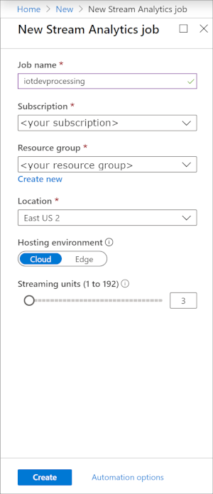
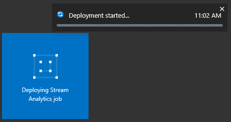
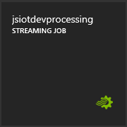
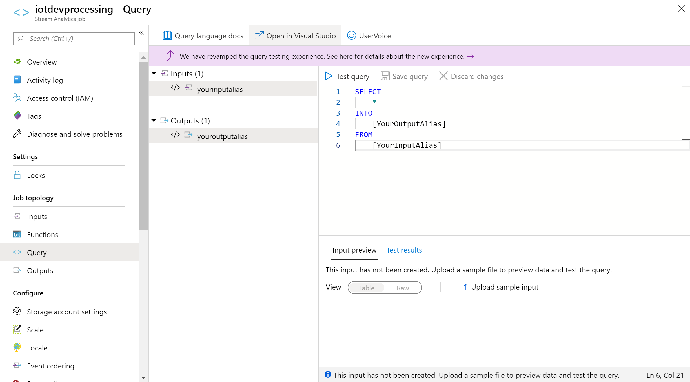
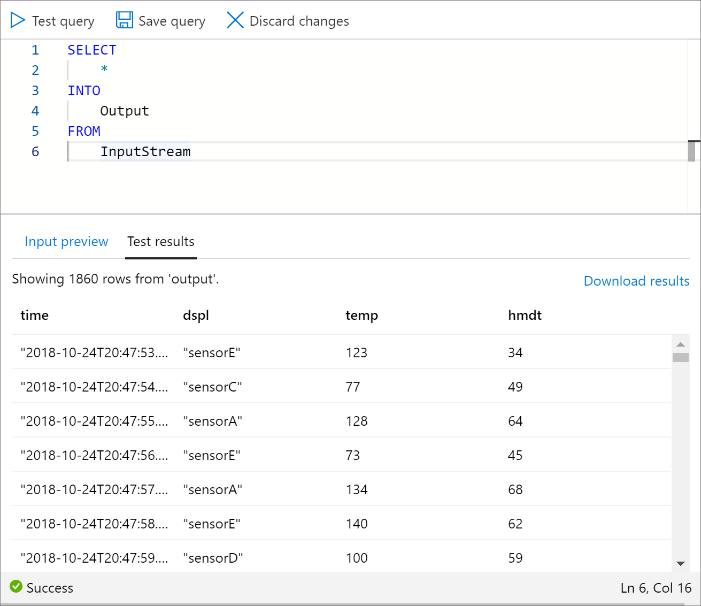
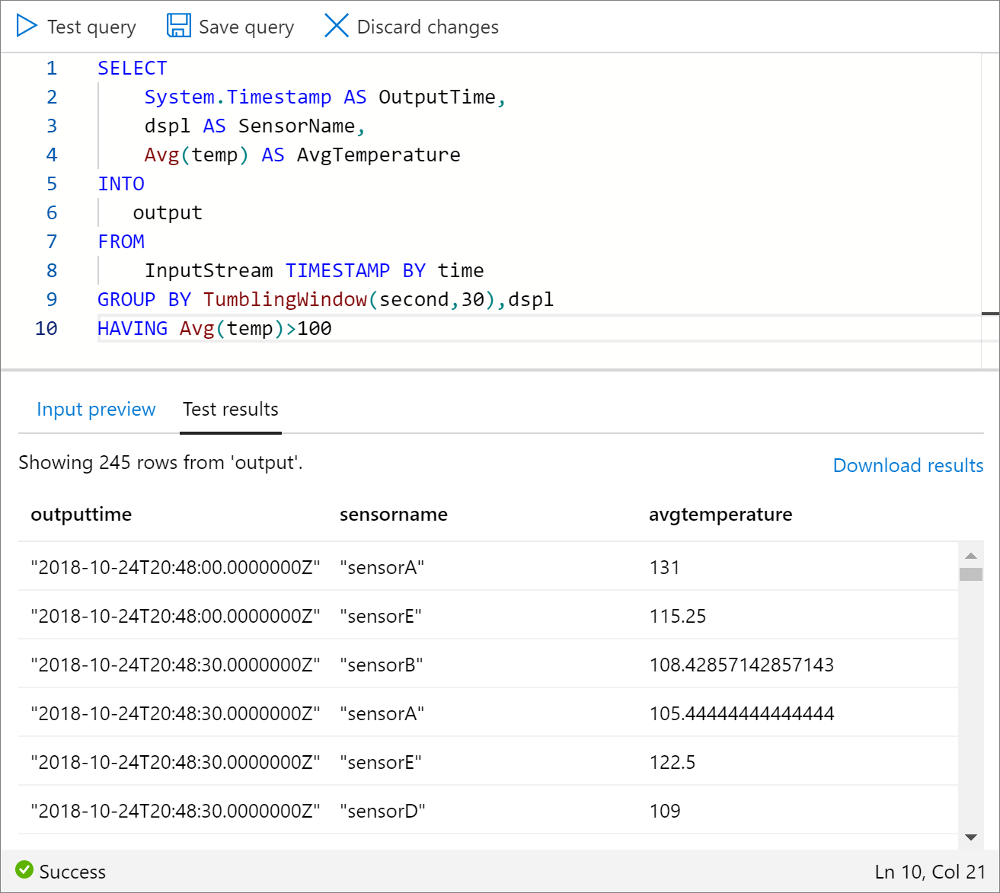

# Get started with Azure Stream Analytics to process data from IoT devices
In this tutorial, you will learn how to create stream-processing logic to gather data from Internet of Things (IoT) devices. We will use a real-world, Internet of Things (IoT) use case to demonstrate how to build your solution quickly and economically.

## Prerequisites
* [Azure subscription](https://azure.microsoft.com/pricing/free-trial/)
* Sample query and data files downloadable from [GitHub](https://aka.ms/azure-stream-analytics-get-started-iot)

## Scenario
Contoso, which is a company in the industrial automation space, has completely automated its manufacturing process. The machinery in this plant has sensors that are capable of emitting streams of data in real time. In this scenario, a production floor manager wants to have real-time insights from the sensor data to look for patterns and take actions on them. We will use the Stream Analytics Query Language (SAQL) over the sensor data to find interesting patterns from the incoming stream of data.

Here data is being generated from a Texas Instruments sensor tag device. The payload of the data is in JSON format and looks like the following:

```json
{
    "time": "2016-01-26T20:47:53.0000000",  
    "dspl": "sensorE",  
    "temp": 123,  
    "hmdt": 34  
}  
```

In a real-world scenario, you could have hundreds of these sensors generating events as a stream. Ideally, a gateway device would run code to push these events to [Azure Event Hubs](https://azure.microsoft.com/services/event-hubs/) or [Azure IoT Hubs](https://azure.microsoft.com/services/iot-hub/). Your Stream Analytics job would ingest these events from Event Hubs and run real-time analytics queries against the streams. Then, you could send the results to one of the [supported outputs](stream-analytics-define-outputs.md).

For ease of use, this getting started guide provides a sample data file, which was captured from real sensor tag devices. You can run queries on the sample data and see results. In subsequent tutorials, you will learn how to connect your job to inputs and outputs and deploy them to the Azure service.

## Create a Stream Analytics job
1. In the [Azure portal](https://portal.azure.com), click the plus sign and then type **STREAM ANALYTICS** in the text window to the right. Then select **Stream Analytics job** in the results list.
   
    
2. Enter a unique job name and verify the subscription is the correct one for your job. Then either create a new resource group or select an existing one on your subscription.
3. Then select a location for your job. For speed of processing and reduction of cost in data transfer selecting the same location as the resource group and intended storage account is recommended.
   
    
   
   > [!NOTE]
   > You should create this storage account only once per region. This storage will be shared across all Stream Analytics jobs that are created in that region.
   > 
   > 
4. Check the box to place your job on your dashboard and then click **CREATE**.
   
    
5. You should see a 'Deployment started...' displayed in the top right of your browser window. Soon it will change to a completed window as shown below.
   
    

## Create an Azure Stream Analytics query
After your job is created it's time to open it and build a query. You can easily access your job by clicking the tile for it.



In the **Job Topology** pane click the **QUERY** box to go to the Query Editor. The **QUERY** editor allows you to enter a T-SQL query that performs the transformation over the incoming event data.



### Query: Archive your raw data
The simplest form of query is a pass-through query that archives all input data to its designated output. Download the sample data file from [GitHub](https://aka.ms/azure-stream-analytics-get-started-iot) to a location on your computer. 

1. Paste the query from the PassThrough.txt file. 
   
    
2. Click the three dots next to your input and select **Upload sample data from file** box.
   
    
3. A pane opens on the right as a result, in it select the HelloWorldASA-InputStream.json data file from your downloaded location and click **OK** at the bottom of the pane.
   
    
4. Then click the **Test** gear in the top left area of the window and process your test query against the sample dataset. A results window will open below your query as the processing is complete.
   
    

### Query: Filter the data based on a condition
Let’s try to filter the results based on a condition. We would like to show results for only those events that come from "sensorA." The query is in the Filtering.txt file.


Note that the case-sensitive query compares a string value. Click the **Test** gear again to execute the query. The query should return 389 rows out of 1860 events.


### Query: Alert to trigger a business workflow
Let's make our query more detailed. For every type of sensor, we want to monitor average temperature per 30-second window and display results only if the average temperature is above 100 degrees. We will write the following query and then click **Test** to see the results. The query is in the ThresholdAlerting.txt file.



You should now see results that contain only 245 rows and names of sensors where the average temperate is greater than 100. This query groups the stream of events by **dspl**, which is the sensor name, over a **Tumbling Window** of 30 seconds. Temporal queries must state how we want time to progress. By using the **TIMESTAMP BY** clause, we have specified the **OUTPUTTIME** column to associate times with all temporal calculations. For detailed information, read the MSDN articles about [Time Management](https://msdn.microsoft.com/library/azure/mt582045.aspx) and [Windowing functions](https://msdn.microsoft.com/library/azure/dn835019.aspx).

### Query: Detect absence of events
How can we write a query to find a lack of input events? Let’s find the last time that a sensor sent data and then did not send events for the next 5 seconds. The query is in the AbsenceOfEvent.txt file.


Here we use a **LEFT OUTER** join to the same data stream (self-join). For an **INNER** join, a result is returned only when a match is found.  For a **LEFT OUTER** join, if an event from the left side of the join is unmatched, a row that has NULL for all the columns of the right side is returned. This technique is very useful to find an absence of events. See our MSDN documentation for more information about [JOIN](https://msdn.microsoft.com/library/azure/dn835026.aspx).

## Conclusion
The purpose of this tutorial is to demonstrate how to write different Stream Analytics Query Language queries and see results in the browser. However, this is just getting started. You can do so much more with Stream Analytics. Stream Analytics supports a variety of inputs and outputs and can even use functions in Azure Machine Learning to make it a robust tool for analyzing data streams. You can start to explore more about Stream Analytics by using our [learning map](https://docs.microsoft.com/azure/stream-analytics/). For more information about how to write queries, read the article about [common query patterns](stream-analytics-stream-analytics-query-patterns.md).

