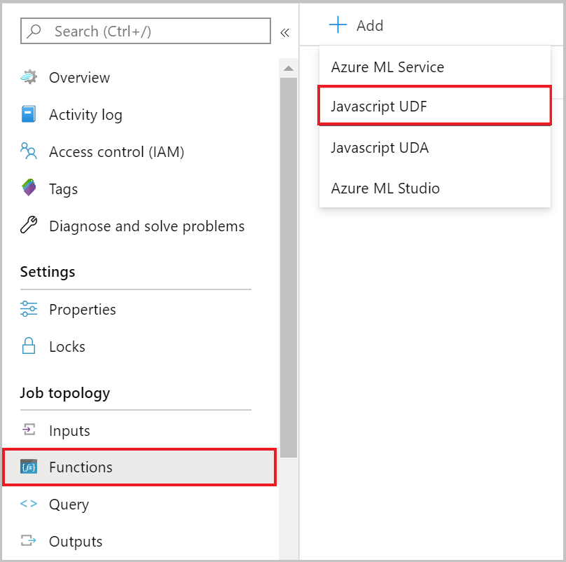

# JavaScript user-defined functions in Azure Stream Analytics
 
Azure Stream Analytics supports user-defined functions written in JavaScript. With the rich set of **String**, **RegExp**, **Math**, **Array**, and **Date** methods that JavaScript provides, complex data transformations with Stream Analytics jobs become easier to create.

## Overview

JavaScript user-defined functions support stateless, compute-only scalar functions that don't require external connectivity. The return value of a function can only be a scalar (single) value. After you add a JavaScript user-defined function to a job, you can use the function anywhere in the query, like a built-in scalar function.

Here are some scenarios where you might find JavaScript user-defined functions useful:
* Parsing and manipulating strings that have regular expression functions, for example, **Regexp_Replace()** and **Regexp_Extract()**
* Decoding and encoding data, for example, binary-to-hex conversion
* Doing mathematic computations with JavaScript **Math** functions
* Doing array operations like sort, join, find, and fill

Here are some things that you can't do with a JavaScript user-defined function in Stream Analytics:
* Call out external REST endpoints, for example, doing reverse IP lookup or pulling reference data from an external source
* Perform custom event format serialization or deserialization on inputs/outputs
* Create custom aggregates

Although functions like **Date.GetDate()** or **Math.random()** aren't blocked in the functions definition, you should avoid using them. These functions **don't** return the same result every time you call them, and the Azure Stream Analytics service doesn't keep a journal of function invocations and returned results. If a function returns different result on the same events, repeatability isn't guaranteed when a job is restarted by you or by the Stream Analytics service.

## Add a JavaScript user-defined function to your job

> [!NOTE]
> These steps work on the Stream Analytics jobs configured to run in the cloud. If your Stream Analytics job is configured to run on Azure IoT Edge, instead use Visual Studio and [write the user-defined function using C#](stream-analytics-edge-csharp-udf.md).

To create a JavaScript user-defined function in your Stream Analytics job, select **Functions** under **Job Topology**. Then, select **JavaScript UDF** from the **+Add** dropdown menu. 



You must then provide the following properties and select **Save**.

|Property|Description|
|--------|-----------|
|Function alias|Enter a name to invoke the function in your query.|
|Output type|Type that will be returned by your JavaScript user-defined function to your Stream Analytics query.|
|Function definition|Implementation of your JavaScript function that will be executed each time your UDF gets invoked from your query.|

## Test and troubleshoot JavaScript UDFs 

You can test and debug your JavaScript UDF logic in any browser. Debugging and testing the logic of these user-defined functions is currently not supported in the Stream Analytics portal. Once the function works as expected, you can add it to the Stream Analytics job as mentioned above and then invoke it directly from your query. You can test your query logic with JavaScript UDF using [Stream Analytics tools for Visual Studio](https://docs.microsoft.com/azure/stream-analytics/stream-analytics-tools-for-visual-studio-install).

JavaScript runtime errors are considered fatal, and are surfaced through the Activity log. To retrieve the log, in the Azure portal, go to your job and select **Activity log**.

## Call a JavaScript user-defined function in a query

You can easily invoke your JavaScript function in your query using the function alias prefixed with **udf**. Here is an example of a JavaScript UDF that converts hexadecimal values to integer being invoked in a Stream Analytics query.

```SQL
    SELECT
        time,
        UDF.hex2Int(offset) AS IntOffset
    INTO
        output
    FROM
        InputStream
```

## Supported JavaScript objects

Azure Stream Analytics JavaScript user-defined functions support standard, built-in JavaScript objects. For a list of these objects, see [Global Objects](https://developer.mozilla.org/docs/Web/JavaScript/Reference/Global_Objects).

### Stream Analytics and JavaScript type conversion

There are differences in the types that the Stream Analytics query language and JavaScript support. This table lists the conversion mappings between the two:

Stream Analytics | JavaScript
--- | ---
bigint | Number (JavaScript can only represent integers up to precisely 2^53)
DateTime | Date (JavaScript only supports milliseconds)
double | Number
nvarchar(MAX) | String
Record | Object
Array | Array
NULL | Null

Here are JavaScript-to-Stream Analytics conversions:

JavaScript | Stream Analytics
--- | ---
Number | Bigint (if the number is round and between long.MinValue and long.MaxValue; otherwise, it's double)
Date | DateTime
String | nvarchar(MAX)
Object | Record
Array | Array
Null, Undefined | NULL
Any other type (for example, a function or error) | Not supported (results in runtime error)

JavaScript language is case-sensitive and casing of the object fields in JavaScript code must match the casing of the fields in the incoming data. Jobs with compatibility level 1.0 will convert fields from SQL SELECT statement to be lowercase. Under compatibility level 1.1 and higher, fields from SELECT statement will have the same casing as specified in the SQL query.

## Other JavaScript user-defined function patterns

### Write nested JSON to output

If you have a follow-up processing step that uses a Stream Analytics job output as input, and it requires a JSON format, you can write a JSON string to output. The next example calls the **JSON.stringify()** function to pack all name/value pairs of the input, and then write them as a single string value in output.

**JavaScript user-defined function definition:**

```javascript
function main(x) {
return JSON.stringify(x);
}
```

**Sample query:**
```SQL
SELECT
    DataString,
    DataValue,
    HexValue,
    UDF.jsonstringify(input) As InputEvent
INTO
    output
FROM
    input PARTITION BY PARTITIONID
```

## Next steps

* [Machine Learning UDF](https://docs.microsoft.com/azure/stream-analytics/machine-learning-udf)
* [C# UDF](https://docs.microsoft.com/azure/stream-analytics/stream-analytics-edge-csharp-udf-methods)
