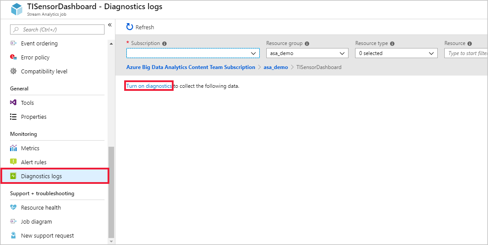
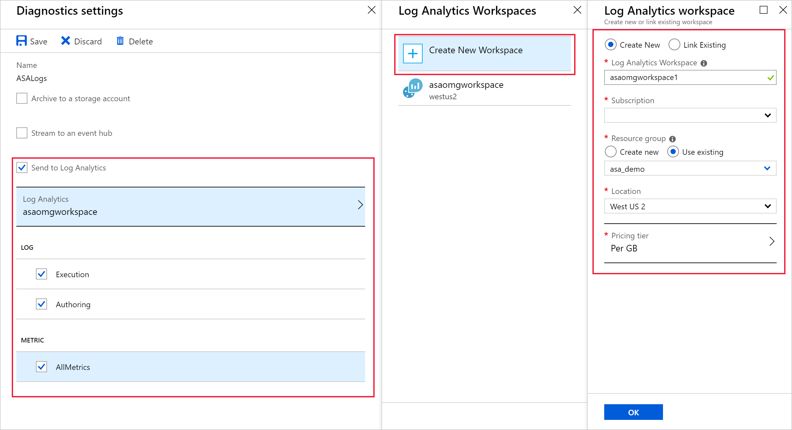
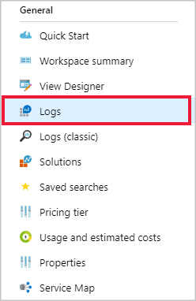
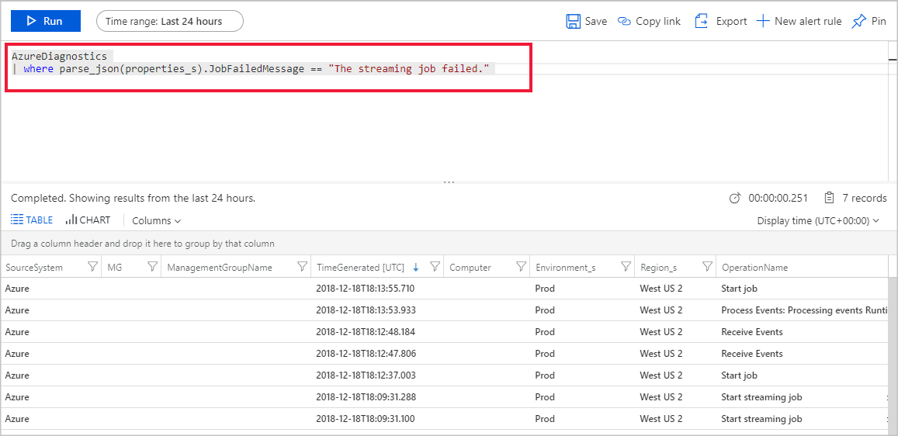
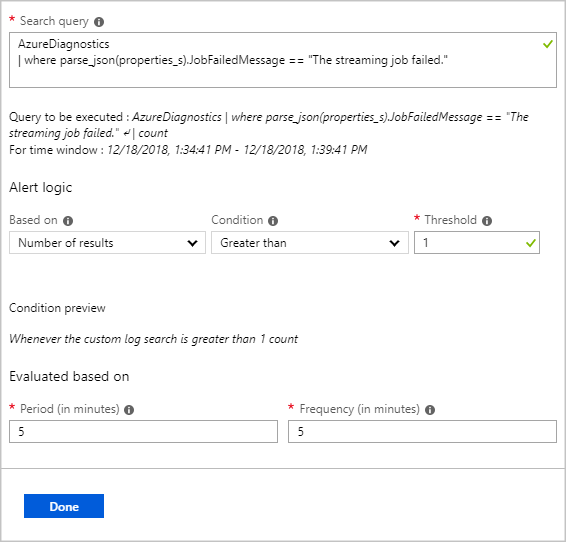

# Troubleshoot Azure Stream Analytics by using diagnostics logs

Occasionally, an Azure Stream Analytics job unexpectedly stops processing. It's important to be able to troubleshoot this kind of event. Failures can be caused by an unexpected query result, by connectivity to devices, or by an unexpected service outage. The diagnostics logs in Stream Analytics can help you identify the cause of issues when they occur and reduce recovery time.

## Log types

Stream Analytics offers two types of logs:

* [Activity logs](https://docs.microsoft.com/azure/monitoring-and-diagnostics/monitoring-overview-activity-logs) (always on), which give insights into operations performed on jobs.

* [Diagnostics logs](https://docs.microsoft.com/azure/monitoring-and-diagnostics/monitoring-overview-of-diagnostic-logs) (configurable), which provide richer insights into everything that happens with a job. Diagnostics logs start when the job is created and end when the job is deleted. They cover events when the job is updated and while it’s running.

> [!NOTE]
> You can use services like Azure Storage, Azure Event Hubs, and Azure Monitor logs to analyze nonconforming data. You are charged based on the pricing model for those services.

[!INCLUDE [azure-monitor-log-analytics-rebrand](../../includes/azure-monitor-log-analytics-rebrand.md)]

## Debugging using activity logs

Activity logs are on by default and give high-level insights into operations performed by your Stream Analytics job. Information present in activity logs may help find the root cause of the issues impacting your job. Do the following steps to use activity logs in Stream Analytics:

1. Sign in to the Azure portal and select **Activity log** under **Overview**.

   

2. You can see a list of operations that have been performed. Any operation that caused your job to fail has a red info bubble.

3. Click an operation to see its summary view. Information here is often limited. To learn more details about the operation, click **JSON**.

   

4. Scroll down to the **Properties** section of the JSON, which provides details of the error that caused the failed operation. In this example, the failure was due to a runtime error from out of bound latitude values.

   

5. You can take corrective actions based on the error message in JSON. In this example, checks to ensure latitude value is between -90 degrees and 90 degrees need to be added to the query.

6. If the error message in the Activity logs isn’t helpful in identifying root cause, enable diagnostic logs and use Azure Monitor logs.

## Send diagnostics to Azure Monitor logs

Turning on diagnostic logs and sending them to Azure Monitor logs is highly recommended. Diagnostics logs are **off** by default. To turn on diagnostics logs, complete these steps:

1.  Sign in to the Azure portal, and navigate to your Stream Analytics job. Under **Monitoring**, select **Diagnostics logs**. Then select **Turn on diagnostics**.

      

2.  Create a **Name** in **Diagnostic settings** and check the box next to **Send to Log Analytics**. Then add an existing or create a new **Log analytics workspace**. Check the boxes for **Execution** and **Authoring** under **LOG**, and **AllMetrics** under **METRIC**. Click **Save**.

    

3. When your Stream Analytics job starts, diagnostic logs are routed to your Log Analytics workspace. Navigate to the Log Analytics workspace and choose **Logs** under the **General** section.

   

4. You can [write your own query](../azure-monitor/log-query/get-started-portal.md) to search for terms, identify trends, analyze patterns, and provide insights based on your data. For example, you can write a query to filter only diagnostic logs that have the message “The streaming job failed.” Diagnostic logs from Azure Stream Analytics are stored in the **AzureDiagnostics** table.

   

5. When you have a query that is searching for the right logs, save it by selecting **Save** and provide a Name and Category. You can then create an alert by selecting **New alert rule**. Next, specify the alert condition. Select **Condition** and enter the threshold value and the frequency at which this custom log search is evaluated.  

   

6. Choose the action group and specify alert details, like name and description, before you can create the alert rule. You can route the diagnostic logs of various jobs to the same Log Analytics workspace. This allows you to set up alerts once that work across all jobs.  

## Diagnostics log categories

Azure Stream Analytics captures two categories of diagnostics logs:

* **Authoring**: Captures log events that are related to job authoring operations, such as job creation, adding and deleting inputs and outputs, adding and updating the query, and starting or stopping the job.

* **Execution**: Captures events that occur during job execution.
    * Connectivity errors
    * Data processing errors, including:
        * Events that don’t conform to the query definition (mismatched field types and values, missing fields, and so on)
        * Expression evaluation errors
    * Other events and errors

## Diagnostics logs schema

All logs are stored in JSON format. Each entry has the following common string fields:

Name | Description
------- | -------
time | Timestamp (in UTC) of the log.
resourceId | ID of the resource that the operation took place on, in upper case. It includes the subscription ID, the resource group, and the job name. For example, **/SUBSCRIPTIONS/6503D296-DAC1-4449-9B03-609A1F4A1C87/RESOURCEGROUPS/MY-RESOURCE-GROUP/PROVIDERS/MICROSOFT.STREAMANALYTICS/STREAMINGJOBS/MYSTREAMINGJOB**.
category | Log category, either **Execution** or **Authoring**.
operationName | Name of the operation that is logged. For example, **Send Events: SQL Output write failure to mysqloutput**.
status | Status of the operation. For example, **Failed** or **Succeeded**.
level | Log level. For example, **Error**, **Warning**, or **Informational**.
properties | Log entry-specific detail, serialized as a JSON string. For more information, see the following sections in this article.

### Execution log properties schema

Execution logs have information about events that happened during Stream Analytics job execution. The schema of properties varies depending on whether the event is a data error or a generic event.

### Data errors

Any error that occurs while the job is processing data is in this category of logs. These logs most often are created during data read, serialization, and write operations. These logs do not include connectivity errors. Connectivity errors are treated as generic events.

Name | Description
------- | -------
Source | Name of the job input or output where the error occurred.
Message | Message associated with the error.
Type | Type of error. For example, **DataConversionError**, **CsvParserError**, or **ServiceBusPropertyColumnMissingError**.
Data | Contains data that is useful to accurately locate the source of the error. Subject to truncation, depending on size.

Depending on the **operationName** value, data errors have the following schema:

* **Serialize events** occur during event read operations. They occur when the data at the input does not satisfy the query schema for one of these reasons:

   * *Type mismatch during event (de)serialize*: Identifies the field that's causing the error.

   * *Cannot read an event, invalid serialization*: Lists information about the location in the input data where the error occurred. Includes blob name for blob input, offset, and a sample of the data.

* **Send events** occur during write operations. They identify the streaming event that caused the error.

### Generic events

Generic events cover everything else.

Name | Description
-------- | --------
Error | (optional) Error information. Usually, this is exception information if it's available.
Message| Log message.
Type | Type of message. Maps to internal categorization of errors. For example, **JobValidationError** or **BlobOutputAdapterInitializationFailure**.
Correlation ID | [GUID](https://en.wikipedia.org/wiki/Universally_unique_identifier) that uniquely identifies the job execution. All execution log entries from the time the job starts until the job stops have the same **Correlation ID** value.

## Next steps

* [Introduction to Stream Analytics](stream-analytics-introduction.md)
* [Get started with Stream Analytics](stream-analytics-real-time-fraud-detection.md)
* [Scale Stream Analytics jobs](stream-analytics-scale-jobs.md)
* [Stream Analytics query language reference](https://msdn.microsoft.com/library/azure/dn834998.aspx)
* [Stream Analytics management REST API reference](https://msdn.microsoft.com/library/azure/dn835031.aspx)
