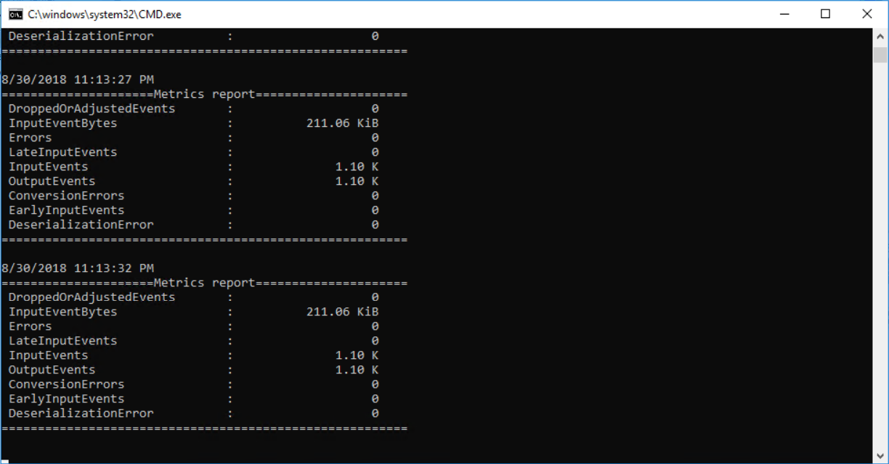
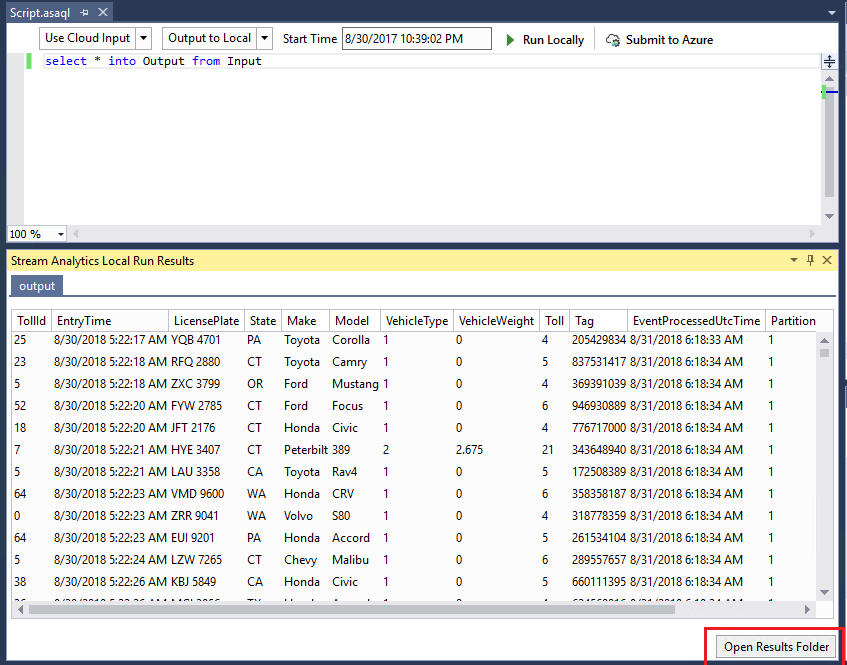

# Test live data locally using Azure Stream Analytics tools for Visual Studio (Preview)

Azure Stream Analytics tools for Visual Studio allows you to test jobs locally from the IDE using live event streams from Azure Event Hub, IoT Hub, and Blob Storage. Live data local testing can't replace the [performance and scalability testing](stream-analytics-streaming-unit-consumption.md) you can perform in the cloud, but you can save time during functional testing by not having to submit to the cloud each time you want to test your Stream Analytics job. This feature is in preview and shouldn't be used for production workloads.

## Testing options

The following local testing options are supported:

|**Input**  |**Output**  |**Job Type**  |
|---------|---------|---------|
|Local static data   |  Local static data   |   Cloud/Edge |
|Live input data   |  Local static data   |   Cloud |
|Live input data   |  Live output data   |   Cloud |

## Local testing with live data

1. After you've created an [Azure Stream Analytics cloud project in Visual Studio](stream-analytics-quick-create-vs.md), open **script.asaql**. The local testing uses local input and local output by default.

   

2. To test live data, choose **Use Cloud Input** from the dropdown box.

   

3. Set the **Start Time** to define when the job will start processing input data. The job might need to read input data ahead of time to ensure accurate results. The default time is set to 30 minutes ahead of the current time.

   

4. Click **Run Locally**. A console window will appear with the running progress and job metrics. If you want to stop the process, you can do so manually. 

   

   The output results are refreshed every three seconds with the first 500 output rows in the local run result window, and the output files are placed in your project path **ASALocalRun** folder. You can also open the output files by clicking **Open Results Folder** button in the local run result window.

   

5. If you want to output the results to your cloud output sinks, choose **Output to Cloud** from the second dropdown box. Power BI and Azure Data Lake Storage are not supported output sinks.

   
 
## Limitations

* Power BI and Azure Data Lake Storage are not supported output sinks due to authentication model limitations.

* Only cloud input options have [time policies](./stream-analytics-time-handling.md) support, while local input options do not.

## Next steps

* [Create a Stream Analytics job by using the Azure Stream Analytics tools for Visual Studio](stream-analytics-quick-create-vs.md)
* [Test Stream Analytics queries locally with Visual Studio](stream-analytics-vs-tools-local-run.md)
* [Use Visual Studio to view Azure Stream Analytics jobs](stream-analytics-vs-tools.md)