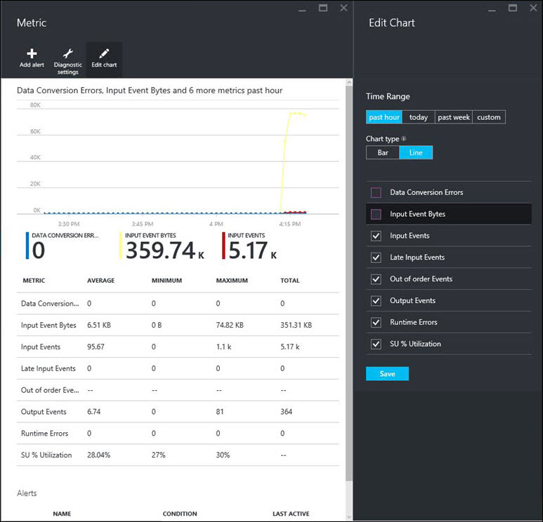

# Understand Stream Analytics job monitoring and how to monitor queries

## Introduction: The monitor page
The Azure portal surfaces key performance metrics that can be used to monitor and troubleshoot your query and job performance. To see these metrics, browse to the Stream Analytics job you are interested in seeing metrics for and view the **Monitoring** section on the Overview page.  

The window will appear as shown:

  

## Metrics available for Stream Analytics
| Metric                 | Definition                               |
| ---------------------- | ---------------------------------------- |
| Backlogged Input Events       | Number of input events that are backlogged. A non-zero value for this metric implies that your job isn't able to keep up with the number of incoming events. If this value is slowly increasing or consistently non-zero, you should scale out your job. You can learn more by visiting [Understand and adjust Streaming Units](stream-analytics-streaming-unit-consumption.md). |
| Data Conversion Errors | Number of output events that could not be converted to the expected output schema. Error policy can be changed to 'Drop' to drop events that encounter this scenario. |
| Early Input Events       | Events whose application timestamp is earlier than their arrival time by more than 5 minutes. |
| Failed Function Requests | Number of failed Azure Machine Learning function calls (if present). |
| Function Events        | Number of events sent to the Azure Machine Learning function (if present). |
| Function Requests      | Number of calls to the Azure Machine Learning function (if present). |
| Input Deserialization Errors       | Number of input events that could not be deserialized.  |
| Input Event Bytes      | Amount of data received by the Stream Analytics job, in bytes. This can be used to validate that events are being sent to the input source. |
| Input Events           | Number of records deserialized from the input events. This count does not include incoming events that result in deserialization errors. The same events can be ingested by Stream Analytics multiple times in scenarios such as internal recoveries and self joins. Therefore it is recommended not to expect Input Events and Output Events metrics to match if your job has a simple 'pass through' query. |
| Input Sources Received       | Number of messages received by the job. For Event Hub, a message is a single EventData. For Blob, a message is a single blob. Please note that Input Sources are counted before deserialization. If there are deserialization errors, input sources can be greater than input events. Otherwise, it can be less than or equal to input events since each message can contain multiple events. |
| Late Input Events      | Events that arrived later than the configured late arrival tolerance window. Learn more about [Azure Stream Analytics event order considerations](stream-analytics-out-of-order-and-late-events.md) . |
| Out-of-Order Events    | Number of events received out of order that were either dropped or given an adjusted timestamp, based on the Event Ordering Policy. This can be impacted by the configuration of the Out of Order Tolerance Window setting. |
| Output Events          | Amount of data sent by the Stream Analytics job to the output target, in number of events. |
| Runtime Errors         | Total number of errors related to query processing (excluding errors found while ingesting events or outputting results) |
| SU % Utilization       | The utilization of the Streaming Unit(s) assigned to a job from the Scale tab of the job. Should this indicator reach 80%, or above, there is high probability that event processing may be delayed or stopped making progress. |
| Watermark Delay       | The maximum watermark delay across all partitions of all outputs in the job. |

You can use these metrics to [monitor the performance of your Stream Analytics job](https://docs.microsoft.com/azure/stream-analytics/stream-analytics-set-up-alerts#scenarios-to-monitor). 

## Customizing Monitoring in the Azure portal
You can adjust the type of chart, metrics shown, and time range in the Edit Chart settings. For details, see [How to Customize Monitoring](../monitoring-and-diagnostics/insights-how-to-customize-monitoring.md).

    

## Latest output
Another interesting data point to monitor your job is the time of the last output, shown in the Overview page.
This time is the application time (i.e. the time using the timestamp from the event data) of the latest output of your job.

## Get help
For further assistance, try our [Azure Stream Analytics forum](https://social.msdn.microsoft.com/Forums/azure/home?forum=AzureStreamAnalytics)

## Next steps
* [Introduction to Azure Stream Analytics](stream-analytics-introduction.md)
* [Get started using Azure Stream Analytics](stream-analytics-real-time-fraud-detection.md)
* [Scale Azure Stream Analytics jobs](stream-analytics-scale-jobs.md)
* [Azure Stream Analytics Query Language Reference](https://docs.microsoft.com/stream-analytics-query/stream-analytics-query-language-reference)
* [Azure Stream Analytics Management REST API Reference](https://msdn.microsoft.com/library/azure/dn835031.aspx)
