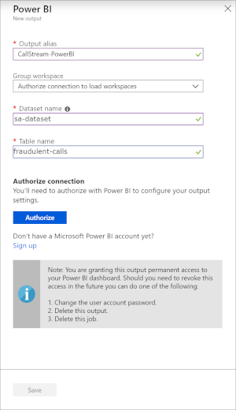
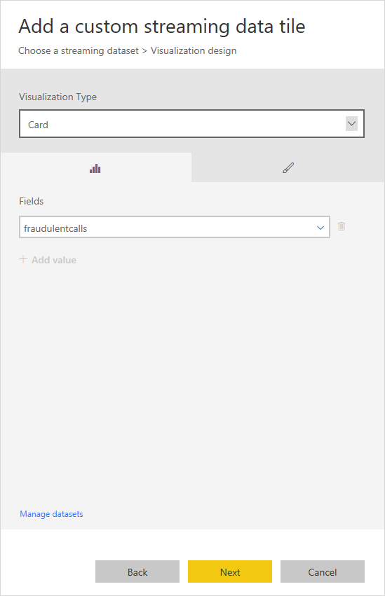
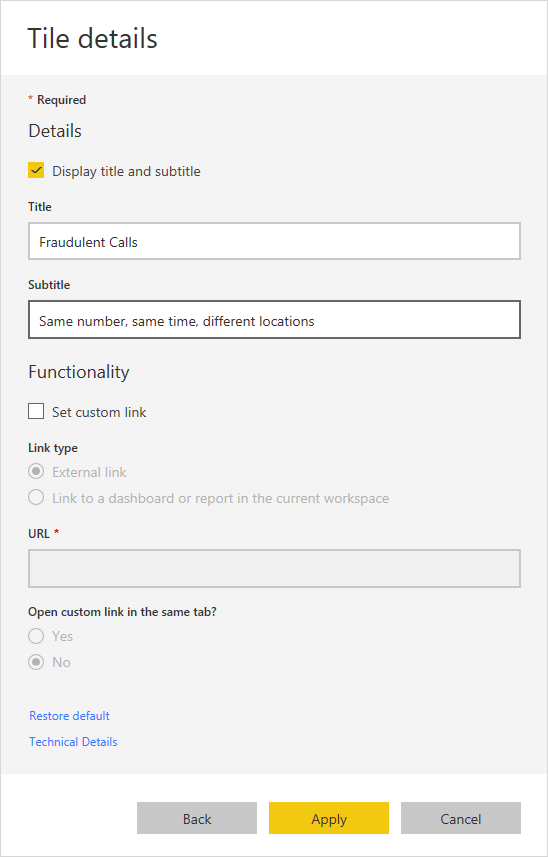
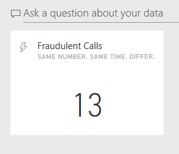
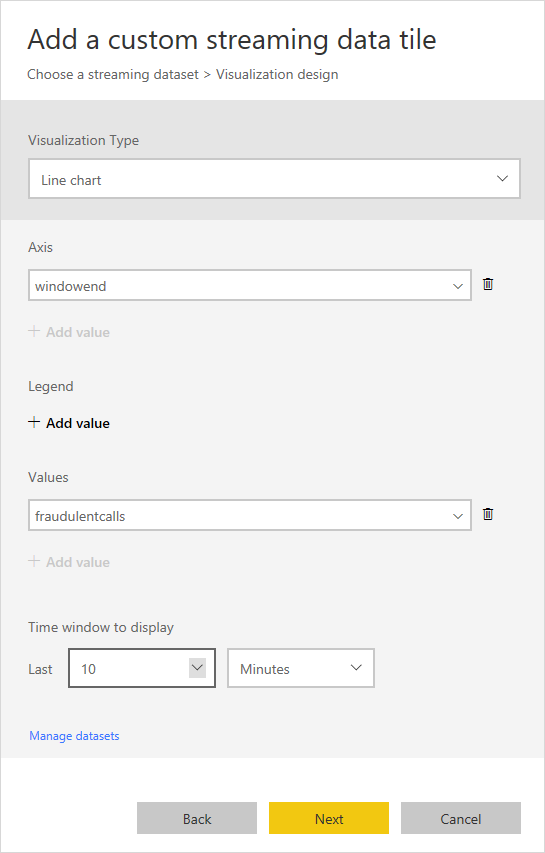
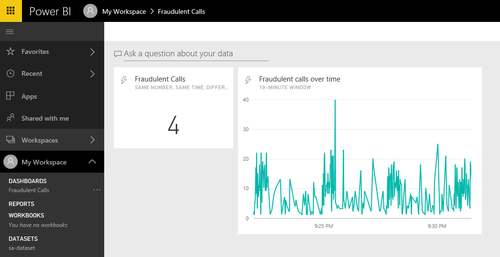

# Stream Analytics and Power BI: A real-time analytics dashboard for streaming data

Azure Stream Analytics enables you to take advantage of one of the leading business intelligence tools, [Microsoft Power BI](https://powerbi.com/). In this article, you learn how create business intelligence tools by using Power BI as an output for your Azure Stream Analytics jobs. You also learn how to create and use a real-time dashboard.

This article continues from the Stream Analytics [real-time fraud detection](stream-analytics-real-time-fraud-detection.md) tutorial. It builds on the workflow created in that tutorial and adds a Power BI output so that you can visualize fraudulent phone calls that are detected by a Streaming Analytics job. 

You can watch [a video](https://www.youtube.com/watch?v=SGUpT-a99MA)  that illustrates this scenario.


## Prerequisites

Before you start, make sure you have the following:

* An Azure account.
* An account for Power BI. You can use a work account or a school account.
* A completed version of the [real-time fraud detection](stream-analytics-real-time-fraud-detection.md) tutorial. The tutorial includes an app that generates fictitious telephone-call metadata. In the tutorial, you create an event hub and send the streaming phone call data to the event hub. You write a query that detects fraudulent calls (calls from the same number at the same time in different locations). 


## Add Power BI output
In the real-time fraud detection tutorial, the output is sent to Azure Blob storage. In this section, you add an output that sends information to Power BI.

1. In the Azure portal, open the Streaming Analytics job that you created earlier. If you used the suggested name, the job is named `sa_frauddetection_job_demo`.

2. On the left menu, select **Outputs** under **Job topology**. Then, select **+ Add** and choose **Power BI** from the dropdown menu.

3. Select **+ Add** > **Power BI**. Then fill the form with the following details and select **Authorize**:

   |**Setting**  |**Suggested value**  |
   |---------|---------|
   |Output alias  |  CallStream-PowerBI  |
   |Dataset name  |   sa-dataset  |
   |Table name |  fraudulent-calls  |

   

   > [!WARNING]
   > If Power BI has a dataset and table that have the same names as the ones that you specify in the Stream Analytics job, the existing ones are overwritten.
   > We recommend that you do not explicitly create this dataset and table in your Power BI account. They are automatically created when you start your Stream Analytics job and the job starts pumping output into Power BI. If your job query doesn't return any results, the dataset and table are not  created.
   >

4. When you select **Authorize**, a pop-up window opens and you are asked to provide credentials to authenticate to your Power BI account. Once the authorization is successful, **Save** the settings.

8. Click **Create**.

The dataset is created with the following settings:

* **defaultRetentionPolicy: BasicFIFO** - Data is FIFO, with a maximum of 200,000 rows.
* **defaultMode: pushStreaming** - The dataset supports both streaming tiles and traditional report-based visuals (also known as push).

Currently, you can't create datasets with other flags.

For more information about Power BI datasets, see the [Power BI REST API](https://msdn.microsoft.com/library/mt203562.aspx) reference.


## Write the query

1. Close the **Outputs** blade and return to the job blade.

2. Click the **Query** box. 

3. Enter the following query. This query is similar to the self-join query you created in the fraud-detection tutorial. The difference is that this query sends results to the new output you created (`CallStream-PowerBI`). 

    >[!NOTE]
    >If you did not name the input `CallStream` in the fraud-detection tutorial, substitute your name for `CallStream` in the **FROM** and **JOIN** clauses in the query.

   ```SQL
   /* Our criteria for fraud:
   Calls made from the same caller to two phone switches in different locations (for example, Australia and Europe) within five seconds */

   SELECT System.Timestamp AS WindowEnd, COUNT(*) AS FraudulentCalls
   INTO "CallStream-PowerBI"
   FROM "CallStream" CS1 TIMESTAMP BY CallRecTime
   JOIN "CallStream" CS2 TIMESTAMP BY CallRecTime

   /* Where the caller is the same, as indicated by IMSI (International Mobile Subscriber Identity) */
   ON CS1.CallingIMSI = CS2.CallingIMSI

   /* ...and date between CS1 and CS2 is between one and five seconds */
   AND DATEDIFF(ss, CS1, CS2) BETWEEN 1 AND 5

   /* Where the switch location is different */
   WHERE CS1.SwitchNum != CS2.SwitchNum
   GROUP BY TumblingWindow(Duration(second, 1))
   ```

4. Click **Save**.


## Test the query

This section is optional, but recommended. 

1. If the TelcoStreaming app is not currently running, start it by following these steps:

    * Open Command Prompt.
    * Go to the folder where the telcogenerator.exe and modified telcodatagen.exe.config files are.
    * Run the following command:

       `telcodatagen.exe 1000 .2 2`

2. On the **Query** page for your Stream Analytics job, click the dots next to the `CallStream` input and then select **Sample data from input**.

3. Specify that you want three minutes' worth of data and click **OK**. Wait until you're notified that the data has been sampled.

4. Click **Test** and review the results.

## Run the job

1. Make sure the TelcoStreaming app is running.

2. Navigate to the **Overview** page for your Stream Analytics job and select **Start**.

    

Your Streaming Analytics job starts looking for fraudulent calls in the incoming stream. The job also creates the dataset and table in Power BI and starts sending data about the fraudulent calls to them.


## Create the dashboard in Power BI

1. Go to [Powerbi.com](https://powerbi.com) and sign in with your work or school account. If the Stream Analytics job query outputs results, you see that your dataset is already created:

    

2. In your workspace, click **+&nbsp;Create**.

    

3. Create a new dashboard and name it `Fraudulent Calls`.

    

4. At the top of the window, click **Add tile**, select **CUSTOM STREAMING DATA**, and then click **Next**.

    

5. Under **YOUR DATSETS**, select your dataset and then click **Next**.

    

6. Under **Visualization Type**, select **Card**, and then in the **Fields** list, select **fraudulentcalls**.

    

7. Click **Next**.

8. Fill in tile details like a title and subtitle.

    

9. Click **Apply**.

    Now you have a fraud counter!

    

8. Follow the steps again to add a tile (starting with step 4). This time, do the following:

    * When you get to **Visualization Type**, select **Line chart**. 
    * Add an axis and select **windowend**. 
    * Add a value and select **fraudulentcalls**.
    * For **Time window to display**, select the last 10 minutes.

      

9. Click **Next**, add a title and subtitle, and click **Apply**.

     The Power BI dashboard now gives you two views of data about fraudulent calls as detected in the streaming data.

     


## Learn more about Power BI

This tutorial demonstrates how to create only a few kinds of visualizations for a dataset. Power BI can help you create other customer business intelligence tools for your organization. For more ideas, see the following resources:

* For another example of a Power BI dashboard, watch the [Getting Started with Power BI](https://youtu.be/L-Z_6P56aas?t=1m58s) video.
* For more information about configuring Streaming Analytics job output to Power BI and using Power BI groups, review the [Power BI](stream-analytics-define-outputs.md#power-bi) section of the [Stream Analytics outputs](stream-analytics-define-outputs.md) article. 
* For information about using Power BI generally, see [Dashboards in Power BI](https://powerbi.microsoft.com/documentation/powerbi-service-dashboards/).


## Learn about limitations and best practices
Currently, Power BI can be called roughly once per second. Streaming visuals support packets of 15 KB. Beyond that, streaming visuals fail (but push continues to work). Because of these limitations, Power BI lends itself most naturally to cases where Azure Stream Analytics does a significant data load reduction. We recommend using a Tumbling window or Hopping window to ensure that data push is at most one push per second, and that your query lands within the throughput requirements.

You can use the following equation to compute the value to give your window in seconds:

  

For example:

* You have 1,000 devices sending data at one-second intervals.
* You are using the Power BI Pro SKU that supports 1,000,000 rows per hour.
* You want to publish the amount of average data per device to Power BI.

As a result, the equation becomes:

  

Given this configuration, you can change the original query to the following:

```SQL
    SELECT
        MAX(hmdt) AS hmdt,
        MAX(temp) AS temp,
        System.TimeStamp AS time,
        dspl
    INTO "CallStream-PowerBI"
    FROM
        Input TIMESTAMP BY time
    GROUP BY
        TUMBLINGWINDOW(ss,4),
        dspl
```

### Renew authorization
If the password has changed since your job was created or last authenticated, you need to reauthenticate your Power BI account. If Azure Multi-Factor Authentication is configured on your Azure Active Directory (Azure AD) tenant, you also need to renew Power BI authorization every two weeks. If you don't renew, you could see symptoms such as a lack of job output or an `Authenticate user error` in the operation logs.

Similarly, if a job starts after the token has expired, an error occurs and the job fails. To resolve this issue, stop the job that's running and go to your Power BI output. To avoid data loss, select the **Renew authorization** link, and then restart your job from the **Last Stopped Time**.

After the authorization has been refreshed with Power BI, a green alert appears in the authorization area to reflect that the issue has been resolved.

## Get help
For further assistance, try our [Azure Stream Analytics forum](https://social.msdn.microsoft.com/Forums/azure/home?forum=AzureStreamAnalytics).

## Next steps
* [Introduction to Azure Stream Analytics](stream-analytics-introduction.md)
* [Get started using Azure Stream Analytics](stream-analytics-real-time-fraud-detection.md)
* [Scale Azure Stream Analytics jobs](stream-analytics-scale-jobs.md)
* [Azure Stream Analytics query language reference](https://msdn.microsoft.com/library/azure/dn834998.aspx)
* [Azure Stream Analytics Management REST API reference](https://msdn.microsoft.com/library/azure/dn835031.aspx)
