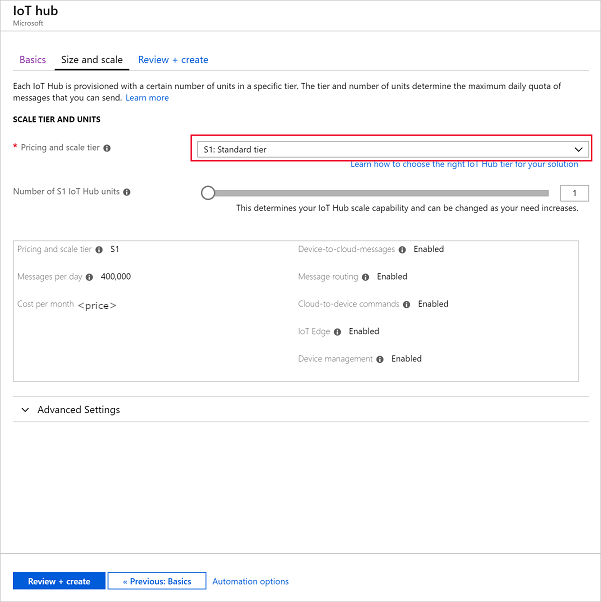
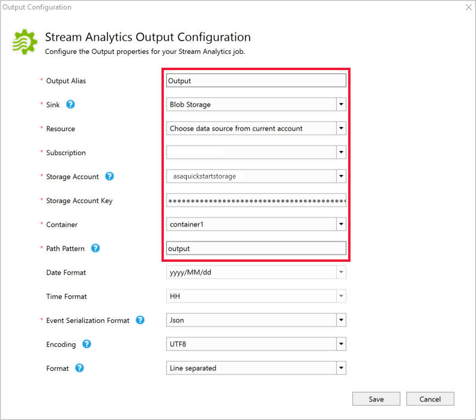

# Quickstart: Create an Azure Stream Analytics job by using Visual Studio

This quickstart shows you how to create and run a Stream Analytics job using Azure Stream Analytics tools for Visual Studio. The example job reads streaming data from an IoT Hub device. You define a job that calculates the average temperature when over 27° and writes the resulting output events to a new file in blob storage.

## Before you begin

* If you don't have an Azure subscription, create a [free account](https://azure.microsoft.com/free/).

* Sign in to the [Azure portal](https://portal.azure.com/).

* Install Visual Studio 2019, Visual Studio 2015, or Visual Studio 2013 Update 4. Enterprise (Ultimate/Premium), Professional, and Community editions are supported. Express edition is not supported.

* Follow the  [installation instructions](https://docs.microsoft.com/azure/stream-analytics/stream-analytics-tools-for-visual-studio-install) to install Stream Analytics tools for Visual Studio.

## Prepare the input data

Before defining the Stream Analytics job, you should prepare the data, which is later configured as the job input. To prepare the input data required by the job, complete the following steps:

1. Sign in to the [Azure portal](https://portal.azure.com/).

2. Select **Create a resource** > **Internet of Things** > **IoT Hub**.

3. In the **IoT Hub** pane, enter the following information:
   
   |**Setting**  |**Suggested value**  |**Description**  |
   |---------|---------|---------|
   |Subscription  | \<Your subscription\> |  Select the Azure subscription that you want to use. |
   |Resource group   |   asaquickstart-resourcegroup  |   Select **Create New** and enter a new resource-group name for your account. |
   |Region  |  \<Select the region that is closest to your users\> | Select a geographic location where you can host your IoT Hub. Use the location that's closest to your users. |
   |IoT Hub Name  | MyASAIoTHub  |   Select a name for your IoT Hub.   |

   

4. Select **Next: Set size and scale**.

5. Choose your **Pricing and scale tier**. For this quickstart, select the **F1 - Free** tier if it's still available on your subscription. If the free tier is unavailable, choose the lowest tier available. For more information, see [IoT Hub pricing](https://azure.microsoft.com/pricing/details/iot-hub/).

   

6. Select **Review + create**. Review your IoT Hub information and click **Create**. Your IoT Hub might take a few minutes to create. You can monitor the progress in the **Notifications** pane.

7. In your IoT Hub navigation menu, click **Add** under **IoT devices**. Add a **Device ID** and click **Save**.

   

8. Once the device is created, open the device from the **IoT devices** list. Copy the **Connection string -- primary key** and save it to a notepad to use later.

   

## Create blob storage

1. From the upper left-hand corner of the Azure portal, select **Create a resource** > **Storage** > **Storage account**.

2. In the **Create storage account** pane, enter a storage account name, location, and resource group. Choose the same location and resource group as the IoT Hub you created. Then click **Review + create** to create the account.

   

3. Once your storage account is created, select the **Blobs** tile on the **Overview** pane.

   

4. From the **Blob Service** page, select **Container** and provide a name for your container, such as *container1*. Leave the **Public access level** as **Private (no anonymous access)** and select **OK**.

   

## Create a Stream Analytics project

1. Start Visual Studio.

2. Select **File > New Project**.  

3. In the templates list on the left, select **Stream Analytics**, and then select **Azure Stream Analytics Application**.  

4. Input the project **Name**, **Location**, and **Solution name**, and select **OK**.

   

Notice the elements that are included in an Azure Stream Analytics project.

   


## Choose the required subscription

1. In Visual Studio, on the **View** menu, select **Server Explorer**.

2. Right click on **Azure**, select **Connect to Microsoft Azure Subscription**, and then sign in with your Azure account.

## Define input

1. In **Solution Explorer**, expand the **Inputs** node and double-click **Input.json**.

2. Fill out the **Stream Analytics Input Configuration** with the following values:

   |**Setting**  |**Suggested value**  |**Description**   |
   |---------|---------|---------|
   |Input Alias  |  Input   |  Enter a name to identify the job’s input.   |
   |Source Type   |  Data Stream |  Choose the appropriate input source: Data Stream or Reference Data.   |
   |Source  |  IoT Hub |  Choose the appropriate input source.   |
   |Resource  | Choose data source from current account | Choose to enter data manually or select an existing account.   |
   |Subscription  |  \<Your subscription\>   | Select the Azure subscription that has the IoT Hub you created.   |
   |IoT Hub  |  MyASAIoTHub   |  Choose or enter the name of your IoT Hub. IoT Hub names are automatically detected if they are created in the same subscription.   |
   
3. Leave other options to default values and select **Save** to save the settings.  

   

## Define output

1. In **Solution Explorer**, expand the **Outputs** node and double-click **Output.json**.

2. Fill out the **Stream Analytics Output Configuration** with the following values:

   |**Setting**  |**Suggested value**  |**Description**   |
   |---------|---------|---------|
   |Output Alias  |  Output   |  Enter a name to identify the job’s output.   |
   |Sink   |  Blob Storage |  Choose the appropriate sink.    |
   |Resource  |  Provide data source settings manually |  Choose to enter data manually or select an existing account.   |
   |Subscription  |  \<Your subscription\>   | Select the Azure subscription that has the storage account you created. The storage account can be in the same or in a different subscription. This example assumes that you have created storage account in the same subscription.   |
   |Storage Account  |  asaquickstartstorage   |  Choose or enter the name of the storage account. Storage account names are automatically detected if they are created in the same subscription.   |
   |Container  |  container1   |  Select the existing container that you created in your storage account.   |
   |Path Pattern  |  output   |  Enter the name of a file path to be created within the container.   |
   
3. Leave other options to default values and select **Save** to save the settings.  

   

## Define the transformation query

1. Open **Script.asaql** from **Solution Explorer** in Visual Studio.

2. Add the following query:

   ```sql
   SELECT *
   INTO BlobOutput
   FROM IoTHubInput
   HAVING Temperature > 27
   ```

## Submit a Stream Analytics query to Azure

1. In the **Query Editor**, select **Submit To Azure** in the script editor.

2. Select **Create a New Azure Stream Analytics job** and enter a **Job Name**. Choose the **Subscription**, **Resource Group**, and **Location** you used at the beginning of the Quickstart.

   

## Run the IoT simulator

1. Open the [Raspberry Pi Azure IoT Online Simulator](https://azure-samples.github.io/raspberry-pi-web-simulator/) in a new browser tab or window.

2. Replace the placeholder in Line 15 with the Azure IoT Hub device connection string you saved in a previous section.

3. Click **Run**. The output should show the sensor data and messages that are being sent to your IoT Hub.

   

## Start the Stream Analytics job and check output

1. When your job is created, the job view opens automatically. Select the green arrow button to start the job,

   

2. Change the **Job output start mode** to **JobStartTime** and select **Start**.

   

3. Note the job status has changed to **Running**, and there are input/output events. This may take a few minutes.

   

4. To view results, on the **View** menu, select **Cloud Explorer**, and navigate to the storage account in your resource group. Under **Blob Containers**, double-click **container1**, and then the **output** file path.

   

## Clean up resources

When no longer needed, delete the resource group, the streaming job, and all related resources. Deleting the job avoids billing the streaming units consumed by the job. If you're planning to use the job in future, you can stop it and restart it later when you need. If you are not going to continue to use this job, delete all resources created by this quickstart by using the following steps:

1. From the left-hand menu in the Azure portal, select **Resource groups** and then select the name of the resource you created.  

2. On your resource group page, select **Delete**, type the name of the resource to delete in the text box, and then select **Delete**.

## Next steps

In this quickstart, you deployed a simple Stream Analytics job using Visual Studio. You can also deploy Stream Analytics jobs using the [Azure portal](stream-analytics-quick-create-portal.md) and [PowerShell](stream-analytics-quick-create-powershell.md). 

To learn about Azure Stream Analytics tools for Visual Studio, continue to the following article:

> [!div class="nextstepaction"]
> [Use Visual Studio to view Azure Stream Analytics jobs](stream-analytics-vs-tools.md)
