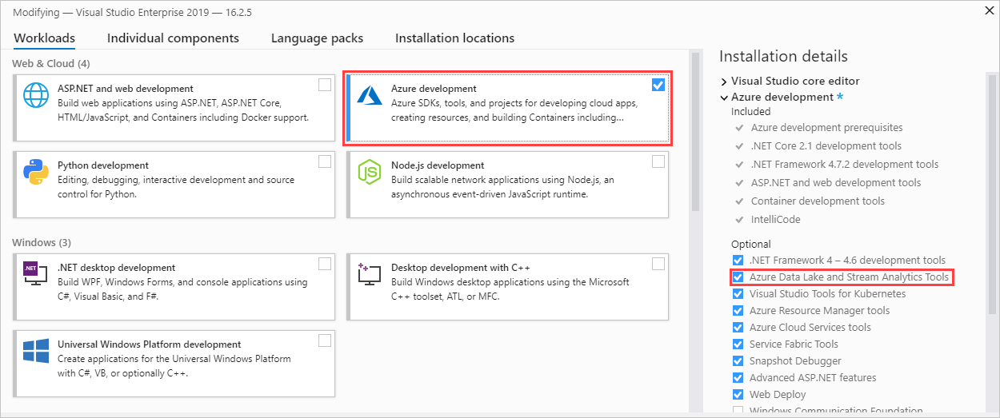

# Install Azure Stream Analytics tools for Visual Studio

Visual Studio 2019 and Visual Studio 2017 support Azure Data Lake and Stream Analytics Tools. This article describes how to install and uninstall the tools.

For more information on using the tools, see [Quickstart: Create an Azure Stream Analytics job by using Visual Studio](stream-analytics-quick-create-vs.md).

## Install

Visual Studio Enterprise (Ultimate/Premium), Professional, and Community editions support the tools. Express edition and Visual Studio for Mac don't support them.

We recommend Visual Studio 2019.

### Install for Visual Studio 2019 and 2017

Azure Data Lake and Stream Analytics Tools are part of the **Azure development** and **Data storage and processing** workloads. Enable either one of these two workloads during installation. If Visual Studio is already installed, select **Tools** > **Get Tools and Features** to add workloads.

Download [Visual Studio 2019 (Preview 2 or above) or Visual Studio 2017 (15.3 or above)](https://www.visualstudio.com/) and follow instructions to install.

Select the **Data storage and processing** workload as shown:

Select the **Azure development** workload as shown:

After you add the workload, update the tools. This procedure refers to Visual Studio 2019:

1. Select **Extensions** > **Manage Extensions**.

1. In **Manage Extensions**, select **Updates** and choose **Azure Data Lake and Stream Analytics Tools**.

1. Select **Update** to install the latest extension.

### Install for Visual Studio 2015 and 2013

Visual Studio Enterprise (Ultimate/Premium), Professional, and Community editions support the tools. Express edition doesn't support them.

* Install Visual Studio 2015 or Visual Studio 2013 Update 4.
* Install the Microsoft Azure SDK for .NET version 2.7.1 or above by using the [Web platform installer](https://www.microsoft.com/web/downloads/platform.aspx).
* Install [Microsoft Azure Data Lake and Stream Analytics Tools for Visual Studio](https://www.microsoft.com/en-us/download/details.aspx?id=49504).

## Update

For Visual Studio 2019 and Visual Studio 2017, a new version reminder shows up as a Visual Studio notification.

For Visual Studio 2015 and Visual Studio 2013, the tools check for new versions automatically. Follow the instructions to install the latest version.

## Uninstall

You can uninstall Azure Data Lake and Stream Analytics Tools. For Visual Studio 2019 or Visual Studio 2017, select **Tools** > **Get Tools and Features**. In **Modifying**, unselect **Azure Data Lake and Stream Analytics Tools**. It appears under either the **Data storage and processing** workload or the **Azure development** workload.

To uninstall from Visual Studio 2015 or Visual Studio 2013, go to **Control Panel** > **Programs and Features**. Uninstall **Microsoft Azure Data Lake and Stream Analytics Tools for Visual Studio**.
