# Real-time Twitter sentiment analysis in Azure Stream Analytics

Learn how to build a sentiment analysis solution for social media analytics by bringing real-time Twitter events into Azure Event Hubs. Then write an Azure Stream Analytics query to analyze the data and store the results for later use or create a [Power BI](https://powerbi.com/) dashboard to provide insights in real time.

Social media analytics tools help organizations understand trending topics. Trending topics are subjects and attitudes that have a high volume of posts on social media. Sentiment analysis, which is also called *opinion mining*, uses social media analytics tools to determine attitudes toward a product or idea. 

Real-time Twitter trend analysis is a great example of an analytics tool because the hashtag subscription model enables you to listen to specific keywords (hashtags) and develop sentiment analysis of the feed.

## Scenario: Social media sentiment analysis in real time

A company that has a news media website is interested in gaining an advantage over its competitors by featuring site content that is immediately relevant to its readers. The company uses social media analysis on topics that are relevant to readers by doing real-time sentiment analysis of Twitter data.

To identify trending topics in real time on Twitter, the company needs real-time analytics about the tweet volume and sentiment for key topics.

## Prerequisites
In this how-to guide, you use a client application that connects to Twitter and looks for tweets that have certain hashtags (which you can set). To run the application and analyze the tweets using Azure Streaming Analytics, you must have the following:

* If you don't have an Azure subscription, create a [free account](https://azure.microsoft.com/free/).
* A [Twitter](https://twitter.com) account.
* The TwitterWPFClient application, which reads the Twitter feed. To get this application, download the [TwitterWPFClient.zip](https://github.com/Azure/azure-stream-analytics/blob/master/Samples/TwitterClient/TwitterWPFClient.zip) file from GitHub and then unzip the package into a folder on your computer. If you want to see the source code and run the application in a debugger, you can get the source code from [GitHub](https://github.com/Azure/azure-stream-analytics/tree/master/Samples/TwitterClient). 

## Create an event hub for Streaming Analytics input

The sample application generates events and pushes them to an Azure event hub. Azure event hubs are the preferred method of event ingestion for Stream Analytics. For more information, see the [Azure Event Hubs documentation](../event-hubs/event-hubs-what-is-event-hubs.md).

### Create an event hub namespace and event hub
Create an event hub namespace, and then add an event hub to that namespace. Event hub namespaces are used to logically group related event bus instances. 

1. Log  in to the Azure portal and click **Create a resource** > **Internet of Things** > **Event Hub**. 

2. In the **Create namespace** blade, enter a namespace name such as `<yourname>-socialtwitter-eh-ns`. You can use any name for the namespace, but the name must be valid for a URL and it must be unique across Azure. 
    
3. Select a subscription and create or choose a resource group, then click **Create**. 

    
 
4. When the namespace has finished deploying, find the event hub namespace in your list of Azure resources. 

5. Click the new namespace, and in the namespace blade, click **+&nbsp;Event Hub**. 

        
 
6. Name the new event hub `socialtwitter-eh`. You can use a different name. If you do, make a note of it, because you need the name later. You don't need to set any other options for the event hub.

    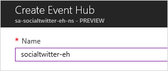
 
7. Click **Create**.


### Grant access to the event hub

Before a process can send data to an event hub, the event hub must have a policy that allows appropriate access. The access policy produces a connection string that includes authorization information.

1.	In the event namespace blade, click **Event Hubs** and then click the name of your new event hub.

2.	In the event hub blade, click **Shared access policies** and then click **+&nbsp;Add**.

    >[!NOTE]
    >Make sure you're working with the event hub, not the event hub namespace.

3.	Add a policy named `socialtwitter-access` and for **Claim**, select **Manage**.

    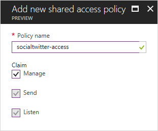
 
4.	Click **Create**.

5.	After the policy has been deployed, click it in the list of shared access policies.

6.	Find the box labeled **CONNECTION STRING-PRIMARY KEY** and click the copy button next to the connection string. 
    
    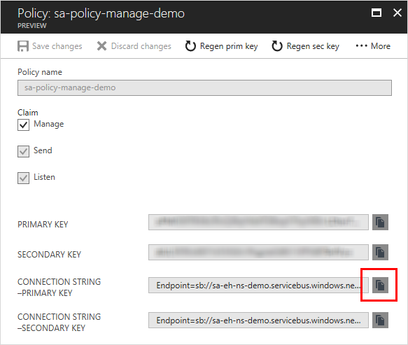
 
7.	Paste the connection string into a text editor. You need this connection string for the next section, after you make some small edits to it.

    The connection string looks like this:

        Endpoint=sb://YOURNAME-socialtwitter-eh-ns.servicebus.windows.net/;SharedAccessKeyName=socialtwitter-access;SharedAccessKey=Gw2NFZw6r...FxKbXaC2op6a0ZsPkI=;EntityPath=socialtwitter-eh

    Notice that the connection string contains multiple key-value pairs, separated with semicolons: `Endpoint`, `SharedAccessKeyName`, `SharedAccessKey`, and `EntityPath`.  

    > [!NOTE]
    > For security, parts of the connection string in the example have been removed.

8.  In the text editor, remove the `EntityPath` pair from the connection string (don't forget to remove the semicolon that precedes it). When you're done, the connection string looks like this:

        Endpoint=sb://YOURNAME-socialtwitter-eh-ns.servicebus.windows.net/;SharedAccessKeyName=socialtwitter-access;SharedAccessKey=Gw2NFZw6r...FxKbXaC2op6a0ZsPkI=


## Configure and start the Twitter client application
The client application gets tweet events directly from Twitter. In order to do so, it needs permission to call the Twitter Streaming APIs. To configure that permission, you create an application in Twitter, which generates unique credentials (such as an OAuth token). You can then configure the client application to use these credentials when it makes API calls. 

### Create a Twitter application
If you do not already have a Twitter application that you can use for this how-to guide, you can create one. You must already have a Twitter account.

> [!NOTE]
> The exact process in Twitter for creating an application and getting the keys, secrets, and token might change. If these instructions don't match what you see on the Twitter site, refer to the Twitter developer documentation.

1. From a web browser, go to [Twitter For Developers](https://developer.twitter.com/en/apps), and select **Create an app**. You might see a message saying that you need to apply for a Twitter developer account. Feel free to do so, and after your application has been approved you should see a confirmation email. It could take several days to be approved for a developer account.

   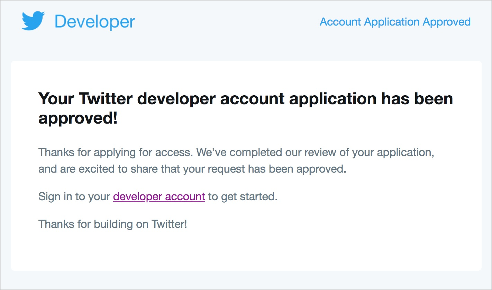

   

2. In the **Create an application** page, provide the details for the new app, and then select **Create your Twitter application**.

   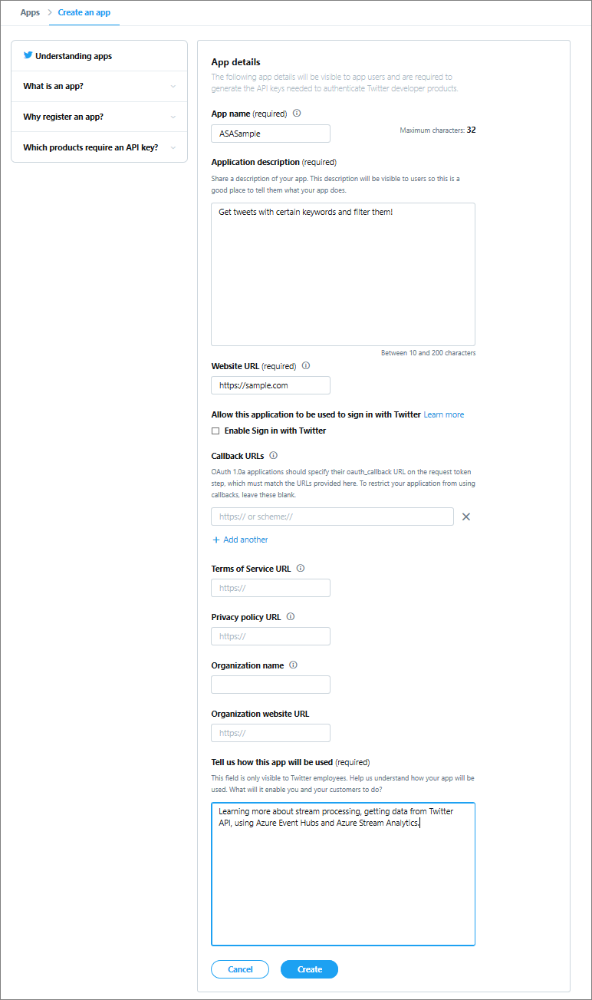

3. In the application page, select the **Keys and Tokens** tab and copy the values for **Consumer API Key** and **Consumer API Secret Key**. Also, select **Create** under **Access Token and Access Token Secret** to generate the access tokens. Copy the values for **Access Token** and **Access Token Secret**.

    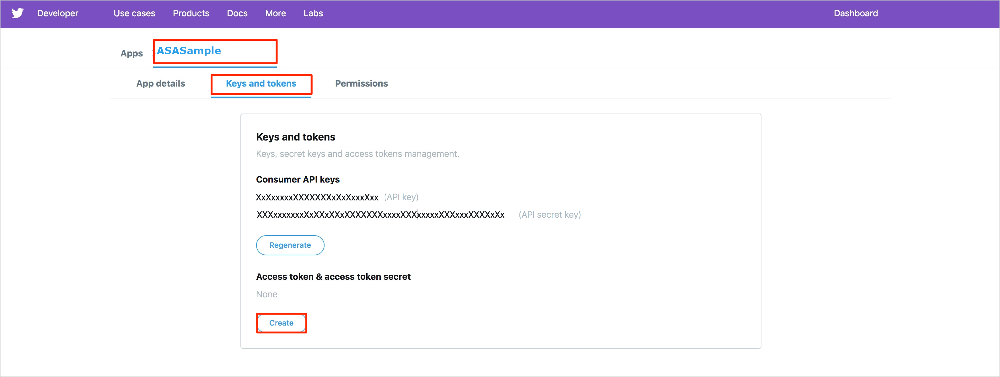

Save the values that you retrieved for the Twitter application. You need the values later in the how-to.

>[!NOTE]
>The keys and secrets for the Twitter application provide access to your Twitter account. Treat this information as sensitive, the same as you do your Twitter password. For example, don't embed this information in an application that you give to others. 


### Configure the client application
We've created a client application that connects to Twitter data using [Twitter's Streaming APIs](https://dev.twitter.com/streaming/overview) to collect tweet events about a specific set of topics. The application uses the [Sentiment140](http://help.sentiment140.com/) open source tool, which assigns the following sentiment value to each tweet:

* 0 = negative
* 2 = neutral
* 4 = positive

After the tweet events have been assigned a sentiment value, they are pushed to the event hub that you created earlier.

Before the application runs, it requires certain information from you, like the Twitter keys and the event hub connection string. You can provide the configuration information in these ways:

* Run the application, and then use the application's UI to enter the keys, secrets, and connection string. If you do this, the configuration information is used for your current session, but it isn't saved.
* Edit the application's .config file and set the values there. This approach persists the configuration information, but it also means that this potentially sensitive information is stored in plain text on your computer.

The following procedure documents both approaches. 

1. Make sure you've downloaded and unzipped the [TwitterWPFClient.zip](https://github.com/Azure/azure-stream-analytics/blob/master/Samples/TwitterClient/TwitterWPFClient.zip) application, as listed in the prerequisites.

2. To set the values at run time (and only for the current session), run the `TwitterWPFClient.exe` application. When the application prompts you, enter the following values:

    * The Twitter Consumer Key (API Key).
    * The Twitter Consumer Secret (API Secret).
    * The Twitter Access Token.
    * The Twitter Access Token Secret.
    * The connection string information that you saved earlier. Make sure that you use the connection string that you removed the `EntityPath` key-value pair from.
    * The Twitter keywords that you want to determine sentiment for.

   

3. To set the values persistently, use a text editor to open the TwitterWpfClient.exe.config file. Then in the `<appSettings>` element, do this:

   * Set `oauth_consumer_key` to the Twitter Consumer Key (API Key). 
   * Set `oauth_consumer_secret` to the Twitter Consumer Secret (API Secret).
   * Set `oauth_token` to the Twitter Access Token.
   * Set `oauth_token_secret` to the Twitter Access Token Secret.

     Later in the `<appSettings>` element, make these changes:

   * Set `EventHubName` to the event hub name (that is, to the value of the entity path).
   * Set `EventHubNameConnectionString` to the connection string. Make sure that you use the connection string that you removed the `EntityPath` key-value pair from.

     The `<appSettings>` section looks like the following example. (For clarity and security, we wrapped some lines and removed some characters.)

     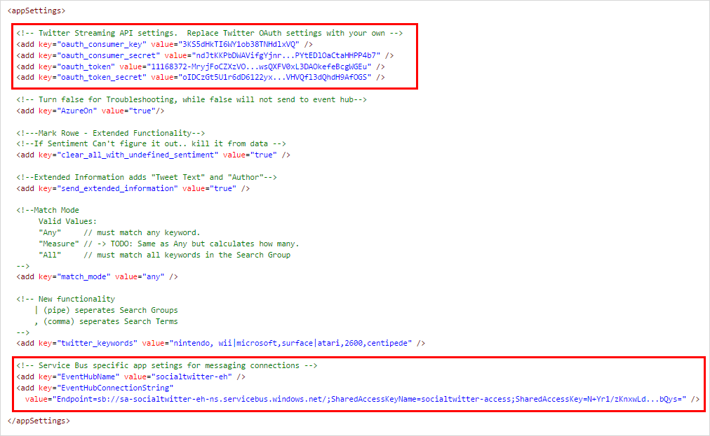
 
4. If you didn't already start the application, run TwitterWpfClient.exe now. 

5. Click the green start button to collect social sentiment. You see Tweet events with the **CreatedAt**, **Topic**, and **SentimentScore** values being sent to your event hub.

    

    >[!NOTE]
    >If you see errors, and you don't see a stream of tweets displayed in the lower part of the window, double-check the keys and secrets. Also check the connection string (make sure that it does not include the `EntityPath` key and value.)


## Create a Stream Analytics job

Now that tweet events are streaming in real time from Twitter, you can set up a Stream Analytics job to analyze these events in real time.

1. In the Azure portal, click **Create a resource** > **Internet of Things** > **Stream Analytics job**.

2. Name the job `socialtwitter-sa-job` and specify a subscription, resource group, and location.

    It's a good idea to place the job and the event hub in the same region for best performance and so that you don't pay to transfer data between regions.

    

3. Click **Create**.

    The job is created and the portal displays job details.


## Specify the job input

1. In your Stream Analytics job, under **Job Topology** in the middle of the job blade, click **Inputs**. 

2. In the **Inputs** blade, click **+&nbsp;Add** and then fill out the blade with these values:

   * **Input alias**: Use the name `TwitterStream`. If you use a different name, make a note of it because you need it later.
   * **Source type**: Select **Data stream**.
   * **Source**: Select **Event hub**.
   * **Import option**: Select **Use event hub from current subscription**. 
   * **Service bus namespace**: Select the event hub namespace that you created earlier (`<yourname>-socialtwitter-eh-ns`).
   * **Event hub**: Select the event hub that you created earlier (`socialtwitter-eh`).
   * **Event hub policy name**: Select the access policy that you created earlier (`socialtwitter-access`).

     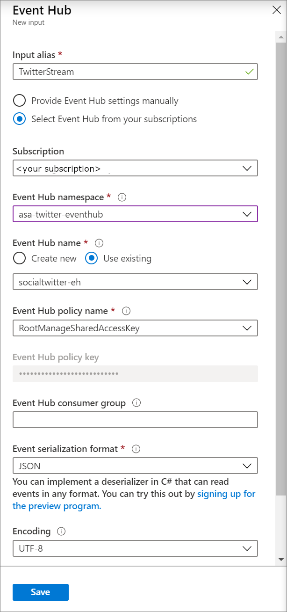

3. Click **Create**.


## Specify the job query

Stream Analytics supports a simple, declarative query model that describes transformations. To learn more about the language, see the [Azure Stream Analytics Query Language Reference](https://docs.microsoft.com/stream-analytics-query/stream-analytics-query-language-reference).  This how-to guide helps you author and test several queries over Twitter data.

To compare the number of mentions among topics, you can use a [Tumbling window](https://docs.microsoft.com/stream-analytics-query/tumbling-window-azure-stream-analytics) to get the count of mentions by topic every five seconds.

1. Close the **Inputs** blade if you haven't already.

2. In the **Overview** blade, click **Edit Query** near the top right of the Query box. Azure lists the inputs and outputs that are configured for the job, and lets you create a query that lets you transform the input stream as it is sent to the output.

3. Make sure that the TwitterWpfClient application is running. 

3. In the **Query** blade, click the dots next to the `TwitterStream` input and then select **Sample data from input**.

    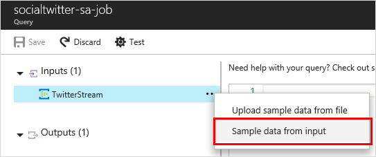

    This opens a blade that lets you specify how much sample data to get, defined in terms of how long to read the input stream.

4. Set **Minutes** to 3 and then click **OK**. 
    
    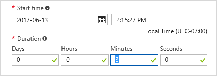

    Azure samples 3 minutes' worth of data from the input stream and notifies you when the sample data is ready. (This takes a short while.) 

    The sample data is stored temporarily and is available while you have the query window open. If you close the query window, the sample data is discarded, and you have to create a new set of sample data. 

5. Change the query in the code editor to the following:

    ```
    SELECT System.Timestamp as Time, Topic, COUNT(*)
    FROM TwitterStream TIMESTAMP BY CreatedAt
    GROUP BY TUMBLINGWINDOW(s, 5), Topic
    ```

    If didn't use `TwitterStream` as the alias for the input, substitute your alias for `TwitterStream` in the query.  

    This query uses the **TIMESTAMP BY** keyword to specify a timestamp field in the payload to be used in the temporal computation. If this field isn't specified, the windowing operation is performed by using the time that each event arrived at the event hub. Learn more in the "Arrival Time vs Application Time" section of [Stream Analytics Query Reference](https://docs.microsoft.com/stream-analytics-query/stream-analytics-query-language-reference).

    This query also accesses a timestamp for the end of each window by using the **System.Timestamp** property.

5. Click **Test**. The query runs against the data that you sampled.
    
6. Click **Save**. This saves the query as part of the Streaming Analytics job. (It doesn't save the sample data.)


## Experiment using different fields from the stream 

The following table lists the fields that are part of the JSON streaming data. Feel free to experiment in the query editor.

|JSON property | Definition|
|--- | ---|
|CreatedAt | The time that the tweet was created|
|Topic | The topic that matches the specified keyword|
|SentimentScore | The sentiment score from Sentiment140|
|Author | The Twitter handle that sent the tweet|
|Text | The full body of the tweet|


## Create an output sink

You have now defined an event stream, an event hub input to ingest events, and a query to perform a transformation over the stream. The last step is to define an output sink for the job.  

In this how-to guide, you write the aggregated tweet events from the job query to Azure Blob storage.  You can also push your results to Azure SQL Database, Azure Table storage, Event Hubs, or Power BI, depending on your application needs.

## Specify the job output

1. In the **Job Topology** section, click the **Output** box. 

2. In the **Outputs** blade, click **+&nbsp;Add** and then fill out the blade with these values:

   * **Output alias**: Use the name `TwitterStream-Output`. 
   * **Sink**: Select **Blob storage**.
   * **Import options**: Select **Use blob storage from current subscription**.
   * **Storage account**. Select **Create a new storage account.**
   * **Storage account** (second box). Enter `YOURNAMEsa`, where `YOURNAME` is your name or another unique string. The name can use only lowercase letters and numbers, and it must be unique across Azure. 
   * **Container**. Enter `socialtwitter`.
     The storage account name and container name are used together to provide a URI for the blob storage, like this: 

     `http://YOURNAMEsa.blob.core.windows.net/socialtwitter/...`
    
     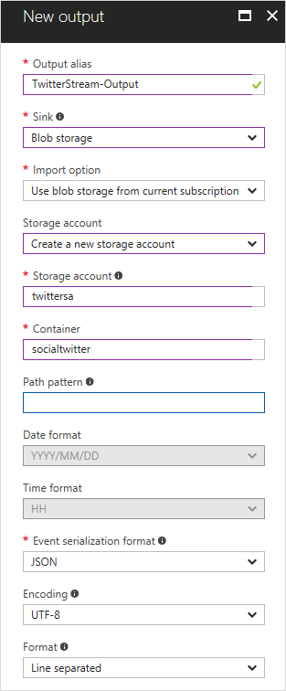
    
4. Click **Create**. 

    Azure creates the storage account and generates a key automatically. 

5. Close the **Outputs** blade. 


## Start the job

A job input, query, and output are specified. You are ready to start the Stream Analytics job.

1. Make sure that the TwitterWpfClient application is running. 

2. In the job blade, click **Start**.

    

3. In the **Start job** blade, for **Job output start time**, select **Now** and then click **Start**. 

    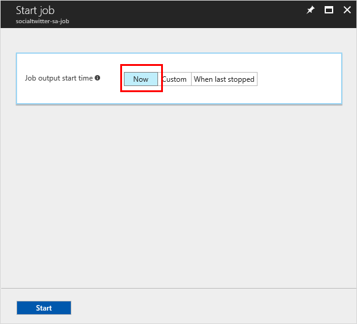

    Azure notifies you when the job has started, and in the job blade, the status is displayed as **Running**.

    

## View output for sentiment analysis

After your job has started running and is processing the real-time Twitter stream, you can view the output for sentiment analysis.

You can use a tool like [Azure Storage Explorer](https://storageexplorer.com/) or [Azure Explorer](https://www.cerebrata.com/products/azure-explorer/introduction) to view your job output in real time. From here, you can use [Power BI](https://powerbi.com/) to extend your application to include a customized dashboard like the one shown in the following screenshot:


## Create another query to identify trending topics

Another query you can use to understand Twitter sentiment is based on a [Sliding Window](https://docs.microsoft.com/stream-analytics-query/sliding-window-azure-stream-analytics). To identify trending topics, you look for topics that cross a threshold value for mentions in a specified amount of time.

For the purposes of this how-to, you check for topics that are mentioned more than 20 times in the last 5 seconds.

1. In the job blade, click **Stop** to stop the job. 

2. In the **Job Topology** section, click the **Query** box. 

3. Change the query to the following:

    ```    
    SELECT System.Timestamp as Time, Topic, COUNT(*) as Mentions
    FROM TwitterStream TIMESTAMP BY CreatedAt
    GROUP BY SLIDINGWINDOW(s, 5), topic
    HAVING COUNT(*) > 20
    ```

4. Click **Save**.

5. Make sure that the TwitterWpfClient application is running. 

6. Click **Start** to restart the job using the new query.


## Get support
For further assistance, try our [Azure Stream Analytics forum](https://social.msdn.microsoft.com/Forums/azure/home?forum=AzureStreamAnalytics).

## Next steps
* [Introduction to Azure Stream Analytics](stream-analytics-introduction.md)
* [Get started using Azure Stream Analytics](stream-analytics-real-time-fraud-detection.md)
* [Scale Azure Stream Analytics jobs](stream-analytics-scale-jobs.md)
* [Azure Stream Analytics Query Language Reference](https://docs.microsoft.com/stream-analytics-query/stream-analytics-query-language-reference)
* [Azure Stream Analytics Management REST API Reference](https://msdn.microsoft.com/library/azure/dn835031.aspx)
