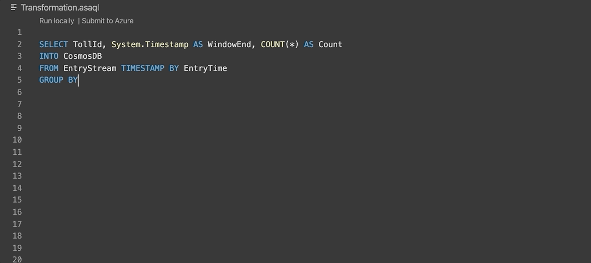
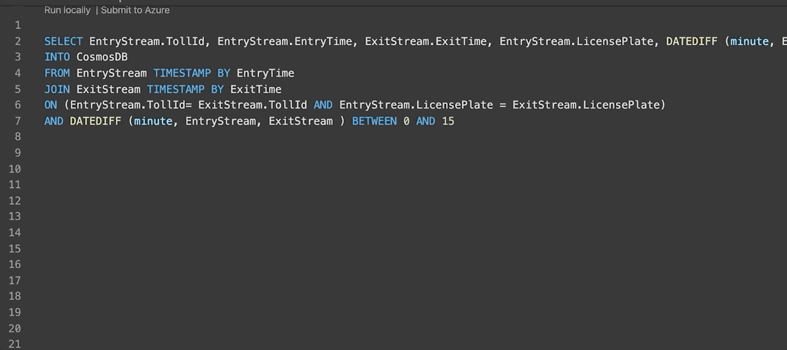

# IntelliSense in Azure Stream Analytics tools for Visual Studio Code

IntelliSense is available for [Stream Analytics Query Language](/stream-analytics-query/stream-analytics-query-language-reference?bc=https%253a%2f%2fdocs.microsoft.com%2fazure%2fbread%2ftoc.json&toc=https%253a%2f%2fdocs.microsoft.com%2fazure%2fstream-analytics%2ftoc.json) in [Azure Stream Analytics tools for VS Code](https://marketplace.visualstudio.com/items?itemName=ms-bigdatatools.vscode-asa&ssr=false#overview). IntelliSense is a code-completion aid that includes a number of features: List Members, Parameter Info, Quick Info, and Complete Word. IntelliSense features are sometimes called by other names such as "code completion", "content assist", and "code hinting".

## IntelliSense features

The IntelliSense features in Stream Analytics tools for VS Code are powered by a language service. A language service analyzes your source code and provides intelligent code completions based on language semantics. If a language service knows possible completions, IntelliSense suggestions pop up as you type. If you continue typing, a list of members, such as variables and methods, is filtered to only include members that contain the characters you typed. When you press the `Tab` or `Enter` keys, IntelliSense inserts the member you selected.

You can trigger IntelliSense in any editor window by typing a trigger character, such as the dot character `.`.

> [!TIP]
> The suggestions widget supports CamelCase filtering. You can type the letters which are uppercased in a method name to limit the suggestions. For example, "cra" will quickly bring up "createApplication".

### Types of completions

Stream Analytics tools for VS Code IntelliSense offers different types of completions, including language server suggestions, snippets, and simple word-based textual completions.

|Completion     |  Type       |
| ----- | ------- |
| Keywords | `keyword`
| Functions | `build-in function`, `user defined function`  |
| Data Set Name| `input`, `output`, `intermediate result set`|
| Data Set Column Name|`input`, `intermediate result set`|

#### Name completion

Aside from keyword auto-completion, Stream Analytics tools for VS Code reads the list of job input and output names, as well as the names of the columns in your data sources when they are configured. The extension remembers this information to provide name completion capabilities that are useful for entering statements with few keystrokes:

While coding, you don't need to leave the editor to perform searches on job input names, output name, and column names. You can keep your context, find the information you need, insert elements directly into your code, and have IntelliSense complete your typing for you.

Note that you need to configure either local input or live input and save the configuration file to be able to use name completion.

### Parameter Info

The IntelliSense **Parameter Info** option opens a parameters list that provides information about the number, names, and types of the parameters that are required by a function. The parameter in bold indicates the next parameter that is required as you type a function.

The parameter list is also displayed for nested functions. If you type a function as a parameter to another function, the parameter list displays the parameters for the inner function. Then, when the inner function parameter list is complete, the parameter list reverts to displaying the outer function parameters.

### Quick Info

As provided by the language service, you can see **Quick Info** for each identifier in your code. Some examples of identifiers are input, output, an intermediate result set, or function. When you move the mouse pointer over an identifier, its declaration is displayed in a pop-up window. The properties and data schemas for inputs, if configured, and intermediate data set are shown.

## Troubleshoot IntelliSense

This issue is caused by missing input configuration which provides data. You can check if a [local input](visual-studio-code-local-run.md#define-a-local-input) or [live input](visual-studio-code-local-run-live-input.md#define-a-live-stream-input) has been configured correctly.

## Next steps

* [Quickstart: Create an Azure Stream Analytics job in Visual Studio Code](quick-create-visual-studio-code.md)
* [Test Stream Analytics queries locally with sample data using Visual Studio Code](visual-studio-code-local-run.md)
* [Test Stream Analytics queries locally against live stream input by using Visual Studio Code](visual-studio-code-local-run-live-input.md)