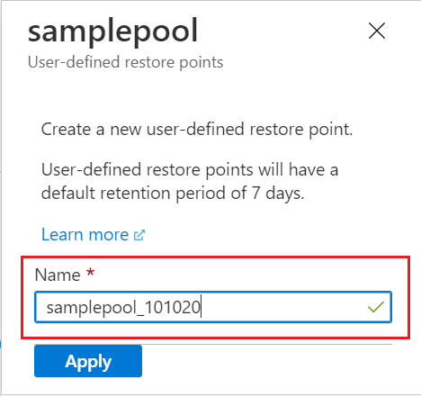

# User-defined restore points

In this article, you'll learn to create a new user-defined restore point for a dedicated SQL pool in Azure Synapse Analytics by using the Azure portal.

## Create user-defined restore points through the Azure portal

User-defined restore points can also be created through Azure portal.

1. Sign in to your [Azure portal](https://portal.azure.com/) account.

2. Navigate to the dedicated SQL pool that you want to create a restore point for.

3. Select **Overview** from the left pane, select **+ New restore point**. If the New Restore Point button isn't enabled, make sure that the dedicated SQL pool isn't paused.

    

4. Specify a name for your user-defined restore point and click **Apply**. User-defined restore points have a default retention period of seven days.

    

## Next steps

- [Restore an existing dedicated SQL pool](restore-sql-pool.md)

