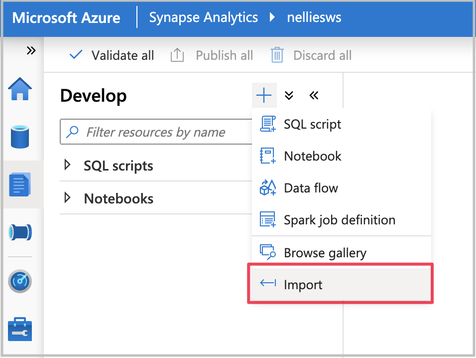
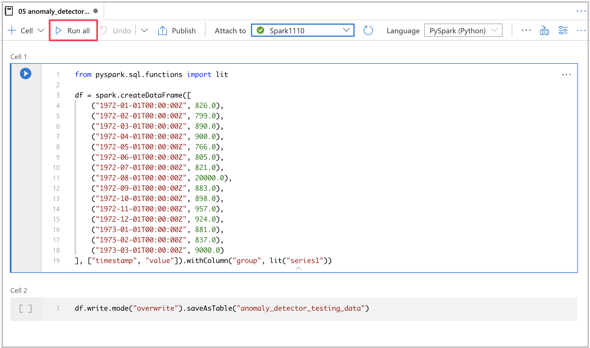
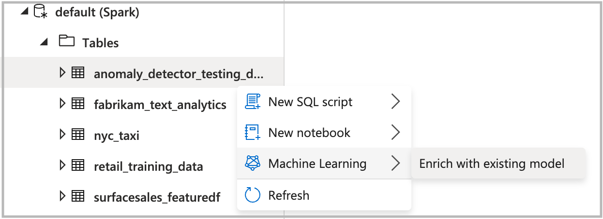
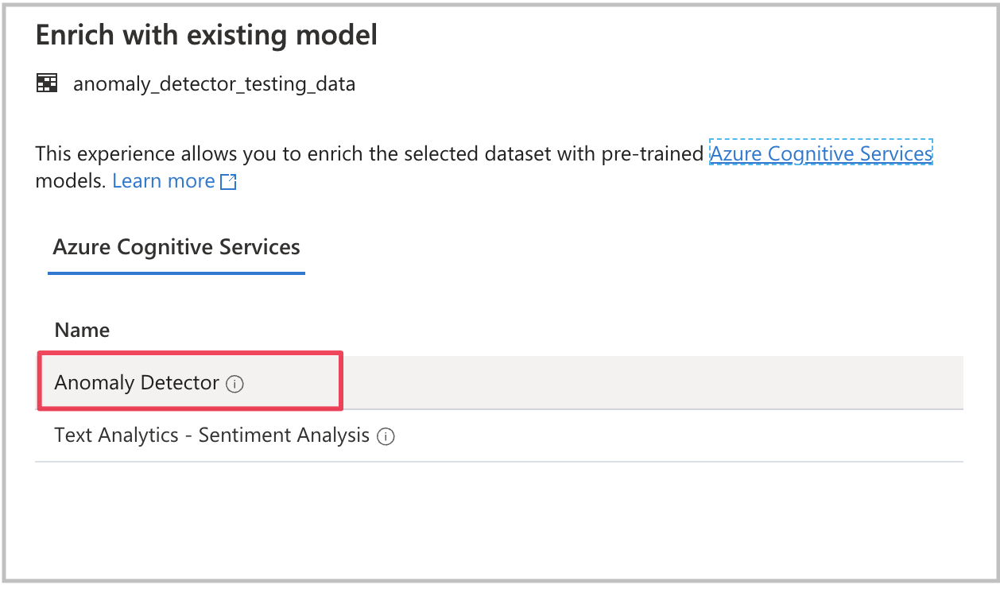
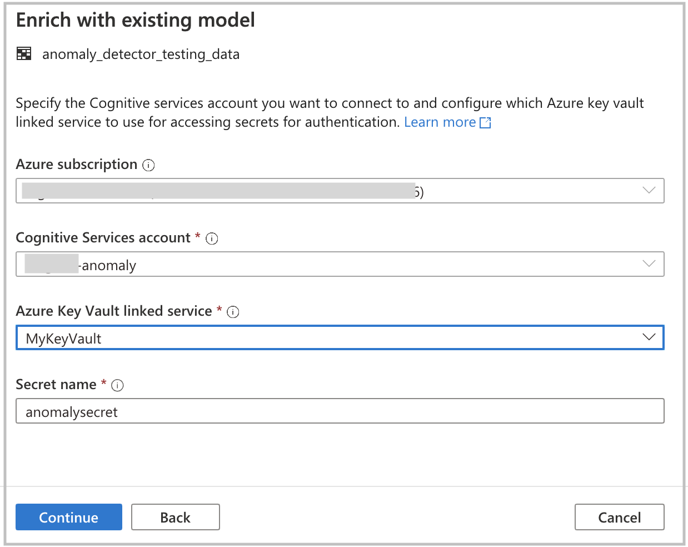
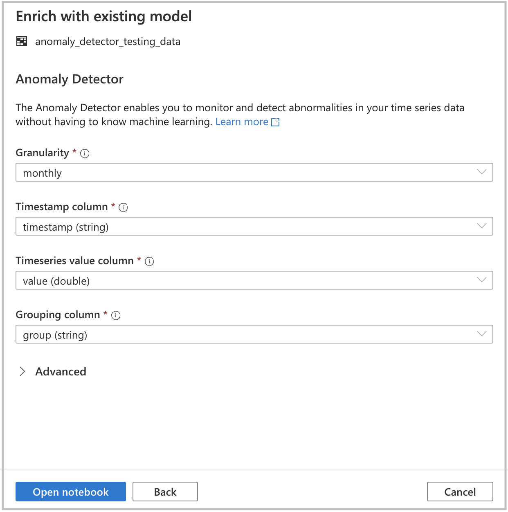
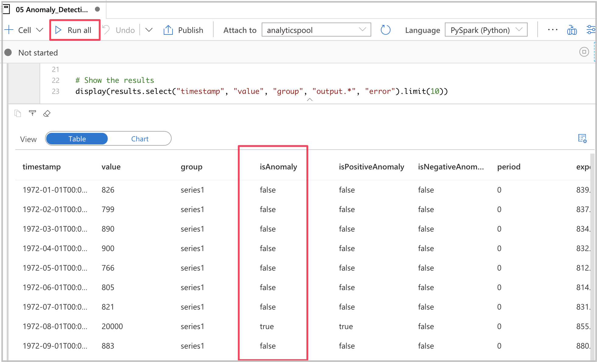

# Tutorial: Anomaly detection with Cognitive Services (Preview)

In this tutorial, you will learn how to easily enrich your data in Azure Synapse with [Cognitive Services](../../cognitive-services/index.yml). We will be using the [Anomaly Detector](../../cognitive-services/anomaly-detector/index.yml) to perform anomaly detection. A user in Azure Synapse can simply select a table to enrich for detection of anomalies.

This tutorial covers:

> [!div class="checklist"]
> - Steps for getting a Spark table dataset containing time series data.
> - Use a wizard experience in Azure Synapse to enrich data using Anomaly Detector Cognitive Service.

If you don't have an Azure subscription, [create a free account before you begin](https://azure.microsoft.com/free/).

## Prerequisites

- [Azure Synapse Analytics workspace](../get-started-create-workspace.md) with an ADLS Gen2 storage account configured as the default storage. You need to be the **Storage Blob Data Contributor** of the ADLS Gen2 filesystem that you work with.
- Spark pool in your Azure Synapse Analytics workspace. For details, see [Create a Spark pool in Azure Synapse](../quickstart-create-sql-pool-studio.md).
- Before you can use this tutorial, you also need to complete the pre-configuration steps described in this tutorial. [Configure Cognitive Services in Azure Synapse](tutorial-configure-cognitive-services-synapse.md).

## Sign in to the Azure portal

Sign in to the [Azure portal](https://portal.azure.com/)

## Create a Spark table

You will need a Spark table for this tutorial.

1. Download the following notebook file containing code to generate a Spark table: [prepare_anomaly_detector_data.ipynb](https://go.microsoft.com/fwlink/?linkid=2149577)

1. Upload the file to your Azure Synapse workspace.

1. Open the notebook file and choose to **Run All** cells.

1. A Spark table named **anomaly_detector_testing_data** should now appear in the default Spark database.

## Launch Cognitive Services wizard

1. Right-click on the Spark table created in the previous step. Select "Machine Learning-> Enrich with existing model" to open the wizard.

2. A configuration panel will appear and you will be asked to select a Cognitive Services model. Select Anomaly Detector.

## Provide authentication details

In order to authenticate to Cognitive Services, you need to reference the secret to use in your Key Vault. The below inputs are depending on [pre-requisite steps](tutorial-configure-cognitive-services-synapse.md) that you should have completed before this step.

- **Azure Subscription**: Select the Azure subscription that your key vault belongs to.
- **Cognitive Services Account**: This is the Text Analytics resource you are going to connect to.
- **Azure Key Vault Linked Service**: As part of the pre-requisite steps, you have created a linked service to your Text Analytics resource. Please select it here.
- **Secret name**: This is the name of the secret in your key vault containing the key to authenticate to your Cognitive Services resource.

## Configure Anomaly Detection

Next, you need to configure the anomaly detection. Please provide the following details:

- Granularity: The rate that your data is sampled at. For example, if your data has a value for every minute, then your granularity would be minutely. Choose **monthly** 

- Timestamp: Column representing the time of the series. Choose column **timestamp**

- Timeseries value: Column representing the value of the series at the time specified by the Timestamp column. Choose column **value**

- Grouping: column that groups the series. That is, all rows that have the same value in this column should form one time series. Choose column **group**

Once you are done, select **Open Notebook**. This will generate a notebook for you with PySpark code that performs anomaly detection using Azure Cognitive Services.

## Open notebook and run

The notebook you just opened is using the [mmlspark library](https://github.com/Azure/mmlspark) to connect to Cognitive services.

The Azure Key Vault details you provided allow you to securely reference your secrets from this experience without revealing them.

You can now **Run All** cells to perform anomaly detection. Learn more about [Cognitive Services - Anomaly Detector](../../cognitive-services/anomaly-detector/index.yml).

## Next steps

- [Tutorial: Sentiment analysis with Azure Cognitive Services](tutorial-cognitive-services-sentiment.md)
- [Tutorial: Machine learning model scoring in Azure Synapse dedicated SQL Pools](tutorial-sql-pool-model-scoring-wizard.md)
- [Machine Learning capabilities in Azure Synapse Analytics](what-is-machine-learning.md)