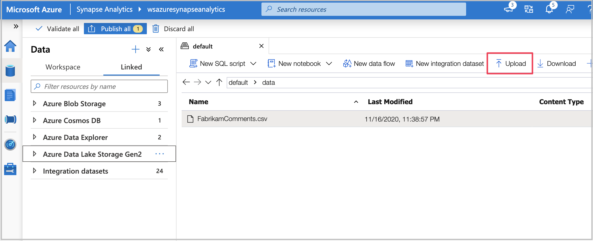
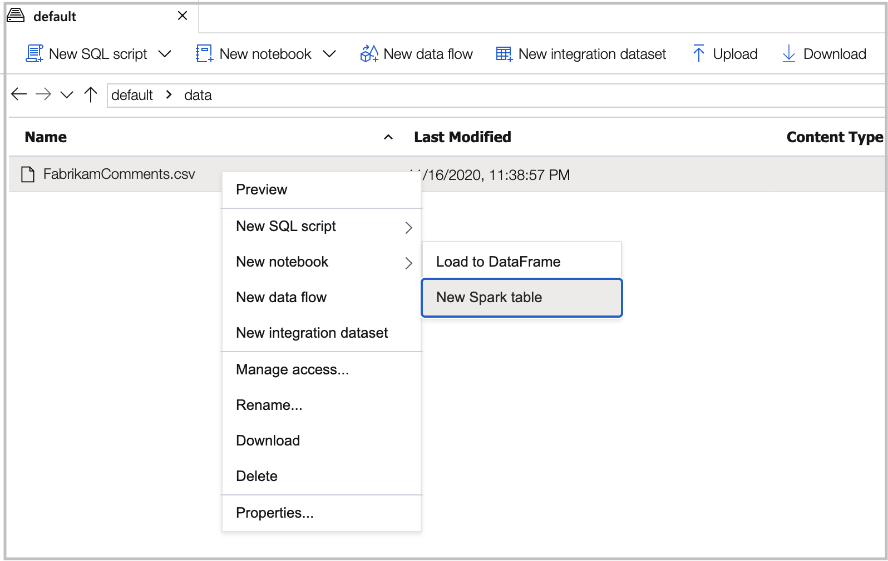
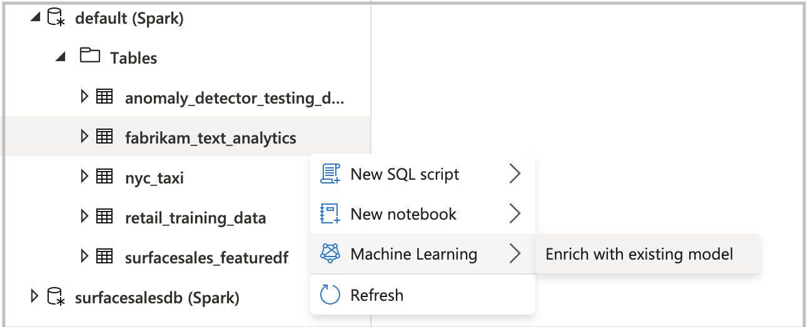
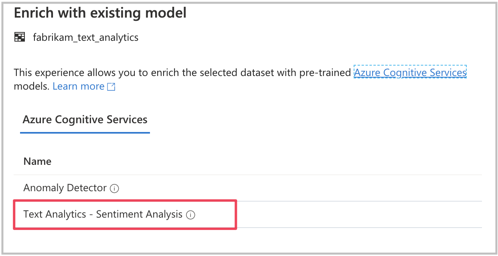
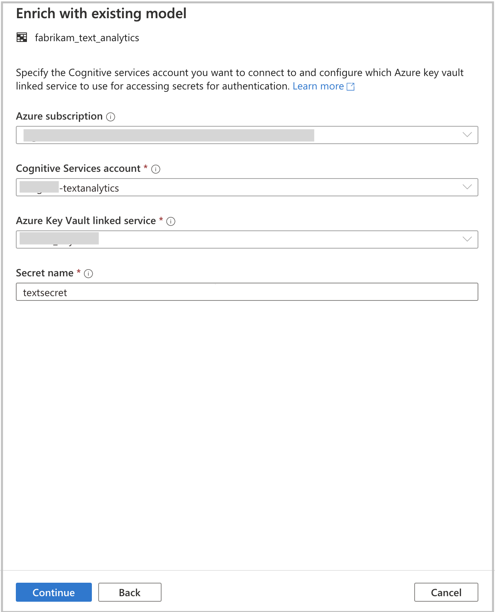
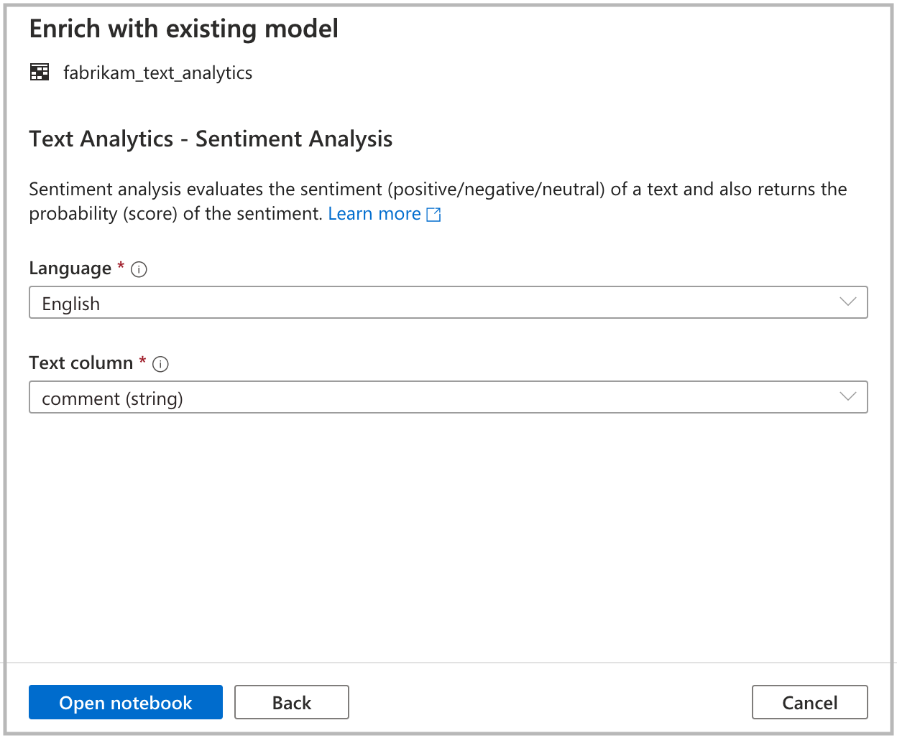
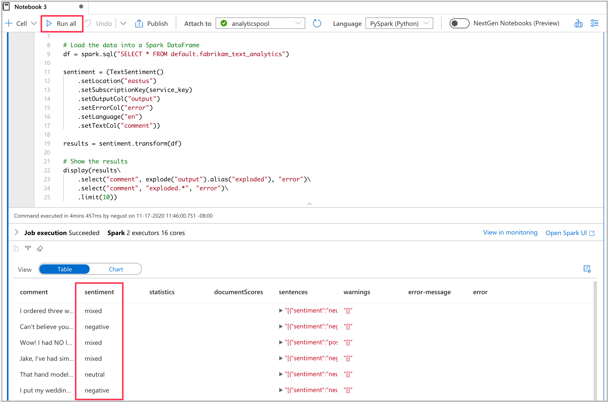

# Tutorial: Sentiment analysis with Cognitive Services (Preview)

In this tutorial, you will learn how to easily enrich your data in Azure Synapse with [Cognitive Services](../../cognitive-services/index.yml). We will be using the [Text Analytics](../../cognitive-services/text-analytics/index.yml) capabilities to perform sentiment analysis. A user in Azure Synapse can simply select a table containing a text column to enrich with sentiments. These sentiments can be positive, negative, mixed or neutral and a probability will also be returned.

This tutorial covers:

> [!div class="checklist"]
> - Steps for getting a Spark table dataset containing text column for sentiment analysis.
> - Use a wizard experience in Azure Synapse to enrich data using Text Analytics Cognitive Services.

If you don't have an Azure subscription, [create a free account before you begin](https://azure.microsoft.com/free/).

## Prerequisites

- [Azure Synapse Analytics workspace](../get-started-create-workspace.md) with an ADLS Gen2 storage account configured as the default storage. You need to be the **Storage Blob Data Contributor** of the ADLS Gen2 filesystem that you work with.
- Spark pool in your Azure Synapse Analytics workspace. For details, see [Create a Spark pool in Azure Synapse](../quickstart-create-sql-pool-studio.md).
- Before you can use this tutorial, you also need to complete the pre-configuration steps described in this tutorial. [Configure Cognitive Services in Azure Synapse](tutorial-configure-cognitive-services-synapse.md).

## Sign in to the Azure portal

Sign in to the [Azure portal](https://portal.azure.com/)

## Create a Spark table

You will need a Spark table for this tutorial.

1. Download the following CSV file containing a data set for text analytics: [FabrikamComments.csv](https://github.com/Kaiqb/KaiqbRepo0731190208/blob/master/CognitiveServices/TextAnalytics/FabrikamComments.csv)

1. Upload the file to your Azure Synapse ADLSGen2 storage account.


1. Create a Spark table from the .csv file by right clicking on the file and selecting **New Notebook -> Create Spark table**.


1. Name the table in the code cell and run the notebook on a Spark pool. Remember to set "header = True".


```python
%%pyspark
df = spark.read.load('abfss://default@azuresynapsesa.dfs.core.windows.net/data/FabrikamComments.csv', format='csv'
## If header exists uncomment line below
, header=True
)
df.write.mode("overwrite").saveAsTable("default.YourTableName")
```

## Launch Cognitive Services wizard

1. Right-click on the Spark table created in the previous step. Select "Machine Learning-> Enrich with existing model" to open the wizard.


2. A configuration panel will appear and you will be asked to select a Cognitive Services model. Select Text analytics - Sentiment Analysis.



## Provide authentication details

In order to authenticate to Cognitive Services, you need to reference the secret to use in your Key Vault. The below inputs are depending on [pre-requisite steps](tutorial-configure-cognitive-services-synapse.md) that you should have completed before this step.

- **Azure Subscription**: Select the Azure subscription that your key vault belongs to.
- **Cognitive Services Account**: This is the Text Analytics resource you are going to connect to.
- **Azure Key Vault Linked Service**: As part of the pre-requisite steps, you have created a linked service to your Text Analytics resource. Please select it here.
- **Secret name**: This is the name of the secret in your key vault containing the key to authenticate to your Cognitive Services resource.



## Configure Sentiment Analysis

Next, you need to configure the sentiment analysis. Please select the following details:
- **Language**: Select the language of the text you want to perform sentiment analysis on. Select **EN**.
- **Text column**: This is the text column in your dataset that you want to analyze to determine the sentiment. Select table column **comment**.

Once you are done, click **Open Notebook**. This will generate a notebook for you with PySpark code that performs the sentiment analysis with Azure Cognitive Services.



## Open notebook and run

The notebook you just opened is using the [mmlspark library](https://github.com/Azure/mmlspark) to connect to Cognitive services.

The Azure Key Vault details you provided allow you to securely reference your secrets from this experience without revealing them.

You can now **Run All** cells to enrich your data with sentiments. The sentiments will be returned as Positive/Negative/Neutral/Mixed, and you will also get probabilities per sentiment. Learn more about [Cognitive Services - Sentiment analysis](../../cognitive-services/text-analytics/how-tos/text-analytics-how-to-sentiment-analysis.md).



## Next steps
- [Tutorial: Anomaly detection with Azure Cognitive Services](tutorial-cognitive-services-sentiment.md)
- [Tutorial: Machine learning model scoring in Azure Synapse dedicated SQL Pools](tutorial-sql-pool-model-scoring-wizard.md)
- [Machine Learning capabilities in Azure Azure Synapse Analytics](what-is-machine-learning.md)