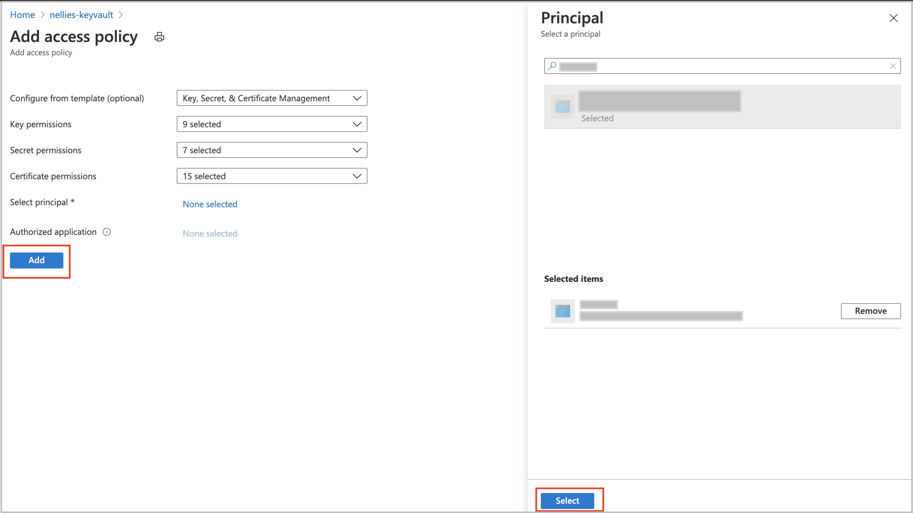
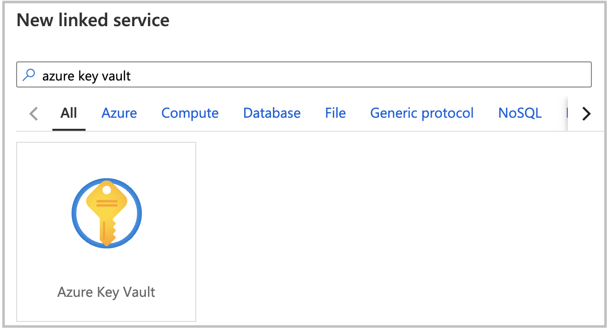

# Tutorial: Pre-requisites for using Cognitive Services in Azure Synapse

In this tutorial, you will learn how set up the pre-requisites for securely leveraging Cognitive Services in Azure Synapse.

This tutorial covers:
> [!div class="checklist"]
> - Create a Cognitive Services resources. For example Text Analytics or Anomaly Detector.
> - Store authentication key to Cognitive Services resources as secrets in Azure Key vault and configure access for Azure Synapse workspace.
> - Create Azure Key vault linked service in your Azure Synapse Analytics workspace.

If you don't have an Azure subscription, [create a free account before you begin](https://azure.microsoft.com/free/).

## Prerequisites

- [Azure Synapse Analytics workspace](../get-started-create-workspace.md) with an ADLS Gen2 storage account configured as the default storage. You need to be the **Storage Blob Data Contributor** of the ADLS Gen2 filesystem that you work with.

## Sign in to the Azure portal

Sign in to the [Azure portal](https://portal.azure.com/)

## Create a Cognitive Services Resource

[Azure Cognitive Services](https://go.microsoft.com/fwlink/?linkid=2147492) include many different types of services. Below are some examples that are used in the Synapse tutorials.

### Create an Anomaly Detector resource
Create an [Anomaly Detector](https://ms.portal.azure.com/#create/Microsoft.CognitiveServicesTextAnalytics) in Azure portal.

### Create a Text Analytics resource
Create a [Text Analytics](https://ms.portal.azure.com/#create/Microsoft.CognitiveServicesTextAnalytics) resource in Azure portal.

## Create Key Vault and configure secrets and access

1. Create a [Key Vault](https://ms.portal.azure.com/#create/Microsoft.KeyVault) in Azure portal.
2. Go to **Key Vault -> Access policies**, and grant the [Azure Synapse workspace MSI](https://docs.microsoft.com/azure/synapse-analytics/security/synapse-workspace-managed-identity) permissions to read secrets from Azure Key Vault.

>Make sure that the policy changes are saved. This step is easy to miss.

3. Go to your Cognitive Service resource, for example **Anomaly Detector -> Keys and Endpoint**, copy either of the two keys to the clipboard.

4. Go to **Key Vault -> Secret** to create a new secret. Specify the name of the secret, and then paste the key from the previous step into the "Value" field. Finally, click **Create**.

> Make sure you remember or note down this secret name! You will use it later when you connect to Cognitive Services from Azure Synapse Studio.

## Create Azure Keyvault Linked Service in Azure Synapse

1. Open your workspace in Azure Synapse Studio. Navigate to **Manage -> Linked Services**. Create ab "Azure Key Vault" linked service pointing to the Key Vault we just created. Then, verify the connection by clicking "Test connection" button and checking if it is green. If anything works fine, click "Create" first and then click "Publish all" to save your change.

You are now ready to continue with one of the tutorials for using the Azure Cognitive Services experience in Azure Synapse Studio.

## Next steps

- [Tutorial: Sentiment analysis with Azure Cognitive Services](tutorial-cognitive-services-sentiment.md)
- [Tutorial: Anomaly detection with Azure Cognitive Services](tutorial-cognitive-services-sentiment.md)
- [Tutorial: Machine learning model scoring in Azure Synapse dedicated SQL Pools](tutorial-sql-pool-model-scoring-wizard.md).
- [Machine Learning capabilities in Azure Synapse Analytics](what-is-machine-learning.md)