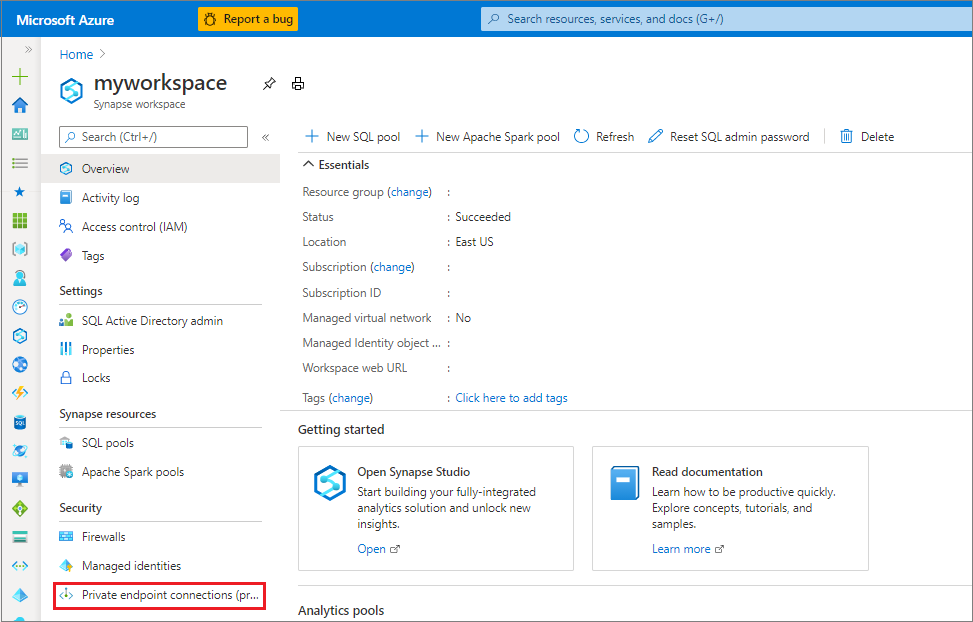
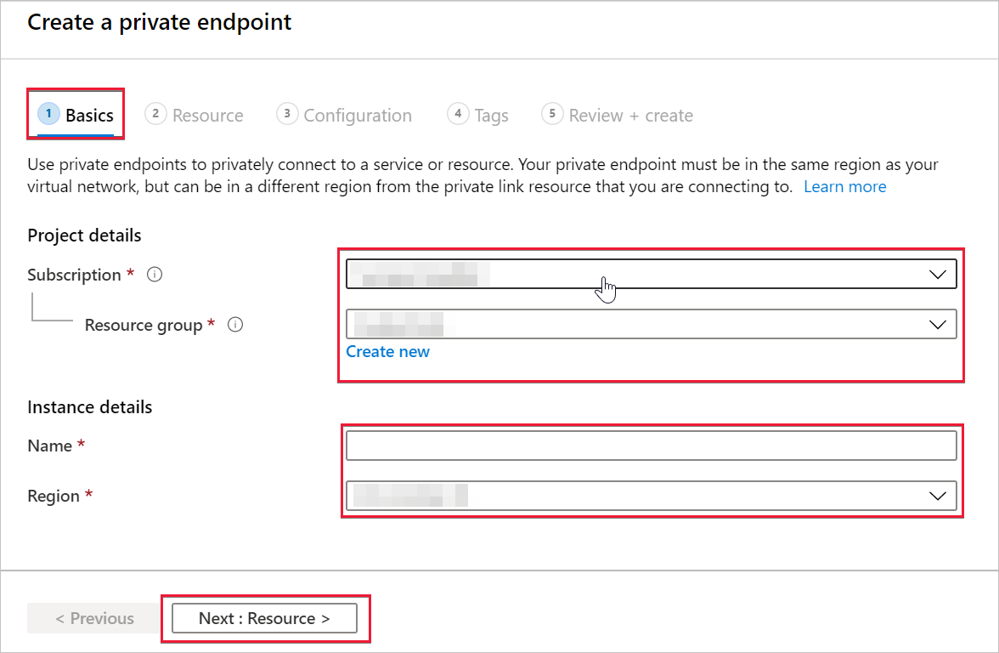
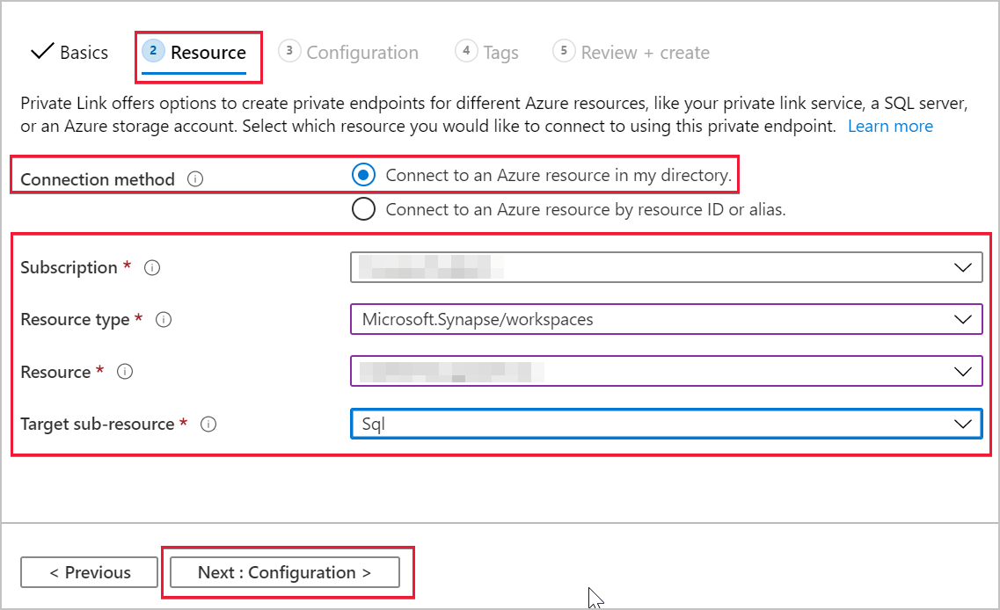
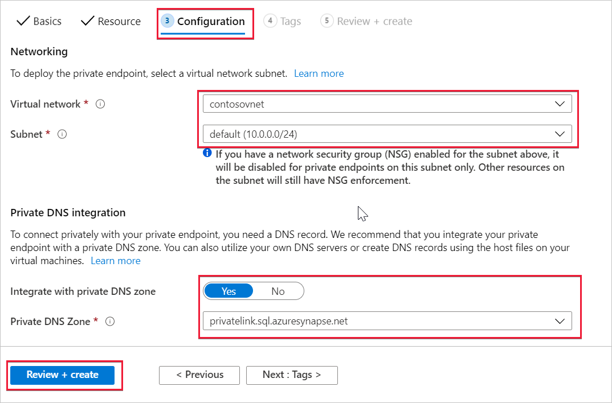

# Connect to your Azure Synapse workspace using private links (preview)

This article will teach you how to create private endpoint to your Azure Synapse workspace. See [private links and private endpoints](https://docs.microsoft.com/azure/private-link/) to learn more.

## Step 1: Open your Azure Synapse workspace in Azure portal

Select **Private endpoint connection** under **Security** and then select **+ Private endpoint**.

## Step 2: Select your subscription and region details

Under the **Basics** tab in the **Create a private endpoint** window, choose your **Subscription** and **Resource Group**. Give a **Name** to the private endpoint that you want to create. Select the **Region** where you want the private endpoint created.

Private endpoints are created in a subnet. The subscription, resource group, and region selected filter the private endpoint subnets. Select **Next: Resource >** when done.

## Step 3: Select your Azure Synapse workspace details

Select **Connect to an Azure resource in my directory** in the **Resource** tab. Select the **Subscription** that contains your Azure Synapse workspace. The **Resource type** for creating private endpoints to an Azure Synapse workspace is *Microsoft.Synapse/workspaces*.

Select your Azure Synapse workspace as the **Resource**. Every Azure Synapse workspace has three **Target sub-resource** that you can create a private endpoint to: Sql, SqlOnDemand, and Dev.

Select **Next: Configuration>** to advance to the next part of the setup.

In the **Configuration** tab, select the **Virtual network** and the **Subnet** in which the private endpoint should be created. You also need to create a DNS record that maps to the private endpoint.

Select **Yes** for **Integrate with private DNS zone** to integrate your private endpoint with a private DNS zone. If you don't have a private DNS zone associated with your VNet, then a new private DNS zone is created. Select **Review + create** when done.

When the deployment is complete, open your Azure Synapse workspace in Azure portal and select **Private endpoint connections**. The new private endpoint and private endpoint connection name associated to the private endpoint are shown.

## Next steps

Learn more about [Managed workspace VNet](./synapse-workspace-managed-vnet.md)

Learn more about [Managed private endpoints](./synapse-workspace-managed-private-endpoints.md)

[Create Managed private endpoints to your data sources](./how-to-create-managed-private-endpoints.md)
