# Tutorial: Create an Apache Spark application with IntelliJ using a Synapse workspace

This tutorial shows you how to use the Azure Toolkit for IntelliJ plug-in to develop Apache Spark applications, which are written in [Scala](https://www.scala-lang.org/), and then submit them to a serverless Apache Spark pool (preview) directly from the IntelliJ integrated development environment (IDE). You can use the plug-in in a few ways:

- Develop and submit a Scala Spark application on a Spark pool.
- Access your Spark pools resources.
- Develop and run a Scala Spark application locally.

In this tutorial, you learn how to:
> [!div class="checklist"]
>
> - Use the Azure Toolkit for IntelliJ plug-in
> - Develop Apache Spark applications
> - Submit application to Spark pools

## Prerequisites

- [IntelliJ IDEA Community Version](https://www.jetbrains.com/idea/download/download-thanks.html?platform=windows&code=IIC).
- Azure toolkit plugin 3.27.0-2019.2 – Install from [IntelliJ Plugin repository](/java/azure/intellij/azure-toolkit-for-intellij-installation?toc=/azure/synapse-analytics/toc.json&bc=/azure/synapse-analytics/breadcrumb/toc.json)
- [JDK (Version 1.8)](https://www.oracle.com/technetwork/java/javase/downloads/jdk8-downloads-2133151.html).
- Scala Plugin – Install from [IntelliJ Plugin repository](/azure/hdinsight/spark/apache-spark-intellij-tool-plugin#install-scala-plugin-for-intellij-idea).
- The following prerequisite is only for Windows users:

  While you're running the local Spark Scala application on a Windows computer, you might get an exception, as explained in [SPARK-2356](https://issues.apache.org/jira/browse/SPARK-2356). The exception occurs because WinUtils.exe is missing on Windows.
  To resolve this error, download the [WinUtils executable](http://public-repo-1.hortonworks.com/hdp-win-alpha/winutils.exe) to a location such as **C:\WinUtils\bin**. Then, add the environment variable **HADOOP_HOME**, and set the value of the variable to **C:\WinUtils**.

## Create a Spark Scala application for a Spark pool

1. Start IntelliJ IDEA, and select **Create New Project** to open the **New Project** window.
2. Select **Apache Spark/HDInsight** from the left pane.
3. Select **Spark Project with Samples(Scala)** from the main window.
4. From the **Build tool** drop-down list, select one of the following types:

   - **Maven** for Scala project-creation wizard support.
   - **SBT** for managing the dependencies and building for the Scala project.

    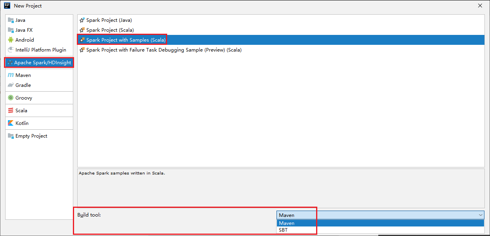

5. Select **Next**.
6. In the **New Project** window, provide the following information:

    | Property | Description |
    | ----- | ----- |
    |Project name| Enter a name. This tutorial uses `myApp`.|
    |Project&nbsp;location| Enter the wanted location to save your project.|
    |Project SDK| It might be blank on your first use of IDEA. Select **New...** and navigate to your JDK.|
    |Spark Version|The creation wizard integrates the proper version for Spark SDK and Scala SDK. Synapse only supports **Spark 2.4.0**.|
    |||

    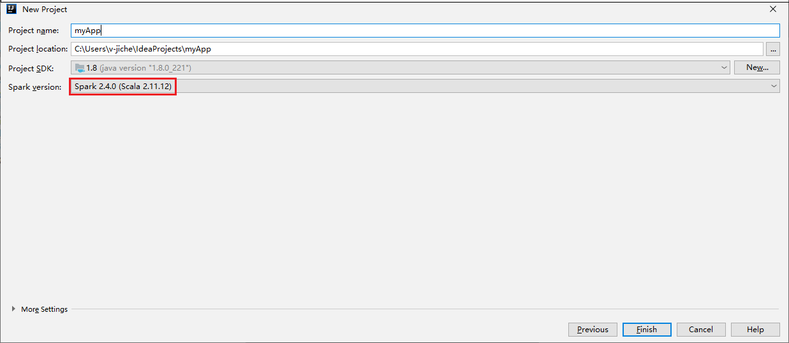

7. Select **Finish**. It may take a few minutes before the project becomes available.
8. The Spark project automatically creates an artifact for you. To view the artifact, do the following operating:

   a. From the menu bar, navigate to **File** > **Project Structure...**.

   b. From the **Project Structure** window, select **Artifacts**.

   c. Select **Cancel** after viewing the artifact.

    

9. Find **LogQuery** from **myApp** > **src** > **main** > **scala**> **sample**> **LogQuery**. This tutorial uses **LogQuery** to run.

   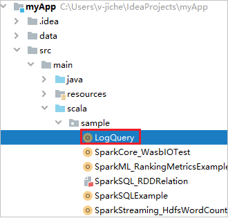

## Connect to your Spark pools

Sign in to Azure subscription to connect to your Spark pools.

### Sign in to your Azure subscription

1. From the menu bar, navigate to **View** > **Tool Windows** > **Azure Explorer**.

   

2. From Azure Explorer, right-click the **Azure** node, and then select **Sign In**.

   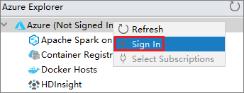

3. In the **Azure Sign In** dialog box, choose **Device Login**, and then select **Sign in**.

    

4. In the **Azure Device Login** dialog box, select **Copy&Open**.

   

5. In the browser interface, paste the code, and then select **Next**.

   

6. Enter your Azure credentials, and then close the browser.

   

7. After you're signed in, the **Select Subscriptions** dialog box lists all the Azure subscriptions that are associated with the credentials. Select your subscription and then select **Select**.

    

8. From **Azure Explorer**, expand **Apache Spark on Synapse** to view the Workspaces that are in your subscriptions.

    

9. To view the Spark pools, you can further expand a workspace.

    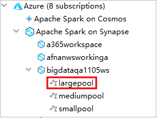

## Remote Run a Spark Scala application on a Spark pool

After creating a Scala application, you can remotely run it.

1. Open **Run/Debug Configurations** window by selecting the icon.

    

2. In the **Run/Debug Configurations** dialog window, select **+**, then select **Apache Spark on Synapse**.

    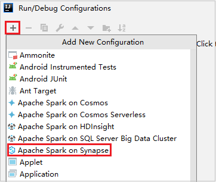

3. In the **Run/Debug Configurations** window, provide the following values, and then select **OK**:

    |Property |Value |
    |----|----|
    |Spark pools|Select the Spark pools on which you want to run your application.|
    |Select an Artifact to submit|Leave default setting.|
    |Main class name|The default value is the main class from the selected file. You can change the class by selecting the ellipsis(**...**) and choosing another class.|
    |Job configurations|You can change the default key and values. For more information, see [Apache Livy REST API](http://livy.incubator.apache.org./docs/latest/rest-api.html).|
    |Command-line arguments|You can enter arguments separated by space for the main class if needed.|
    |Referenced Jars and Referenced Files|You can enter the paths for the referenced Jars and files if any. You can also browse files in the Azure virtual file system, which currently only supports ADLS Gen2 cluster. For more information: [Apache Spark Configuration]https://spark.apache.org/docs/2.4.5/configuration.html#runtime-environment) and [How to upload resources to cluster](../../storage/blobs/storage-quickstart-blobs-storage-explorer.md?toc=/azure/synapse-analytics/toc.json&bc=/azure/synapse-analytics/breadcrumb/toc.json).|
    |Job Upload Storage|Expand to reveal additional options.|
    |Storage Type|Select **Use Azure Blob to upload** or **Use cluster default storage account to upload** from the drop-down list.|
    |Storage Account|Enter your storage account.|
    |Storage Key|Enter your storage key.|
    |Storage Container|Select your storage container from the drop-down list once **Storage Account** and **Storage Key** has been entered.|

    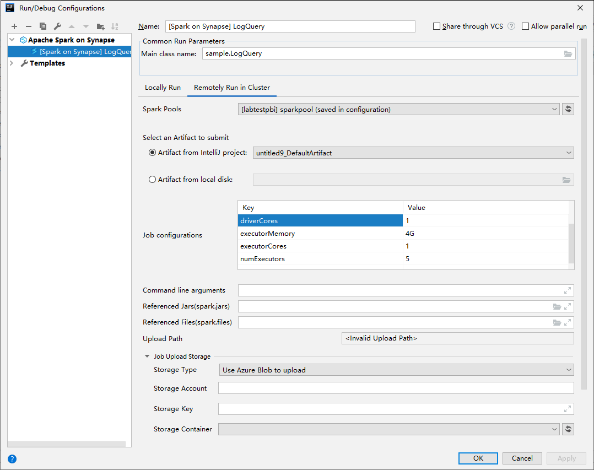

4. Select **SparkJobRun** icon to submit your project to the selected Spark pool. The **Remote Spark Job in Cluster** tab displays the job execution progress at the bottom. You can stop the application by selecting the red button.

    

    

## Local Run/Debug Apache Spark applications

You can follow the instructions below to set up your local run and local debug for your Apache Spark job.

### Scenario 1: Do local run

1. Open the **Run/Debug Configurations** dialog, select the plus sign (**+**). Then select the **Apache Spark on Synapse** option. Enter information for **Name**, **Main class name** to save.

    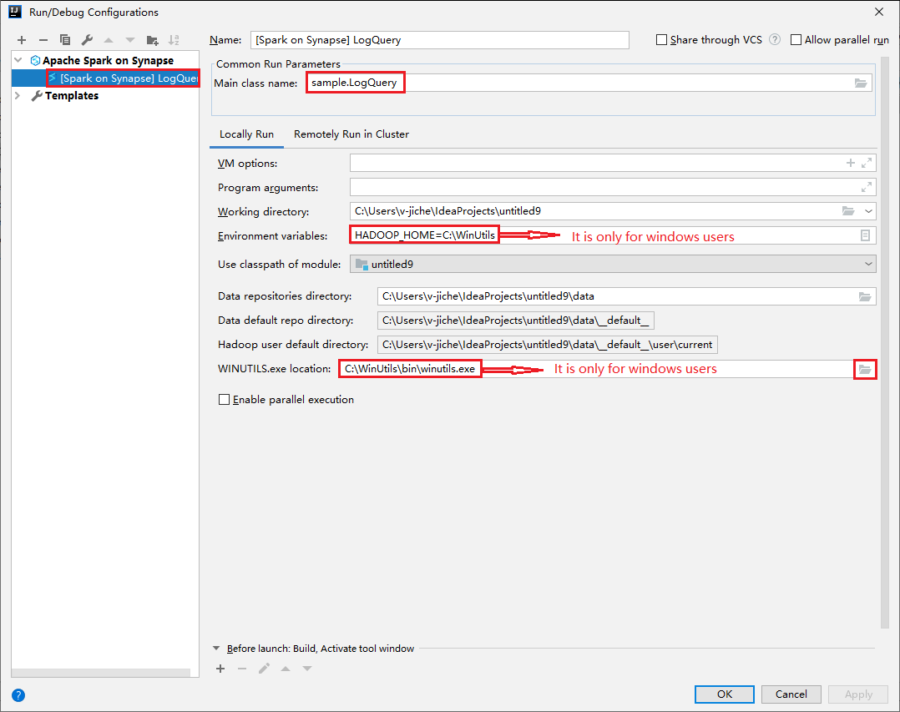

    - Environment variables and WinUtils.exe Location are only for windows users.
    - Environment variables: The system environment variable can be auto detected if you have set it before and no need to manually add.
    - [WinUtils.exe Location](http://public-repo-1.hortonworks.com/hdp-win-alpha/winutils.exe): You can specify the WinUtils location by selecting the folder icon on the right.

2. Then select the local play button.

    

3. Once local run completed, if script includes output, you can check the output file from **data** > **__default__**.

    

### Scenario 2: Do local debugging

1. Open the **LogQuery** script, set breakpoints.
2. Select **Local debug** icon to do local debugging.

    

## Access and manage Synapse Workspace

You can perform different operations in Azure Explorer within Azure Toolkit for IntelliJ. From the menu bar, navigate to **View** > **Tool Windows** > **Azure Explorer**.

### Launch workspace

1. From Azure Explorer, navigate to **Apache Spark on Synapse**, then expand it.

    

2. Right-click a workspace, then select **Launch workspace**, website will be opened.

    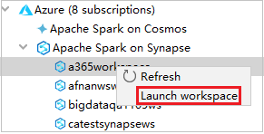

    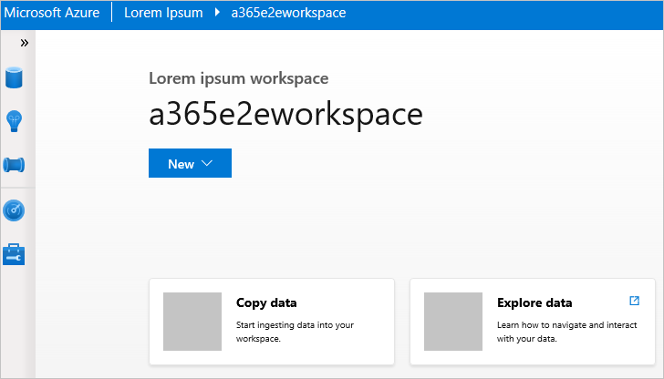

## Spark console

You can run Spark Local Console(Scala) or run Spark Livy Interactive Session Console(Scala).

### Spark local console (Scala)

Ensure you've satisfied the WINUTILS.EXE prerequisite.

1. From the menu bar, navigate to **Run** > **Edit Configurations...**.
2. From the **Run/Debug Configurations** window, in the left pane, navigate to **Apache Spark on Synapse** > **[Spark on Synapse] myApp**.
3. From the main window, select the **Locally Run** tab.
4. Provide the following values, and then select **OK**:

    |Property |Value |
    |----|----|
    |Environment variables|Ensure the value for HADOOP_HOME is correct.|
    |WINUTILS.exe location|Ensure the path is correct.|

    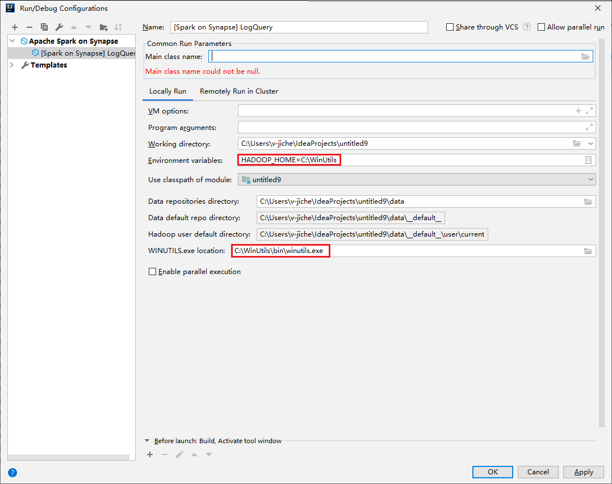

5. From Project, navigate to **myApp** > **src** > **main** > **scala** > **myApp**.
6. From the menu bar, navigate to **Tools** > **Spark console** > **Run Spark Local Console(Scala)**.
7. Then two dialogs may be displayed to ask you if you want to auto fix dependencies. If so, select **Auto Fix**.

    

    

8. The console should look similar to the picture below. In the console window type `sc.appName`, and then press ctrl+Enter. The result will be shown. You can stop the local console by selecting red button.

    

### Spark Livy interactive session console (Scala)

It's only supported on IntelliJ 2018.2 and 2018.3.

1. From the menu bar, navigate to **Run** > **Edit Configurations...**.

2. From the **Run/Debug Configurations** window, in the left pane, navigate to **Apache Spark on synapse** > **[Spark on synapse] myApp**.

3. From the main window, select the **Remotely Run in Cluster** tab.

4. Provide the following values, and then select **OK**:

    |Property |Value |
    |----|----|
    |Main class name| Select the Main class name.| 
    |Spark pools|Select the Spark pools on which you want to run your application.|
    ||

    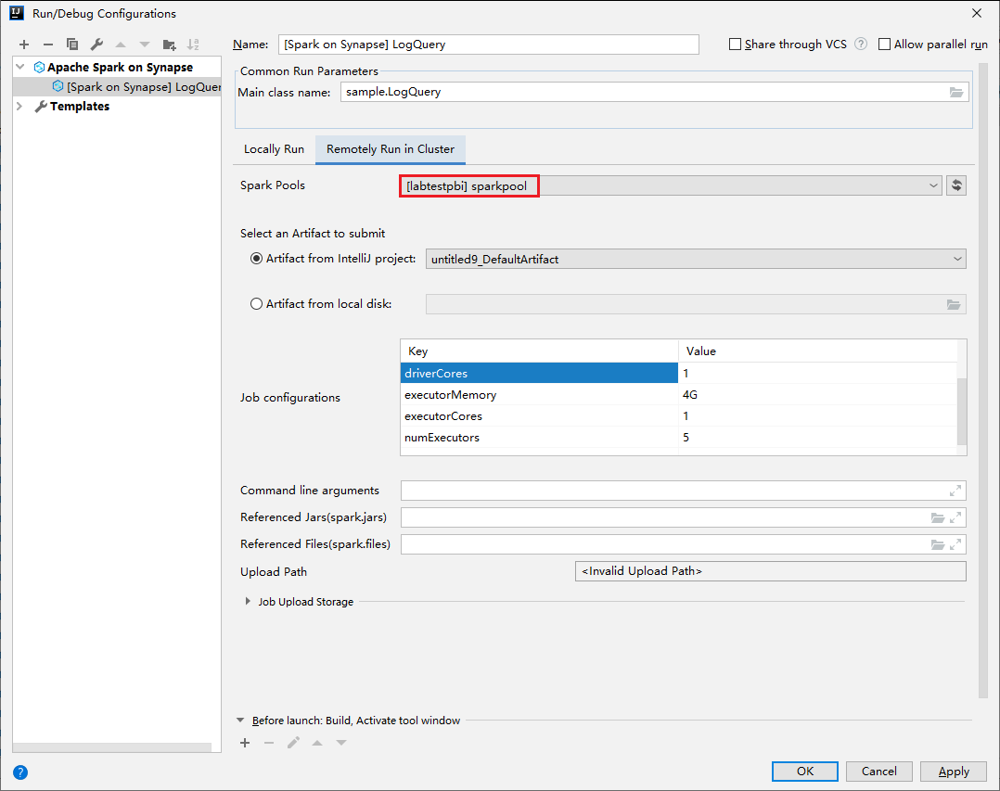

5. From Project, navigate to **myApp** > **src** > **main** > **scala** > **myApp**.

6. From the menu bar, navigate to **Tools** > **Spark console** > **Run Spark Livy Interactive Session Console(Scala)**.
7. The console should look similar to the picture below. In the console window type `sc.appName`, and then press ctrl+Enter. The result will be shown. You can stop the local console by selecting red button.

    

### Send selection to Spark console

You may want to see the script result by sending some code to the local console or Livy Interactive Session Console(Scala). To do so, you can highlight some code in the Scala file, then right-click **Send Selection To Spark console**. The selected code will be sent to the console and be done. The result will be displayed after the code in the console. The console will check the existing errors.

   

## Next steps

- [Azure Synapse Analytics](../overview-what-is.md)
- [Create a new Apache Spark pool for an Azure Synapse Analytics workspace](../../synapse-analytics/quickstart-create-apache-spark-pool-studio.md)
