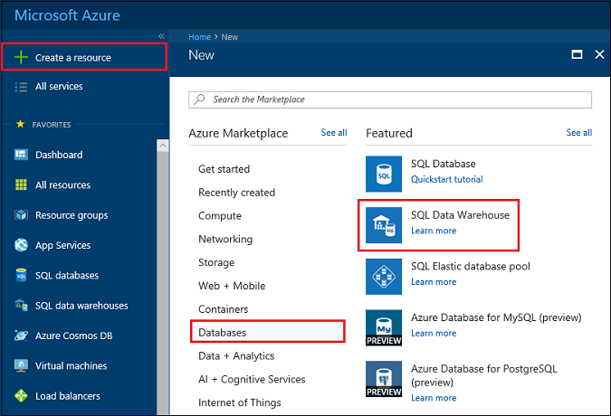
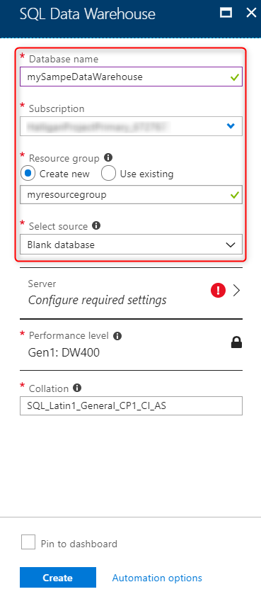
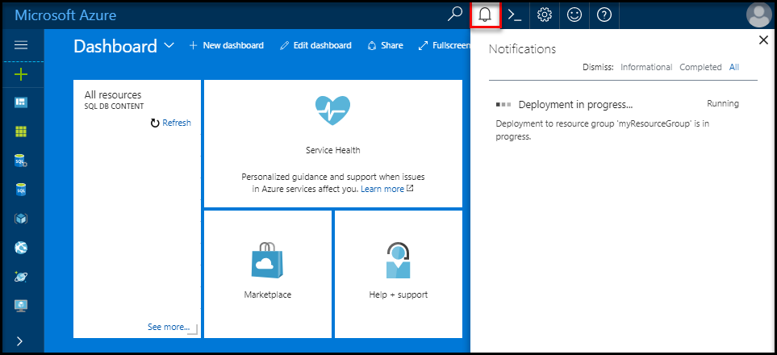
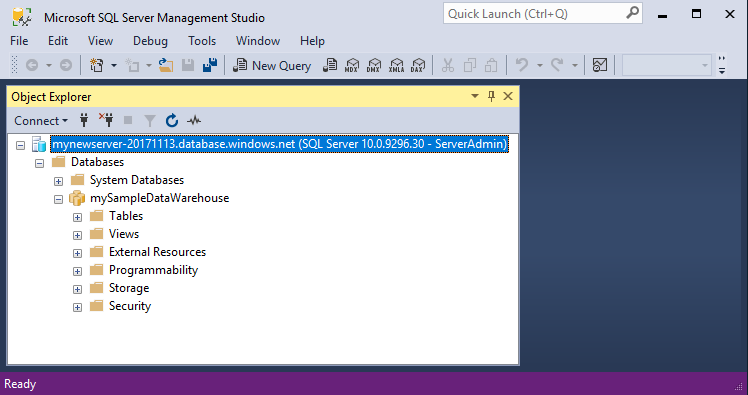
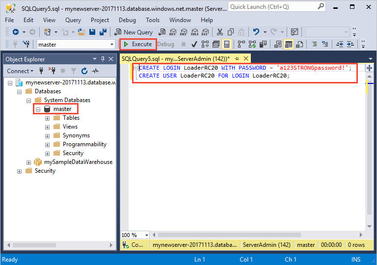
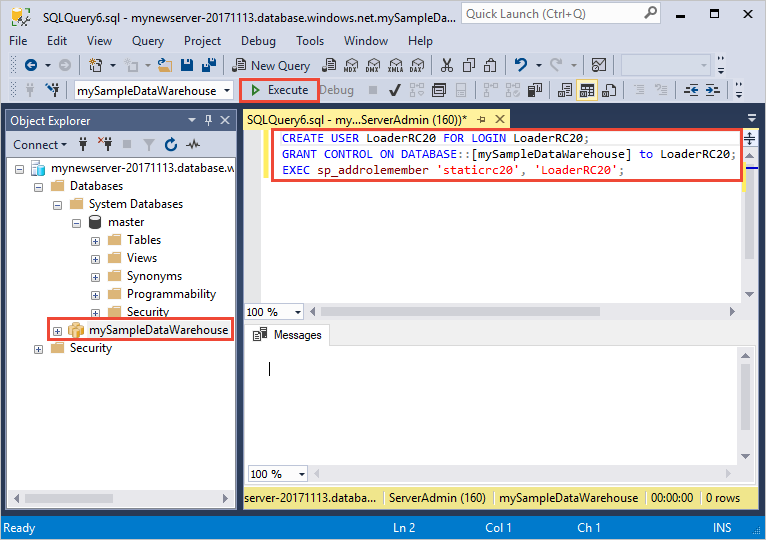
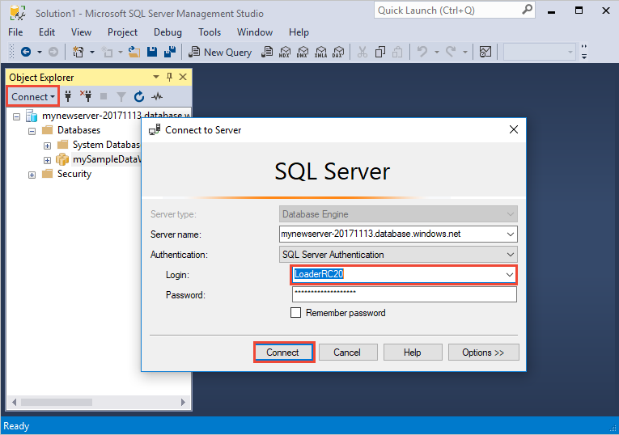
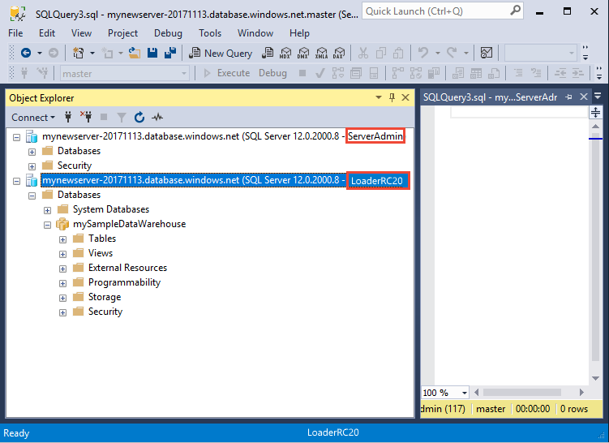
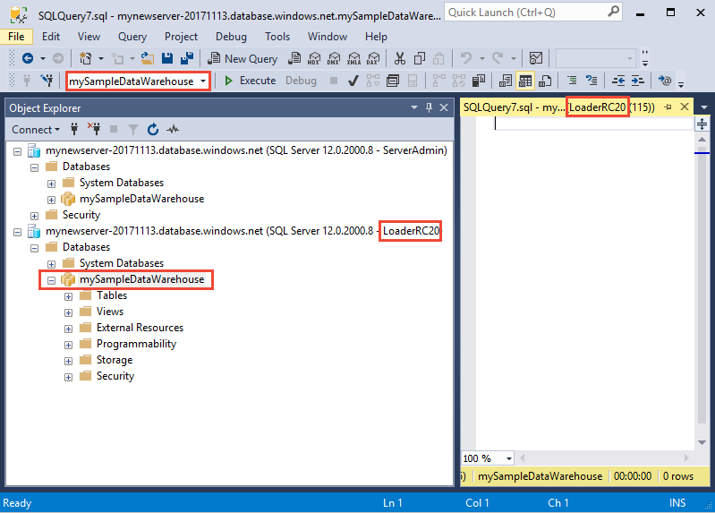
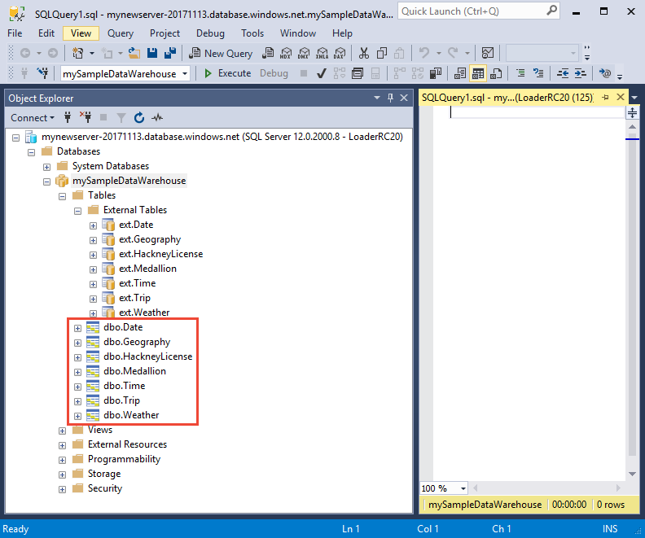

# Tutorial: Load the New York Taxicab dataset

This tutorial uses the [COPY statement](https://docs.microsoft.com/sql/t-sql/statements/copy-into-transact-sql?view=azure-sqldw-latest) to load New York Taxicab dataset from an Azure blob storage account. The tutorial uses the [Azure portal](https://portal.azure.com) and [SQL Server Management Studio](/sql/ssms/download-sql-server-management-studio-ssms?toc=/azure/synapse-analytics/sql-data-warehouse/toc.json&bc=/azure/synapse-analytics/sql-data-warehouse/breadcrumb/toc.json&view=azure-sqldw-latest) (SSMS) to:

> [!div class="checklist"]
>
> * Create a SQL pool in the Azure portal
> * Set up a server-level firewall rule in the Azure portal
> * Connect to the data warehouse with SSMS
> * Create a user designated for loading data
> * Create the tables for the sample dataset 
> * Use the COPY T-SQL statement to load data into your data warehouse
> * View the progress of data as it is loading

If you don't have an Azure subscription, [create a free account](https://azure.microsoft.com/free/) before you begin.

## Before you begin

Before you begin this tutorial, download and install the newest version of [SQL Server Management Studio](/sql/ssms/download-sql-server-management-studio-ssms?toc=/azure/synapse-analytics/sql-data-warehouse/toc.json&bc=/azure/synapse-analytics/sql-data-warehouse/breadcrumb/toc.json&view=azure-sqldw-latest) (SSMS).

## Log in to the Azure portal

Log in to the [Azure portal](https://portal.azure.com/).

## Create a blank database

A SQL pool is created with a defined set of [compute resources](memory-concurrency-limits.md). The database is created within an [Azure resource group](../../azure-resource-manager/management/overview.md?toc=/azure/synapse-analytics/sql-data-warehouse/toc.json&bc=/azure/synapse-analytics/sql-data-warehouse/breadcrumb/toc.json) and in a [logical SQL server](../../azure-sql/database/logical-servers.md?toc=/azure/synapse-analytics/sql-data-warehouse/toc.json&bc=/azure/synapse-analytics/sql-data-warehouse/breadcrumb/toc.json).

Follow these steps to create a blank database.

1. Select **Create a resource** in the upper left-hand corner of the Azure portal.

2. Select **Databases** from the **New** page, and select **Azure Synapse Analytics** under **Featured** on the **New** page.

    

3. Fill out the form with the following information:

   | Setting            | Suggested value       | Description                                                  |
   | ------------------ | --------------------- | ------------------------------------------------------------ |
   | *Name**            | mySampleDataWarehouse | For valid database names, see [Database Identifiers](/sql/relational-databases/databases/database-identifiers?toc=/azure/synapse-analytics/sql-data-warehouse/toc.json&bc=/azure/synapse-analytics/sql-data-warehouse/breadcrumb/toc.json&view=azure-sqldw-latest). |
   | **Subscription**   | Your subscription     | For details about your subscriptions, see [Subscriptions](https://account.windowsazure.com/Subscriptions). |
   | **Resource group** | myResourceGroup       | For valid resource group names, see [Naming rules and restrictions](/azure/architecture/best-practices/resource-naming?toc=/azure/synapse-analytics/sql-data-warehouse/toc.json&bc=/azure/synapse-analytics/sql-data-warehouse/breadcrumb/toc.json). |
   | **Select source**  | Blank database        | Specifies to create a blank database. Note, a data warehouse is one type of database. |

    

4. Select **Server** to create and configure a new server for your new database. Fill out the **New server form** with the following information:

    | Setting                | Suggested value          | Description                                                  |
    | ---------------------- | ------------------------ | ------------------------------------------------------------ |
    | **Server name**        | Any globally unique name | For valid server names, see [Naming rules and restrictions](/azure/architecture/best-practices/resource-naming?toc=/azure/synapse-analytics/sql-data-warehouse/toc.json&bc=/azure/synapse-analytics/sql-data-warehouse/breadcrumb/toc.json). |
    | **Server admin login** | Any valid name           | For valid login names, see [Database Identifiers](/sql/relational-databases/databases/database-identifiers?toc=/azure/synapse-analytics/sql-data-warehouse/toc.json&bc=/azure/synapse-analytics/sql-data-warehouse/breadcrumb/toc.json&view=azure-sqldw-latest). |
    | **Password**           | Any valid password       | Your password must have at least eight characters and must contain characters from three of the following categories: upper case characters, lower case characters, numbers, and non-alphanumeric characters. |
    | **Location**           | Any valid location       | For information about regions, see [Azure Regions](https://azure.microsoft.com/regions/). |

    

5. Select **Select**.

6. Select **Performance level** to specify whether the data warehouse is Gen1 or Gen2, and the number of data warehouse units.

7. For this tutorial, select SQL pool **Gen2**. The slider is set to **DW1000c** by default.  Try moving it up and down to see how it works.

    

8. Select **Apply**.
9. In the provisioning blade, select a **collation** for the blank database. For this tutorial, use the default value. For more information about collations, see [Collations](/sql/t-sql/statements/collations?toc=/azure/synapse-analytics/sql-data-warehouse/toc.json&bc=/azure/synapse-analytics/sql-data-warehouse/breadcrumb/toc.json&view=azure-sqldw-latest)

10. Now that you have completed the form, select **Create** to provision the database. Provisioning takes a few minutes.

11. On the toolbar, select **Notifications** to monitor the deployment process.
  
     

## Create a server-level firewall rule

A firewall at the server-level that prevents external applications and tools from connecting to the server or any databases on the server. To enable connectivity, you can add firewall rules that enable connectivity for specific IP addresses.  Follow these steps to create a [server-level firewall rule](../../azure-sql/database/firewall-configure.md?toc=/azure/synapse-analytics/sql-data-warehouse/toc.json&bc=/azure/synapse-analytics/sql-data-warehouse/breadcrumb/toc.json) for your client's IP address.

> [!NOTE]
> Azure Synapse Analytics communicates over port 1433. If you are trying to connect from within a corporate network, outbound traffic over port 1433 might not be allowed by your network's firewall. If so, you cannot connect to your server unless your IT department opens port 1433.

1. After the deployment completes, select **SQL databases** from the left-hand menu and then select **mySampleDatabase** on the **SQL databases** page. The overview page for your database opens, showing you the fully qualified server name (such as **mynewserver-20180430.database.windows.net**) and provides options for further configuration.

2. Copy this fully qualified server name for use to connect to your server and its databases in subsequent quick starts. Then select the server name to open server settings.

    

3. Select the server name to open server settings.

    

4. Select **Show firewall settings**. The **Firewall settings** page for the server opens.

    

5. Select **Add client IP** on the toolbar to add your current IP address to a new firewall rule. A firewall rule can open port 1433 for a single IP address or a range of IP addresses.

6. Select **Save**. A server-level firewall rule is created for your current IP address opening port 1433 on the server.

7. Select **OK** and then close the **Firewall settings** page.

You can now connect to the server and its data warehouses using this IP address. The connection works from SQL Server Management Studio or another tool of your choice. When you connect, use the ServerAdmin account you created previously.  

> [!IMPORTANT]
> By default, access through the SQL Database firewall is enabled for all Azure services. Select **OFF** on this page and then select **Save** to disable the firewall for all Azure services.

## Get the fully qualified server name

Get the fully qualified server name for your server in the Azure portal. Later you will use the fully qualified name when connecting to the server.

1. Log in to the [Azure portal](https://portal.azure.com/).
2. Select **Azure Synapse Analytics** from the left-hand menu, and select your database on the **Azure Synapse Analytics** page.
3. In the **Essentials** pane in the Azure portal page for your database, locate and then copy the **Server name**. In this example, the fully qualified name is mynewserver-20180430.database.windows.net.

      

## Connect to the server as server admin

This section uses [SQL Server Management Studio](/sql/ssms/download-sql-server-management-studio-ssms?toc=/azure/synapse-analytics/sql-data-warehouse/toc.json&bc=/azure/synapse-analytics/sql-data-warehouse/breadcrumb/toc.json&view=azure-sqldw-latest) (SSMS) to establish a connection to your server.

1. Open SQL Server Management Studio.

2. In the **Connect to Server** dialog box, enter the following information:

    | Setting        | Suggested value                            | Description                                                  |
    | -------------- | ------------------------------------------ | ------------------------------------------------------------ |
    | Server type    | Database engine                            | This value is required                                       |
    | Server name    | The fully qualified server name            | The name should be something like this: **mynewserver-20180430.database.windows.net**. |
    | Authentication | SQL Server Authentication                  | SQL Authentication is the only authentication type that we have configured in this tutorial. |
    | Login          | The server admin account                   | This is the account that you specified when you created the server. |
    | Password       | The password for your server admin account | This is the password that you specified when you created the server. |

    

3. Select **Connect**. The Object Explorer window opens in SSMS.

4. In Object Explorer, expand **Databases**. Then expand **System databases** and **master** to view the objects in the master database.  Expand **mySampleDatabase** to view the objects in your new database.

    

## Create a user for loading data

The server admin account is meant to perform management operations, and is not suited for running queries on user data. Loading data is a memory-intensive operation. Memory maximums are defined according to the [data warehouse units](what-is-a-data-warehouse-unit-dwu-cdwu.md) and [resource class](resource-classes-for-workload-management.md) configured.

It's best to create a login and user that is dedicated for loading data. Then add the loading user to a [resource class](resource-classes-for-workload-management.md) that enables an appropriate maximum memory allocation.

Since you are currently connected as the server admin, you can create logins and users. Use these steps to create a login and user called **LoaderRC20**. Then assign the user to the **staticrc20** resource class.

1. In SSMS, right-select **master** to show a drop-down menu, and choose **New Query**. A new query window opens.

    

2. In the query window, enter these T-SQL commands to create a login and user named LoaderRC20, substituting your own password for 'a123STRONGpassword!'.

    ```sql
    CREATE LOGIN LoaderRC20 WITH PASSWORD = 'a123STRONGpassword!';
    CREATE USER LoaderRC20 FOR LOGIN LoaderRC20;
    ```

3. Select **Execute**.

4. Right-click **mySampleDataWarehouse**, and choose **New Query**. A new query Window opens.  

    

5. Enter the following T-SQL commands to create a database user named LoaderRC20 for the LoaderRC20 login. The second line grants the new user CONTROL permissions on the new data warehouse.  These permissions are similar to making the user the owner of the database. The third line adds the new user as a member of the staticrc20 [resource class](resource-classes-for-workload-management.md).

    ```sql
    CREATE USER LoaderRC20 FOR LOGIN LoaderRC20;
    GRANT CONTROL ON DATABASE::[mySampleDataWarehouse] to LoaderRC20;
    EXEC sp_addrolemember 'staticrc20', 'LoaderRC20';
    ```

6. Select **Execute**.

## Connect to the server as the loading user

The first step toward loading data is to login as LoaderRC20.  

1. In Object Explorer, select the **Connect** drop down menu and select **Database Engine**. The **Connect to Server** dialog box appears.

    

2. Enter the fully qualified server name, and enter **LoaderRC20** as the Login.  Enter your password for LoaderRC20.

3. Select **Connect**.

4. When your connection is ready, you will see two server connections in Object Explorer. One connection as ServerAdmin and one connection as MedRCLogin.

    

## Create tables for the sample data

You are ready to begin the process of loading data into your new data warehouse. This part of the tutorial shows you how to use the COPY statement to load the New York City taxi cab dataset from an Azure Storage blob. For future reference, to learn how to get your data to Azure blob storage or to load it directly from your source, see the [loading overview](design-elt-data-loading.md).

Run the following SQL scripts and specify information about the data you wish to load. This information includes where the data is located, the format of the contents of the data, and the table definition for the data.

1. In the previous section, you logged into your data warehouse as LoaderRC20. In SSMS, right-click your LoaderRC20 connection and select **New Query**.  A new query window appears.

    

2. Compare your query window to the previous image.  Verify your new query window is running as LoaderRC20 and performing queries on your MySampleDataWarehouse database. Use this query window to perform all of the loading steps.

7. Run the following T-SQL statements to create the tables:

    ```sql
    CREATE TABLE [dbo].[Date]
    (
        [DateID] int NOT NULL,
        [Date] datetime NULL,
        [DateBKey] char(10) COLLATE SQL_Latin1_General_CP1_CI_AS NULL,
        [DayOfMonth] varchar(2) COLLATE SQL_Latin1_General_CP1_CI_AS NULL,
        [DaySuffix] varchar(4) COLLATE SQL_Latin1_General_CP1_CI_AS NULL,
        [DayName] varchar(9) COLLATE SQL_Latin1_General_CP1_CI_AS NULL,
        [DayOfWeek] char(1) COLLATE SQL_Latin1_General_CP1_CI_AS NULL,
        [DayOfWeekInMonth] varchar(2) COLLATE SQL_Latin1_General_CP1_CI_AS NULL,
        [DayOfWeekInYear] varchar(2) COLLATE SQL_Latin1_General_CP1_CI_AS NULL,
        [DayOfQuarter] varchar(3) COLLATE SQL_Latin1_General_CP1_CI_AS NULL,
        [DayOfYear] varchar(3) COLLATE SQL_Latin1_General_CP1_CI_AS NULL,
        [WeekOfMonth] varchar(1) COLLATE SQL_Latin1_General_CP1_CI_AS NULL,
        [WeekOfQuarter] varchar(2) COLLATE SQL_Latin1_General_CP1_CI_AS NULL,
        [WeekOfYear] varchar(2) COLLATE SQL_Latin1_General_CP1_CI_AS NULL,
        [Month] varchar(2) COLLATE SQL_Latin1_General_CP1_CI_AS NULL,
        [MonthName] varchar(9) COLLATE SQL_Latin1_General_CP1_CI_AS NULL,
        [MonthOfQuarter] varchar(2) COLLATE SQL_Latin1_General_CP1_CI_AS NULL,
        [Quarter] char(1) COLLATE SQL_Latin1_General_CP1_CI_AS NULL,
        [QuarterName] varchar(9) COLLATE SQL_Latin1_General_CP1_CI_AS NULL,
        [Year] char(4) COLLATE SQL_Latin1_General_CP1_CI_AS NULL,
        [YearName] char(7) COLLATE SQL_Latin1_General_CP1_CI_AS NULL,
        [MonthYear] char(10) COLLATE SQL_Latin1_General_CP1_CI_AS NULL,
        [MMYYYY] char(6) COLLATE SQL_Latin1_General_CP1_CI_AS NULL,
        [FirstDayOfMonth] date NULL,
        [LastDayOfMonth] date NULL,
        [FirstDayOfQuarter] date NULL,
        [LastDayOfQuarter] date NULL,
        [FirstDayOfYear] date NULL,
        [LastDayOfYear] date NULL,
        [IsHolidayUSA] bit NULL,
        [IsWeekday] bit NULL,
        [HolidayUSA] varchar(50) COLLATE SQL_Latin1_General_CP1_CI_AS NULL
    )
    WITH
    (
        DISTRIBUTION = ROUND_ROBIN,
        CLUSTERED COLUMNSTORE INDEX
    );
    
    CREATE TABLE [dbo].[Geography]
    (
        [GeographyID] int NOT NULL,
        [ZipCodeBKey] varchar(10) COLLATE SQL_Latin1_General_CP1_CI_AS NOT NULL,
        [County] varchar(50) COLLATE SQL_Latin1_General_CP1_CI_AS NULL,
        [City] varchar(50) COLLATE SQL_Latin1_General_CP1_CI_AS NULL,
        [State] varchar(50) COLLATE SQL_Latin1_General_CP1_CI_AS NULL,
        [Country] varchar(50) COLLATE SQL_Latin1_General_CP1_CI_AS NULL,
        [ZipCode] varchar(50) COLLATE SQL_Latin1_General_CP1_CI_AS NULL
    )
    WITH
    (
        DISTRIBUTION = ROUND_ROBIN,
        CLUSTERED COLUMNSTORE INDEX
    );
    
    CREATE TABLE [dbo].[HackneyLicense]
    (
        [HackneyLicenseID] int NOT NULL,
        [HackneyLicenseBKey] varchar(50) COLLATE SQL_Latin1_General_CP1_CI_AS NOT NULL,
        [HackneyLicenseCode] varchar(50) COLLATE SQL_Latin1_General_CP1_CI_AS NULL
    )
    WITH
    (
        DISTRIBUTION = ROUND_ROBIN,
        CLUSTERED COLUMNSTORE INDEX
    );
    
    CREATE TABLE [dbo].[Medallion]
    (
        [MedallionID] int NOT NULL,
        [MedallionBKey] varchar(50) COLLATE SQL_Latin1_General_CP1_CI_AS NOT NULL,
        [MedallionCode] varchar(50) COLLATE SQL_Latin1_General_CP1_CI_AS NULL
    )
    WITH
    (
        DISTRIBUTION = ROUND_ROBIN,
        CLUSTERED COLUMNSTORE INDEX
    );
    
    CREATE TABLE [dbo].[Time]
    (
        [TimeID] int NOT NULL,
        [TimeBKey] varchar(8) COLLATE SQL_Latin1_General_CP1_CI_AS NOT NULL,
        [HourNumber] tinyint NOT NULL,
        [MinuteNumber] tinyint NOT NULL,
        [SecondNumber] tinyint NOT NULL,
        [TimeInSecond] int NOT NULL,
        [HourlyBucket] varchar(15) COLLATE SQL_Latin1_General_CP1_CI_AS NOT NULL,
        [DayTimeBucketGroupKey] int NOT NULL,
        [DayTimeBucket] varchar(100) COLLATE SQL_Latin1_General_CP1_CI_AS NOT NULL
    )
    WITH
    (
        DISTRIBUTION = ROUND_ROBIN,
        CLUSTERED COLUMNSTORE INDEX
    );
    
    CREATE TABLE [dbo].[Trip]
    (
        [DateID] int NOT NULL,
        [MedallionID] int NOT NULL,
        [HackneyLicenseID] int NOT NULL,
        [PickupTimeID] int NOT NULL,
        [DropoffTimeID] int NOT NULL,
        [PickupGeographyID] int NULL,
        [DropoffGeographyID] int NULL,
        [PickupLatitude] float NULL,
        [PickupLongitude] float NULL,
        [PickupLatLong] varchar(50) COLLATE SQL_Latin1_General_CP1_CI_AS NULL,
        [DropoffLatitude] float NULL,
        [DropoffLongitude] float NULL,
        [DropoffLatLong] varchar(50) COLLATE SQL_Latin1_General_CP1_CI_AS NULL,
        [PassengerCount] int NULL,
        [TripDurationSeconds] int NULL,
        [TripDistanceMiles] float NULL,
        [PaymentType] varchar(50) COLLATE SQL_Latin1_General_CP1_CI_AS NULL,
        [FareAmount] money NULL,
        [SurchargeAmount] money NULL,
        [TaxAmount] money NULL,
        [TipAmount] money NULL,
        [TollsAmount] money NULL,
        [TotalAmount] money NULL
    )
    WITH
    (
        DISTRIBUTION = ROUND_ROBIN,
        CLUSTERED COLUMNSTORE INDEX
    );
    
    CREATE TABLE [dbo].[Weather]
    (
        [DateID] int NOT NULL,
        [GeographyID] int NOT NULL,
        [PrecipitationInches] float NOT NULL,
        [AvgTemperatureFahrenheit] float NOT NULL
    )
    WITH
    (
        DISTRIBUTION = ROUND_ROBIN,
        CLUSTERED COLUMNSTORE INDEX
    );
    ```
    

## Load the data into your data warehouse

This section uses the [COPY statement to load](https://docs.microsoft.com/sql/t-sql/statements/copy-into-transact-sql?view=azure-sqldw-latest) the sample data from Azure Storage Blob.  

> [!NOTE]
> This tutorial loads the data directly into the final table. You would typically load into a staging table for your production workloads. While data is in the staging table you can perform any necessary transformations. 

1. Run the following statements to load the data:

    ```sql
    COPY INTO [dbo].[Date]
    FROM 'https://nytaxiblob.blob.core.windows.net/2013/Date'
    WITH
    (
        FILE_TYPE = 'CSV',
    	FIELDTERMINATOR = ',',
    	FIELDQUOTE = ''
    )
    OPTION (LABEL = 'COPY : Load [dbo].[Date] - Taxi dataset');
    
    
    COPY INTO [dbo].[Geography]
    FROM 'https://nytaxiblob.blob.core.windows.net/2013/Geography'
    WITH
    (
        FILE_TYPE = 'CSV',
    	FIELDTERMINATOR = ',',
    	FIELDQUOTE = ''
    )
    OPTION (LABEL = 'COPY : Load [dbo].[Geography] - Taxi dataset');
    
    COPY INTO [dbo].[HackneyLicense]
    FROM 'https://nytaxiblob.blob.core.windows.net/2013/HackneyLicense'
    WITH
    (
        FILE_TYPE = 'CSV',
    	FIELDTERMINATOR = ',',
    	FIELDQUOTE = ''
    )
    OPTION (LABEL = 'COPY : Load [dbo].[HackneyLicense] - Taxi dataset');
    
    COPY INTO [dbo].[Medallion]
    FROM 'https://nytaxiblob.blob.core.windows.net/2013/Medallion'
    WITH
    (
        FILE_TYPE = 'CSV',
    	FIELDTERMINATOR = ',',
    	FIELDQUOTE = ''
    )
    OPTION (LABEL = 'COPY : Load [dbo].[Medallion] - Taxi dataset');
    
    COPY INTO [dbo].[Time]
    FROM 'https://nytaxiblob.blob.core.windows.net/2013/Time'
    WITH
    (
        FILE_TYPE = 'CSV',
    	FIELDTERMINATOR = ',',
    	FIELDQUOTE = ''
    )
    OPTION (LABEL = 'COPY : Load [dbo].[Time] - Taxi dataset');
    
    COPY INTO [dbo].[Weather]
    FROM 'https://nytaxiblob.blob.core.windows.net/2013/Weather'
    WITH
    (
        FILE_TYPE = 'CSV',
    	FIELDTERMINATOR = ',',
    	FIELDQUOTE = '',
    	ROWTERMINATOR='0X0A'
    )
    OPTION (LABEL = 'COPY : Load [dbo].[Weather] - Taxi dataset');
    
    COPY INTO [dbo].[Trip]
    FROM 'https://nytaxiblob.blob.core.windows.net/2013/Trip2013'
    WITH
    (
        FILE_TYPE = 'CSV',
    	FIELDTERMINATOR = '|',
    	FIELDQUOTE = '',
    	ROWTERMINATOR='0X0A',
    	COMPRESSION = 'GZIP'
    )
    OPTION (LABEL = 'COPY : Load [dbo].[Trip] - Taxi dataset');
    ```

2. View your data as it loads. You're loading several GBs of data and compressing it into highly performant clustered columnstore indexes. Run the following query that uses a dynamic management views (DMVs) to show the status of the load.

    ```sql
    SELECT  r.[request_id]                           
    ,       r.[status]                               
    ,       r.resource_class                         
    ,       r.command
    ,       sum(bytes_processed) AS bytes_processed
    ,       sum(rows_processed) AS rows_processed
    FROM    sys.dm_pdw_exec_requests r
                  JOIN sys.dm_pdw_dms_workers w
                         ON r.[request_id] = w.request_id
    WHERE [label] = 'COPY : Load [dbo].[Date] - Taxi dataset' OR
        [label] = 'COPY : Load [dbo].[Geography] - Taxi dataset' OR
        [label] = 'COPY : Load [dbo].[HackneyLicense] - Taxi dataset' OR
        [label] = 'COPY : Load [dbo].[Medallion] - Taxi dataset' OR
        [label] = 'COPY : Load [dbo].[Time] - Taxi dataset' OR
        [label] = 'COPY : Load [dbo].[Weather] - Taxi dataset' OR
        [label] = 'COPY : Load [dbo].[Trip] - Taxi dataset' 
    and session_id <> session_id() and type = 'WRITER'
    GROUP BY r.[request_id]                           
    ,       r.[status]                               
    ,       r.resource_class                         
    ,       r.command;
    ```
    
3. View all system queries.

    ```sql
    SELECT * FROM sys.dm_pdw_exec_requests;
    ```

4. Enjoy seeing your data nicely loaded into your data warehouse.

    

## Clean up resources

You are being charged for compute resources and data that you loaded into your data warehouse. These are billed separately.

* If you want to keep the data in storage, you can pause compute when you aren't using the data warehouse. By pausing compute you will only be charge for data storage and you can resume the compute whenever you are ready to work with the data.
* If you want to remove future charges, you can delete the data warehouse.

Follow these steps to clean up resources as you desire.

1. Log in to the [Azure portal](https://portal.azure.com), select your data warehouse.

    

2. To pause compute, select the **Pause** button. When the data warehouse is paused, you will see a **Start** button.  To resume compute, select **Start**.

3. To remove the data warehouse so you won't be charged for compute or storage, select **Delete**.

4. To remove the server you created, select **mynewserver-20180430.database.windows.net** in the previous image, and then select **Delete**.  Be careful with this as deleting the server will delete all databases assigned to the server.

5. To remove the resource group, select **myResourceGroup**, and then select **Delete resource group**.

## Next steps

In this tutorial, you learned how to create a data warehouse and create a user for loading data. You used the simple [COPY statement](https://docs.microsoft.com/sql/t-sql/statements/copy-into-transact-sql?view=azure-sqldw-latest#examples) to load data into your data warehouse.

You did these things:
> [!div class="checklist"]
>
> * Created a data warehouse in the Azure portal
> * Set up a server-level firewall rule in the Azure portal
> * Connected to the data warehouse with SSMS
> * Created a user designated for loading data
> * Created the tables for the sample data
> * Used the COPY T-SQL statement to load data into your data warehouse
> * Viewed the progress of data as it is loading

Advance to the development overview to learn how to migrate an existing database to Azure Synapse Analytics:

> [!div class="nextstepaction"]
> [Design decisions to migrate an existing database to Azure Synapse Analytics](sql-data-warehouse-overview-develop.md)

For more loading examples and references, view the following documentation:

- [COPY statement reference documentation](https://docs.microsoft.com/sql/t-sql/statements/copy-into-transact-sql?view=azure-sqldw-latest#syntax)
- [COPY examples for each authentication method](https://docs.microsoft.com/azure/synapse-analytics/sql-data-warehouse/quickstart-bulk-load-copy-tsql-examples)
- [COPY quickstart for a single table](https://docs.microsoft.com/azure/synapse-analytics/sql-data-warehouse/quickstart-bulk-load-copy-tsql)
