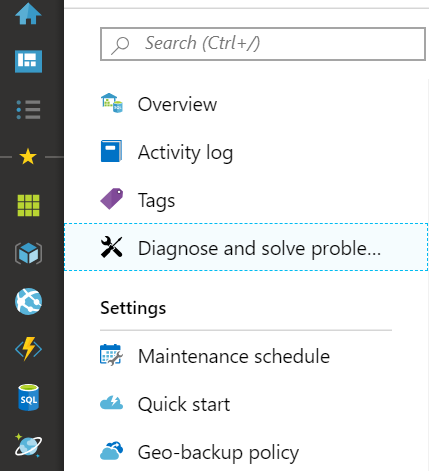

# Troubleshooting connectivity issues in dedicated SQL pool

This article lists common troubleshooting techniques around connecting to your dedicated SQL pool database.

## Check service availability

Check to see if the service is available. In the Azure portal, go to the dedicated SQL pool you're trying to connect. In the left TOC panel, click on **Diagnose and solve problems**.



The status of your dedicated SQL pool will be shown here. If the service isn't showing as **Available**, check further steps.


If your Resource health shows that your dedicated SQL pool instance is paused or scaling, follow the guidance to resume your instance.


Additional information about Resource Health can be found here.

## Check for paused or scaling operation

Check the portal to see if your dedicated SQL pool instance is paused or scaling.


If you see that your service is paused or scaling, check to see it isn't during your maintenance schedule. On the portal for your dedicated SQL pool *Overview*, you'll see the elected maintenance schedule.


Otherwise, check with your IT administrator to verify that this maintenance isn't a scheduled event. To resume the dedicated SQL pool instance, follow [these steps](pause-and-resume-compute-portal.md).

## Check your firewall settings

The dedicated SQL pool database communicates over port 1433.  If you're trying to connect from within a corporate network, outbound traffic over port 1433 might not be allowed by your network's firewall. In that case, you can't connect to your [logical server](../../azure-sql/database/logical-servers.md) unless your IT department opens port 1433. Additional information on firewall configurations can be found [here](../../azure-sql/database/firewall-configure.md?toc=/azure/synapse-analytics/sql-data-warehouse/toc.json&bc=/azure/synapse-analytics/sql-data-warehouse/breadcrumb/toc.json#create-and-manage-ip-firewall-rules).

## Check your VNet/Service Endpoint settings

If you're receiving Errors 40914 and 40615, see [error description and resolution here](../../azure-sql/database/vnet-service-endpoint-rule-overview.md?toc=/azure/synapse-analytics/sql-data-warehouse/toc.json&bc=/azure/synapse-analytics/sql-data-warehouse/breadcrumb/toc.json#errors-40914-and-40615).

## Check for the latest drivers

### Software

Check to make sure you're using the latest tools to connect to your dedicated SQL pool:

- SSMS
- Azure Data Studio
- SQL Server Data Tools (Visual Studio)

### Drivers

Check to make sure you're using the latest driver versions.  Using an older version of the drivers could result in unexpected behaviors as the older drivers may not support new features.

- [ODBC](/sql/connect/odbc/download-odbc-driver-for-sql-server?toc=/azure/synapse-analytics/sql-data-warehouse/toc.json&bc=/azure/synapse-analytics/sql-data-warehouse/breadcrumb/toc.json&view=azure-sqldw-latest)
- [JDBC](/sql/connect/jdbc/download-microsoft-jdbc-driver-for-sql-server?toc=/azure/synapse-analytics/sql-data-warehouse/toc.json&bc=/azure/synapse-analytics/sql-data-warehouse/breadcrumb/toc.json&view=azure-sqldw-latest)
- [OLE DB](/sql/connect/oledb/download-oledb-driver-for-sql-server?toc=/azure/synapse-analytics/sql-data-warehouse/toc.json&bc=/azure/synapse-analytics/sql-data-warehouse/breadcrumb/toc.json&view=azure-sqldw-latest)
- [PHP](/sql/connect/php/download-drivers-php-sql-server?toc=/azure/synapse-analytics/sql-data-warehouse/toc.json&bc=/azure/synapse-analytics/sql-data-warehouse/breadcrumb/toc.json&view=azure-sqldw-latest)

## Check your connection string

Check to make sure your connection strings are set properly.  Below are some samples.  You can find additional information around [connection strings here](sql-data-warehouse-connection-strings.md).

ADO.NET connection string

```csharp
Server=tcp:{your_server}.database.windows.net,1433;Database={your_database};User ID={your_user_name};Password={your_password_here};Encrypt=True;TrustServerCertificate=False;Connection Timeout=30;
```

ODBC Connection string

```csharp
Driver={SQL Server Native Client 11.0};Server=tcp:{your_server}.database.windows.net,1433;Database={your_database};Uid={your_user_name};Pwd={your_password_here};Encrypt=yes;TrustServerCertificate=no;Connection Timeout=30;
```

PHP Connection string

```PHP
Server: {your_server}.database.windows.net,1433 \r\nSQL Database: {your_database}\r\nUser Name: {your_user_name}\r\n\r\nPHP Data Objects(PDO) Sample Code:\r\n\r\ntry {\r\n   $conn = new PDO ( \"sqlsrv:server = tcp:{your_server}.database.windows.net,1433; Database = {your_database}\", \"{your_user_name}\", \"{your_password_here}\");\r\n    $conn->setAttribute( PDO::ATTR_ERRMODE, PDO::ERRMODE_EXCEPTION );\r\n}\r\ncatch ( PDOException $e ) {\r\n   print( \"Error connecting to SQL Server.\" );\r\n   die(print_r($e));\r\n}\r\n\rSQL Server Extension Sample Code:\r\n\r\n$connectionInfo = array(\"UID\" => \"{your_user_name}\", \"pwd\" => \"{your_password_here}\", \"Database\" => \"{your_database}\", \"LoginTimeout\" => 30, \"Encrypt\" => 1, \"TrustServerCertificate\" => 0);\r\n$serverName = \"tcp:{your_server}.database.windows.net,1433\";\r\n$conn = sqlsrv_connect($serverName, $connectionInfo);
```

JDBC connection string

```Java
jdbc:sqlserver://yourserver.database.windows.net:1433;database=yourdatabase;user={your_user_name};password={your_password_here};encrypt=true;trustServerCertificate=false;hostNameInCertificate=*.database.windows.net;loginTimeout=30;
```

## Intermittent connection issues

Check to see if you're experiencing heavy load on the server with a high number of queued requests. You may need to scale up your dedicated SQL pool for additional resources.

## Common error messages

Errors 40914 and 40615, see the [error description and resolution here](../../azure-sql/database/vnet-service-endpoint-rule-overview.md?toc=/azure/synapse-analytics/sql-data-warehouse/toc.json&bc=/azure/synapse-analytics/sql-data-warehouse/breadcrumb/toc.json#errors-40914-and-40615).

## Still having connectivity issues?

Create a [support ticket](sql-data-warehouse-get-started-create-support-ticket.md) so the engineering team can support you.
