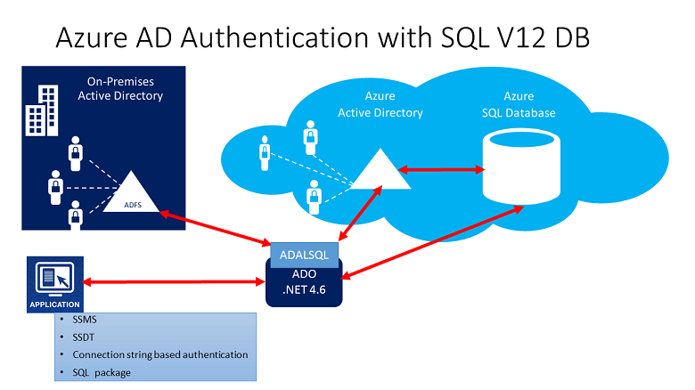
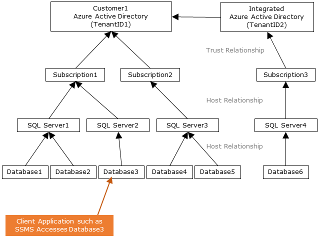
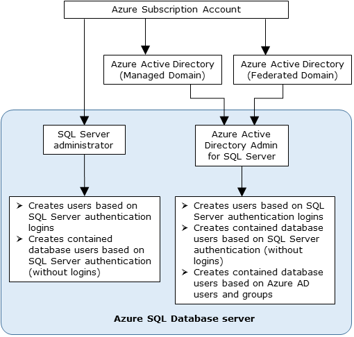

# Use Azure Active Directory Authentication for authentication with Synapse SQL

Azure Active Directory authentication is a mechanism that connects to [Azure Synapse Analytics](../overview-faq.md) by using identities in Azure Active Directory (Azure AD).

With Azure AD authentication, you can centrally manage user identities that have access to Azure Synapse to simplify permission management. Benefits include the following:

- It provides an alternative to regular username and password authentication.
- Helps stop the proliferation of user identities across servers.
- Allows password rotation in a single place.
- Customers can manage permissions using external (Azure AD) groups.
- It can eliminate storing passwords by enabling integrated Windows authentication and other forms of authentication supported by Azure Active Directory.
- Azure AD supports token-based authentication for applications connecting to Azure Synapse.
- Azure AD authentication supports ADFS (domain federation) or native user/password authentication for a local Azure Active Directory without domain synchronization.
- Azure AD supports connections from SQL Server Management Studio that use Active Directory Universal Authentication, which includes Multi-Factor Authentication (MFA).  MFA includes strong authentication with a range of easy verification options, including phone call, text message, smart cards with pin, or mobile app notification. For more information, see [SSMS support for Azure AD MFA with Synapse SQL](mfa-authentication.md).
- Azure AD supports similar connections from SQL Server Data Tools (SSDT) that use Active Directory Interactive Authentication. For more information, see
[Azure Active Directory support in SQL Server Data Tools (SSDT)](/sql/ssdt/azure-active-directory?toc=/azure/synapse-analytics/toc.json&bc=/azure/synapse-analytics/breadcrumb/toc.json&view=azure-sqldw-latest&preserve-view=true).

The configuration steps include the following procedures to configure and use Azure Active Directory authentication.

1. Create and populate Azure AD.
2. Create an Azure Active Directory identity
3. Assign role to created Azure Active Directory identity in Synapse workspace
4. Connect to Synapse Studio by using Azure AD identities.

## Azure AD pass-through in Azure Synapse Analytics

Azure Synapse Analytics enables you to access the data in the data lake using your Azure Active Directory identity.

Defining access rights on the files and data that is respected in different data engines enables you to simplify your data lake solutions by having a single place where the permissions are defined instead of having to define them in multiple places.

## Trust architecture

The following high-level diagram summarizes the solution architecture of using Azure AD authentication with Synapse SQL. To support Azure AD native user password, only the Cloud portion and Azure AD/Synapse Synapse SQL is considered. To support Federated authentication (or user/password for Windows credentials), the communication with ADFS block is required. The arrows indicate communication pathways.

The following diagram indicates the federation, trust, and hosting relationships that allow a client to connect to a database by submitting a token. The token is authenticated by an Azure AD, and is trusted by the database. 

Customer 1 can represent an Azure Active Directory with native users or an Azure AD with federated users. Customer 2 represents a possible solution including imported users; in this example coming from a federated Azure Active Directory with ADFS being synchronized with Azure Active Directory. 

It's important to understand that access to a database using Azure AD authentication requires that the hosting subscription is associated to the Azure AD. The same subscription must be used to create the SQL Server hosting the Azure SQL Database or dedicated SQL pool.

## Administrator structure

When using Azure AD authentication, there are two Administrator accounts for the Synapse SQL; the original SQL Server administrator and the Azure AD administrator. Only the administrator based on an Azure AD account can create the first Azure AD contained database user in a user database. 

The Azure AD administrator login can be an Azure AD user or an Azure AD group. When the administrator is a group account, it can be used by any group member, enabling multiple Azure AD administrators for the Synapse SQL instance. 

Using group account as an administrator enhances manageability by allowing you to centrally add and remove group members in Azure AD without changing the users or permissions in Azure Synapse Analytics workspace. Only one Azure AD administrator (a user or group) can be configured at any time.

## Permissions

To create new users, you must have the `ALTER ANY USER` permission in the database. The `ALTER ANY USER` permission can be granted to any database user. The `ALTER ANY USER` permission is also held by the server administrator accounts, and database users with the `CONTROL ON DATABASE` or `ALTER ON DATABASE` permission for that database, and by members of the `db_owner` database role.

To create a contained database user in Synapse SQL, you must connect to the database or instance using an Azure AD identity. To create the first contained database user, you must connect to the database by using an Azure AD administrator (who is the owner of the database). 

Any Azure AD authentication is only possible if the Azure AD admin was created for Synapse SQL. If the Azure Active Directory admin was removed from the server, existing Azure Active Directory users created previously inside Synapse SQL can no longer connect to the database using their Azure Active Directory credentials.
 
## Azure AD features and limitations

- The following members of Azure AD can be provisioned in Synapse SQL:

  - Native members: A member created in Azure AD in the managed domain or in a customer domain. For more information, see [Add your own domain name to Azure AD](../../active-directory/fundamentals/add-custom-domain.md?toc=/azure/synapse-analytics/toc.json&bc=/azure/synapse-analytics/breadcrumb/toc.json).
  - Federated domain members: A member created in Azure AD with a federated domain. For more information, see [Microsoft Azure now supports federation with Windows Server Active Directory](https://azure.microsoft.com/blog/20../../windows-azure-now-supports-federation-with-windows-server-active-directory/).
  - Imported members from other Azure ADs who are native or federated domain members.
  - Active Directory groups created as security groups.

- Azure AD users that are part of a group that has `db_owner` server role can't use the **[CREATE DATABASE SCOPED CREDENTIAL](/sql/t-sql/statements/create-database-scoped-credential-transact-sql?toc=/azure/synapse-analytics/toc.json&bc=/azure/synapse-analytics/breadcrumb/toc.json&view=azure-sqldw-latest&preserve-view=true)** syntax against Synapse SQL. You will see the following error:

    `SQL Error [2760] [S0001]: The specified schema name 'user@mydomain.com' either does not exist or you do not have permission to use it.`

    Grant the `db_owner` role directly to the individual Azure AD user to mitigate the **CREATE DATABASE SCOPED CREDENTIAL** issue.

- These system functions return NULL values when executed under Azure AD principals:

  - `SUSER_ID()`
  - `SUSER_NAME(<admin ID>)`
  - `SUSER_SNAME(<admin SID>)`
  - `SUSER_ID(<admin name>)`
  - `SUSER_SID(<admin name>)`

## Connect using Azure AD identities

Azure Active Directory authentication supports the following methods of connecting to a database using Azure AD identities:

- Azure Active Directory Password
- Azure Active Directory Integrated
- Azure Active Directory Universal with MFA
- Using Application token authentication

The following authentication methods are supported for Azure AD server principals (logins):

- Azure Active Directory Password
- Azure Active Directory Integrated
- Azure Active Directory Universal with MFA

### Additional considerations

- To enhance manageability, we recommend you provision a dedicated Azure AD group as an administrator.
- Only one Azure AD administrator (a user or group) can be configured for Synapse SQL pool at any time.
  - The addition of Azure AD server principals (logins) for Synapse SQL allows the possibility of creating multiple Azure AD server principals (logins) that can be added to the `sysadmin` role.
- Only an Azure AD administrator for Synapse SQL can initially connect to Synapse SQL using an Azure Active Directory account. The Active Directory administrator can configure subsequent Azure AD database users.
- We recommend setting the connection timeout to 30 seconds.
- SQL Server 2016 Management Studio and SQL Server Data Tools for Visual Studio 2015 (version 14.0.60311.1April 2016 or later) support Azure Active Directory authentication. (Azure AD authentication is supported by the **.NET Framework Data Provider for SqlServer**; at least version .NET Framework 4.6). So, the newest versions of these tools and data-tier applications (DAC and .BACPAC) can use Azure AD authentication.
- Beginning with version 15.0.1, [sqlcmd utility](/sql/tools/sqlcmd-utility?toc=/azure/synapse-analytics/toc.json&bc=/azure/synapse-analytics/breadcrumb/toc.json&view=azure-sqldw-latest&preserve-view=true) and [bcp utility](/sql/tools/bcp-utility?toc=/azure/synapse-analytics/toc.json&bc=/azure/synapse-analytics/breadcrumb/toc.json&view=azure-sqldw-latest&preserve-view=true) support Active Directory Interactive authentication with MFA.
- SQL Server Data Tools for Visual Studio 2015 requires at least the April 2016 version of the Data Tools (version 14.0.60311.1). Currently, Azure AD users aren't shown in SSDT Object Explorer. As a workaround, view the users in [sys.database_principals](/sql/relational-databases/system-catalog-views/sys-database-principals-transact-sql?toc=/azure/synapse-analytics/toc.json&bc=/azure/synapse-analytics/breadcrumb/toc.json&view=azure-sqldw-latest&preserve-view=true).
- [Microsoft JDBC Driver 6.0 for SQL Server](https://www.microsoft.com/download/details.aspx?id=11774) supports Azure AD authentication. Also, see [Setting the Connection Properties](/sql/connect/jdbc/setting-the-connection-properties?toc=/azure/synapse-analytics/toc.json&bc=/azure/synapse-analytics/breadcrumb/toc.json&view=azure-sqldw-latest&preserve-view=true).

## Next steps

- For an overview of access and control in Synapse SQL, see [Synapse SQL access control](../sql/access-control.md).
- For more information about database principals, see [Principals](/sql/relational-databases/security/authentication-access/principals-database-engine?toc=/azure/synapse-analytics/toc.json&bc=/azure/synapse-analytics/breadcrumb/toc.json&view=azure-sqldw-latest&preserve-view=true).
- For more information about database roles, see [Database roles](/sql/relational-databases/security/authentication-access/database-level-roles?toc=/azure/synapse-analytics/toc.json&bc=/azure/synapse-analytics/breadcrumb/toc.json&view=azure-sqldw-latest&preserve-view=true).

 