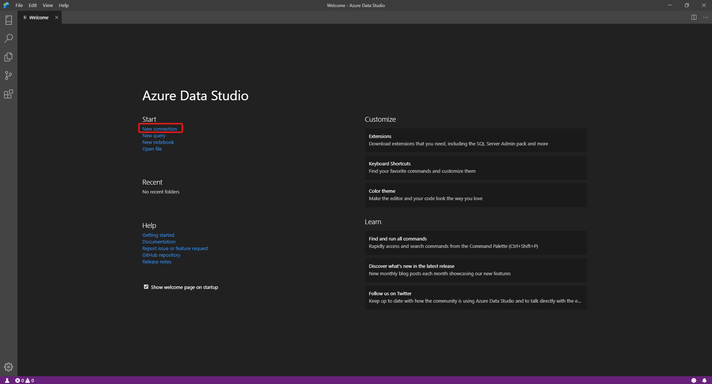
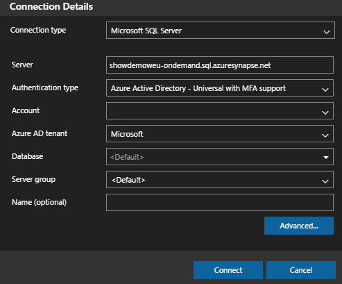
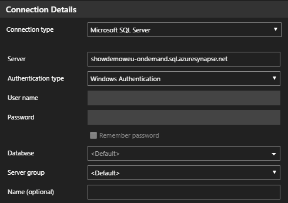
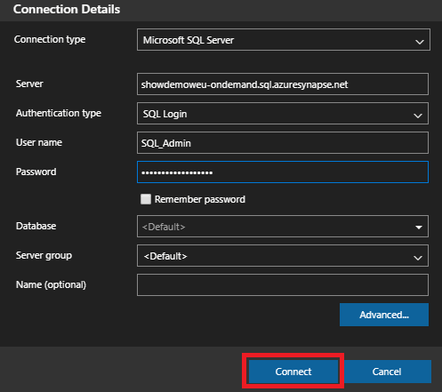

# Connect to Synapse SQL with Azure Data Studio

> [!div class="op_single_selector"]
>
> * [Azure Data Studio](get-started-azure-data-studio.md)
> * [Power BI](get-started-power-bi-professional.md)
> * [Visual Studio](../sql-data-warehouse/sql-data-warehouse-query-visual-studio.md?toc=/azure/synapse-analytics/toc.json&bc=/azure/synapse-analytics/breadcrumb/toc.json)
> * [sqlcmd](get-started-connect-sqlcmd.md)
> * [SSMS](get-started-ssms.md)

You can use [Azure Data Studio](/sql/azure-data-studio/download-azure-data-studio?view=azure-sqldw-latest&preserve-view=true) to connect to and query Synapse SQL in Azure Synapse Analytics. 

## Connect

To connect to Synapse SQL, open Azure Data Studio and select **New Connection**.



Choose **Microsoft SQL Server** as the **Connection type**.

The connection requires the following parameters:

* **Server:** Server in the form `<Azure Synapse workspace name>`-ondemand.sql.azuresynapse.net
* **Database:** Database name

> [!NOTE]
> If you would like to use **serverless SQL pool** the URL should look like:
>
> - `<Azure Synapse workspace name>`-ondemand.sql.azuresynapse.net.
>
> If you would like to use **dedicated SQL pool** the URL should look like:
>
> - `<Azure Synapse workspace name>`.sql.azuresynapse.net

Choose **Windows Authentication**, **Azure Active Directory**, or **SQL Login** as the **Authentication Type**.

To use **SQL Login** as the authentication type, add the username/password parameters:

* **User:** Server user in the form `<User>`
* **Password:** Password associated with the user

To use Azure Active Directory, you need to choose the needed authentication type.



The following screenshot shows the **Connection Details** for **Windows Authentication**:



The following screenshot shows the **Connection Details** using **SQL Login**:



After successful login, you should see a dashboard like this:


## Query

Once connected, you can query Synapse SQL using supported [Transact-SQL (T-SQL)](/sql/t-sql/language-reference?view=azure-sqldw-latest&preserve-view=true) statements against the instance. Select **New query** from the dashboard view to get started.


For example, you can use the following Transact-SQL statement to [query Parquet files](query-parquet-files.md) using serverless SQL pool:

```sql
SELECT COUNT(*)
FROM  
OPENROWSET(
    BULK 'https://azureopendatastorage.blob.core.windows.net/censusdatacontainer/release/us_population_county/year=20*/*.parquet',
    FORMAT='PARQUET'
)
```
## Next steps 
Explore other ways to connect to Synapse SQL: 

- [SSMS](get-started-ssms.md)
- [Power BI](get-started-power-bi-professional.md)
- [Visual Studio](../sql-data-warehouse/sql-data-warehouse-query-visual-studio.md?toc=/azure/synapse-analytics/toc.json&bc=/azure/synapse-analytics/breadcrumb/toc.json)
- [sqlcmd](get-started-connect-sqlcmd.md)

Visit [Use Azure Data Studio to connect and query data using a dedicated SQL pool in Azure Synapse Analytics](/sql/azure-data-studio/quickstart-sql-dw), for more information.
