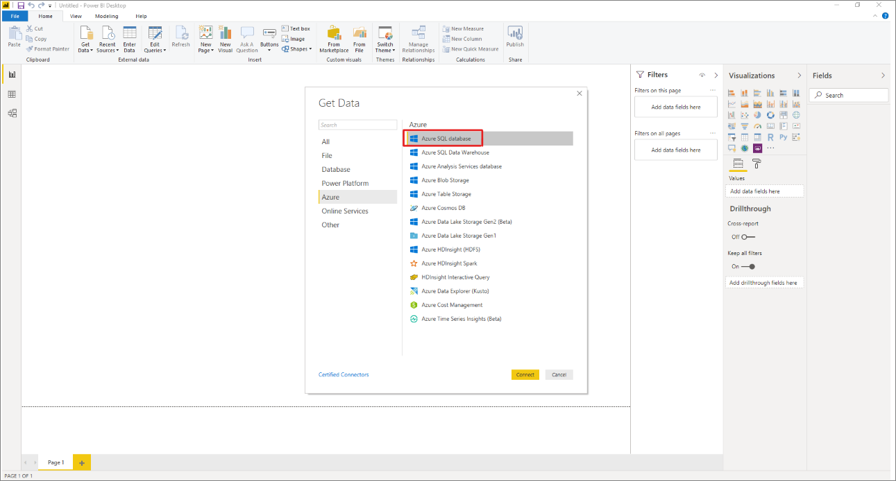
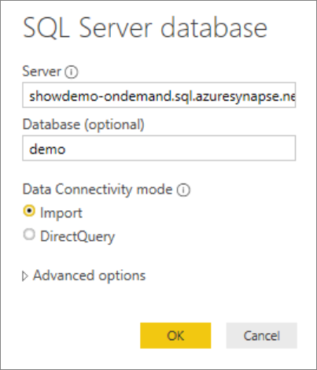

# Connect to Synapse SQL with Power BI Professional

> [!div class="op_single_selector"]
>
> - [Azure Data Studio](get-started-azure-data-studio.md)
> - [Power BI](get-started-power-bi-professional.md)
> - [Visual Studio](../sql-data-warehouse/sql-data-warehouse-query-visual-studio.md?toc=/azure/synapse-analytics/toc.json&bc=/azure/synapse-analytics/breadcrumb/toc.json)
> - [sqlcmd](../sql/get-started-connect-sqlcmd.md)
> - [SSMS](get-started-ssms.md)

In this tutorial, we will go through the steps for connecting Power BI desktop to SQL on-demand (preview).

## Prerequisites

Tool to issue queries:

- SQL client of your choice:

  - Azure Data Studio
  - SQL Server Management Studio

- Power BI desktop installed

Parameters:

| Parameter                                 | Description                                                   |
| ----------------------------------------- | ------------------------------------------------------------- |
| SQL on-demand service endpoint address    | Will be used as server name                                   |
| SQL on-demand service endpoint region     | Will be used to determine what storage will we use in samples |
| Username and password for endpoint access | Will be used to access endpoint                               |
| Database you'll use to create views     | This database will be used as starting point in samples       |

## First-time setup

There are two steps prior to using samples:

1. Create database for your views
2. Create credentials to be used by SQL on-demand to access files in storage

### Create database

For this getting started article, you should create your own database to utilize as a demo. A database is needed for views creation. You'll use this database in some of the sample queries within this documentation.

> [!NOTE]
> Databases are used only for viewing metadata, not for actual data.
>
> Write down the database name you're using, you'll need it later on.

```sql
DROP DATABASE IF EXISTS demo;
```

### Create credentials

We need to create credentials before you can run queries. This credential will be used by SQL on-demand service to access files in storage.

> [!NOTE]
> You need to create credentials for storage account access. Although SQL on-demand can access storage from different regions, having storage and Azure Synapse workspace in the same region will provide a better performance experience.

**Code snippet on how to create credentials for Census data containers**, run:

```sql
IF EXISTS (SELECT * FROM sys.credentials WHERE name = 'https://azureopendatastorage.blob.core.windows.net/censusdatacontainer')
DROP CREDENTIAL [https://azureopendatastorage.blob.core.windows.net/censusdatacontainer];
GO

-- Create credentials for Census Data container which resides in a azure open data storage account
-- There is no secret. We are using public storage account which doesn't need secret
CREATE CREDENTIAL [https://azureopendatastorage.blob.core.windows.net/censusdatacontainer]  
WITH IDENTITY='SHARED ACCESS SIGNATURE',  
SECRET = '';
GO
```

## Creating Power BI desktop report

Open the Power BI desktop application and select the **Get data** option.


### Step 1 - Select data source

Select **Azure** in the menu and then **Azure SQL Database**.


### Step 2 - Select database

Write the URL for the database and the name of the database where the view resides.


## Next steps

Advance to [Query storage files](get-started-azure-data-studio.md) to learn how to connect to SQL on-demand using Azure Data Studio.
 