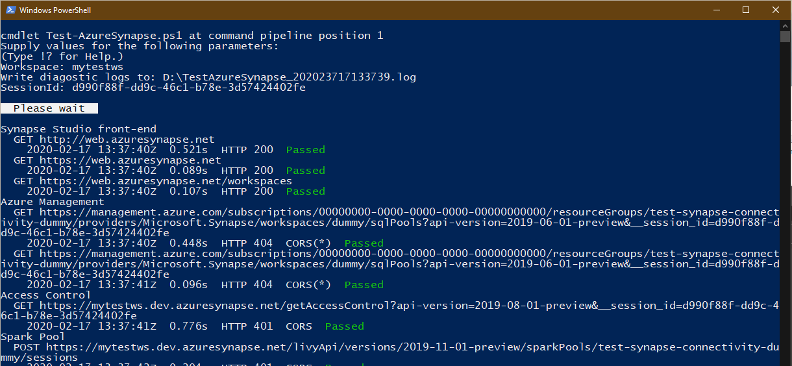
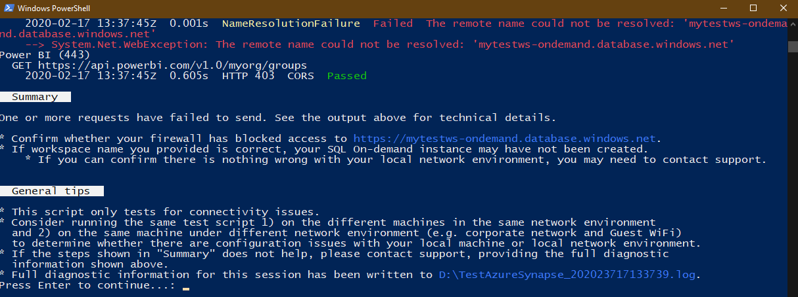

# Troubleshoot Synapse Studio connectivity with PowerShell

Azure Synapse Studio (preview) depends on a set of Web API endpoints to work properly. This guide will help you identify causes of connectivity issues when you're:
- configuring your local network (such as network behind a corporate firewall) for accessing Azure Synapse Studio.
- experiencing connectivity issues using Azure Synapse Studio.

## Prerequisite

* PowerShell 5.0 or higher version on Windows, or
* PowerShell Core 6.0 or higher version on Windows or Linux.

## Troubleshooting steps

Right-click on the following link, and select "Save target as":

- [Test-AzureSynapse.ps1](https://go.microsoft.com/fwlink/?linkid=2119734)

Alternatively, you may open the link directly, and save the opened script file. Don't save the address of the link above, as it may change in the future.

In file explorer, right-click on the downloaded script file, and select "Run with PowerShell".

When prompted, enter the Azure Synapse workspace name that is currently experiencing a problem or that you want to test for connectivity, and press enter.

The diagnostic session will be started. Wait for it to complete.

In the end, a diagnosis summary will be shown. If your PC cannot connect to one or more of the endpoints, it will show some suggestions in the "Summary" section.

Additionally, a diagnostic log file for this session will be generated in the same folder as the troubleshooting script. Its location is shown in "General tips" section (`D:\TestAzureSynapse_2020....log`). You may send this file to technical support if necessary.

If you're a network administrator and tuning your firewall configuration for Azure Synapse Studio, the technical details shown above the "Summary" section may help.

* All the test items (requests) marked with "Passed" mean they have passed connectivity tests, regardless of the HTTP status code.
 For the failed requests, the reason is shown in yellow, such as `NamedResolutionFailure` or `ConnectFailure`. These reasons may help you figure out whether there are misconfigurations with your network environment.

## Next steps
If the previous steps don't help to resolve your issue, [create a support ticket](../../sql-data-warehouse/sql-data-warehouse-get-started-create-support-ticket.md).
