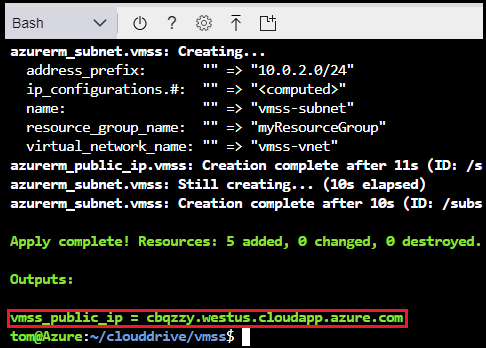
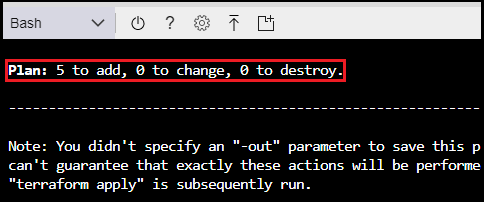
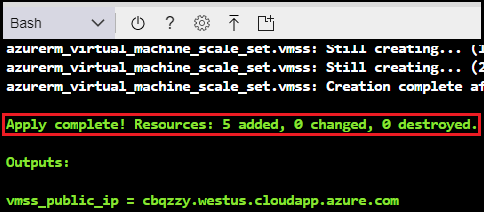
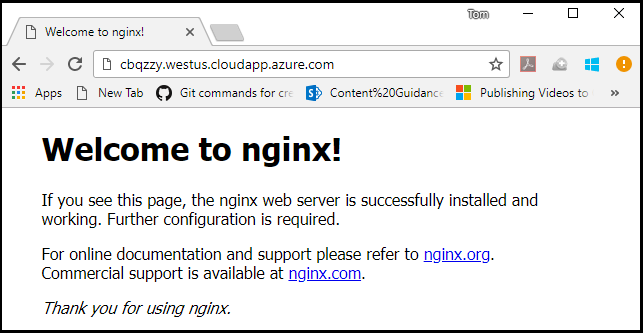

# Tutorial: Create an Azure virtual machine scale set using Terraform

[Azure virtual machine scale sets](/azure/virtual-machine-scale-sets) allow you to configure identical VMs. The number of VM instances can adjust based on demand or a schedule. For more information, see [Automatically scale a virtual machine scale set in the Azure portal](/azure/virtual-machine-scale-sets/virtual-machine-scale-sets-autoscale-portal).

In this tutorial, you learn how to use [Azure Cloud Shell](/azure/cloud-shell/overview) to do the following tasks:

> [!div class="checklist"]
> * Set up a Terraform deployment
> * Use variables and outputs for Terraform deployment
> * Create and deploy network infrastructure
> * Create and deploy a virtual machine scale set and attach it to the network
> * Create and deploy a jumpbox to connect to the VMs via SSH

> [!NOTE]
> The most recent version of the Terraform configuration files used in this article are in the [Awesome Terraform repository on GitHub](https://github.com/Azure/awesome-terraform/tree/master/codelab-vmss).

## Prerequisites

- **Azure subscription**: If you don't have an Azure subscription, create a [free account](https://azure.microsoft.com/free/?ref=microsoft.com&utm_source=microsoft.com&utm_medium=docs&utm_campaign=visualstudio) before you begin.

- **Install Terraform**: Follow the directions in the article, [Terraform and configure access to Azure](terraform-install-configure.md)

- **Create an SSH key pair**: For more information, see [How to create and use an SSH public and private key pair for Linux VMs in Azure](/azure/virtual-machines/linux/mac-create-ssh-keys).

## Create the directory structure

1. Browse to the [Azure portal](https://portal.azure.com).

1. Open [Azure Cloud Shell](/azure/cloud-shell/overview). If you didn't select an environment previously, select **Bash** as your environment.

    

1. Change directories to the `clouddrive` directory.

    ```bash
    cd clouddrive
    ```

1. Create a directory named `vmss`.

    ```bash
    mkdir vmss
    ```

1. Change directories to the new directory:

    ```bash
    cd vmss
    ```

## Create the variables definitions file
In this section, you define the variables that customize the resources created by Terraform.

Within the Azure Cloud Shell, do the following steps:

1. Create a file named `variables.tf`.

    ```bash
    code variables.tf
    ```

1. Paste the following code into the editor:

   ```hcl
   variable "location" {
    description = "The location where resources will be created"
   }

   variable "tags" {
    description = "A map of the tags to use for the resources that are deployed"
    type        = "map"

    default = {
      environment = "codelab"
    }
   }

   variable "resource_group_name" {
    description = "The name of the resource group in which the resources will be created"
    default     = "myResourceGroup"
   }
   ```

1. Save the file (**&lt;Ctrl>S**) and exit the editor (**&lt;Ctrl>Q**).

## Create the output definitions file
In this section, you create the file that describes the output after deployment.

Within the Azure Cloud Shell, do the following steps:

1. Create a file named `output.tf`.

    ```bash
    code output.tf
    ```

1. Paste the following code into the editor to expose the fully qualified domain name (FQDN) for the virtual machines.
   :

   ```hcl
    output "vmss_public_ip" {
        value = azurerm_public_ip.vmss.fqdn
    }
   ```

1. Save the file (**&lt;Ctrl>S**) and exit the editor (**&lt;Ctrl>Q**).

## Define the network infrastructure in a template
In this section, you create the following network infrastructure in a new Azure resource group:

  - One virtual network (VNET) with the address space of 10.0.0.0/16
  - One subnet with the address space of 10.0.2.0/24
  - Two public IP addresses. One used by the virtual machine scale set load balancer, the other used to connect to the SSH jumpbox.

Within the Azure Cloud Shell, do the following steps:

1. Create a file named `vmss.tf` to describe the virtual machine scale set infrastructure.

    ```bash
    code vmss.tf
    ```

1. Paste the following code to the end of the file to expose the fully qualified domain name (FQDN) for the virtual machines.

   ```hcl
   resource "azurerm_resource_group" "vmss" {
    name     = var.resource_group_name
    location = var.location
    tags     = var.tags
   }

   resource "random_string" "fqdn" {
    length  = 6
    special = false
    upper   = false
    number  = false
   }

   resource "azurerm_virtual_network" "vmss" {
    name                = "vmss-vnet"
    address_space       = ["10.0.0.0/16"]
    location            = var.location
    resource_group_name = azurerm_resource_group.vmss.name
    tags                = var.tags
   }

   resource "azurerm_subnet" "vmss" {
    name                 = "vmss-subnet"
    resource_group_name  = azurerm_resource_group.vmss.name
    virtual_network_name = azurerm_virtual_network.vmss.name
    address_prefix       = "10.0.2.0/24"
   }

   resource "azurerm_public_ip" "vmss" {
    name                         = "vmss-public-ip"
    location                     = var.location
    resource_group_name          = azurerm_resource_group.vmss.name
    allocation_method = "Static"
    domain_name_label            = random_string.fqdn.result
    tags                         = var.tags
   }
   ```

1. Save the file (**&lt;Ctrl>S**) and exit the editor (**&lt;Ctrl>Q**).

## Provision the network infrastructure
Using the Azure Cloud Shell from the directory where you created the configuration files (.tf) do the following steps:

1. Initialize Terraform.

   ```bash
   terraform init
   ```

1. Run the following command to deploy the defined infrastructure in Azure.

   ```bash
   terraform apply
   ```

   Terraform prompts you for a `location` value as the `location` variable is defined in `variables.tf`, but it's never set. You can enter any valid location - such as "West US" followed by selecting Enter. (Use parentheses around any value with spaces.)

1. Terraform prints the output as defined in the `output.tf` file. As shown in the following screenshot, the FQDN takes the following form: `<ID>.<location>.cloudapp.azure.com`. The ID is a computed value and location is the value provide when running Terraform.

   

1. In the Azure portal menu, select **Resource groups** from the main menu.

1. On the **Resource groups** tab, select **myResourceGroup** to view the resources that were created by Terraform.
   

## Add a virtual machine scale set

In this section, you learn how to add the following resources to the template:

- An Azure load balancer and rules to serve the application and attach it to the public IP address configured earlier in this article
- An Azure backend address pool and assign it to the load balancer
- A health probe port used by the application and configured on the load balancer
- A virtual machine scale set sitting behind the load balancer that runs on the VNET deployed earlier in this article
- [Nginx](https://nginx.org/) on the nodes of the virtual machine scale using [cloud-init](https://cloudinit.readthedocs.io/en/latest/).

In Cloud Shell, do the following steps:

1. Open the `vmss.tf` configuration file.

   ```bash
   code vmss.tf
   ```

1. Go to the end of the file and enter append mode by selecting the A key.

1. Paste the following code to the end of the file:

   ```hcl
   resource "azurerm_lb" "vmss" {
    name                = "vmss-lb"
    location            = var.location
    resource_group_name = azurerm_resource_group.vmss.name

    frontend_ip_configuration {
      name                 = "PublicIPAddress"
      public_ip_address_id = azurerm_public_ip.vmss.id
    }

    tags = var.tags
   }

   resource "azurerm_lb_backend_address_pool" "bpepool" {
    resource_group_name = azurerm_resource_group.vmss.name
    loadbalancer_id     = azurerm_lb.vmss.id
    name                = "BackEndAddressPool"
   }

   resource "azurerm_lb_probe" "vmss" {
    resource_group_name = azurerm_resource_group.vmss.name
    loadbalancer_id     = azurerm_lb.vmss.id
    name                = "ssh-running-probe"
    port                = var.application_port
   }

   resource "azurerm_lb_rule" "lbnatrule" {
      resource_group_name            = azurerm_resource_group.vmss.name
      loadbalancer_id                = azurerm_lb.vmss.id
      name                           = "http"
      protocol                       = "Tcp"
      frontend_port                  = var.application_port
      backend_port                   = var.application_port
      backend_address_pool_id        = azurerm_lb_backend_address_pool.bpepool.id
      frontend_ip_configuration_name = "PublicIPAddress"
      probe_id                       = azurerm_lb_probe.vmss.id
   }

   resource "azurerm_virtual_machine_scale_set" "vmss" {
    name                = "vmscaleset"
    location            = var.location
    resource_group_name = azurerm_resource_group.vmss.name
    upgrade_policy_mode = "Manual"

    sku {
      name     = "Standard_DS1_v2"
      tier     = "Standard"
      capacity = 2
    }

    storage_profile_image_reference {
      publisher = "Canonical"
      offer     = "UbuntuServer"
      sku       = "16.04-LTS"
      version   = "latest"
    }

    storage_profile_os_disk {
      name              = ""
      caching           = "ReadWrite"
      create_option     = "FromImage"
      managed_disk_type = "Standard_LRS"
    }

    storage_profile_data_disk {
      lun          = 0
      caching        = "ReadWrite"
      create_option  = "Empty"
      disk_size_gb   = 10
    }

    os_profile {
      computer_name_prefix = "vmlab"
      admin_username       = var.admin_user
      admin_password       = var.admin_password
      custom_data          = file("web.conf")
    }

    os_profile_linux_config {
      disable_password_authentication = false
    }

    network_profile {
      name    = "terraformnetworkprofile"
      primary = true

      ip_configuration {
        name                                   = "IPConfiguration"
        subnet_id                              = azurerm_subnet.vmss.id
        load_balancer_backend_address_pool_ids = [azurerm_lb_backend_address_pool.bpepool.id]
        primary = true
      }
    }

    tags = var.tags
   }
   ```

1. Save the file and exit the vi editor by entering the following command:

    ```bash
    :wq
    ```

1. Create a file named `web.conf` to serve as the cloud-init configuration for the virtual machines that are part of the scale set.

    ```bash
    code web.conf
    ```

1. Paste the following code into the editor:

   ```hcl
   #cloud-config
   packages:
    - nginx
   ```

1. Save the file and exit the vi editor by entering the following command:

     ```bash
     :wq
     ```

1. Open the `variables.tf` configuration file.

    ```bash
    code variables.tf
    ```

1. Go to the end of the file and enter append mode by selecting the A key.

1. Customize the deployment by pasting the following code to the end of the file:

    ```hcl
    variable "application_port" {
       description = "The port that you want to expose to the external load balancer"
       default     = 80
    }

    variable "admin_user" {
       description = "User name to use as the admin account on the VMs that will be part of the VM Scale Set"
       default     = "azureuser"
    }

    variable "admin_password" {
       description = "Default password for admin account"
    }
    ```

1. Save the file (**&lt;Ctrl>S**) and exit the editor (**&lt;Ctrl>Q**).

1. Create a Terraform plan to visualize the virtual machine scale set deployment. (You need to specify a password of your choosing, as well as the location for your resources.)

    ```bash
    terraform plan
    ```

    The output of the command should be similar to the following screenshot:

    

1. Deploy the new resources in Azure.

    ```bash
    terraform apply
    ```

    The output of the command should be similar to the following screenshot:

    

1. Open a browser and connect to the FQDN that was returned by the command.

    

## Add an SSH jumpbox
An SSH *jumpbox* is a single server that you "jump" through to access other servers on the network. In this step, you configure the following resources:

- A network interface (or jumpbox) connected to the same subnet as the virtual machine scale set.

- A virtual machine connected with this network interface. This 'jumpbox' is remotely accessible. Once connected, you can SSH to any of the virtual machines in the scale set.

1. Open the `vmss.tf` configuration file.

   ```bash
   code vmss.tf
   ```

1. Go to the end of the file and enter append mode by selecting the A key.

1. Paste the following code to the end of the file:

   ```hcl
   resource "azurerm_public_ip" "jumpbox" {
    name                         = "jumpbox-public-ip"
    location                     = var.location
    resource_group_name          = azurerm_resource_group.vmss.name
    allocation_method = "Static"
    domain_name_label            = "${random_string.fqdn.result}-ssh"
    tags                         = var.tags
   }

   resource "azurerm_network_interface" "jumpbox" {
    name                = "jumpbox-nic"
    location            = var.location
    resource_group_name = azurerm_resource_group.vmss.name

    ip_configuration {
      name                          = "IPConfiguration"
      subnet_id                     = azurerm_subnet.vmss.id
      private_ip_address_allocation = "dynamic"
      public_ip_address_id          = azurerm_public_ip.jumpbox.id
    }

    tags = var.tags
   }

   resource "azurerm_virtual_machine" "jumpbox" {
    name                  = "jumpbox"
    location              = var.location
    resource_group_name   = azurerm_resource_group.vmss.name
    network_interface_ids = [azurerm_network_interface.jumpbox.id]
    vm_size               = "Standard_DS1_v2"

    storage_image_reference {
      publisher = "Canonical"
      offer     = "UbuntuServer"
      sku       = "16.04-LTS"
      version   = "latest"
    }

    storage_os_disk {
      name              = "jumpbox-osdisk"
      caching           = "ReadWrite"
      create_option     = "FromImage"
      managed_disk_type = "Standard_LRS"
    }

    os_profile {
      computer_name  = "jumpbox"
      admin_username = var.admin_user
      admin_password = var.admin_password
    }

    os_profile_linux_config {
      disable_password_authentication = false
    }

    tags = var.tags
   }
   ```

1. Open the `output.tf` configuration file.

   ```bash
   code output.tf
   ```

1. Go to the end of the file and enter append mode by selecting the A key.

1. Paste the following code to the end of the file to display the hostname of the jumpbox when the deployment is complete:

   ```hcl
   output "jumpbox_public_ip" {
      value = azurerm_public_ip.jumpbox.fqdn
   }
   ```

1. Save the file (**&lt;Ctrl>S**) and exit the editor (**&lt;Ctrl>Q**).

1. Deploy the jumpbox.

   ```bash
   terraform apply
   ```

Once the deployment has completed, the content of the resource group resembles that shown in the following screenshot:


> [!NOTE]
> The ability to log in with a password is disabled on the jumpbox and the virtual machine scale set that you deployed. Log in with SSH to access the virtual machine(s).

## Environment cleanup

To delete the Terraform resources that were created in this tutorial, enter the following command into Cloud Shell:

```bash
terraform destroy
```

The destruction process can take several minutes to complete.

## Next steps

> [!div class="nextstepaction"] 
> [Learn more about using Terraform in Azure](/azure/terraform)
