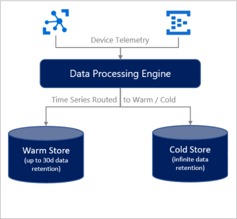
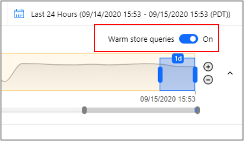

# Data Storage

This article describes data storage in Azure Time Series Insights Gen2. It covers warm and cold, data availability, and best practices.

## Provisioning

When you create an Azure Time Series Insights Gen2 environment, you have the following options:

* Cold data storage:
  * Create a new Azure Storage resource in the subscription and region you’ve chosen for your environment.
  * Attach a pre-existing Azure Storage account. This option is only available by deploying from an Azure Resource Manager [template](/azure/templates/microsoft.timeseriesinsights/allversions), and is not visible in the Azure portal.
* Warm data storage:
  * A warm store is optional, and can be enabled or disabled during or after time of provisioning. If you decide to enable warm store at a later time and there is already data in your cold store, review [this](concepts-storage.md#warm-store-behavior) section below to understand the expected behavior. The warm store data retention time can be configured for 7 to 31 days, and this can also be adjusted as needed.

When an event is ingested, it is indexed in both warm store (if enabled) and cold store.

> [!WARNING]
> As the owner of the Azure Blob storage account where cold store data resides, you have full access to all data in the account. This access includes write and delete permissions. Don't edit or delete the data that Azure Time Series Insights Gen2 writes because that can cause data loss.

## Data availability

Azure Time Series Insights Gen2 partitions and indexes data for optimum query performance. Data becomes available to query from both warm (if enabled) and cold store after it's indexed. The amount of data that's being ingested and the per-partition throughput rate can affect availability. Review the event source [throughput limitations](./concepts-streaming-ingress-throughput-limits.md) and [best practices](./concepts-streaming-ingestion-event-sources.md#streaming-ingestion-best-practices) for best performance. You can also configure a lag [alert](./time-series-insights-environment-mitigate-latency.md#monitor-latency-and-throttling-with-alerts) to be notified if your environment is experiencing issues processing data.

> [!IMPORTANT]
> You might experience a period of up to 60 seconds before data becomes available via the [Time Series Query APIs](./concepts-query-overview.md). If you experience significant latency beyond 60 seconds, please submit a support ticket through the Azure portal.
> 
> You might experience a period of up to 5 minutes before data becomes available when directly accessing the Parquet files outside of Azure Time Series Insights Gen2. See the [Parquet file format](#parquet-file-format-and-folder-structure) section for more information.

## Warm store

Data in your warm store is available only via the [Time Series Query APIs](./concepts-query-overview.md), the [Azure Time Series Insights TSI Explorer](./concepts-ux-panels.md), or the [Power BI Connector](./how-to-connect-power-bi.md). Warm store queries are free and there is no quota, but there is a [limit of 30](/rest/api/time-series-insights/reference-api-limits#query-apis---limits) concurrent requests.

### Warm store behavior

* When enabled, all data streamed into your environment will be routed to your warm store, regardless of the event timestamp. Note that the streaming ingestion pipeline is built for near-real time streaming and ingesting historical events is [not supported](./concepts-streaming-ingestion-event-sources.md#historical-data-ingestion).
* The retention period is calculated based on when the event was indexed in warm store, not the event timestamp. This means that data is no longer available in warm store after the retention period has elapsed, even if the event timestamp is for the future.
  * Example: an event with 10-day weather forecasts is ingested and indexed in a warm storage container configured with a 7-day retention period. After seven days, the prediction is no longer accessible in warm store, but can be queried from cold.
* If you enable warm store on an existing environment that already has recent data indexed in cold storage, note that your warm store will not be back-filled with this data.
* If you just enabled warm store and are experiencing issues viewing your recent data in the Explorer, you can temporarily toggle warm store queries off:

   

## Cold store

This section describes Azure Storage details relevant to Azure Time Series Insights Gen2.

For a thorough description of Azure Blob storage, read the [Storage blobs introduction](../storage/blobs/storage-blobs-introduction.md).

### Your cold storage account

Azure Time Series Insights Gen2 retains up to two copies of each event in your Azure Storage account. One copy stores events ordered by ingestion time, always allowing access to events in a time-ordered sequence. Over time, Azure Time Series Insights Gen2 also creates a repartitioned copy of the data to optimize for performant queries.

All of your data is stored indefinitely in your Azure Storage account.

> [!WARNING]
> Do not restrict Public Internet access to the storage account used by Time Series Insights or the necessary connection will be broken.

#### Writing and editing blobs

To ensure query performance and data availability, don't edit or delete any blobs that Azure Time Series Insights Gen2 creates.

#### Accessing cold store data

In addition to accessing your data from the [Azure Time Series Insights Explorer](./concepts-ux-panels.md) and [Time Series Query APIs](./concepts-query-overview.md), you may also want to access your data directly from the Parquet files stored in the cold store. For example, you can read, transform, and cleanse data in a Jupyter notebook, then use it to train your Azure Machine Learning model in the same Spark workflow.

To access data directly from your Azure Storage account, you need read access to the account used to store your Azure Time Series Insights Gen2 data. You can then read selected data based on the creation time of the Parquet file located in the `PT=Time` folder described below in the [Parquet file format](#parquet-file-format-and-folder-structure) section.  For more information on enabling read access to your storage account, see [Manage access to your storage account resources](../storage/blobs/anonymous-read-access-configure.md).

#### Data deletion

Don't delete your Azure Time Series Insights Gen2 files. Manage related data from within Azure Time Series Insights Gen2 only.

### Parquet file format and folder structure

Parquet is an open-source columnar file format designed for efficient storage and performance. Azure Time Series Insights Gen2 uses Parquet to enable Time Series ID-based query performance at scale.

For more information about the Parquet file type, read the [Parquet documentation](https://parquet.apache.org/documentation/latest/).

Azure Time Series Insights Gen2 stores copies of your data as follows:

* The `PT=Time` folder is partitioned by ingestion time and stores data roughly in order of arrival. This data is preserved over time and you can directly access it from outside of Azure Time Series Insight Gen2, such as from your Spark notebooks. The timestamp `<YYYYMMDDHHMMSSfff>` corresponds to the ingestion time of the data. The `<MinEventTimeStamp>` and `<MaxEventTimeStamp>` correspond to the range of event timestamps included in the file. The path and filename are formatted as:

  `V=1/PT=Time/Y=<YYYY>/M=<MM>/<BlobCreationTimestamp>_<MinEventTimestamp>_<MaxEventTimestamp>_<TsiInternalSuffix>.parquet`

* The `PT=Live` and `PT=Tsid` folders contain a second copy of your data, repartitioned for time series query performance at scale. This data is optimized over time and is not static. During repartitioning, some events could be present in multiple blobs and the blob names might change.  These folders are used by Azure Time Series Insights Gen2 and should not be accessed directly; you should only use `PT=Time` for that purpose.

> [!NOTE]
>
> Data in the `PT=Time` folder from before June 2021 could have a filename format with no event time ranges: `V=1/PT=Time/Y=<YYYY>/M=<MM>/<BlobCreationTimestamp>_<TsiInternalSuffix>.parquet`.  The internal file format is the same and files with both naming schemes can be used together. 
>
> * `<YYYY>` maps to a four-digit year representation.
> * `<MM>` maps to a two-digit month representation.
> * The `<YYYYMMDDHHMMSSfff>` format of the timestamps map to a four-digit year (`YYYY`), two-digit month (`MM`), two-digit day (`DD`), two-digit hour (`HH`), two-digit minute (`MM`), two-digit second (`SS`), and three-digit millisecond (`fff`).

Azure Time Series Insights Gen2 events are mapped to Parquet file contents as follows:

* Each event maps to a single row.
* Every row includes the **timestamp** column with an event time stamp. The time-stamp property is never null. It defaults to the **event enqueued time** if the time stamp property isn't specified in the event source. The stored time-stamp is always in UTC.
* Every row includes the Time Series ID (TSID) column(s) as defined when the Azure Time Series Insights Gen2 environment is created. The TSID property name includes the `_string` suffix.
* All other properties sent as telemetry data are mapped to column names that end with `_bool` (boolean), `_datetime` (time stamp), `_long` (long), `_double` (double), `_string` (string), or `_dynamic` (dynamic), depending on the property type.  For more information, read about [Supported data types](./concepts-supported-data-types.md).
* This mapping schema applies to the first version of the file format, referenced as **V=1**, and stored in the base folder of the same name. As this feature evolves, this mapping schema might change and the reference name incremented.

## Next steps

* Read about [data modeling](./concepts-model-overview.md).

* Plan your [Azure Time Series Insights Gen2 environment](./how-to-plan-your-environment.md).
