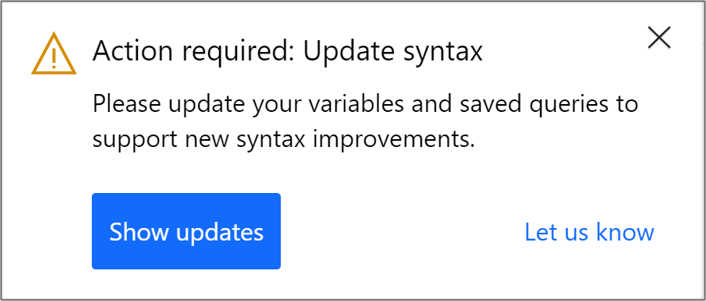
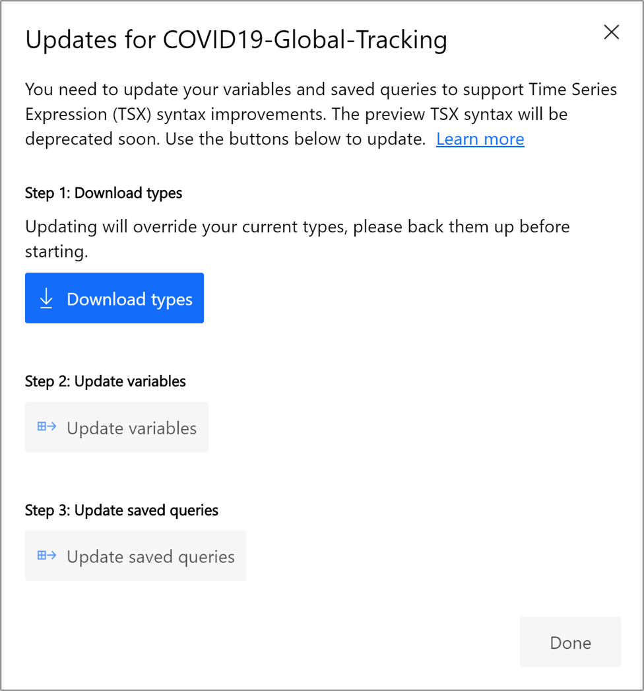
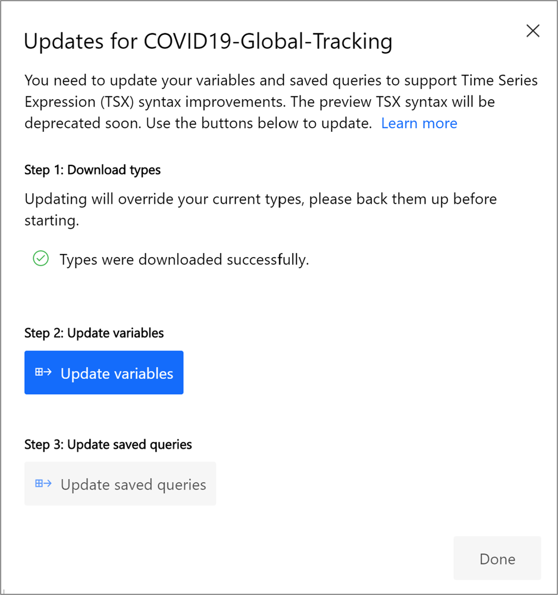
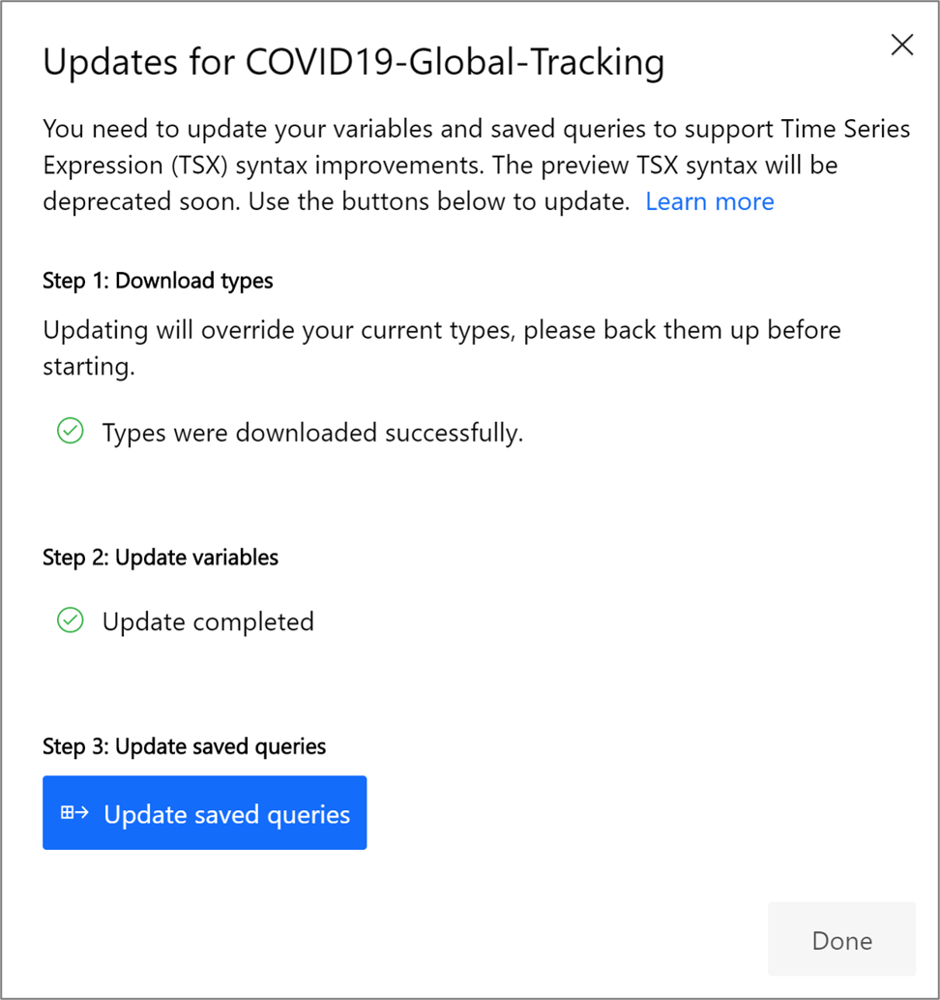
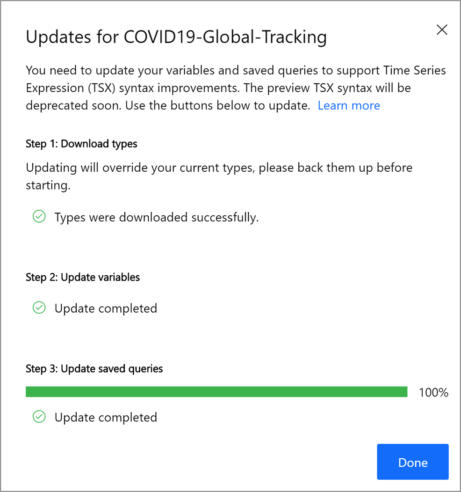

# Migrating to new Azure Time Series Insights Gen2 API versions

## Overview

If you have created an Azure Time Series Insights Gen2 environment when it was in Public Preview (before July 16th, 2020), please update your TSI environment to use the new generally available versions of APIs by following the steps described in this article. This change does not affect any users who are using the Gen1 version of Azure Time Series Insights.

> [!IMPORTANT]
> The updates described in this article will ONLY upgrade the API versions used by your TSI environment. This change is unrelated to the new [JSON flattening and escaping rules](./concepts-json-flattening-escaping-rules.md) introduced for Gen2 environments.

The new API version is `2020-07-31` and uses an updated [Time Series Expression Syntax](/rest/api/time-series-insights/reference-time-series-expression-syntax).

Users must migrate their environment's [Time Series Model variables](./concepts-variables.md), saved queries, Power BI queries, and any custom tools making calls to the API endpoints. If you have any questions or concerns about the migration process, submit a support ticket through the Azure portal and mention this document.

> [!IMPORTANT]
> The Preview API version `2018-11-01-preview` will continue to be supported until October 31st, 2020. Please complete all applicable steps of this migration before then to avoid any disruptions in service.

## Migrate Time Series Model and saved queries

To help users migrate their [Time Series Model variables](./concepts-variables.md) and saved queries, there is a built-in tool available through the [Azure Time Series Insights Explorer](https://insights.timeseries.azure.com). Navigate to the environment you wish to migrate and follow the steps below. **You can complete the migration partially and return to complete it at a later time, however, none of the updates can be reverted.**

> [!NOTE]
> You must be a Contributor to the environment to make updates to the Time Series Model and saved queries. If you are not a Contributor, you will only be able to migrate your personal saved queries. Please review [environment access policies](./concepts-access-policies.md) and your access level before proceeding.

1. You will be prompted by the Explorer to update the syntax used by your Time Series Model variables and saved queries.

    [](media/v2-update-overview/overview-one.png#lightbox)

    If you accidentally close the notification, it can be found in the notification panel.

1. Click **Show Updates** to open the migration tool.

1. Click **Download types**. Since migration will overwrite your current Types to alter variable syntax, you will be required to save a copy of your current Types. The tool will notify you when Types have been downloaded.

    [](media/v2-update-overview/overview-one.png#lightbox)

1. Click **Update variables**. The tool will notify you when variables have been updated.

    > [!IMPORTANT]
    > If you update your Types, custom applications using an older API version (`2018-11-01-preview`) will need to use the new API version (`2020-07-31`) to continue working. If you aren't sure what API version you're using, check with your Admin before updating. You can close the migration tool and return to these steps later. Read more about [how to migrate custom applications](#migrate-custom-applications).

    [](media/v2-update-overview/overview-one.png#lightbox)

1. Click **Update saved queries**. The tool will notify you when saved queries have been updated.

    [](media/v2-update-overview/overview-one.png#lightbox)

1. Click **Done**.

    [](media/v2-update-overview/overview-one.png#lightbox)

Review your updated environment by charting some of the newly created variables and saved queries. If you see any unexpected behavior while charting, please send us feedback using the feedback tool in the Explorer.

## Migrate Power BI queries

If you have generated queries using the Power BI Connector, they are making calls to Azure Time Series Insights using the Preview API version and old Time Series Expression Syntax. These queries will continue to successfully retrieve data until the Preview API is deprecated.

To update the queries to use the new API version and new Time Series Expression Syntax, queries will need to be regenerated from the Explorer. Read more about how to [create queries using the Power BI Connector](./how-to-connect-power-bi.md).

> [!NOTE]
> You must be using the July 2020 Version of Power BI Desktop. If not you may see an [invalid query payload version error](./how-to-diagnose-troubleshoot.md#problem-power-bi-connector-shows-unable-to-connect).

## Migrate custom applications

If your custom application is making calls to the following REST endpoints, it is sufficient to update the API version to `2020-07-31` in the URI:

- Time Series Model APIs
  - Model Settings APIs
    - [Get](/rest/api/time-series-insights/dataaccessgen2/modelsettings/get)
    - [Update](/rest/api/time-series-insights/dataaccessgen2/modelsettings/update)
  - Instance APIs
    - [All Batch Operations](/rest/api/time-series-insights/dataaccessgen2/timeseriesinstances/executebatch)
    - [List](/rest/api/time-series-insights/dataaccessgen2/timeseriesinstances/list)
    - [Search](/rest/api/time-series-insights/dataaccessgen2/timeseriesinstances/search)
    - [Suggest](/rest/api/time-series-insights/dataaccessgen2/timeseriesinstances/suggest)
  - Hierarchy APIs
    - [All Batch Operations](/rest/api/time-series-insights/dataaccessgen2/timeserieshierarchies/executebatch)
    - [List](/rest/api/time-series-insights/dataaccessgen2/timeserieshierarchies/list)
  - Types APIs
    - [Delete, Get Operations](/rest/api/time-series-insights/dataaccessgen2/timeseriestypes/executebatch)
    - [List](/rest/api/time-series-insights/dataaccessgen2/timeseriestypes/list)

For the following REST endpoints, you must update the API version to `2020-07-31` in the URI and make sure all occurrences of the `tsx` property use the updated [Time Series Expression Syntax](/rest/api/time-series-insights/reference-time-series-expression-syntax).

- Types APIs
  - [Put Operation](/rest/api/time-series-insights/dataaccessgen2/timeseriestypes/executebatch#typesbatchput)
- Query APIs
  - [GetEvents](/rest/api/time-series-insights/dataaccessgen2/query/execute#getevents)
  - [GetSeries](/rest/api/time-series-insights/dataaccessgen2/query/execute#getseries)
  - [GetAggregateSeries](/rest/api/time-series-insights/dataaccessgen2/query/execute#aggregateseries)

### Examples

#### TypesBatchPut

Old Request Body (used by `2018-11-01-preview`):

```JSON
{
  "put": [
    {
      "id": "c1cb7a33-ed9b-4cf1-9958-f3162fed8ee8",
      "name": "OutdoorTemperatureSensor",
      "description": "This is an outdoor temperature sensor.",
      "variables": {
        "AverageTemperature": {
          "kind": "numeric",
          "value": {
            "tsx": "$event.[Temperature_Celsius].Double"
          },
          "filter": {
            "tsx": "$event.[Mode].String = 'outdoor'"
          },
          "aggregation": {
            "tsx": "avg($value)"
          }
        }
      }
    }
  ]
}
```

Updated Request Body (used by `2020-07-31`):

```JSON
{
  "put": [
    {
      "id": "c1cb7a33-ed9b-4cf1-9958-f3162fed8ee8",
      "name": "OutdoorTemperatureSensor",
      "description": "This is an outdoor temperature sensor.",
      "variables": {
        "AverageTemperature": {
          "kind": "numeric",
          "value": {
            "tsx": "$event['Temperature_Celsius'].Double"
          },
          "filter": {
            "tsx": "$event['Mode'].String = 'outdoor'"
          },
          "aggregation": {
            "tsx": "avg($value)"
          }
        }
      }
    }
  ]
}
```

Alternatively, the `filter` can also be `$event.Mode.String = 'outdoor'`. The `value` must use the brackets to escape the special character (`_`).

#### GetEvents

Old Request Body (used by `2018-11-01-preview`):

```JSON
{
  "getEvents": {
    "timeSeriesId": [
      "006dfc2d-0324-4937-998c-d16f3b4f1952",
      "T1"
    ],
    "searchSpan": {
      "from": "2016-08-01T00:00:00Z",
      "to": "2016-08-01T00:16:50Z"
    },
    "filter": {
      "tsx": "($event.[Value].Double != null) OR ($event.[Status].String = 'Good')"
    },
    "projectedProperties": [
      {
        "name": "Temperature",
        "type": "Double"
      }
    ]
  }
}
```

Updated Request Body (used by `2020-07-31`):

```JSON
{
  "getEvents": {
    "timeSeriesId": [
      "006dfc2d-0324-4937-998c-d16f3b4f1952",
      "T1"
    ],
    "searchSpan": {
      "from": "2016-08-01T00:00:00Z",
      "to": "2016-08-01T00:16:50Z"
    },
    "filter": {
      "tsx": "($event.Value.Double != null) OR ($event.Status.String = 'Good')"
    },
    "projectedProperties": [
      {
        "name": "Temperature",
        "type": "Double"
      }
    ]
  }
}
```

Alternatively, the `filter` can also be `($event['Value'].Double != null) OR ($event['Status'].String = 'Good')`.

#### GetSeries

Old Request Body (used by `2018-11-01-preview`):

```JSON
{
  "getSeries": {
    "timeSeriesId": [
      "006dfc2d-0324-4937-998c-d16f3b4f1952"
    ],
    "searchSpan": {
      "from": "2016-08-01T00:00:00Z",
      "to": "2016-08-01T00:16:50Z"
    },
    "inlineVariables": {
      "pressure": {
        "kind": "numeric",
        "value": {
          "tsx": "$event.[Bar-Pressure-Offset]"
        },
        "aggregation": {
          "tsx": "avg($value)"
        }
      }
    },
    "projectedVariables": [
      "pressure"
    ]
  }
}
```

Updated Request Body (used by `2020-07-31`):

```JSON
{
  "getSeries": {
    "timeSeriesId": [
      "006dfc2d-0324-4937-998c-d16f3b4f1952"
    ],
    "searchSpan": {
      "from": "2016-08-01T00:00:00Z",
      "to": "2016-08-01T00:16:50Z"
    },
    "inlineVariables": {
      "pressure": {
        "kind": "numeric",
        "value": {
          "tsx": "$event['Bar-Pressure-Offset']"
        },
        "aggregation": {
          "tsx": "avg($value)"
        }
      }
    },
    "projectedVariables": [
      "pressure"
    ]
  }
}
```

Alternatively, the `value` can also be `$event['Bar-Pressure-Offset'].Double`. If no data type is specified, the data type is always assumed to be Double. The bracket notation must be used to escape the special character (`-`).

#### AggregateSeries

Old Request Body (used by `2018-11-01-preview`):

```JSON
{
  "aggregateSeries": {
    "timeSeriesId": [
      "006dfc2d-0324-4937-998c-d16f3b4f1952"
    ],
    "searchSpan": {
      "from": "2016-08-01T00:00:00Z",
      "to": "2016-08-01T00:16:50Z"
    },
    "interval": "PT1M",
    "inlineVariables": {
      "MinTemperature": {
        "kind": "numeric",
        "value": {
          "tsx": "coalesce($event.[Temp].Double, toDouble($event.[Temp].Long))"
        },
        "aggregation": {
          "tsx": "min($value)"
        }
      },
    },
    "projectedVariables": [
      "MinTemperature"
    ]
  }
}
```

Updated Request Body (used by `2020-07-31`):

```JSON
  "aggregateSeries": {
    "timeSeriesId": [
      "006dfc2d-0324-4937-998c-d16f3b4f1952"
    ],
    "searchSpan": {
      "from": "2016-08-01T00:00:00Z",
      "to": "2016-08-01T00:16:50Z"
    },
    "interval": "PT1M",
    "inlineVariables": {
      "MinTemperature": {
        "kind": "numeric",
        "value": {
          "tsx": "coalesce($event.Temp.Double, toDouble($event.Temp.Long))"
        },
        "aggregation": {
          "tsx": "min($value)"
        }
      },
    },
    "projectedVariables": [
      "MinTemperature"
    ]
  }
}
```

Alternatively, the `value` can also be `coalesce($event['Temp'].Double, toDouble($event['Temp'].Long))`.

### Potential Errors

#### InvalidInput

If you see the following error, you are using the new API version (`2020-07-31`) but the TSX syntax has not been updated. Please review the [Time Series Expression Syntax](/rest/api/time-series-insights/reference-time-series-expression-syntax) and migration examples above. Make sure all `tsx` properties are properly updated before resubmitting the API request.

```JSON
{
    "error": {
        "code": "InvalidInput",
        "message": "Unable to parse 'value' time series expression (TSX) in variable 'Temperature'.",
        "target": "projectedVariables.Temperature.value",
        "innerError": {
            "parseErrorDetails": [
                {
                    "pos": [
                        0,
                        5
                    ],
                    "line": 1,
                    "msg": "Unsupported Time Series Expression version TSX01 used instead of TSX00.",
                    "code": "UnsupportedTSXVersionTSX01",
                    "target": "$event"
                }
            ],
            "code": "TsxParseError"
        }
    }
}
```

## Next Steps

- Test your environment via the [Azure Time Series Insights Explorer](./concepts-ux-panels.md) or through your custom application.