# Data modeling in Azure Time Series Insights Gen2

This article describes how to work with Time Series Model in Azure Time Series Insights Gen2. It details several common data scenarios.

> [!TIP]
>
> * Read more about the [Time Series Model](concepts-model-overview.md).
> * Learn more about navigating the [Azure Time Series Insights Gen2 explorer](./concepts-ux-panels.md).

## Instances

The Azure Time Series Insights explorer supports Instance **CREATE**, **READ**, **UPDATE**, and **DELETE** operations within the browser.

To begin, select the **Model** view from the Azure Time Series Insights explorer **Analyze** view.

### Create a single instance

1. Go to the Time Series Model selector panel, and select **Instances** from the menu. All instances associated with your selected Azure Time Series Insights environment will be displayed.

    [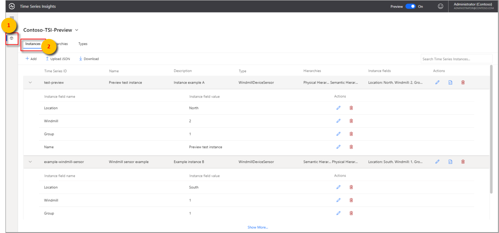](media/v2-update-how-to-tsm/how-to-tsm-instances-panel.png#lightbox)

1. Select **+ Add**.

    [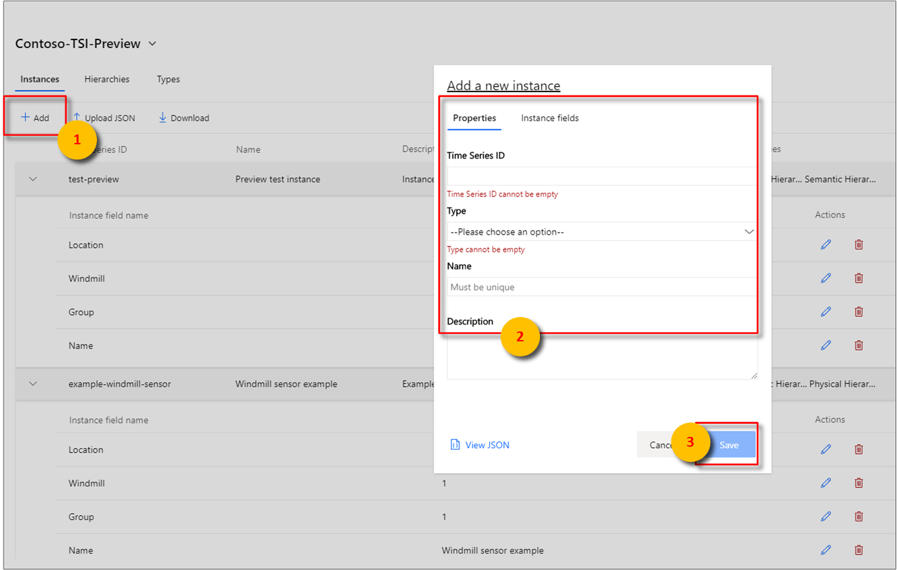](media/v2-update-how-to-tsm/how-to-tsm-add-instance.png#lightbox)

1. Enter the instance details, select the type and hierarchy association, and select **Create**.

### Bulk upload one or more instances

> [!TIP]
> You may save your instances to your desktop in JSON.The downloaded JSON file can then be uploaded through the following steps.

1. Select **Upload JSON**.
1. Select the file that contains the instances payload.

    [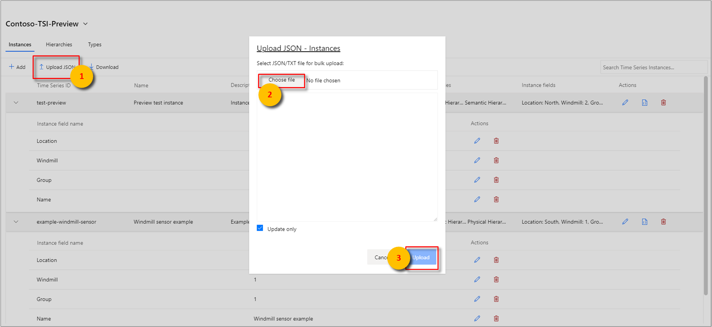](media/v2-update-how-to-tsm/how-to-tsm-bulk-upload-instances.png#lightbox)

1. Select **Upload**.

### Edit a single instance

1. Select the instance, and select the **edit** or **pencil icon**.
1. Make the required changes, and select **Save**.

    

### Delete an instance

1. Select the instance, and select the **delete** or **waste bin icon**.

   

1. Confirm deletion by selecting **Delete**.

> [!NOTE]
> An instance must successfully pass a field validation check to be deleted.

## Hierarchies

The Azure Time Series Insights explorer supports Hierarchy **CREATE**, **READ**, **UPDATE**, and **DELETE** operations within the browser.

To begin, select the **Model** view from the Azure Time Series Insights explorer **Analyze** view.

### Create a single hierarchy

1. Go to the Time Series Model selector panel, and select **Hierarchies** from the menu. All hierarchies associated with your selected Azure Time Series Insights environment will be displayed.

    [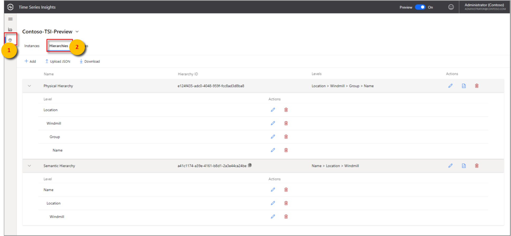](media/v2-update-how-to-tsm/how-to-tsm-hierarchy-panel.png#lightbox)

1. Select **+ Add**.

    [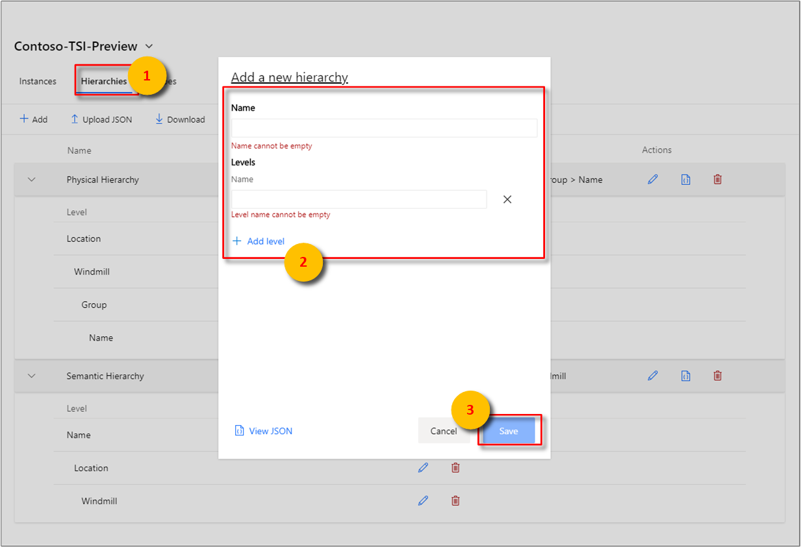](media/v2-update-how-to-tsm/how-to-tsm-add-new-hierarchy.png#lightbox)

1. Select **+ Add level** in the right pane.

    [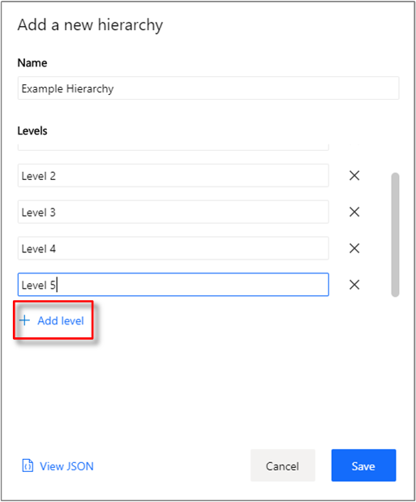](media/v2-update-how-to-tsm/how-to-tsm-save-hierarchy-levels.png#lightbox)

1. Enter the hierarchy details, and select **Save**.

    [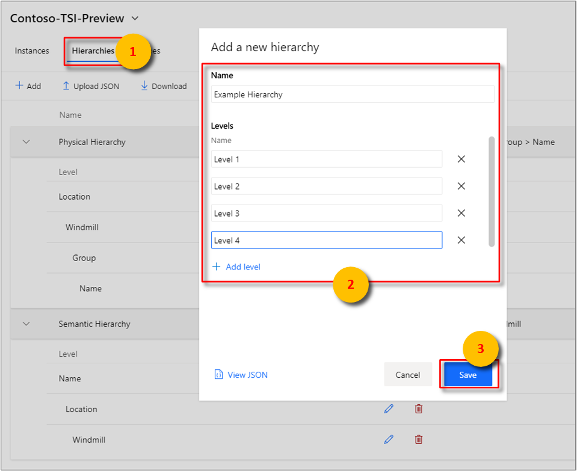](media/v2-update-how-to-tsm/how-to-tsm-add-hierarchy-level.png#lightbox)

### Bulk upload one or more hierarchies

> [!TIP]
> You may save your hierarchies to your desktop in JSON.The downloaded JSON file can then be uploaded through the following steps.

1. Select **Upload JSON**.
1. Select the file that contains the hierarchy payload.
1. Select **Upload**.

    [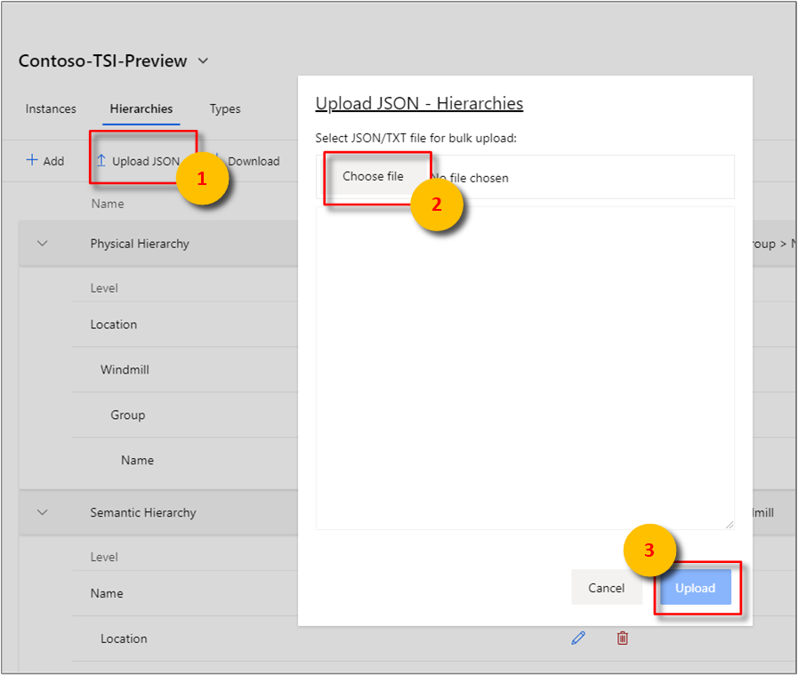](media/v2-update-how-to-tsm/how-to-tsm-bulk-upload-hierarchies.png#lightbox)

### Edit a single hierarchy

1. Select the hierarchy, and select the **edit** or **pencil icon**.
1. Make the required changes, and select **Save**.

    [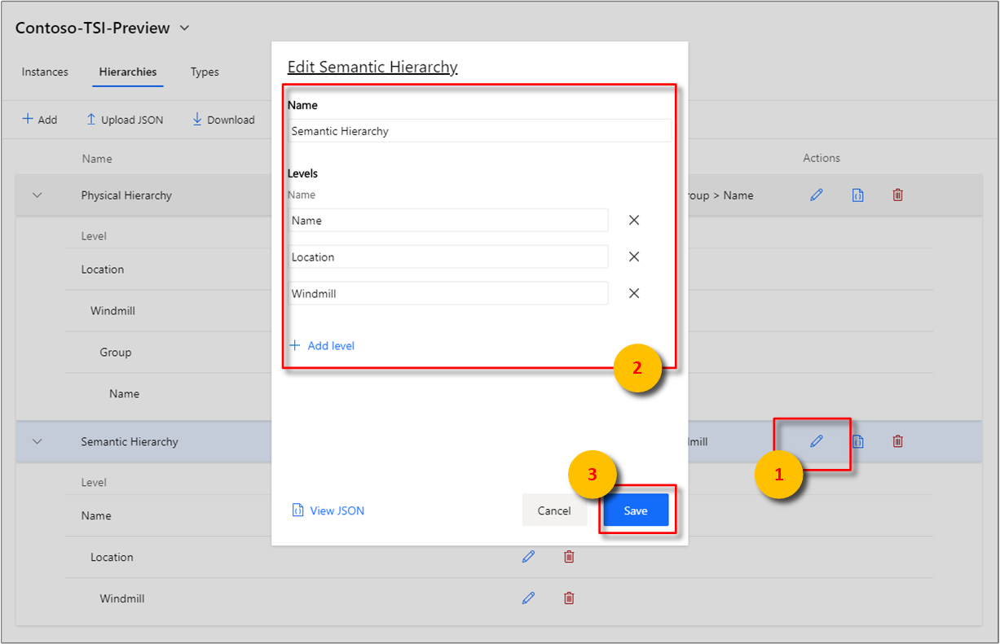](media/v2-update-how-to-tsm/how-to-tsm-edit-hierarchy.png#lightbox)

### Delete a hierarchy

1. Select the hierarchy, and select the **delete** or **waste bin icon**.

    [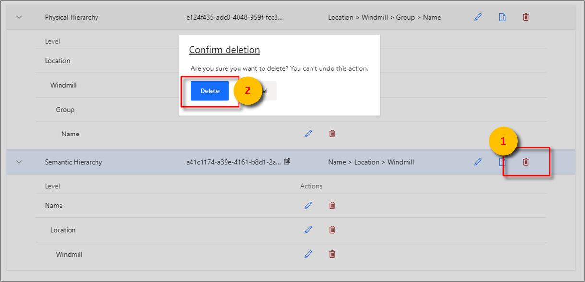](media/v2-update-how-to-tsm/how-to-tsm-delete-hierarchy.png#lightbox)

1. Confirm deletion by selecting **Delete**.

## Types

The Azure Time Series Insights explorer supports Type **CREATE**, **READ**, **UPDATE**, and **DELETE** operations within the browser.

To begin, select the **Model** view from the Azure Time Series Insights explorer **Analyze** view.

### Create a single type

1. Go to the Time Series Model selector panel, and select **Types** from the menu. All types associated with your selected Azure Time Series Insights environment will be displayed.

    [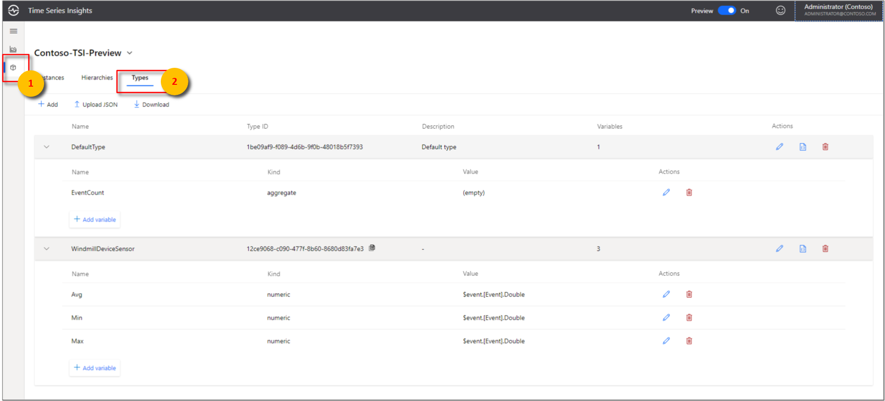](media/v2-update-how-to-tsm/how-to-tsm-type-panel.png#lightbox)

1. Select **+ Add** to display the **Add a new type** popup modal.
1. Enter properties and variables for your type. Once entered, select **Save**.

    [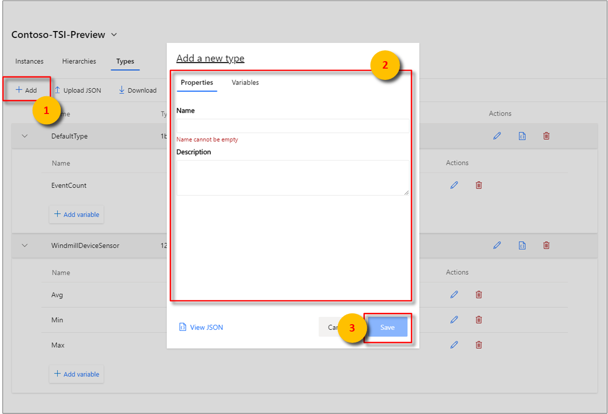](media/v2-update-how-to-tsm/how-to-tsm-add-new-type.png#lightbox)

### Bulk upload one or more types

> [!TIP]
> You may save your types to your desktop in JSON.The downloaded JSON file can then be uploaded through the following steps.

1. Select **Upload JSON**.
1. Select the file that contains the type payload.
1. Select **Upload**.

    [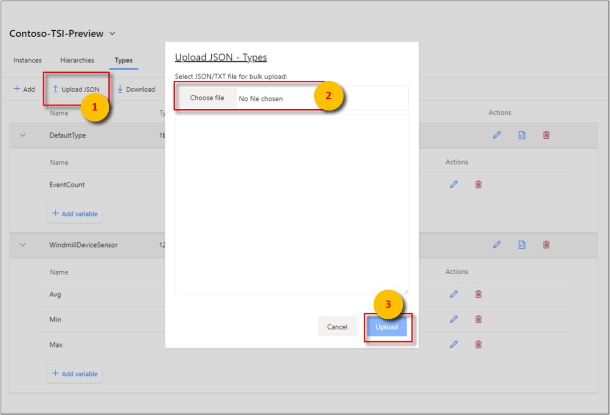](media/v2-update-how-to-tsm/how-to-tsm-bulk-upload-types-json.png#lightbox)

### Edit a single type

1. Select the type, and select the **edit** or **pencil icon**.
1. Make the required changes, and select **Save**.

    [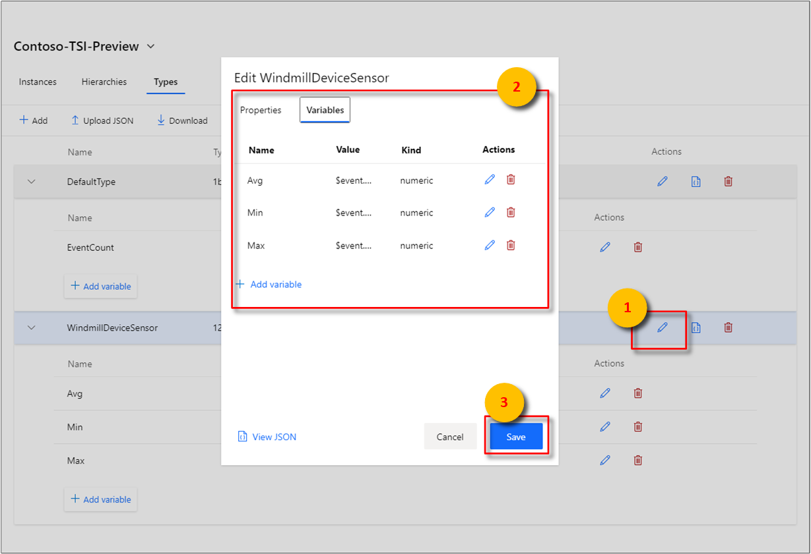](media/v2-update-how-to-tsm/how-to-tsm-edit-type.png#lightbox)

### Delete a type

1. Select the type, and select the **delete** or **waste bin icon**.

   [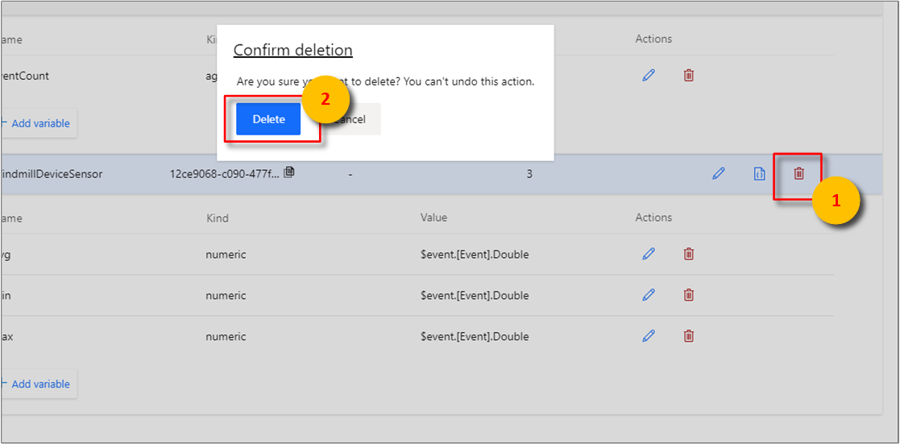](media/v2-update-how-to-tsm/how-to-tsm-delete-type.png#lightbox)

1. Confirm deletion by selecting **Delete**.

## Next steps

* For more information about Time Series Model, read [Data modeling](./concepts-model-overview.md).

* To learn more about the Gen2, read [Visualize data in the Azure Time Series Insights Gen2 explorer](./concepts-ux-panels.md).

* To learn about supported JSON shapes, read [Supported JSON shapes](./time-series-insights-send-events.md#supported-json-shapes).