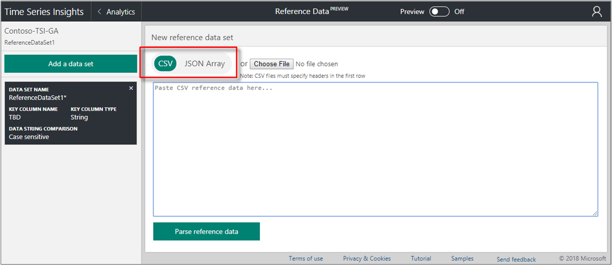
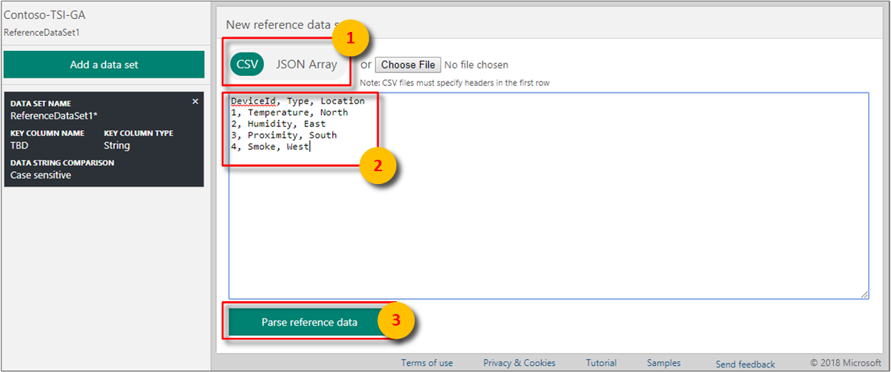
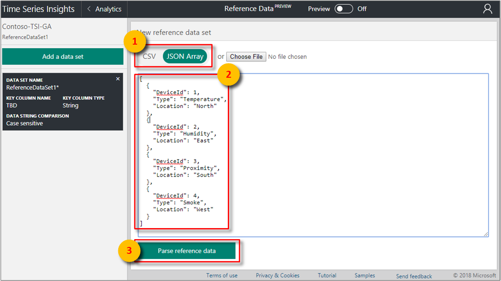
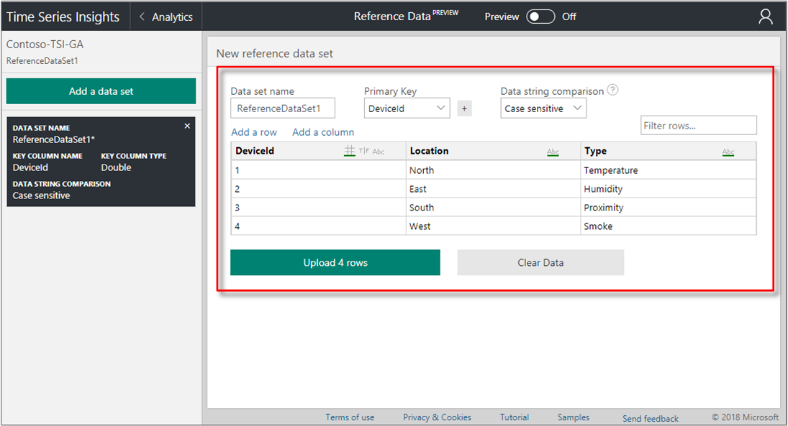
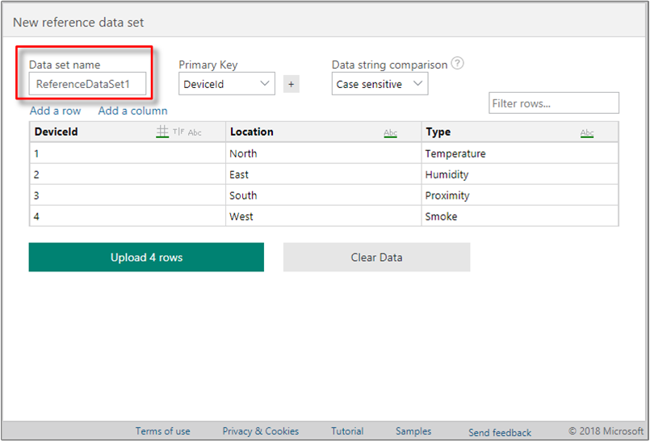
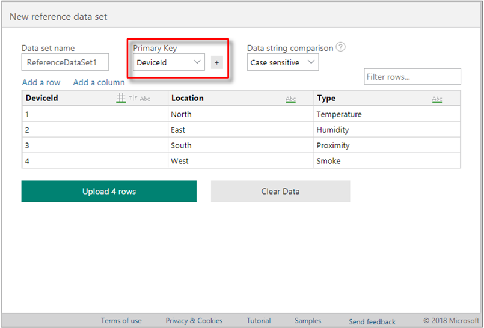
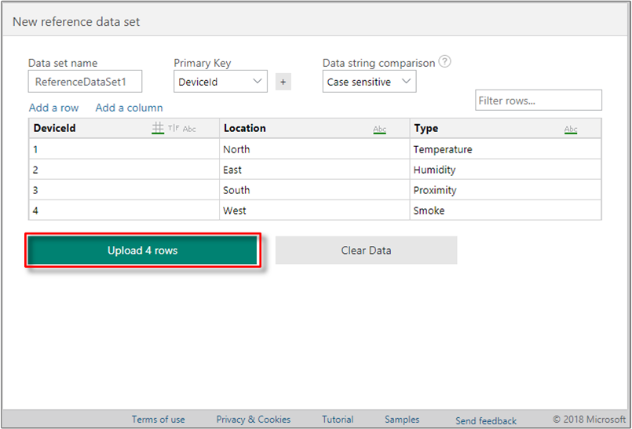
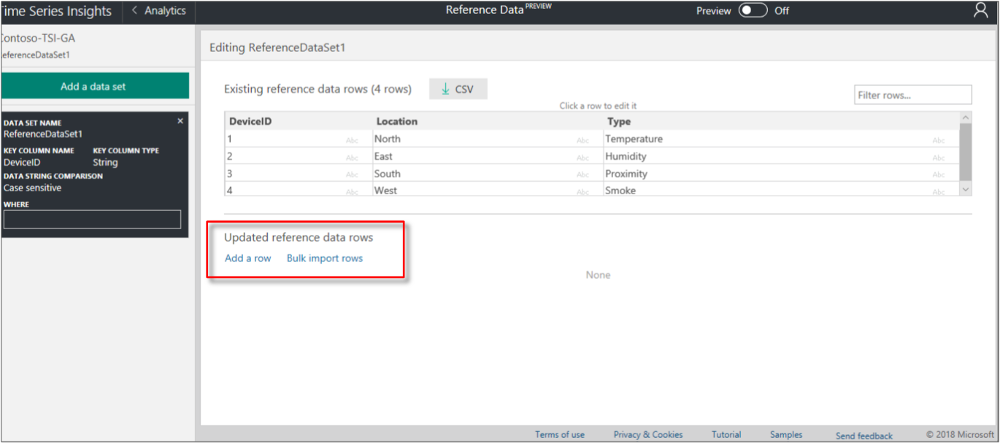

# Create a reference data set for your Time Series Insights environment using the Azure portal

This article describes how to add a reference data set to your Azure Time Series Insights environment. Reference data is useful to join to your source data to augment the values.

A Reference Data Set is a collection of items that augment the events from your event source. Time Series Insights ingress engine joins each event from your event source with the corresponding data row in your reference data set. This augmented event is then available for query. This join is based on the Primary Key column(s) defined in your reference data set.

Reference data is not joined retroactively. Thus, only current and future ingress data is matched and joined to the reference date set, once it has been configured and uploaded.

## Video

### Learn about Time Series Insight’s reference data model. 

> [!VIDEO https://www.youtube.com/embed/Z0NuWQUMv1o]

## Add a reference data set

1. Sign in to the [Azure portal](https://portal.azure.com).

1. Locate your existing Azure Time Series Insights environment. Select **All resources** in the menu on the left side of the Azure portal. Select your Time Series Insights environment.

1. Select the **Overview** page. Expand the **Essentials** section near the top of the page to locate the **Time Series Insights explorer URL** and open the link.  

   

   View the explorer for your Time Series Insights environment.

1. Expand the environment selector in the Time Series Insights explorer. Choose the active environment. Select the reference data icon on the upper right in the explorer page.

   

1. Select the **+ Add a data set** button to begin adding a new data set.

   

1. On the **New reference data set** page, choose the format of the data:

   - Choose **CSV** for comma-delimited data. The first row is treated as a header row.
   - Choose **JSON Array** for JavaScript object notation (JSON) formatted data.

   

1. Provide the data, using one of the two methods:

   - Paste the data into the text editor. Then, select **Parse reference data** button.
   - Select **Choose File** button to add data from a local text file.

   For example, paste CSV data:
   

   For example, paste JSON array data:
   

   If there is an error parsing the data values, the error appears in red at the bottom of the page, such as `CSV parsing error, no rows extracted`.

1. Once the data is successfully parsed, a data grid is shown displaying the columns and rows representing the data. Review the data grid to ensure correctness.

   

1. Review each column to understand the data type assumed, and change the data type if needed.  Select the data type symbol in the column heading: **#** for double (numerical data), **T|F** for boolean, or **Abc** for string.

   

1. Rename the column headers if needed. The key column name is necessary to join to the corresponding property in your event source. 

   > [!IMPORTANT]
   > Ensure that the reference data key column names match exactly to the event name to your incoming data, including case-sensitivity. The non-key column names are used to augment the incoming data with the corresponding reference data values.

1. Type a value in the **Filter the rows...** field to review specific rows as needed. The filter is useful for reviewing data, but is not applied when uploading the data.

1. Name the data set, by filling in the **Data set name** field above the data grid.

    

1. Provide the **Primary Key** column in the data set, by selecting the drop-down above the data grid.

    

    **(Optional)** Select the **+** button to add a secondary key column, as a composite primary key. If you need to undo the selection, choose the empty value from the drop-down to remove the secondary key.

1. To upload the data, select the **Upload rows** button.

    

    The page confirms the completed upload and display the message **Successfully uploaded dataset**.

    > [!WARNING]
    > Columns or properties shared between reference data sets will display a **Duplicate property name** upload error. The error will not prevent the successful upload of the reference data sets. It can be removed by combining rows sharing the duplicated property name.

1. Select **Add a row**, **Bulk import rows**, or **Add a column** to add more reference data values, as needed.

    

   > [!IMPORTANT]
   > Any row that shares a unique key with another row will have its columns overridden by the last row added that shares that unique key.

   > [!NOTE]
   > Added rows **do not** need to be *rectangular* - they may have fewer, greater, or varying columns from the other entries in the reference data set.

## Next steps

* [Manage reference data](time-series-insights-manage-reference-data-csharp.md) programmatically.

* For the complete API reference, read [Reference Data API](https://docs.microsoft.com/rest/api/time-series-insights/ga-reference-data-api) document.
