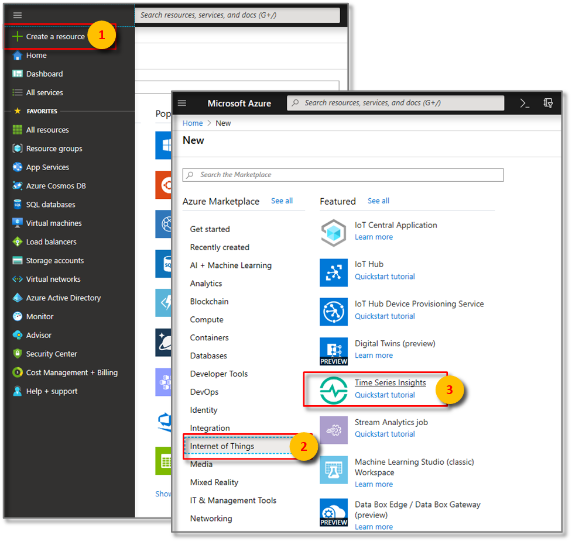
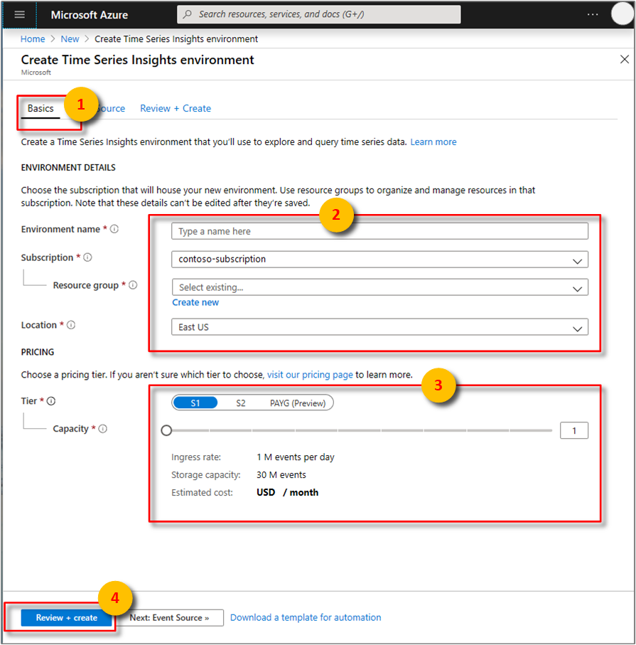

# Create a new Azure Time Series Insights Gen1 environment in the Azure portal

This article describes how to create a new Azure Time Series Insights environment using the Azure portal.

Azure Time Series Insights allows you to get started visualizing and querying data flowing into Azure IoT Hubs and Event Hubs in minutes, enabling you to query large volumes of time series data in seconds.  It was designed for the internet-of-things (IoT) scale and can handle terabytes of data.

## Steps to create the environment

Follow these steps to create an environment:

1. Sign in to the [Azure portal](https://portal.azure.com).

1. Select the **+ Create a resource** button.

1. Select the **Internet of Things** category, and select **Time Series Insights**.

   

1. On the **Time Series Insights** page, select **Create**.

1. Fill in the required parameters. The following table explains each parameter:

   

   Setting|Suggested value|Description
   ---|---|---
   Environment name | A unique name | This name represents the environment in [time series Explorer](https://insights.timeseries.azure.com)
   Subscription | Your subscription | If you have multiple subscriptions, choose the subscription that contains your event source preferably. Azure Time Series Insights can automatically detect Azure IoT Hub and Event Hub resources existing in the same subscription.
   Resource group | Create a new or use existing | A resource group is a collection of Azure resources used together. You can choose an existing resource group, for example the one that contains your Event Hub or IoT Hub. Or you can make a new one if this resource is not related to the other resources.
   Location | Nearest your event source | Preferably, choose the same data center location that contains your event source data, in effort to avoid added cross-region and cross-zone bandwidth costs and added latency when moving data out of the region.
   Pricing tier | S1 | Choose the throughput needed. For lowest costs and starter capacity, select S1.
   Capacity | 1 | Capacity is the multiplier applies to the ingress rate, storage capacity, and cost associated with the selected SKU.  You can change capacity of an environment after creation. For lowest costs, select a capacity of 1.
  
1. Select **Create** to begin the provisioning process. It may take a couple of minutes.

1. To monitor the deployment process, select the **Notifications** symbol (bell icon).

   

1. In the resource **Overview**, verify your deployment configuration settings.

   

1. **(Optional)** Select the **pin icon** in the upper right corner to easily access your Azure Time Series Insights environment in the future.

## Next steps

* [Define data access policies](time-series-insights-data-access.md) to secure your environment.

* [Add an Event Hub event source](time-series-insights-how-to-add-an-event-source-eventhub.md) to your Azure Time Series Insights environment.

* [Send events](time-series-insights-send-events.md) to the event source.

* View your environment in [Azure Time Series Insights Explorer](https://insights.timeseries.azure.com).
